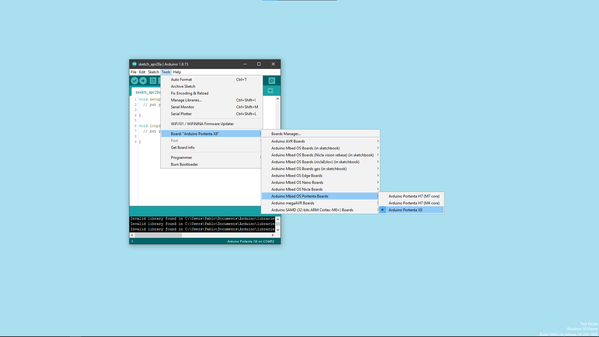

## Overview
This tutorial will explain how to upload a standard Arduino sketch to your Portenta X8's M4.

## Goals
- Use the Arduino IDE to compile and upload.
- Compile the sketch binaries with the Arduino IDE and upload it through ADB.

### Required Hardware and Software
- Portenta X8
- USB C cable (either USB A to USB C or USB C to USB C)
- Arduino IDE 1.8.10+ or Arduino-cli
- arduino-mbed portenta Core up to date (greater than 3.0.1)

## Instructions

### Standard Arduino IDE upload
Open the Arduino IDE, make sure you have selected the Portenta X8 on the boards selector.



Create your sketch, for example the blink sketch:
```arduino
void setup(){
  pinMode(LED_BUILTIN ,OUTPUT);
}

void loop(){
  digitalWrite(LED_BUILTIN , HIGH);
  delay(1000);
  digitalWrite(LED_BUILTIN , LOW);
  delay(1000);
}
```

Once your sketch it's completed, select the port of your device.

Press the Compile and Upload button.

To finalize, when you see that the sketch has bee uploaded successfully, check that every second you are getting the LED changing from OFF to ON.

### Upload using ADB

To use ADB, it gets installed at `Arduino15\packages\arduino\tools\adb\32.0.0`.

From that directory you can use the `adb` tool. To upload your compiled sketch you just need to type:
```
adb push <sketchBinaryPath> /tmp/arduino/m4-user-sketch.elf
```


## How it works?
The Portenta X8 has some services that once the sketch has been pushed to the required folder, if it detects changes the device will flash the M4 after that happened!

This work thanks to the following services:
* **monitor-m4-elf-file.service**: this service monitors the directory `/tmp/arduino/m4-user-sketch.elf` each time it detects a new file it will proceed to flash the M4 using the tool `openOCD` and providing the sketch that has been pushed.
* **android-tools-adbd.service**: responsible of generating the needed interfaces for the different types of usb gadgets.
* **create-docker-envfile.service**: Controls if the device has been plugged for example in some carrier and makes the info available at `/var/run/arduino_hw_info.env` and is meant to be used by the ´docker containers´.

## Conclusion
You now have access to the M4 processor, so for example you are able to connect an I<sup>2</sup>C sensor and interact with it, also you could track the sensor from the Arduino Portenta X8 Linux side.

## Troubleshooting

### ADB folder empty

If you cannot use the `ADB` tool and the folder `Arduino15\packages\arduino\tools\adb\32.0.0` is empty Remove the Mbed Portenta Core and install it again.