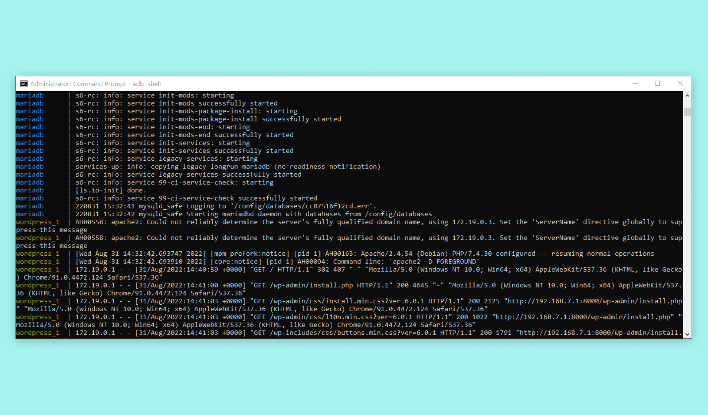

## Overview

The Arduino Portenta X8 is a powerful board that has many features that can be easily utilized with the help of Docker containers. In this tutorial we will be using the Portenta X8 to host a webserver and run Wordpress using containers. This is a simple way to configure and run your own webserver and Wordpress page. We can then access the Wordpress site on the X8 through our web browser and begin setting it up.

## Goals

- Create the file to install docker containers
- Install and run the containers
- Connect to the Wordpress container running on the Portenta X8

### Required Hardware and Software

- [Arduino Portenta X8](https://store.arduino.cc/products/portenta-x8)
- USB-C cable (either USB-C to USB-A or USB-C to USB-C)

## Instructions

First make sure your Portenta X8 is setup correctly by following the [getting started tutorial](https://docs.arduino.cc/tutorials/portenta-x8/out-of-the-box).

### Creating the Docker-compose.yml File

The Wordpress container we will be using also requires a webserver container. We will be using **mariadb** as our webserver container. This container can run on the Portenta X8's architecture. All we need to being installing these containers is to write a **docker-compose.yml** file. This file will contain information about what image we want to install and some important configuration information. Such as the username for the database, password, timezone and database name. The same goes for the Wordpress container, it will contain the password and username, we will also enter the database host name and which container it will use as the database. If you would like to change any password to a more secure one, feel free to replace the generic ones that are stated in the file below.


### The Complete Docker-compose.yml File

In this section you can find the complete **docker-compose.yml** file that we will be using for this tutorial.

```
version: "3.9"
    
services:
  db:
    image: lscr.io/linuxserver/mariadb:latest
    container_name: mariadb
    environment:
      - PUID=1000
      - PGID=1000
      - MYSQL_ROOT_PASSWORD=Wordpress
      - TZ=Europe/London
      - MYSQL_DATABASE=Wordpress
      - MYSQL_USER=Wordpress
      - MYSQL_PASSWORD=Wordpress
    volumes:
      - db_data:/var/lib/mysql
    restart: unless-stopped
    
  Wordpress:
    depends_on:
      - db
    image: Wordpress:latest
    volumes:
      - Wordpress_data:/var/www/html
    ports:
      - "8000:80"
    restart: always
    environment:
      Wordpress_DB_HOST: db
      Wordpress_DB_USER: Wordpress
      Wordpress_DB_PASSWORD: Wordpress
      Wordpress_DB_NAME: Wordpress
volumes:
  Wordpress_data: {}
  db_data: {}
```

Now lets create a directory on our X8 and put this **docker-compose.yml** file on our device.

### Installing The Containers

First we create a directory where we want put our **docker-compose.yml** file. Using the `mkdir` command we will create a directory named "wordpress-test". Navigate into this directory with a simple `cd` command. Either copy the docker-compose.yml file into this directory or create it directly here.


Before installing the containers, make sure that no other container is running on the ports that the Wordpress container will use. You can check what containers are running and what port they are using by running the `docker ps -a` command. This will show a list of the currently installed and running containers on the Portenta X8. To remove a container first stop it with `docker stop <container id>`, then you can run `docker rm <container id>` to remove it. If you want more information about handling containers on your Portenta X8, take a look at our [managing containers with docker tutorial](https://docs.arduino.cc/tutorials/portenta-x8/docker-container).

When you are in the correct directory and no other container is running on the ports that Wordpress will use, we can now run `docker compose up`. This will start installing the **Wordpress** and **mariadb** containers. You can follow the progress in the terminal, it can take a while. Once it is done we can connect to the device and site.


### Connecting to the Wordpress Site

To connect to the Wordpress setup site we simply need to access it with our Portenta X8s unique id and port. So for example `http://<uuid>.local:<port>`, where you would substitute the `<uuid>` with your Portenta X8s unique id and the port chosen for the Wordpress container with `<port>`. The `<uuid>` can be found on the setup page that is showed in the [Getting started tutorial](https://docs.arduino.cc/tutorials/portenta-x8/out-of-the-box), you can also see it in the terminal when running `adb`. Or you can go to `http://192.168.7.1:8000` if you use Windows and Linux, on MacOS use `http://192.168.8.1:8000`.

When you connect you should get some feedback in the terminal. Text will begin printing in the terminal, showing you information about the connection that has just been established. Like shown in the image below.



Now you should see a webpage like on the next image in your browser.


You are now free to go through the Wordpress set up process and configure it however you like.

## Conclusion

In this tutorial we went through how to install and run a Wordpress and database container on the Portenta X8. We then accessed the Wordpress site on our X8 through our web browser. So now you can setup your own Wordpress site on your X8 device and access it from another device.


## Troubleshooting

- If the containers aren't installing or running correctly check if there are any other containers currently running on the same ports as the ones used by the Wordpress container. You can check this with ``docker ps -a``.
- If there is any issue running docker commands, make sure you are using ``sudo`` before the commands.
- If you can't connect to the site when everything is running you can double check the X8s ip address. Run the command `ip s a` in the adb shell. This will display the X8s ip address via usb and wifi. Try connecting via those ip addresses if all else fails.