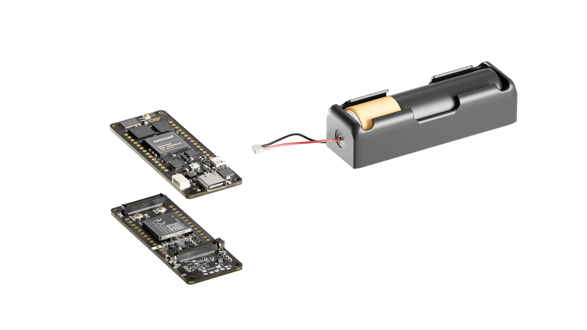
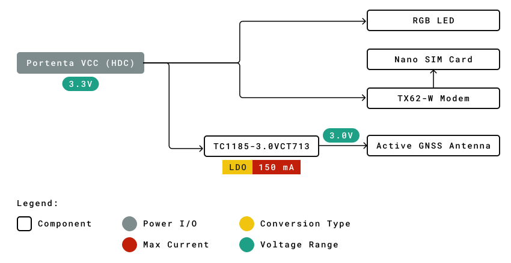
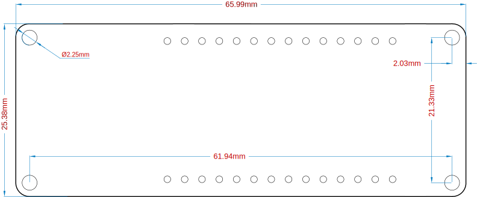

# Description 
Unleash the global connectivity and positioning capabilities of your Portenta or MKR board with the **Arduino® Portenta Cat. M1/NB IoT GNSS Shield**. This shield enables cellular connectivity to both Cat. M1 and NB-IoT networks. Easily track your valuable assets across the city or worldwide with your choice of GPS, GLONASS, Galileo or BeiDou.

# Target areas:
Internet of Things, outdoor asset tracking, positioning, cellular connectivity, fleet management

# Features
***Note: This board requires a compatible MKR or Portenta board to function. Use together with the Arduino® Vision Shield is not supported.***

- Cinterion TX62 wireless module
  - Cellular connectivity and positioning support
  - Embedded IPv4 and IPv6 TCP/IP stack access
  - Internet Services
    - TCP server/client
    - UDP client
    - DNS
    - Ping
    - HTTP client
    - FTP client
    - MQTT client Secure Connection with TLS/DTLS Secure boot
- Cellular Connectivity
  - LTE Cat. M1/NB1/NB2
  - 3GPP Rel.14 Compliant Protocol LTE Cat. M1/NB1/NB2
    - (UMTS BANDS: 1 / 2 / 3 / 4 / 5 / 8 / 1217) / 13 / 18 / 19 / 20 / 25 / 26 / 27 / 28 / 66 / 71 / 85
  - LTE Bands
    - LTE Cat.M1 DL: max. 300 kbps, UL: max. 1.1 Mbps 
    - LTE Cat.NB1 DL: max. 27 kbps, UL: max. 63 kbps 
    - LTE Cat.NB2 DL: max. 124 kbps, UL: max. 158 kbps
  - Short Messaging Service (SMS)
    - Point-to-point mobile terminated (MT) and mobile originated (MO)
    - Text Mode
    - Protocol Data Unit (PDU) Mode
- Positioning Support
  - Multiple GNSS Support
    - GPS
    - GLONASS
    - Galileo
    - BeiDou
- MKR and Portenta Compatible
  - MKR requires headers
  

# Contents

## The Board

### Application Examples
Enter the world of global asset tracking with the **Arduino® Portenta Cat. M1/NB IoT GNSS Shield**. This shield can connect to your Portenta/MKR board enabling a wide range of applications.

- **Global Asset tracking**
  The **Arduino® Portenta Cat. M1/NB IoT GNSS Shield** provides connectivity to four major satellite positioning networks, allowing you to track your inventory reliably. The multi-band cellular connectivity ensures you get live updates on your inventory nearly anywhere in the world.

- **Remote node monitoring**
  The **Arduino® Portenta Cat. M1/NB IoT GNSS Shield** can relay geo-tagged data from local sensors located worldwide to provide real-time insight for increasing your business revenues. 

- **Fleet management**
  Manage your MaaS (Mobility as a Service) solution across the city or between borders. Track, analyze and dynamically manage your fleet to optimize fuel usage, increase your customer satisfaction and reduce transport times. Enable predictive maintenance and remote diagnostics to ensure your business runs smoothly with minimal downtime.

### Accessories (Not Included)
- Active GNSS Antenna (e.g. ECHO19/0.1M/UFL/S/S/17)
- GSM/UMTS Antenna (SKU: X000016)

### Related Products
- Arduino® Portenta H7 (SKU: ABX00042)
- Arduino® Portenta H7 Lite (SKU: ABX00045)
- Arduino® Portenta H7 Lite Connected (SKU: ABX00046)
- Arduino® Portenta X8 (SKU: ABX00049)

### Assembly Overview

## Ratings
### Recommended Operating Conditions
| Symbol           | Description                        | Min  | Typ  | Max  | Unit |
| ---------------- | ---------------------------------- | :--: | :--: | :--: | :--: |
| Vcc   | Input Voltage from Portenta        | 3.2  | 3.3  | 3.4  |  V   |
| VGNSS | Active GNSS Antenna Bias Voltage   | 2.9  |  3   | 3.1  |  V   |
| TOP   | Operating Temperature 2 | -40  |  25  |  85  |  °C  |

**(1):** See Portenta datasheet  
**(2):** Temperatures under -30°C may cause instability in the TX62 operation.

### Power Consumption
| Symbol                  | Description                                                  | Min  | Typ  | Max  | Unit |
| ----------------------- | ------------------------------------------------------------ | :--: | :--: | :--: | :--: |
| PSTDBY       | Power consumption in standby                                 |      | TBC  |      |  mW  |
| PGPS         | Power consumption for GPS geo-location at 1 Hz               |      | TBC  |      |  mW  |
| PCLOUD       | Power consumption for sending data to Arduino Cloud at 1 Hz  |      | TBC  |      |  mW  |
| PGPSCLOUD_LP | Power consumption for GPS geo-location and sending data to Arduino Cloud once per hour |      | TBC  |      |  mW  |

## Functional Overview
### Block Diagram

### Board Topology
### Top View

| **Ref.** |         **Description**          | **Ref.** |        **Description**        |
| :------: | :------------------------------: | :------: | :---------------------------: |
|   DL1    |       SMLP34RGB2W3 RGB LED       |  J1,J2   | Female High Density Connector |
|   PB1    | TL3340AF160QG Mode Select button |   PB2    |  TL3340AF160QG Reset button   |
|    U1    |   TX62-W Cellular-GNSS Module    | U2,U5,U7 | 74LVCH2T45GT Level Translator |

### Bottom View

| **Ref.** |                    **Description**                    | **Ref.** |                  **Description**                  |
| :------: | :---------------------------------------------------: | :------: | :-----------------------------------------------: |
|  J3, J4  |             Male High Density Connectors              |    J6    |  SIM8060-6-0-14-00-A Hinged Nano SIM card module  |
|    J7    | U.FL-R-SMT-1(60) micro UFL Cellular Antenna Connector |    J8    | U.FL-R-SMT-1(60) micro UFL GNSS Antenna Connector |
| U3,U4,U6 |             74LVCH2T45GT Level Translator             |    U8    |         TC1185-3.0VCT713 3V 150mA LDO IC          |

### Cellular Connectivity
The **Arduino® Portenta Cat. M1/NB IoT GNSS Shield** provides access to various cellular networks via the TX62-W Module (U1). It is possible to connect an external cellular antenna via a micro UFL connector (J7). Both SMS and data transfer functionality are provided. SMS messages can be stored in the SIM card module.  The modem is addressable via AT commands. Modem status is provided by the RGB LED (DL1). The input impedance for the cellular antenna is 50Ω.

***Note: The Portenta Cat. M1/NB IoT GNSS Shield requires a physical nano-SIM for cellular connectivity. eSIM is not supported at this time.***

### Positioning
Four major GNSS systems are supported by the **Arduino® Portenta Cat. M1/NB IoT GNSS Shield**. NMEA protocol is used for the transmission of GNSS information. An active antenna can be connected via the micro UFL connector (J8) and should have a bias voltage of 3.0V. The input impedance for the GNSS antenna connector is 50Ω. For compatibility with all GNSS systems, the antenna should support bands over 1559 - 1606 MHz frequency range. 

***Note: GNSS and cellular services cannot be used simultaneously.***

### Power Tree

Power to the **Arduino® Portenta Cat. M1/NB IoT GNSS Shield** is provided by the host Portenta board via the high-density connector. A 3.0V voltage is provided via TC1185-3.0VCT713 (U8) for the active GNSS antenna.

## Board Operation

***Note: The **Arduino® Portenta Cat. M1/NB IoT GNSS Shield** requires a Portenta/MKR host board to operate.***

### Sample Sketches
Sample sketches for the **Arduino® Portenta Cat. M1/NB IoT GNSS Shield** can be found either in the “Examples” menu in the Arduino® IDE or in the “Documentation > Tutorials” section of the Arduino® Pro website **[4]**

### Online Resources
Now that you have gone through the basics of what you can do with the board, you can explore the endless possibilities it provides by checking exciting projects on ProjectHub **[5]**, the Arduino® Library Reference **[6]** and the online store **[7]**, where you will be able to complement your board with sensors, actuators and more.

## Mechanical Information

## Pinout

## Certifications

### Declaration of Conformity CE DoC (EU)
We declare under our sole responsibility that the products above are in conformity with the
essential requirements of the following EU Directives and therefore qualify for free movement
within markets comprising the European Union (EU) and European Economic Area (EEA).
Radio Equipment Directive (RED) 2014/53/EU

### Declaration of Conformity to EU RoHS & REACH 211 01/19/2021
Arduino boards are in compliance with RoHS 2 Directive 2011/65/EU of the European Parliament and RoHS 3
Directive 2015/863/EU of the Council of 4 June 2015 on the restriction of the use of certain hazardous substances in
electrical and electronic equipment

| **Substance**                          | **Maximum Limit (ppm)** |
| -------------------------------------- | ----------------------- |
| Lead (Pb)                              | 1000                    |
| Cadmium (Cd)                           | 100                     |
| Mercury (Hg)                           | 1000                    |
| Hexavalent Chromium (Cr6+)             | 1000                    |
| Poly Brominated Biphenyls (PBB)        | 1000                    |
| Poly Brominated Diphenyl ethers (PBDE) | 1000                    |
| Bis(2-Ethylhexyl} phthalate (DEHP)     | 1000                    |
| Benzyl butyl phthalate (BBP)           | 1000                    |
| Dibutyl phthalate (DBP)                | 1000                    |
| Diisobutyl phthalate (DIBP)            | 1000                    |

Exemptions: No exemptions are claimed. 

Arduino Boards are fully compliant with the related requirements of European Union Regulation (EC) 1907 /2006 concerning the Registration, Evaluation, Authorization and Restriction of Chemicals (REACH). We declare none of the SVHCs (https://echa.europa.eu/web/guest/candidate-list-table), the Candidate List of Substances of Very High Concern for authorization currently released by ECHA, is present in all products (and also package) in quantities totaling in a concentration equal or above 0.1%. To the best of our knowledge, we also declare that our products do not contain any of the substances listed on the "Authorization List" (Annex XIV of the REACH regulations) and Substances of Very High Concern (SVHC) in any significant amounts as specified by the Annex XVII of Candidate list published by ECHA (European Chemical Agency) 1907 /2006/EC.

### Conflict Minerals Declaration 
As a global supplier of electronic and electrical components, Arduino is aware of our obligations with regards to laws and regulations regarding Conflict Minerals, specifically the Dodd-Frank Wall Street Reform and Consumer Protection Act, Section 1502. Arduino does not directly source or process conflict minerals such as Tin, Tantalum, Tungsten, or Gold. Conflict minerals are contained in our products in the form of solder, or as a component in metal alloys. As part of our reasonable due diligence, Arduino has contacted component suppliers within our supply chain to verify their continued compliance with the regulations. Based on the information received thus far we declare that our products contain Conflict Minerals sourced from conflict-free areas. 

## FCC Caution
Any Changes or modifications not expressly approved by the party responsible for compliance could void the user’s authority to operate the equipment.

This device complies with part 15 of the FCC Rules. Operation is subject to the following two conditions: 

(1) This device may not cause harmful interference

(2) this device must accept any interference received, including interference that may cause undesired operation.

**FCC RF Radiation Exposure Statement:**

1. This Transmitter must not be co-located or operating in conjunction with any other antenna or transmitter.

2. This equipment complies with RF radiation exposure limits set forth for an uncontrolled environment.

3. This equipment should be installed and operated with a minimum distance of 20cm between the radiator & your body.

English: 
User manuals for license-exempt radio apparatus shall contain the following or equivalent notice in a conspicuous location in the user manual or alternatively on the device or both. This device complies with Industry Canada license-exempt RSS standard(s). Operation is subject to the following two conditions:

(1) this device may not cause interference

(2) this device must accept any interference, including interference that may cause undesired operation of the device.

French: 
Le présent appareil est conforme aux CNR d’Industrie Canada applicables aux appareils radio exempts de licence. L’exploitation est autorisée aux deux conditions suivantes:

(1) l’appareil nedoit pas produire de brouillage

(2) l’utilisateur de l’appareil doit accepter tout brouillage radioélectrique subi, même si le brouillage est susceptible d’en compromettre le fonctionnement.

**IC SAR Warning:**

English 
This equipment should be installed and operated with a minimum distance of 20 cm between the radiator and your body.  

French: 
Lors de l’ installation et de l’ exploitation de ce dispositif, la distance entre le radiateur et le corps est d ’au moins 20 cm.

**Important:** The operating temperature of the EUT can’t exceed 85℃ and shouldn’t be lower than -40℃.

Hereby, Arduino S.r.l. declares that this product is in compliance with essential requirements and other relevant provisions of Directive 201453/EU. This product is allowed to be used in all EU member states. 

| Frequency bands | Typical Output Power |
| --------------- | -------------------- |
| 600-2100 MHz    | +20 dBm ± 2 dB       |

## Company Information

| Company name    | Arduino S.r.l                              |
| --------------- | ------------------------------------------ |
| Company Address | Via Andrea Appiani, 25 20900 MONZA (Italy) |

## Reference Documentation

| Ref                                | Link                                                                                                |
| ---------------------------------- | --------------------------------------------------------------------------------------------------- |
| Arduino® IDE (Desktop)             | https://www.arduino.cc/en/Main/Software                                                             |
| Arduino® IDE (Cloud)               | https://create.arduino.cc/editor                                                                    |
| Arduino® Cloud IDE Getting Started | https://create.arduino.cc/projecthub/Arduino_Genuino/getting-started-with-arduino-web-editor-4b3e4a |
| Arduino® Pro Website               | https://www.arduino.cc/pro                                                                          |
| Project Hub                        | https://create.arduino.cc/projecthub?by=part&part_id=11332&sort=trending                            |
| Library Reference                  | https://github.com/arduino/ArduinoCore-mbed/tree/master/libraries/GSM      |
| Online Store                       | https://store.arduino.cc/                                                                           |

## Revision History

| **Date**   | **Revision** | **Changes**     |
| ---------- | ------------ | --------------- |
| 31-01-2022 | 01           | Initial Version |
