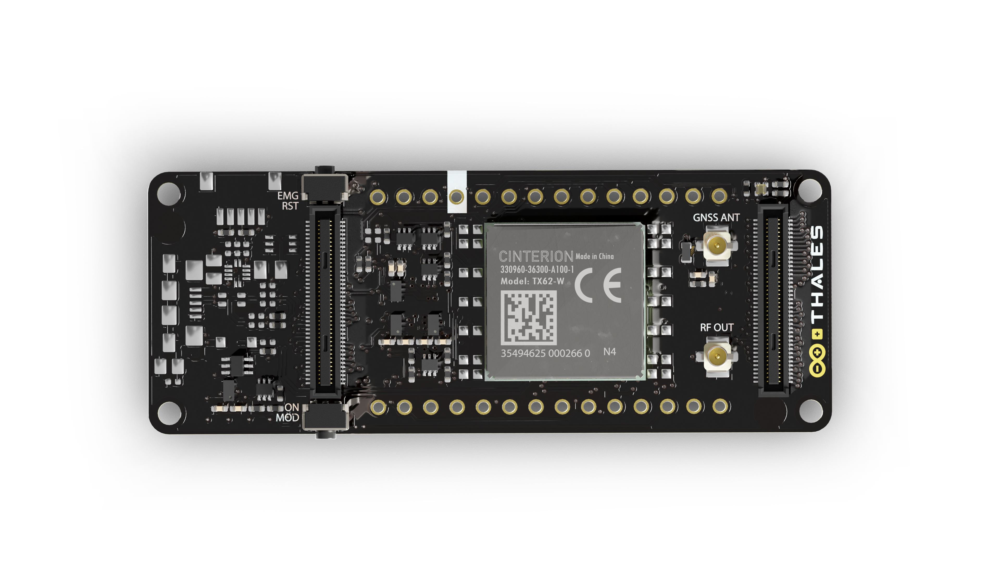
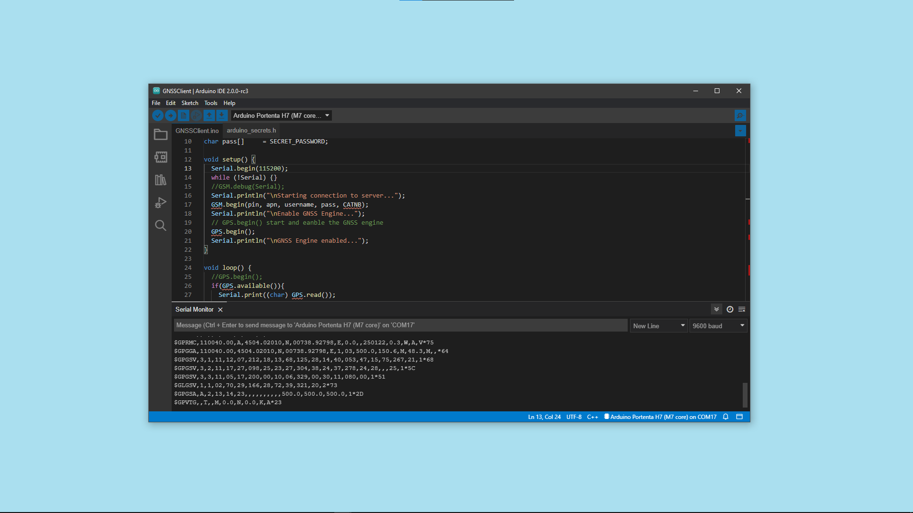

The **Arduino® Portenta Cat. M1/NB IoT GNSS Shield** is a board that enables cellular connectivity to both Cat. M1 and NB-IoT networks. Easily track your valuable assets across the city or worldwide with your choice of GPS, GLONASS, Galileo or BeiDou.

This article is a collection of guides, API calls and tutorials that can help you get started with the Arduino® Portenta Cat. M1/NB IoT GNSS Shield board. You can also visit the [documentation product page for the Arduino® Portenta Cat. M1/NB IoT GNSS Shield](/hardware/portenta-cat-m1-nb-iot-gnss-shield).

## Core

The Arduino® Portenta Cat. M1/NB IoT GNSS Shield uses the [Arduino Mbed OS Portenta core](https://github.com/arduino/ArduinoCore-mbed).

***The incoming libraries are included in the mbed Core version greater than 2.6.1***

## Installation

### Arduino IDE 1.8.X

The Arduino® Portenta Cat. M1/NB IoT GNSS Shield can be programmed through the **Classic Arduino IDE 1.8.X**. To install your board, you can check out the guide below:

- [Installing the Arduino Mbed OS Portenta Boards core](/software/ide-v1/tutorials/getting-started/cores/arduino-mbed_portenta)

### Arduino IDE 2.0.X 

The Arduino® Portenta Cat. M1/NB IoT GNSS Shield can be programmed through the **Arduino IDE 2.0.X (beta)**. To install your board, you can check out the guide below:

- [How to use the board manager with the Arduino IDE 2.0](https://www.arduino.cc/en/Tutorial/getting-started-with-ide-v2/ide-v2-board-manager)

### Web Editor

The board can be programmed through the **Web Editor**. To get started with your board, you will only need to install a plugin, which is explained in the guide below:

- [Getting started with the Web Editor](/cloud/web-editor/tutorials/getting-started/getting-started-web-editor)

## Pins
As a Portenta family Shield it uses the High density pins to be available for the Portenta board which is being connected.


## GSM

### Requirements

The GSM Feature requires:
* An antenna (e.g [Dipole antenna, at the arduino store](https://store.arduino.cc/products/dipole-pentaband-waterproof-antenna?queryID=52d9fdab80e7fcace62aae924c084a93&_gl=1*msh8uc*_ga*MjA5OTMyMzAwMC4xNjIxNTE1OTY3*_ga_NEXN8H46L5*MTYzMDkzMzQ3NS40NS4xLjE2MzA5MzM5MTAuMA..)) at the **RF OUT** antenna connector on the Top side of the shield.
* SIM Card capable of running with the CatM1 specifications  (check with your provider if your Card has that feature)

To check if our setup it's working we can open an example inside the GSM library from the Mbed Portenta Core, going to **Examples -> GSM -> GSMClient** we will open an sketch that connects to the SIM card provider, connects to a webpage and download the content of it to display it inside the Serial Monitor.

Make sure you go to the `arduino_secrets.h` tab and:
* introduce the PIN of the SIM card you are using and store it at `SECRET_PIN`.
* Browse to your IT provider and check the mobile APN link, e.g "online.provider.com" save it inside the `SECRET_APN`

After finishing this setup compile and upload the program, you will see the HTML content of the server printed at the serial monitor.
>**Note:** Sometimes it needs time to connect to the provider's APN, please be patient, it can take up to 30 minutes. If you can not connect after that time, make sure you introduced the correct SIM pin and the APN, if the issue continues, contact with your provider and make sure they have CAT M1 enabled on your SIM card.

### API

To get familiar with the commands, you can have a look to the [MKR GSM library](https://www.arduino.cc/en/Reference/GSM)

This library contains some commands that are quite different, that's because it is using mbed APIs, in this case NetworkInterface, CellularContext and CellularDevice, you can have more info at their API reference at [https://os.mbed.com/docs/mbed-os/v6.14/apis/network-interface-apis.html](https://os.mbed.com/docs/mbed-os/v6.14/apis/network-interface-apis.html).


|                       Command                        |                         Information                          |
| :--------------------------------------------------: | :----------------------------------------------------------: |
| `GSM.begin(PIN, APN, USERNAME, PASSWORD, CATNB/CATM1)` | Unlock the SIM card using the PIN parameter and connects to the provider. |
|                       `GSMClient`                      |    Client constructor, on the examples we define it as client  |
|                    `GSM.getTime()`                     |    Returns the time, you can set a new one with setTime()    |
|                  `GSM.getLocalTime()`                  |                    Returns the local time                    |
|                    `GSM.setTime()`                     | Set the time, it will be saved and it can be get by getTime() |
|                     `GSM.debug()`                      | After this command, the Serial monitor will output more detailed info about the GSM class commands, connections, etc... |
|            `GSMClient.connect(server,port)`            |                  Connect to a remote server                  |
|                `GSMClient.available()`                 | Check if the server that is connected to has some bytes ready to be read |
|                   `GSMClient.read()`                   |                 Returns data from the server                 |
|                   `GSMClient.stop()`                   |                 Disconnects from the server                  |

#### Connect to Your Provider

You need to enter the Pin code and the APN link of your provider.
The username and pass depends on the provider you have.

This sketch will initialize the SIM card and connect to your provider's network

```cpp
#include <GSM.h>

char pin[]      = SECRET_PIN; 		//example "1234"
char apn[]      = SECRET_APN;		//example "live.provider.com"
char username[] = SECRET_USERNAME;
char pass[]     = SECRET_PASSWORD;

void setup() {
  Serial.begin(115200);
  while(!Serial) {}

	if(GSM.begin(pin, apn, username, pass, CATM1)){
		Serial.println("connected");
	}else{
		Serial.println("unable to connect");
	}
  
  // do nothing forevermore:
  while(1);
  
}
```

#### Send HTTP GET Method and Receive Data

The following sketch will do the same as the previous one, connect to your provider and use a HTTP GET method to get the data from the server you connect to. In this case "example.com", printing out the content through the Serial monitor.

```cpp
#include <GSM.h>

REDIRECT_STDOUT_TO(Serial);

char pin[]      = SECRET_PIN; 		//example "1234"
char apn[]      = SECRET_APN;		  //example "live.provider.com"
char username[] = SECRET_USERNAME;
char pass[]     = SECRET_PASSWORD;

const char  server[] = "www.example.com";
const char* ip_address;
int port = 80;

GSMClient client;

void setup() {
  Serial.begin(115200);
  while(!Serial) {}

  GSM.begin(pin, apn, username, pass, CATNB);
  
  Serial.println("\nStarting connection to server...");
  // if you get a connection, report back via serial:
  if (client.connect(server, port)) {
    Serial.println("connected to server");
    // Make a HTTP request:
    client.println("GET / HTTP/1.1");
    client.print("Host: ");
    client.println(server);
    client.println("Connection: close");
    client.println();
  } else {
    Serial.println("unable to connect to server");
  }
  
}

void loop() {

  // if there are incoming bytes available
  // from the server, read them and print them:
  while (client.available()) {
    char c = client.read();
    Serial.write(c);
  }

  // if the server's disconnected, stop the client:
  if (!client.connected()) {
    Serial.println();
    Serial.println("disconnecting from server.");
    client.stop();

    // do nothing forevermore:
    while (true);
  }

}
```

## GPS

### Requirements

The GSM Feature requires:
* A GPS active antenna (e.g [GPS active antenna 28dB](https://www.digikey.com/en/products/detail/adafruit-industries-llc/960/5353630)) at the **GNS ANT** antenna connector on the Top side of the shield.
* You may need a connector converter from the active GPS antenna, we used this one [Coaxial to SMA](https://www.digikey.com/en/products/detail/taoglas-limited/CAB.719/3664639)

To check if our setup it's working we can open an example inside the GSM library from the Mbed Portenta Core, going to **Examples -> GSM -> GNSSClient** we will open an sketch that connects to the SIM card provider and initialize the active GPS antenna, then it will print out GPS readings.

Make sure you go to the `arduino_secrets.h` tab and:
* introduce the PIN of the SIM card you are using and store it at `SECRET_PIN`.
* Browse to your IT provider and check the mobile APN link, e.g "online.provider.com" save it inside the `SECRET_APN`

>**Note:** Sometimes it needs time to connect to the provider's APN, please be patient, it can take up to 30 minutes. If you can not connect after that time, make sure you introduced the correct SIM pin and the APN, if the issue continues, contact with your provider and make sure they have CAT M1 enabled on your SIM card.

### API


|                       Command                        |                         Information                          |
| :--------------------------------------------------: | :----------------------------------------------------------: |
|                       `GPS.begin()`                  |                   Initialize the GPS modem                   |
|                       `GPS.end()`                    |                    Turn OFF the GPS modem.                   |
|                       `GPS.available()`              |           Check if the GPS has new data to be read.          |
|                       `GPS.peek()`                   |  Always true.                                               NEED TO BE UPDATED|
|                       `GPS.read()`                   |      Returns a char with the reading from the GPS module.    NEED TO BE UPDATED |
|                       `GPS.readAndPrint()`           | Output data on the Serial monitor, only if there is new data.|
|                       `GPS.readAndDrop()`            |             Read the data and do nothing with it.            |
|                       `GPS.checkGNSSEngine()`        |     Check if the GNSS modem is receiving data correctly.     |
|                       `GPS.write()`                  |        Write directly to the GPS module, ADD VARIANTS        |

#### Get GPS Data

We included an example inside the GSM example that connects to the GSM provider, then initialize the GPS antenna, gets the data and print it out on the Serial monitor.

Open the example by going to **Examples -> GSM -> GNSSClient**

The sketch:
```cpp
  #include <GPS.h>
  #include <GSM.h>

  REDIRECT_STDOUT_TO(Serial);

  #include "arduino_secrets.h"
  char pin[]      = SECRET_PIN;
  char apn[]      = SECRET_APN;
  char username[] = SECRET_USERNAME;
  char pass[]     = SECRET_PASSWORD;

  void setup() {
    Serial.begin(115200);
    while (!Serial) {}
    //GSM.debug(Serial);
    Serial.println("\nStarting connection to GSM...");
    GSM.begin(pin, apn, username, pass, CATNB);

    Serial.println("\nEnable GNSS Engine..."); 
    GPS.begin();  //start and enable the GNSS engine
    Serial.println("\nGNSS Engine enabled...");
  }

  void loop() {
    if(GPS.available()){
      Serial.print((char) GPS.read());
      delay(1);
    }

    delay(1000);
  }
```
***As you previously done, you need to set up the GSM info and fill the `arduino_secrets.h`***

***Remember to connect to the GSM provider and secondly connect to the GNSS (**mandatory**).***

You will see the **NMEA** data on the Serial monitor.


#### Low Power GPS

The GPS antenna is active, that means that it needs power to function as it has electronics inside of it.
One way to save power on your project is enabling only the GPS module when it is needed to read the data.

You can do so as follows:

```cpp
  //Start the GPS module
  GPS.begin();    

  // Print data
  if(GPS.available()){
    Serial.print((char) GPS.read());
    delay(1);
  }

  //stop and disable the GNSS engine
  GPS.end();
```
***By using this method, you don't need to initialize the GPS inside the `setup()`***

## Conclusion

This cheat sheet is written as a quick reference, to look up the GSM and GPS feature of this product. For a more in-depth walkthrough experience please have a look at the other tutorials.

## Troubleshooting

### Getting Compiling Errors Using GPS and GSM

Make sure you included first the `GPS.h` library and then the `GSM.h`

### Can't Upload the Sketch

Sometimes if the GPS module is getting readings, you will not be able to upload a new sketch, double tap the reset button on your Potenta H7 and upload the new sketch.