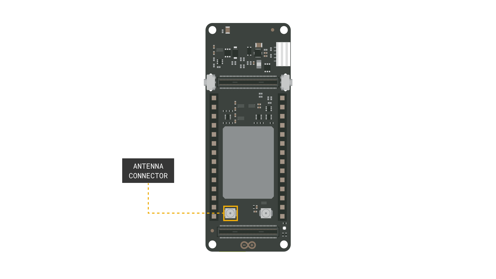
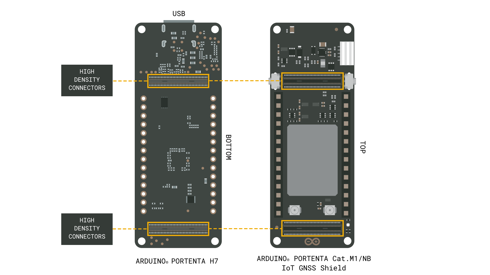

## Introduction 

This tutorial will show how to connect the Portenta Cat. M1/NB IoT GNSS shield to the Portenta H7, connect to a website using GSM with NBIoT or Cat-M1 technology and print the websites HTML content in the serial monitor. This will help you quickly find out if the setup can connect to GSM networks.

>**Note:** This tutorial was created in Sweden, and as a result, the available networks are only Swedish network operators. The results will vary depending on what location we are in. 

## Goals

The goals of this project are:

- Learn how to connect the board and shield.
- Connect to the GSM network with Cat-M1 or NBIoT.
- Print HTML content in the Serial Monitor.

## Hardware & Software Needed

- Arduino IDE ([online](https://create.arduino.cc/) or [offline](https://www.arduino.cc/en/main/software)).
- [Portenta H7](https://store.arduino.cc/products/portenta-h7)
- [Portenta Cat. M1/NB IoT GNSS Shield]()
- [Dipole Antenna](https://store.arduino.cc/antenna).

## Instructions

### Circuit

First insert the SIM card into the SIM card slot at the bottom of the Portenta Cat. M1/NB IoT GNSS Shield. The image below shows where to connect the [dipole antenna](https://store.arduino.cc/antenna) to the Portenta Cat. M1 shield. It should connect to the antenna connector marked **RF OUT**.



Now connect the Portenta Cat. M1 shield to the Portenta H7. Do this by attaching it to the HD connectors at the bottom of the Portenta H7 board. Like the image shows below, the top and bottom high density connectors on the shield are connected to the corresponding ones on the underside of the H7 board. Plug in the H7 to your computer using the USB C cable.



### Arduino IDE

Make sure that you have the latest **Arduino Mbed OS Portenta core** installed, you can find this in **Tools > Board > Board Manager...**. With the board selected, navigate to **file > Examples > GSM > GSMClient**. This is the example sketch we will use to test out the Cat-M1 or NBIoT connection.

### Programming the Board

Go to the **arduino_secrets.h** tab that opens with the example and enter the PIN of the SIM card you are using into the `SECRET_PIN` variable. Check your SIM card providers mobile APN link, e.g "online.provider.com" save it inside `SECRET_APN`.

>**Note:** A standard pre-paid SIM card typically have 0000 or 1234 as a pin code. This varies from operator to operator, it is important to find out this before uploading the code. Otherwise, too many unsuccessful attempts may block the SIM card.

Using `GSM.begin()` will start the GSM module using the pin and apn entered in **arduino_secrets.h**. To decide whether to use NBIoT or Cat-M1 technology we need to change the last argument. Using either `CATNB` for NBIoT or `CATM1` for Cat-M1. If you are unsure what technology to use, check with your SIM card provider to see what technology they support.

```arduino
GSM.begin(pin, apn, username, pass, CATNB);
```

When the GSM module is started we can then proceed to connect with a remote server. Using the server url defined earlier in the example. The port to connect to is also defined earlier. It is set to `80` as default.

```arduino
client.connect(server,port)
```

### Result of sketch

After finishing this setup, compile and upload the program, you will see the HTML content of the server printed in the serial monitor. As default the server is set as `example.com`. Feel free to change this and take a look at how it prints different web pages.

### Troubleshoot

If the code is not working, there are some common issues we can troubleshoot:

- We have entered the wrong pin number.
- We are out of coverage (no signal).
- SIM card may not be activated.

## Next Step

This is a basic example of what the Portenta Cat. M1 shield is capable of. A good next step could be to try out the GNSS functionality. To use the GNSS functionality you will need a different antenna from the one used in this tutorial. If you would rather use the same set up as in this tutorial, but with more advanced functionality, try to send an SMS to a cellphone using the GSM connection.

## Conclusion

This tutorial showed how to connect the Portenta Cat. M1/NB IoT GNSS Shield to the Portenta H7. To then upload an example sketch that will help us confirm that our set up works. The sketch makes it easy to enter a new website to connect to. Be sure to take a look at our other Portenta Cat. M1 shield tutorials.
