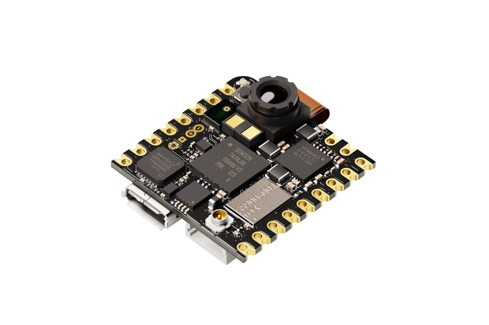

In this tutorial you will use the Nicla Vision to detect proximity, thanks to the Time of Flight (ToF) sensor **VL53L1X**.

This tutorial contains the sketch to blink the built-in RGB LED and control the speed of its blink by the proximity values.
This could help for future projects and control the Camera only when something is crossing in front of the board, like a proximity detector.

## Goals
The goals of this project are:
 - Set up the needed libraries
 - Learn how to interact with the proximity readings
 - Change the RGB values of the LED


### Required Hardware and Software

* Arduino Nicla Vision
* VL53L1X library (Available on the Library Manager)

## Blink Depending on the Distance

Make sure you have installed the latest version of **Arduino mbed Core** and the **VL53L1X library**.

### Include the Needed Libraries and Objects Declaration

First of all declare the sensor's class so you can access it later on your sketch.
The variables are to avoid using delays as the reading would not be accurate.

```cpp
  #include <Wire.h>
  #include "VL53L1X.h"
  VL53L1X proximity(Wire1);

  bool blinkState = false;
  int reading = 0;
  int timeStart = 0;
  int blinkTime = 2000;
```
***Make sure you set `Wire1` inside the VL53L1X constructor's parameter, it won't work if you don't add that setting***

### Initialize the Proximity Sensor and the LED

Inside the setup you need to initialize the I2C communication before initializing the proximity sensor.
Also the RGB Led needs to be set as an output to make it light up.

***The LEDs are accessed as the Portenta H7: LEDR, LEDG and LEDB***

```cpp
  void setup(){
    Serial.begin(115200);

    pinMode(LEDB,OUTPUT);
    digitalWrite(LEDB, blinkState);
    
    if (!proximity.init()){
      Serial.println("Failed to detect and initialize sensor!");
      while (1);
    }

    proximity.setDistanceMode(VL53L1X::Long);
    proximity.setMeasurementTimingBudget(10000);
    proximity.startContinuous(10);
  }
```

### Control the Speed of the Blink

The sketch is going to get the reading on every loop, store it and then the state of the LED will change until the time is up until the proximity reading.

```cpp
  void loop(){
    reading = proximity.read();
    Serial.println(reading);

    if (millis() - timeStart >= reading){
      digitalWrite(LEDB, blinkState);
      timeStart = millis();

      blinkState = !blinkState;
    }
  }
```

## API
| Command                              |                           Details                            | type              |
| :----------------------------------- | :----------------------------------------------------------: | :---------------- |
| setAddress(newAddress)               |      Change the I2C sensor's address (Not recommended)       | `void`            |
| getAddress()                         |                 Get the Sensor's I2C address                 | `uint8_t`         |
| init()                               | Configures the sensor and needed data. Like the usual begin()| `void`            |
| setDistanceMode(mode)                |                                                              | `void`            |
| getDistanceMode()                    |                                                              | `struct distance` |
| setMeasurementTimingBudget(uSeconds) | Set the time to get the measure, greater the value, better precision. In micro seconds. | `void`            |
| getMeasurementTimingBudget()         |        Get the measure timing value in micro seconds.        | `uint32_t`        |
| startContinuous()                    | Start the non stop readings, set the period inside the parameter, after that time you will get the reading. | `void`            |
| stopContinuous()                     |               Stop the non stop measurements.                | `void`            |
| read()                               |        Get the last reading from the continuous mode.        | `void`            |
| readSingle()                         |           Trigger one reading and get its result.            | `uint16_t`        |
| dataReady()                          |        Returns if the sensor has new data available.         | `bool`            |
| setTimeout(mSeconds)                 | Configure the milliseconds the sensor will wait in case it is not getting the proper reading to abort, and continue with a new one, 0 disables it. | `void`            |
| getTimeout()                         |              Get the configured timeout value.               | `uint16_t`        |
| timeoutOccurred()                    |       Returns true whenever the sensor had a timeout.        | `bool`            |
