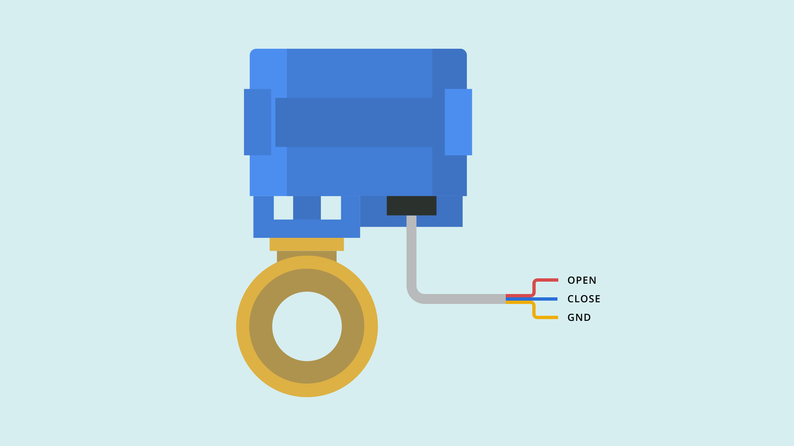

## Overview

A ball valve is a form of quarter-turn [valve](https://en.wikipedia.org/wiki/Valve) which uses a hollow, perforated and pivoting ball to control flow of liquids and gasses through it. This tutorial will guide you through connecting the board to a 3 Wire-Valve and writing a sketch that controls the basic operations such as the opening and closing of the valves. 

***Tip : If this is for your first Edge Control project, we recommend you to take a look at the [Getting Started Tutorial](https://www.arduino.cc/pro/tutorials/portenta-h7/getting-started-edge-control) to setup the development environment before you proceed.*** 

## Goals

- How to connect a motorized valve to the Edge Control board
- How to control the valve through basic commands provided by the `Arduino_EdgeControl` library
- How to power the board with an external power supply 

### Required Hardware and Software

- [Arduino Edge control board](https://store.arduino.cc/edge-control)
- 1x [US Solid Motorised Ball Valve (9 - 24 V)](https://ussolid.com/u-s-solid-motorized-ball-valve-1-2-brass-electrical-ball-valve-with-full-port-9-24-v-ac-dc-3-wire-setup.html) (or compatible)
- External power source: 12V battery (LiPo / SLA) or power supply 
- 1x Micro USB cable
- Arduino IDE 1.8.10+
- 2x Phoenix Connectors
- 2x Jumper cables  

## Instructions 

### 1. Connecting the Valves

The motorized valve comes with three wires primarily marked as blue, yellow and red. The red and blue cables are for the positive and negative signals and the yellow is for the ground. 

 

Before you attach the wires to the board you need to ensure that the Phoenix connectors are in place  

**The Latching Circuitry**
A Latching Circuit has 2 inputs for Positive(P) and Negative(N) signals and 1 output. Latches allows you to store the previous state of the signal that passes through either of the pins and maintains the state until you pass a new signal. Signal passed through the positive and the negative pins will also determine the direction of the signal to the valve. The Edge Control board comes with 8 pairs of Latches each labeled from 1N:1P up to 8N:8P. 

Connect the red and the blue wire to `1N` and `1P` of your Edge Control board. As the valve doesn't come with internal drivers to store the state of the motor, we will use the `Latching_out` pins, instead of `Latching_out_cmd`, these are the ones that include drivers on the Edge Control. 


Connect the yellow wire to the nearby `GND` pin. Ensure that the wires are fastened securely and tightly to the connectors so that they make contact with the pins. 

### 2. Opening And Closing the Valves 

Open a new sketch file on the Arduino IDE and name it `ValveControl.ino`. Add the header file `Arduino_EdgeControl.h` to your sketch.

```cpp
#include <Arduino_EdgeControl.h>
```

Inside `void setup()` , after enabling the serial communication, run the initialization routine `EdgeControl.begin()`. This routine is in charge of enabling the default power areas of the board. Then use `Latching.begin()` to configure the expander pins as outputs.

```cpp
void setup(){
    Serial.begin(9600);
    while(!Serial);
    
    delay(1000);

    Serial.println("3-Wire Valve Demo");

    EdgeControl.begin();
    Latching.begin();

    Serial.println("Starting");
}
```

As mentioned earlier, the 2 Input Pins of the latching circuit are primarily used to control the direction of the output signal. The `<Arduino_EdgeControl.h>` provides various methods to access and control these pins. The command `Latching.channelDirection(LATCHING_OUT_1, direction)` is a method that can be used to assign a signal direction to a specific pin on the board through the parameters.  

Inside the `loop()` you will add the instructions to open and close the valve. `Latching.channelDirection()` with the parameter `LATCHING_OUT_1` to access the 1N:1P pins and the parameters,  `POSITIVE` or `NEGATIVE` for the direction. If you want the valve to open you can use the function as such, 

```cpp
Latching.channelDirection(LATCHING_OUT_1, POSITIVE)
```

and to close the valve, you need to send a signal in the opposite direction using the command, 

```cpp
Latching.channelDirection(LATCHING_OUT_1, NEGATIVE)
```

As it takes a few seconds for the valve to fully open or close, you need to maintain the signal for a set amount of time. Using the command, `Latching.strobe(4500)` you can adjust the duration (milliseconds) of a signal passing through a particular pin.

```cpp
void loop(){
    Serial.println("Closing");
    Latching.channelDirection(LATCHING_OUT_1, POSITIVE);
    Latching.strobe(4500);
    delay(2500);

    Serial.println("Opening");
    Latching.channelDirection(LATCHING_OUT_1, NEGATIVE);
    Latching.strobe(4500);
    delay(2500);
}
```

### 3. Connecting To A Power Source 

The valves require a power supply of 9 - 12 V and you can either use a regular power supply or a 3 cell LiPo battery to provide the required voltage. Power sources can be connected to the relay ports on the edge control board, ensure that you have a source that can provide 9 - 12 V of power for both the valve and the board. Connect two jumper wires to the **GND** and **B** pins of the **Relay ports**.


Connect the jumper from the **B** pin to the positive terminal of the battery and the jumper from the **GND** pin to the negative terminal of the battery.

### 4. Uploading the Sketch 

Connect the board to your computer, upload the `ValveControl.ino` sketch and open the **Serial Monitor**. If all the connections are done right, the valve opens and closes and you should be able to see the status as `Open` or `Close` on the serial monitor.

## Conclusion

In this tutorial you learned how a 3 wire valve works and the basic operations that the Edge Control board uses to control the valves. With this knowledge you can build irrigation systems that periodically control the valves, which can be installed in your fields.

### Complete Sketch

```cpp
#include <Arduino_EdgeControl.h>

void setup(){
    Serial.begin(9600);
    while(!Serial);

    delay(1000);

    Serial.println("3-Wire Valve Demo");

    EdgeControl.begin();
    Latching.begin();

    Serial.println("Starting");
}

void loop(){
    Serial.println("Closing");
    Latching.channelDirection(LATCHING_OUT_1, POSITIVE);
    Latching.strobe(4500);
    delay(2500);

    Serial.println("Opening");
    Latching.channelDirection(LATCHING_OUT_1, NEGATIVE);
    Latching.strobe(4500);
    delay(2500);
}

```
