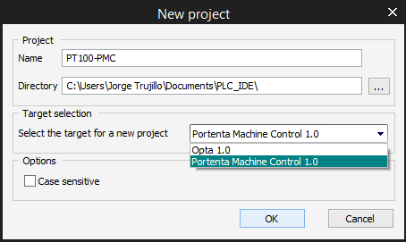
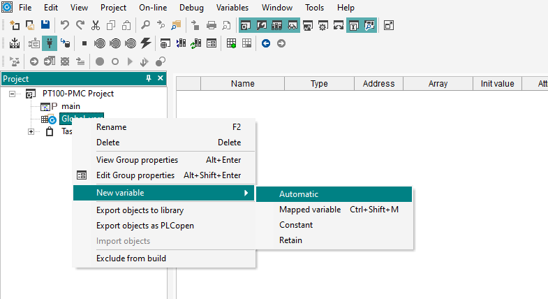
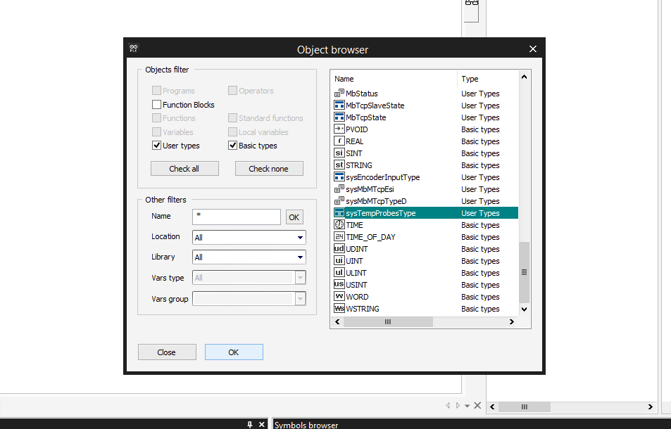

## Introduction
One usage example of a PT100 RTD (Resistance Temperature Detector) is in temperature measurement and control systems in industrial processes. PT100 RTDs are commonly used in industries such as chemical, petrochemical, and food processing, where accurate and reliable temperature measurement is critical for process control and safety.

In this example, we will connect a **PT100** RTD to a Portenta Machine Control (**PMC** from now on) and monitor the values through Arduino PLC IDE.

PT100 temperature sensors are the most common type of platinum resistance thermometer. Pt refers to that the sensor is made from Platinum (Pt). 100 refers to that at 0°C the sensor has a resistance of 100 ohms (Ω).

## Goals
The goals of this tutorial are:
- Understand the operation of the PMC's Temperature Probe inputs.
- Learn about PLC IDE functions and variables
- Read the temperature values using an RTD
- Jumper wire (x1)

## Hardware and Software Requirements
### Hardware Requirements
- Portenta Machine Control (x1)
- Micro-USB cable (x2)
- RTD - We use an PT100 but you can also use an PT1000 (x1)

### Software Requirements
- The [Arduino PLC IDE](https://www.arduino.cc/pro/software-plc-ide) (Including Arduino PLC IDE Tools)
- If you have not done so, follow the steps to set up and activate the PMC license in [this tutorial](https://docs.arduino.cc/tutorials/portenta-machine-control/plc-ide-setup-license)

## How RTD works
An RTD (Resistance Temperature Detector) is a temperature sensor that works by measuring the change in electrical resistance of a metal wire or element as temperature changes. The most common metal used for RTDs is platinum, and RTDs are sometimes referred to as PT100 sensors, where PT stands for platinum and 100 refers to the nominal resistance of the sensor at 0°C.
As temperature increases, the resistance of the metal element in the RTD increases predictably and linearly, which can be measured using an external circuit or instrument. The change in resistance is then converted into a temperature reading using a calibration curve or formula, which relates resistance to temperature.

RTDs are commonly used in industrial applications where temperature measurement is critical for process control and safety, and they are preferred over other types of temperature sensors because of their high accuracy, stability, and repeatability over a narrow temperature range.

## Connections


### Channels

Three independent temperature measurement channels are available.

**Channel 0**

  - Connect one RTD pin to TP0

  - Connect the other RTD pin to TN0

  - Connect a jumper between TP0 and RTD0

**Channel 1**

  - Connect one RTD pin to TP1

  - Connect the other RTD pin to TN1

  - Connect a jumper between TP1 and RTD1

**Channel 2**

  - Connect one RTD pin to TP2

  - Connect the other RTD pin to TN2

  - Connect a jumper between TP2 and RTD2

Each channel can measure non-grounded thermocouples OR PT100, but cannot measure them at the same time.

***Do not connect both a thermocouple and a PT100 to one channel. Only a single channel at a time is
available to be read.***

You can learn more about the RTD connections on the [Portenta Machine Control Datasheet](https://docs.arduino.cc/static/d73624511d43cf53f62620830ee9c114/AKX00032-datasheet.pdf).

### Connecting an RTD to the PMC

In this case, **we will set the channel 0 configuration** as described in the Datasheet, connecting one pin of the PT100 to the TP0 input, the other pin to TN0 and connecting a jumper between TP0 and RTD0 pins as you can see in the following image:


## PLC IDE

### Creating the project

Once we have correctly connected the TP100 to the PMC, the following steps are carried out in the Arduino PLC IDE. We assume that you have previously made the initial configuration of the PMC and activated [the neccessary license](https://store.arduino.cc/products/plc-key-portenta-machine-control) to use it. If you have not done this, it is explained in the  [Configuration tutorial](https://docs.arduino.cc/tutorials/portenta-machine-control/plc-ide-setup-license) mentioned above.

First, we need to **create a new project**. To do this, open the Arduino PLC IDE and click on "New Project" or by clicking on ```File > New project```:


Then, name the project and select "Portenta Machine Control 1.0" as the project target. Press OK:



### Behavior Setting

Once the project has been created, to visualize the "Temperature probes" inputs of the board, you need to go to the **Resources** Tools window and click on "**Temperature probes**". If you don't see this window, you can try to click on: ```View > Tools Windows > Resources``` 


After clicking on "Temperature Probes" we will see a table containing the three temperature probe inputs of the board. We have to make sure that the "**Behavior setting**" is set according to our RTD or Thermocouple sensor. In this case, we are using a two-wires PT100 sensor, so we will select the "**RTD TWO WIRES**" option:


By default the TP00 input is disabled. To enable it you only need to click next to "False" on TP00 "Enable" row and set it as "**True**":


Once enabled, we are ready to continue to the next step creating the necessary variables.

### Creating the variables

***By default the project creates an automatic type int variable called "cnt", you can delete it by right-clicking on it and clicking delete.***

To visualize the temperature values we need to create a variable to save the values. For doing it we need to go to **Global vars** section and right-click on it, select "New variable" and select "Automatic" type or go to ```Project > New objet > New variable > Automatic```. 



A New Variable Window will appear, set **TP00** as the variable name. On the type, press the [...] button and scroll down to find and select the "**sysTempProbesType**". This variable has the automatic process to convert the RTD values into real-type temperature values.



When it is done, press the **OK** button:


Repeat the previous steps to create a new variable called "**temp0**" and type "**REAL**". With this new variable we will directly store the temperature value of the sysTempProbesType variable in real numbers as you will see in the following steps.

If everything is correct, when you double-click on **Global_vars**, a table with the two variables should appear as in the following image:


### Main Program Code

Now that we have created the variables, we have to make it work by defining the variables in the **main** program code. To do this, double-click on "main" and write the next sentences in the code box:

```
TP00 := sysTempProbes[0];
temp0:= systempProbes[0].temperature;
```
Next, plug in your device, make sure it is connected to the Arduino PLC IDE and click the compile button to make sure there are no errors in the code.

If you are not sure about how to connect your device, you can check it on [the setup tutorial](https://docs.arduino.cc/tutorials/portenta-machine-control/plc-ide-setup-license#5-connect-to-the-device).


If there are no errors when compiling, you can download the code to the device by clicking on the button right to the connection symbol. You may see a warning message about the need to cold restart to download the code. Click Yes:


### Watch the values

To watch the values once we have downloaded the code into the PMC, we need to drop the variables in the "**Watch**" section as shown in the following animation. If you can't see the "Watch" window, you can try going to: ```Wiew > Tool Windows > Watch```


## Conclusion

## Troubleshooting