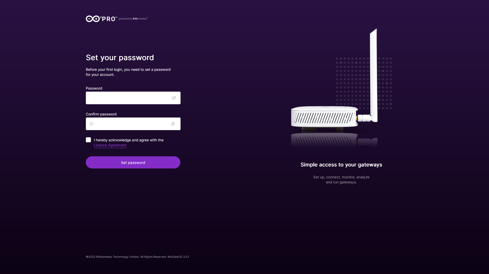
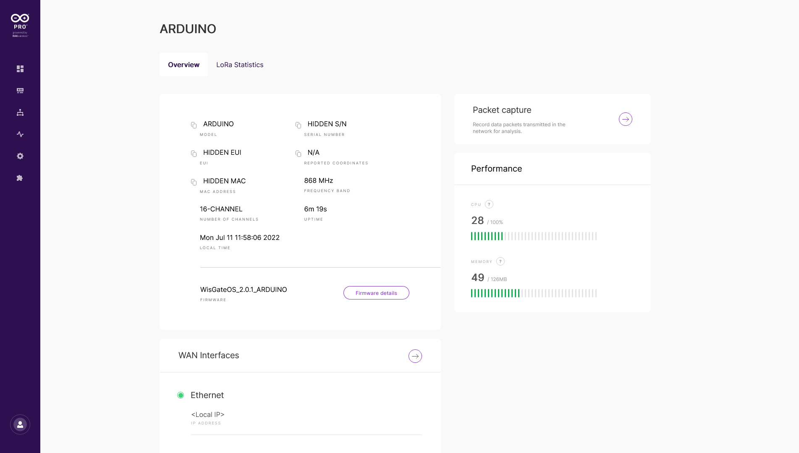
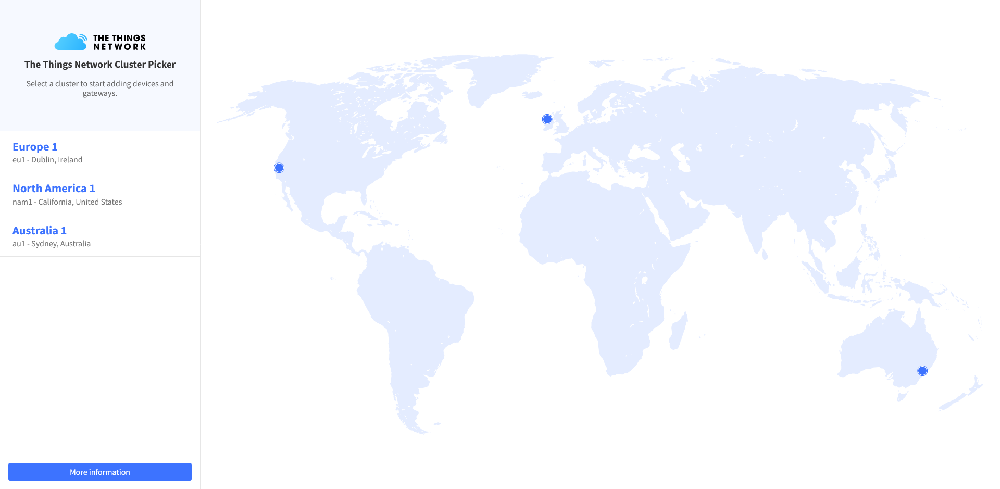
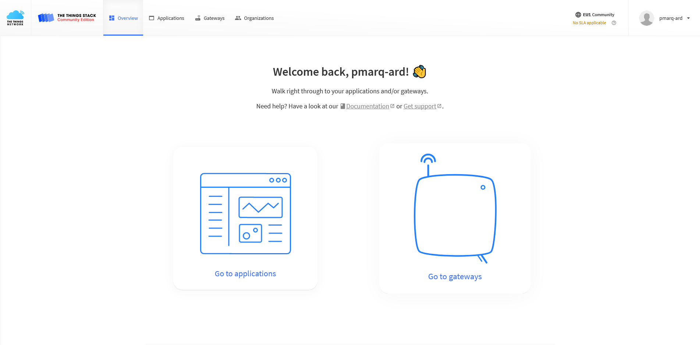
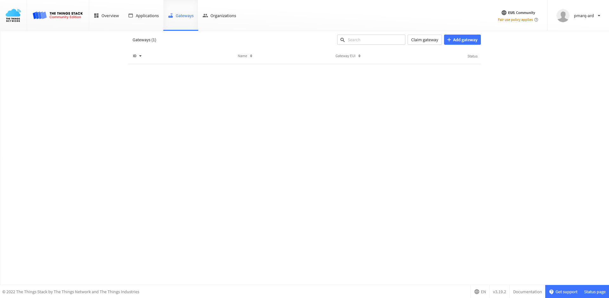
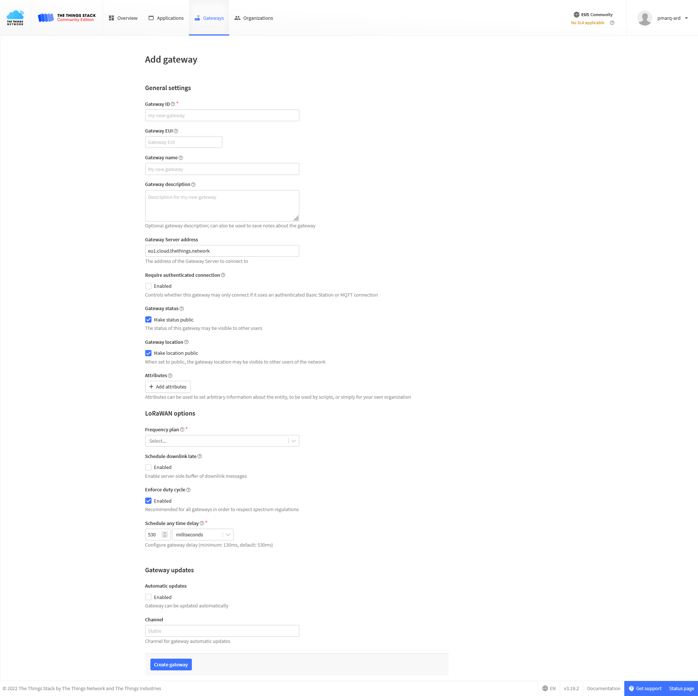
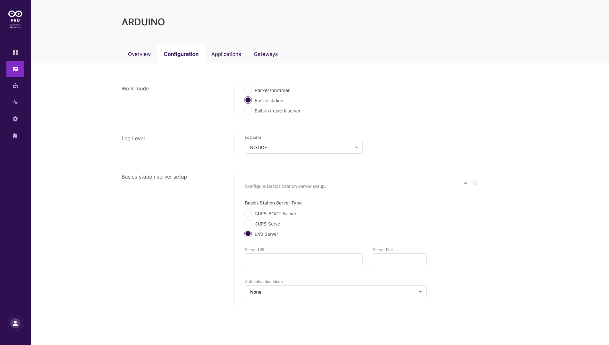
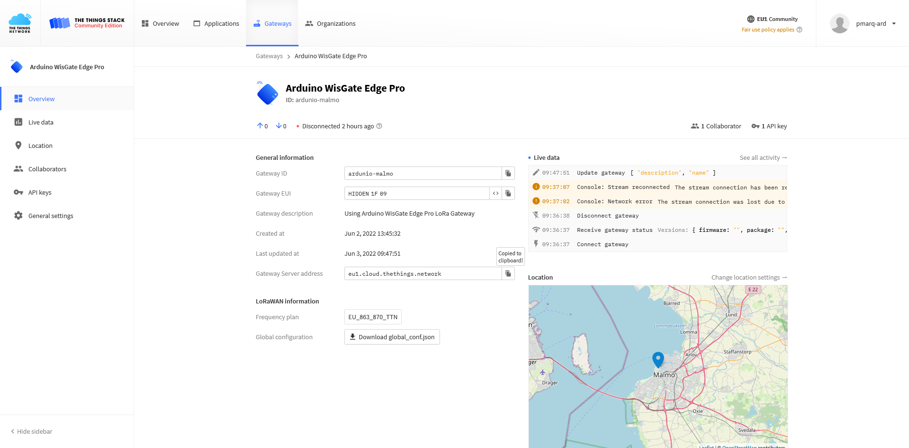
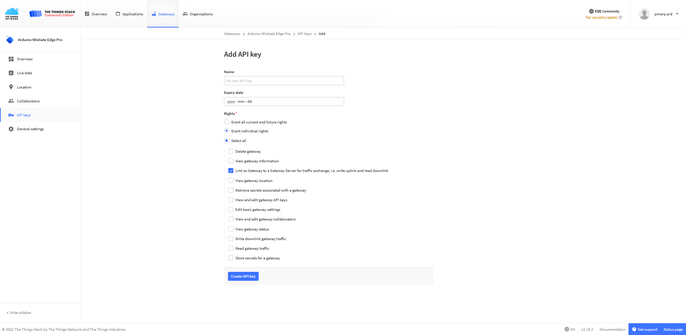

## Introduction

This tutorial will show you how to get started with your **WisGate Edge** gateway and how it can be utilized by itself. It will showcase the connection to **The Things NetworkTM**. We will go through the local and online setup.

## Goals

The goals of this article are:

- Setup the hardware
- Connect locally to the Gateway
- Open the dashboard panel
- Create a Gateway on The Things NetworkTM(TTN)
- Setup the credentials on the device from TTN
- Test the Gateway (optional)

## Hardware & Software Needed

- [WisGate Edge Pro or WisGate Edge Lite 2](https://store.arduino.cc/pages/wisgate-lora-gateways)
- x2 Ethernet Cable

## What's Included in the Box

The package includes:

* LoRa® Gateway
* PoE Injector (with its power cable, IEC)
* Pole mounting mechanical pieces

## Instructions

### Setup the Hardware

The device can be supplied from 37 to 57 VDC with a PoE or with a Solar panel (12 VDC).
You can supply it through the Solar Panel cable (12V cable) or with an ethernet cable with PoE.

In case of the PoE, you can use the PoE Injector included with the kit by connecting your LAN to the `LAN` port and the `PoE` port to the Gateway.

### Connect to the WisGate Dashboard

There are different ways to access the WisGate:

* Connecting to its Wi-Fi® Access Point (dashboard IP: `192.168.230.1`)
* Ethernet cable from your Computer to the Gateway (dashboard IP: `192.168.230.1`)
* Connecting your Gateway to your LAN, getting its DHCP IP (You will need to discover the device's IP)

Once you got the IP of your Gateway you can type it in your browser to access the dashboard.

The first time you attempt to login it will require you to set up the password of your dashboard, set your password, click set password and save it.

Once the password is set, you will now be able to see and interact with the dashboard panel.

***The Wi-Fi Access Point that is running, by default it is open, we recommend you to set a password with WPA2-PSK encryption to secure your device, you can do that by accessing the Wi-Fi settings going to network > LAN > Wi-Fi > Settings***

### Create the Gateway on TTN Dashboard

Go to https://cloud.thethings.network and pick your region's cluster, in our case we pick Europe.

Now chose the gateway button.

It will open the Gateways page, click the create gateway button

Fill the required forms.

Fill the information:

* Gateway ID: unique ID for your gateway inside the things network platform.
* Gateway EUI: The EUI of your WisGate Gateway (Get it on the overview page on the WisGate dashboard)
* Gateway name: Name of the Gateway on your TTN's profile
* Gateway Server Address: the Address of the LoRa® network (format: `wss://<cloudServer>`)
* LoRaWAN® options, Frequency plan: select the recommended plan or the one that fits your project

Click the "Create gateway" button at the end of the page.

You will see the new gateway added to your list.

### Setup Your Gateway with the TTN Credentials

Access to the Network configuration by clicking on its button.

On the configuration tab select the work mode to "Basic station"

Then at the "Basic station server setup" section pick the "LNS Server" as a type.

Fill the Server URL with `wss://eu1.cloud.thethings.network` (for EU) and the port `8887`

The authentication Mode "TLS Server & Client token Authentication"

Choose the file with the certificates that you can download from [here](https://letsencrypt.org/certs/isrgrootx1.pem)

And the client token that you can get inside the TTN Gateway's dashboard panel. 

Click the API key on the top right and create a new one.

Set the "Rights" to individual ones and chose the "Link as gateway to a Gateway Server for traffic exchange"

Then paste it on the WisGate dashboard form as `Authorization: <YOUR_API_KEY>`

Click "Save changes".

After finishing the setup you could see the Gateway status being "Connected"

### Test (Optional)

Follow this tutorial to connect to the GateWay [Connecting MKR WAN 1300 to The Things Network (TTN)](https://docs.arduino.cc/tutorials/mkr-wan-1300/the-things-network)

## Next Step

Set up the gateway to be a Network Server and MQTT client to connect directly to the Arduino Cloud.

## Conclusion

In this tutorial you learned how to setup the LoRa® Gateway.