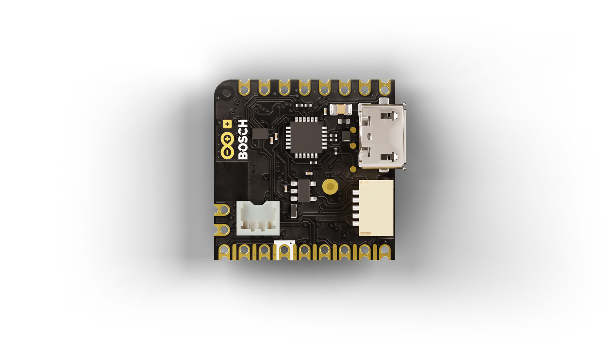
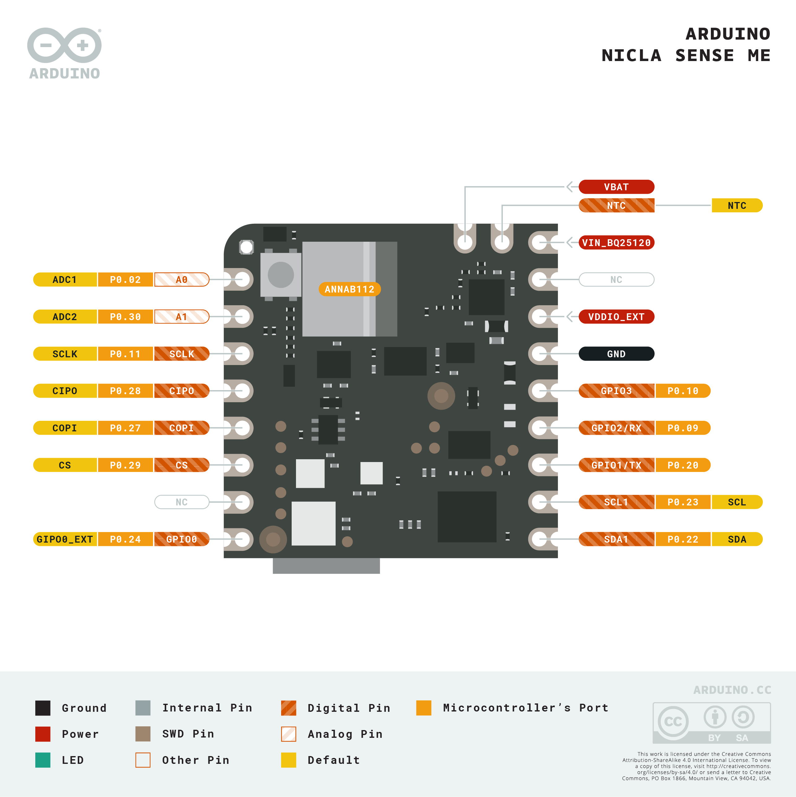
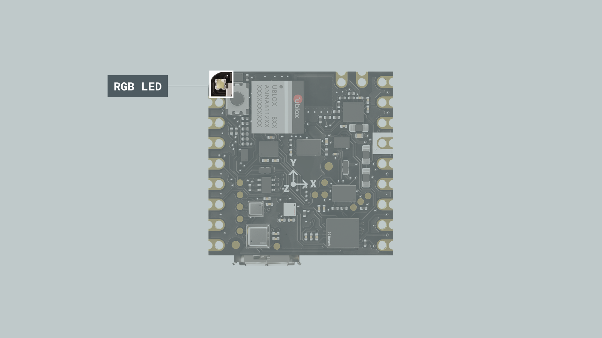
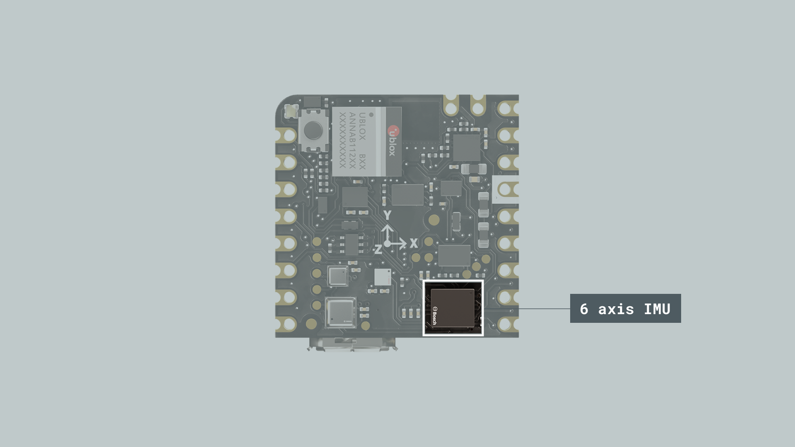
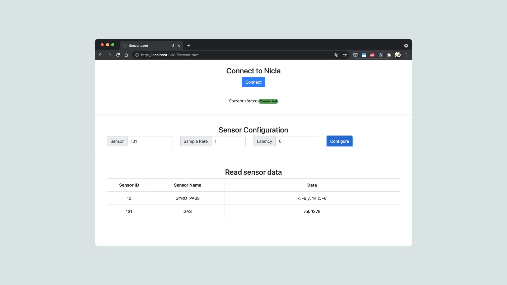

The Arduino® Nicla Sense ME is our smallest form factor yet, with a range of industrial grade sensors packed into a tiny footprint. It features 4 industrial grade Bosch sensors that can accurately measure rotation, acceleration, pressure, humidity, temperature, air quality and CO2 levels. 

## Goals

This article is a collection of guides, API calls, libraries and tutorials that can help you get started with the Nicla Sense ME board. You can also visit the [documentation product page for the Nicla Sense ME](/hardware/nicla-sense-me).

## Core

The Nicla Sense ME uses the [Arduino Mbed OS Nicla Boards core](https://github.com/arduino/ArduinoCore-mbed).

## Installation

### Arduino IDE 1.8.X

The Nicla Sense ME can be programmed through the **Classic Arduino IDE 1.8.X**. To install your board, you can check out the guide below:

- [Installing the Arduino Mbed OS Nicla Boards core](/software/ide-v1/tutorials/getting-started/cores/arduino-mbed_nicla)

### Arduino IDE 2 

The Nicla Sense ME can be programmed through the **Arduino IDE 2**. To install your board, you can check out the guide below:

- [How to use the board manager with the Arduino IDE 2](https://www.arduino.cc/en/Tutorial/getting-started-with-ide-v2/ide-v2-board-manager)

### Web Editor

The Nicla Sense ME can be programmed through the **Web Editor**. To get started with your board, you will only need to install a plugin, which is explained in the guide below:

- [Getting started with the Web Editor](/cloud/web-editor/tutorials/getting-started/getting-started-web-editor)

### Board Not Detected

Sometimes the board is not detected even when the board is connected to your computer. This can be solved through the following steps: 

**1.** Disconnect the board from your computer by removing the USB cable.  
**2.** Reconnect the board to your computer.  
**3.** If it still doesn't show up, double-tap the reset button, to activate the bootloader mode. 

## Pins



### Analog Pins

The Nicla Sense ME has 2 analog pins (`A0` and `A1`), that can be used through the `analogRead()` function.

```arduino
int value = analogRead(pin);
```

### PWM Pins

Most of the digital and analog pins can be used as PWM (Pulse Width Modulation) pins. Check the full pinout in the resources section of the [Nicla Sense ME product page](/hardware/nicla-sense-me) to see which pins can be used.

```arduino
analogWrite(pin, value);
```

### Digital Pins

There are a total of 10 digital pins, whereas the 2 analog pins can also be used as digital pins.

To use them, they need to be configured. Usually this is done in the `setup()` function.

```arduino
pinMode(pin, INPUT); //configured as an input
pinMode(pin, OUTPUT); //configured as an output
pinMode(pin, INPUT_PULLUP); //uses an internal pull up resistor
```

To read the state of a digital pin:

```arduino
state = digitalRead(pin);
```

To write a state to a digital pin:

```arduino
digitalWrite(pin, HIGH);
```

## RGB LED



The Nicla Sense ME features a built-in RGB that can be utilized as a feedback component for applications. The LED is connected through I2C, therefore specific functions need to be used to operate the LED colors.

The Nicla System header is required to use the RGB LED.

```arduino
#include "Nicla_System.h"
```

Since the functions are scoped under a specific Class name called "nicla", you need to explicitly write it before each statement.

The LEDs need to be started along with the Nicla inside `void setup()`:

```arduino
nicla::begin();
nicla::leds.begin();
```

The LED can be set to the desired RGB value using red, green and blue components or by using one of the following predefined colors:
- off
- red
- green
- blue
- yellow
- magenta
- cyan

To set the LED to a predefined color (e.g. green or blue):

```arduino
void loop() {
  nicla::leds.setColor(green);
  delay(1000);
  nicla::leds.setColor(blue);
  delay(1000);  
}
```

To turn the LED off:

```arduino
nicla::leds.setColor(off);
```

You can also choose a value between 255 - 0 for each color component to set a custom color:

```arduino
void loop() {
  int red = 234;
  int green = 72;
  int blue = 122;

  nicla::leds.setColor(red, green, blue);
  delay(1000);
  nicla::leds.setColor(off);
  delay(1000); 
}
```

This is a complete example code to blink the built-in I2C LED:

```arduino
#include "Nicla_System.h"

void setup() {
  nicla::begin();
  nicla::leds.begin();  
}

void loop() {
  nicla::leds.setColor(red);
  delay(1000);
  nicla::leds.setColor(off);
  delay(1000); 
}
```


## Sensors

There are three ways to read from the on-board sensors:

1. Read the sensors directly from Nicla Sense ME in standalone mode.
2. Read sensor values through Bluetooth® Low Energy
3. Read sensor values through I2C by connecting an ESLOV cable

To read from the sensors in any of these mode, you need to install the **Arduino_BHY2** and **Arduino_BHY2Host** libraries. These can be found in the library manager using the Arduino IDE. To do so in the IDE, select **Tools->Manage Libraries...**, now search for **Arduino_BHY2** and **Arduino_BHY2Host** in the new window that opened and click on the install button.

To use the sensors in your sketches, you need to know the sensors ID. You can find them in the section "Sensor IDs" of this article. They can also be found in the header file [here](https://github.com/arduino-libraries/Arduino_BHY2/blob/main/src/sensors/SensorID.h). Additionally, there is an example sketch in the library that will print all available sensors in the Serial Monitor of the Arduino IDE. This example sketch can be found in **File > Examples > Arduino_BHY2 > ShowSensorList** in the Arduino IDE.

In the following section, you can see how these ID's are used in an Arduino sketch.

### Sensor Classes

- **Sensor**: This class handles all the other sensors which have a single value to be read, like temperature, gas, pressure, etc. And also the event sensors, like the step detector. This generic sensor class provides the sensor data through the `value` property that returns a **float**.
- **SensorOrientation**: This class handles sensors with the Euler format, used for example with orientation. It allows you to read the `pitch`, `roll` and `heading` property.
- **SensorXYZ**: This class handles sensors with the XYZ format, like the accelerometer and the gyroscope. It contains `x` `y` and `z` values
- **SensorQuaternion**: Can be used to handle sensors with the quaternion format, can be used to calculate rotation vector, game rotation vector and geomagnetic rotation vector. You can access the `x`, `y`, `z` and `w` property using this class.
- **SensorActivity**: Use this class to handle sensors with the activity format. The activity is encoded as ID and can be retrieved from the `value` property. Use `getActivity` to get a human readable version of the activity e.g. "Walking activity started".
- **SensorBSEC**: BSEC stands for Bosch Sensortec Environmental Cluster, basically you can access the air quality (IAQ) level and it contains the following data:
  
  | Function     | Description                         | Data type       |
  | ------------ | ----------------------------------- | --------------- |
  | `iaq()`      | IAQ value for regular use case      | unsigned 16bit  |
  | `iaq_s()`    | IAQ value for stationary use cases  | unsigned 16bit  |
  | `b_voc_eq()` | breath VOC equivalent (ppm)         | float           |
  | `co2_eq()`   | CO2 equivalent (ppm) [400,]         | unsigned 32bit  |
  | `comp_t()`   | compensated temperature (Celsius)   | float           |
  | `comp_h()`   | compensated humidity                | float           |
  | `comp_g()`   | compensated gas resistance (Ohms)   | unsigned 32bit  |
  | `accuracy()` | accuracy level: [0-3]               | unsigned 8bit   |


Further down you can see how these objects are used in an Arduino sketch to get readings from the sensors.

### Sensor IDs

The IDs to address the sensors both through ESLOV and WebBLE are as follows:

| ID |             Description             |       SENSOR_ID MACRO        |    Class    |
| :-----------: | :---------------------------------: | :--------------------------: | :---------------: |
|       1       |      Accelerometer passthrough      |      SENSOR_ID_ACC_PASS      |     SensorXYZ     |
|       3       |     Accelerometer uncalibrated      |      SENSOR_ID_ACC_RAW       |     SensorXYZ     |
|       4       |       Accelerometer corrected       |        SENSOR_ID_ACC         |     SensorXYZ     |
|       5       |        Accelerometer offset         |      SENSOR_ID_ACC_BIAS      |     SensorXYZ     |
|       6       |   Accelerometer corrected wake up   |       SENSOR_ID_ACC_WU       |     SensorXYZ     |
|       7       | Accelerometer uncalibrated wake up  |     SENSOR_ID_ACC_RAW_WU     |     SensorXYZ     |
|      10       |        Gyroscope passthrough        |     SENSOR_ID_GYRO_PASS      |     SensorXYZ     |
|      12       |       Gyroscope uncalibrated        |      SENSOR_ID_GYRO_RAW      |     SensorXYZ     |
|      13       |         Gyroscope corrected         |        SENSOR_ID_GYRO        |     SensorXYZ     |
|      14       |          Gyroscope offset           |     SENSOR_ID_GYRO_BIAS      |     SensorXYZ     |
|      15       |          Gyroscope wake up          |      SENSOR_ID_GYRO_WU       |     SensorXYZ     |
|      16       |   Gyroscope uncalibrated wake up    |    SENSOR_ID_GYRO_RAW_WU     |     SensorXYZ     |
|      19       |      Magnetometer passthrough       |      SENSOR_ID_MAG_PASS      |     SensorXYZ     |
|      21       |      Magnetometer uncalibrated      |      SENSOR_ID_MAG_RAW       |     SensorXYZ     |
|      22       |       Magnetometer corrected        |        SENSOR_ID_MAG         |     SensorXYZ     |
|      23       |         Magnetometer offset         |      SENSOR_ID_MAG_BIAS      |     SensorXYZ     |
|      24       |        Magnetometer wake up         |       SENSOR_ID_MAG_WU       |     SensorXYZ     |
|      25       |  Magnetometer uncalibrated wake up  |     SENSOR_ID_MAG_RAW_WU     |     SensorXYZ     |
|      28       |           Gravity vector            |        SENSOR_ID_GRA         |     SensorXYZ     |
|      29       |       Gravity vector wake up        |       SENSOR_ID_GRA_WU       |     SensorXYZ     |
|      31       |         Linear acceleration         |        SENSOR_ID_LACC        |     SensorXYZ     |
|      32       |     Linear acceleration wake up     |      SENSOR_ID_LACC_WU       |     SensorXYZ     |
|      34       |           Rotation vector           |         SENSOR_ID_RV         | SensorQuaternion  |
|      35       |       Rotation vector wake up       |       SENSOR_ID_RV_WU        | SensorQuaternion  |
|      37       |        Game rotation vector         |       SENSOR_ID_GAMERV       | SensorQuaternion  |
|      38       |    Game rotation vector wake up     |     SENSOR_ID_GAMERV_WU      | SensorQuaternion  |
|      40       |     Geomagnetic rotation vector     |       SENSOR_ID_GEORV        | SensorQuaternion  |
|      41       | Geomagnetic rotation vector wake up |      SENSOR_ID_GEORV_WU      | SensorQuaternion  |
|      43       |             Orientation             |        SENSOR_ID_ORI         | SensorOrientation |
|      44       |         Orientation wake up         |       SENSOR_ID_ORI_WU       | SensorOrientation |
|      48       |            Tilt detector            |   SENSOR_ID_TILT_DETECTOR    |      Sensor       |
|      50       |            Step detector            |        SENSOR_ID_STD         |      Sensor       |
|      52       |            Step counter             |        SENSOR_ID_STC         |      Sensor       |
|      53       |        Step counter wake up         |       SENSOR_ID_STC_WU       |      Sensor       |
|      55       |         Significant motion          |        SENSOR_ID_SIG         |      Sensor       |
|      57       |            Wake gesture             |    SENSOR_ID_WAKE_GESTURE    |      Sensor       |
|      59       |           Glance gesture            |   SENSOR_ID_GLANCE_GESTURE   |      Sensor       |
|      61       |           Pickup gesture            |   SENSOR_ID_PICKUP_GESTURE   |      Sensor       |
|      63       |        Activity recognition         |         SENSOR_ID_AR         |  SensorActivity   |
|      67       |         Wrist tilt gesture          | SENSOR_ID_WRIST_TILT_GESTURE |      Sensor       |
|      69       |         Device orientation          |     SENSOR_ID_DEVICE_ORI     | SensorOrientation |
|      70       |     Device orientation wake up      |   SENSOR_ID_DEVICE_ORI_WU    |      Sensor       |
|      75       |          Stationary detect          |   SENSOR_ID_STATIONARY_DET   |      Sensor       |
|      77       |            Motion detect            |     SENSOR_ID_MOTION_DET     |      Sensor       |
|      91       |    Accelerometer offset wake up     |    SENSOR_ID_ACC_BIAS_WU     |     SensorXYZ     |
|      92       |      Gyroscope offset wake up       |    SENSOR_ID_GYRO_BIAS_WU    |     SensorXYZ     |
|      93       |     Magnetometer offset wake up     |    SENSOR_ID_MAG_BIAS_WU     |     SensorXYZ     |
|      94       |        Step detector wake up        |       SENSOR_ID_STD_WU       |      Sensor       |
|      115      |              BSEC data              |        SENSOR_ID_BSEC        |    SensorBSEC     |
|      128      |             Temperature             |        SENSOR_ID_TEMP        |      Sensor       |
|      129      |              Barometer              |        SENSOR_ID_BARO        |      Sensor       |
|      130      |              Humidity               |        SENSOR_ID_HUM         |      Sensor       |
|      131      |                 Gas                 |        SENSOR_ID_GAS         |      Sensor       |
|      132      |         Temperature wake up         |      SENSOR_ID_TEMP_WU       |      Sensor       |
|      133      |          Barometer wake up          |      SENSOR_ID_BARO_WU       |      Sensor       |
|      134      |          Humidity wake up           |       SENSOR_ID_HUM_WU       |      Sensor       |
|      135      |             Gas wake up             |       SENSOR_ID_GAS_WU       |      Sensor       |
|      136      |        Hardware Step counter        |       SENSOR_ID_STC_HW       |      Sensor       |
|      137      |       Hardware Step detector        |       SENSOR_ID_STD_HW       |      Sensor       |
|      138      |     Hardware Significant motion     |       SENSOR_ID_SIG_HW       |      Sensor       |
|      139      |    Hardware Step counter wake up    |     SENSOR_ID_STC_HW_WU      |      Sensor       |
|      140      |   Hardware Step detector wake up    |     SENSOR_ID_STD_HW_WU      |      Sensor       |
|      141      | Hardware Significant motion wake up |     SENSOR_ID_SIG_HW_WU      |      Sensor       |
|      142      |             Any motion              |     SENSOR_ID_ANY_MOTION     |      Sensor       |
|      143      |         Any motion wake up          |   SENSOR_ID_ANY_MOTION_WU    |      Sensor       |


The syntax to instantiate a sensor object is `SensorClass variableName(SENSOR_ID MACRO)`. For example:

```arduino
  // Declaring Accelerometer uncalibrated
  SensorXYZ accelerometerRaw(SENSOR_ID_ACC_RAW);
```

### Standalone Mode

In standalone mode, the sensors can be accessed through sensor objects. The sensor data is then read by Nicla Sense ME's on-board microcontroller.

#### IMU



Follow these steps to use the library to read the sensor values.

Include the library's header file:

```cpp
#include "Arduino_BHY2.h"
```

Define sensor objects:

```cpp
SensorXYZ accelerometer(SENSOR_ID_ACC);
SensorXYZ gyro(SENSOR_ID_GYRO);
```

Activating the sensors:

```cpp
void setup(){
  Serial.begin(115200);
  BHY2.begin();

  accelerometer.begin();
  gyro.begin();
}
```

The `begin()` function starts the sensor by calling the `configure()` with default parameters, making it easy to start and use on-board sensors. The parameters in the `configure()` function are sample rate and latency. If specific parameters are needed, then simply call `configure()` with your preferred values. E.g.: `configure(10, 1)`. In this case, the sample rate would be set to `10 Hz` and the latency would be `1ms`.

- **Sample rate** is used also to enable/disable the sensor. 0 to disable, > 0 to enable.
- **Latency** is the longest delay, in milliseconds, before the host is notified of a new value from a sensor. Even though the latency parameter is a 32-bit integer, only the least significant 24 bits of it are actually used. A latency of 0 means that the host is notified immediately when a new value is available.

Reading the sensor values:

```cpp
void loop(){
  static auto lastCheck = millis();

  // Update function should be continuously polled
  BHY2.update();

  // Check sensor values every second  
  if (millis() - lastCheck >= 1000) {
    lastCheck = millis();

    Serial.println(String("acceleration: ") + accelerometer.toString());
    Serial.println(String("gyroscope: ") + gyro.toString());
  }
}
```

You can read the numeric x, y and z properties of the accelerometer and the gyroscope as follows:

```cpp
short accX = accelerometer.x();
short accY = accelerometer.y();
short accZ = accelerometer.z();

short gyroX = gyroscope.x();
short gyroY = gyroscope.y();
short gyroZ = gyroscope.z();
```

#### Temperature

To read the temperature in standalone mode, you also need to use the Arduino_BHY2 library as described in the section above.

Follow these steps to use the library to read the sensor values.

Include the library's header file:

```cpp
#include "Arduino_BHY2.h"
```

Define the sensor object:

```cpp
Sensor temperature(SENSOR_ID_TEMP);
```

Activating the sensor:

```cpp
void setup(){
  Serial.begin(115200);
  BHY2.begin();
  temperature.begin();
}
```

Reading the sensor value:

```cpp
void loop(){
  static auto lastCheck= millis();
  BHY2.update();

  // Check sensor values every second  
  if (millis() - lastCheck >= 1000) {
    lastCheck = millis();
    Serial.println(String("temperature: ") + String(int(temperature.value())));
  }
}
```

#### Gas

To get readings from the gas sensor in standalone mode, you also need to use the Arduino_BHY2 library as described in the section above.

Follow these steps to use the library to read the sensor values.

Include the library's header file:

```cpp
#include "Arduino_BHY2.h"
```

Define the sensor object:

```cpp
Sensor gas(SENSOR_ID_GAS);
```

Activating the sensor:

```cpp
void setup() {
  Serial.begin(115200);
  BHY2.begin();
  gas.begin();
}
```

Reading the sensor value:

```cpp
void loop(){
  static auto lastCheck= millis();
  BHY2.update();

  // Check sensor values every second  
  if (millis() - lastCheck >= 1000) {
    lastCheck = millis();
    Serial.println(String("gas: ") + String(gas.value()));
  }
}
```

#### Pressure

To get readings from the pressure sensor in standalone mode, you also need to use the Arduino_BHY2 library as described in the section above.

Follow these steps to use the library to read the sensor values in hPa.

Include the library's header file:

```cpp
#include "Arduino_BHY2.h"
```

Define the sensor object:

```cpp
Sensor pressure(SENSOR_ID_BARO);
```

Activating the sensor:

```cpp
void setup() {
  Serial.begin(115200);
  BHY2.begin();
  pressure.begin();
}
```

Reading the sensor value:

```cpp
void loop(){
  static auto lastCheck= millis();
  BHY2.update();

  // Check sensor values every second  
  if (millis() - lastCheck >= 1000) {
    lastCheck = millis();
    Serial.println(String("pressure: ") + pressure.toString());
  }
}
```
#### Quaternion Rotation

To get readings from the IMU in a quaternion format in standalone mode, you also need to use the Arduino_BHY2 library as described in the section above.

Follow these steps to use the library to read the sensor values.

Include the library's header file:

```cpp
#include "Arduino_BHY2.h"
```

Define the sensor object:

```cpp
SensorQuaternion rotation(SENSOR_ID_RV);
```

Activating the sensor:

```cpp
void setup(){
  Serial.begin(115200);

  BHY2.begin();
  rotation.begin();
}
```

Reading the sensor value:

```cpp
void loop(){
  static auto lastCheck = millis();
  BHY2.update();

  if (millis() - lastCheck >= 1000) {
    lastCheck = millis();
    Serial.println(String("rotation: ") + rotation.toString());
  }
}
```

#### Activity

To get activity status in standalone mode, you also need to use the Arduino_BHY2 library as described in the section above.

Follow these steps to use the library to read the sensor values.

Include the library's header file:

```cpp
#include "Arduino_BHY2.h"
```

Define the sensor object:

```cpp
SensorActivity activity(SENSOR_ID_AR);
```

Activating the sensor:

```cpp
void setup(){
  Serial.begin(115200);

  BHY2.begin();
  activity.begin();
}
```

Reading the sensor value:

```cpp
void loop(){
  static auto lastCheck = millis();
  BHY2.update();

  if (millis() - lastCheck >= 1000) {
    printTime = millis();
    Serial.println(String("Activity info: ") + activity.toString());
  }
}
```

#### BSEC Data

To get readings from the BME sensor in standalone mode, you also need to use the Arduino_BHY2 library as described in the section above.

Follow these steps to use the library to read the sensor values.

Include the library's header file:

```cpp
#include "Arduino_BHY2.h"
```

Define the sensor object:

```cpp
SensorBSEC bsec(SENSOR_ID_BSEC);
```

Activating the sensor:

```cpp
void setup(){
  Serial.begin(115200);

  BHY2.begin();
  bsec.begin();
}
```

Reading the sensor value:

```cpp
void loop(){
  static auto lastCheck = millis();
  BHY2.update();

  if (millis() - lastCheck >= 1000) {
    printTime = millis();
    Serial.println(String("BSEC info: ") + bsec.toString());
  }
}
```

### Sensor Data Over ESLOV


In order to transmit data over ESLOV to another Arduino board you need to connect the boards with an ESLOV cable. The Nicla Sense ME could for example be connected to an Arduino Portenta H7.


1. To have the Nicla Sense ME pass the sensor data through ESLOV, you need to upload the **App** sketch. You can find it in the Examples menu in the IDE under **Arduino_BH2 > App**. After you upload the sketch, you can disconnect the Nicla Sense ME from the USB cable. It can be powered through the ESLOV connection.

2. For the receiving device you need to upload the passthrough sketch. You can find it in the Examples menu in the IDE under **Arduino_BHY2Host > Passthrough**. After you upload the sketch, a separate serial port will be exposed. One port is used for debugging and the other one is used for passing through the sensor data. The latter one is the one you will use to configure the sensors and read from them.

3. When you're done uploading the sketches, you can use the **bhy** script to interact with the sensors. In the downloaded package (see [here](#sensors)), navigate into the tools folder. There you will find binaries of the bhy tool for Linux and Windows. If you like, you can build the tool yourself (e.g. if you are on macOS). For that, if you haven't installed **Go** yet, please do so by following [there](https://golang.org/doc/install) instructions.
From the terminal execute this command to start the build: `go build`

4. Use the bhy command as follows:

```bash
# list available serial ports
./bhy list

# read available sensor data
./bhy sensor read -p /dev/ttyACM2

# continuously read sensor data when available
./bhy sensor read -live -p /dev/ttyACM2

# configure sensor 10 with a sample rate of 1 Hz and latency of 0ms
./bhy sensor config -p /dev/ttyACM2 -sensor 10 -rate 1 -latency 0

# disable sensor 10
./bhy sensor config -p /dev/ttyACM2 -sensor 10 -rate 0 -latency 0
```

***/dev/ttyACM2 needs to be replaced with the (second) port from the host device retrieved through the list command.***

First execute a list command to retrieve the available ports. The output should look similar to this:

```bash
$ ./bhy list
Found port: /dev/cu.usbmodem142301
   USB ID     2341:8054
   USB serial 554466C450534B54332E3120FF03071B554466C450534B54332E3120FF03071B
Found port: /dev/cu.usbmodem142303
   USB ID     2341:8054
   USB serial 554466C450534B54332E3120FF03071B554466C450534B54332E3120FF03071B
```

Then execute a config command to enable the desired sensor. Please refer to the [Sensor IDs](#sensor-ids) section to find the desired sensor ID. The output of this command should look similar to this:

```bash
$ ./bhy sensor config -p /dev/cu.usbmodem142303 -sensor 10 -rate 1 -latency 0
Connected - port: /dev/cu.usbmodem142303 - baudrate: 115200
Sending configuration: sensor 10	rate 1.000000	latency 0Sent 10 bytes
Sensor configuration correctly sent!
```

Then you can retrieve sensor data from the sensor using the read command. Here is an example output:

```bash
$ ./bhy sensor read -live -p /dev/cu.usbmodem142303
Connected - port: /dev/cu.usbmodem142303 - baudrate: 115200
Sensor id: 10   name: GYRO_PASS   values: x : -12.000000   y : 12.000000   z : -9.000000
Sensor id: 10   name: GYRO_PASS   values: x : -13.000000   y : 12.000000   z : -10.000000
```

***If there is not ESLOV activity in the first minute after power up, the LDO is disabled and then also ESLOV is disabled. This has been made for low power reasons. However, you could change this timeout by calling `BHY2.setLDOTimeout(milliSeconds)` from your sketch.***

### Sensor Data Over WebBLE

Sensor data from the Nicla Sense ME can also be retrieved through Bluetooth® Low Energy in the web browser. For that you can use the bhy tool. Please follow steps 1 - 3 from the "Sensor Data Over ESLOV" section. Then execute the following command to start the webserver: `./bhy webserver`.
When the server has started, you can open the landing page in your browser: [http://localhost:8000/](http://localhost:8000/). Click on "Open sensor page". 


Then click the "Connect" button and pair your computer with the Nicla Sense ME board. 

***For this feature to work, make sure that Web Bluetooth® Low Energy is both supported and enabled! In Google Chrome go to [chrome://flags]() and enable "Experimental Web Platform features".***

You can check the browser compatibility with WebBLE [here](https://developer.mozilla.org/en-US/docs/Web/API/Web_Bluetooth_API#browser_compatibility).

Use the sensor IDs from the section "Sensor IDs" to enable and configure the desired sensors. A sample rate > 0 will enable the sensor.



## BSX Sensor Fusion Software

The BHI260AP sensor runs a customizable firmware based on the BSX Sensor Fusion library. It provides a complete 9-axis fusion solution, which combines the measurements from 3-axis gyroscope, 3-axis geomagnetic sensor and a 3-axis accelerometer, to provide a robust absolute orientation vector. The algorithm fuses the sensor raw data from the accelerometer, geomagnetic sensor and gyroscope in an intelligent way to improve each sensor’s output.

Go to this [site](https://www.bosch-sensortec.com/software-tools/software/sensor-fusion-software/) or take a look at the BHI260AP's [datasheet](https://www.bosch-sensortec.com/media/boschsensortec/downloads/datasheets/bst-bhi260ap-ds000.pdf) for more information.

## Communication

Like other Arduino® products, the Nicla Sense ME features dedicated pins for different protocols.

### SPI

The pins used for SPI (Serial Peripheral Interface) on the Nicla Sense ME are the following:

- CS
- CIPO
- COPI
- SCLK

You can refer to the [pinout](#pins) above to find them on the board.

To use SPI, you first need to include the [SPI](https://www.arduino.cc/en/reference/SPI) library.

```arduino
#include <SPI.h>
```

Inside `void setup()` you need to initialize the library.

```arduino
SPI.begin();
```

And to write to the device:

```arduino
  digitalWrite(chipSelectPin, LOW); //pull down the CS pin
  
  SPI.transfer(address); // address for device, for example 0x00
  SPI.transfer(value); // value to write

  digitalWrite(chipSelectPin, HIGH); // pull up the CS pin
```


### I2C

The pins used for I2C (Inter-Integrated Circuit) on the Nicla Sense ME are the following:

- SDA: SDA1
- SCL: SCL1

You can refer to the [pinout](#pins) above to find them on the board.

To use I2C, you can use the [Wire](https://www.arduino.cc/en/Reference/wire) library, which you need to include at the top of your sketch.

```arduino
#include <Wire.h>
```

Inside `void setup()` you need to initialize the library.

```arduino
Wire.begin(); 
```

And to write something to a device connected via I2C, you can use the following commands:

```arduino
  Wire.beginTransmission(1); //begin transmit to device 1
  Wire.write(byte(0x00)); //send instruction byte 
  Wire.write(val); //send a value
  Wire.endTransmission(); //stop transmit
```

### UART

The pins used for UART (Universal asynchronous receiver-transmitter) are the following:

- Rx: GPIO2
- Tx: GPIO1

You can refer to the pinout above to find them on the board.

To send and receive data through UART, you will first need to set the baud rate inside `void setup()`.

```arduino
Serial1.begin(9600);
```

To read incoming data, you can use a while loop() to read each individual character and add it to a string.

```arduino
  while(Serial1.available()){
    delay(2);
    char c = Serial1.read();
    incoming += c;
  }
```

And to write something, you can use the following command:

```arduino
Serial1.write("Hello world!");
```


### Bluetooth® Low Energy

#### Using the BHY2Host Library with Bluetooth® Low Energy

The BHY2 library for the Nicla Sense ME can automatically send sensor values over a Bluetooth® Low Energy connection to a host board that uses the **Arduino_BHY2Host** library.

Include the BHY2Host library at the top of the sketch of the **Host** board.

Configure the sensors the same way as you do with the BHY2 library except of the `begin` function that takes a `NICLA_VIA_BLE` parameter.

```cpp
#include "Arduino_BHY2Host.h"

Sensor temperature(SENSOR_ID_TEMP);
int lastCheck = 0;

void setup(){
  Serial.begin(115200);
  BHY2Host.begin(false, NICLA_VIA_BLE);
  temperature.begin();
}

void loop(){
  static auto lastCheck= millis();
  BHY2Host.update();

  // Check sensor values every second  
  if (millis() - lastCheck >= 1000) {
    lastCheck = millis();
    Serial.println(String("temperature: ") + String(int(temperature.value())));
  }
}
```
The parameters of `BHY2Host::begin` are: data pass through and communication configuration. The first parameter defines if the data should be passed through the Serial connection. This allows to control the Nicla Sense ME from a PC when connected through a host board. You can use the arduino-bhy tool to control the Nicla Sense ME from either the PC command line or from a web page. The second parameter can take one of the following values: NICLA_VIA_BLE, NICLA_AS_SHIELD, NICLA_VIA_ESLOV (default).

#### Using the Bluetooth® Low Energy Library

To enable Bluetooth® Low Energy on the Nicla Sense ME, you can use the [ArduinoBLE](https://www.arduino.cc/en/Reference/ArduinoBLE) library. The example sketches included in the library work also with Nicla Sense ME with some minor modifications:

Include the Nicla System header at the top of your sketch:

```cpp
#include "Nicla_System.h"
```

In the setup() function add:

```cpp
nicla::begin();
```

Here is an example of how to use the Bluetooth® Low Energy library to advertise a byte characteristic that can be used for example to toggle an LED.

Include the library header it at the top of your sketch:

```arduino
#include <ArduinoBLE.h>
```

Set the service and characteristic:

```arduino
BLEService ledService("180A"); // BLE LED Service
BLEByteCharacteristic switchCharacteristic("2A57", BLERead | BLEWrite);
```

Set advertised name and service:

```arduino
  BLE.setLocalName("Nicla Sense ME");
  BLE.setAdvertisedService(ledService);
```

Start advertising:

```arduino
BLE.advertise();
```

Listen for BLE peripherals to connect:

```arduino  
BLEDevice central = BLE.central();
```

## Conclusion

This cheat sheet is written as a quick reference mainly to look up the features of this product. For a more in-depth walk though experience, please have a look at the other tutorials.
