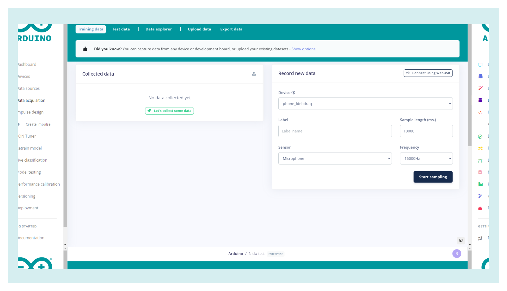
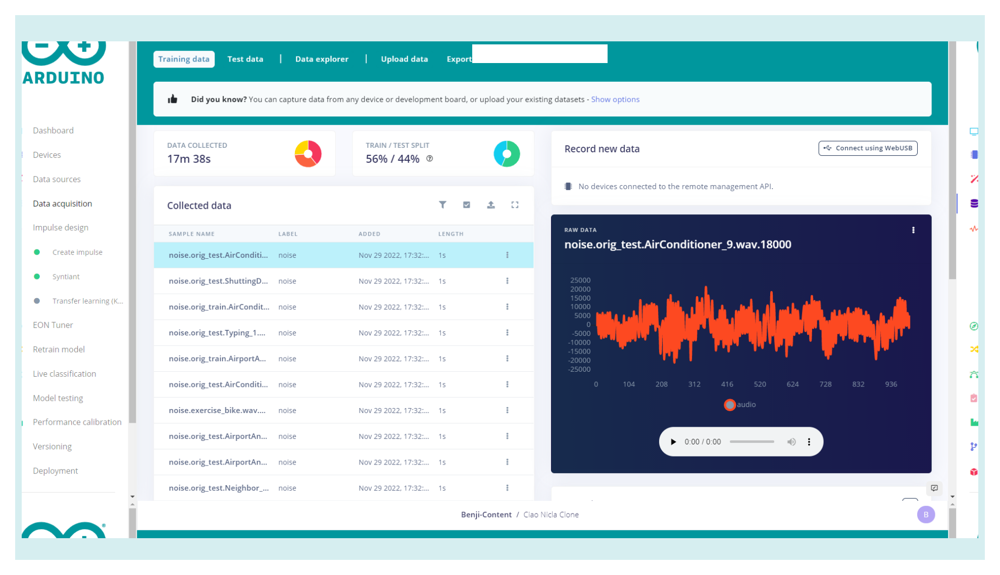
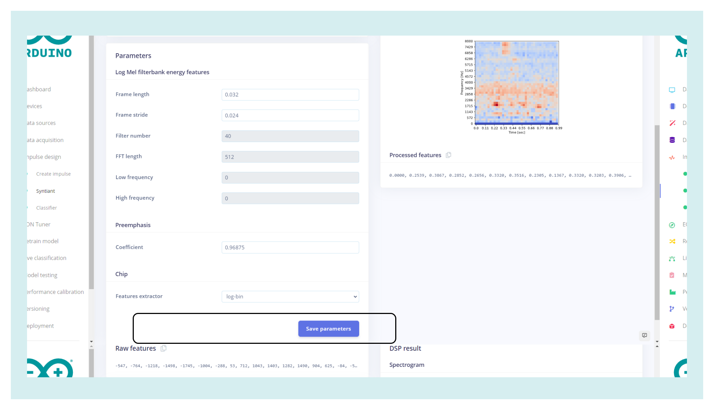
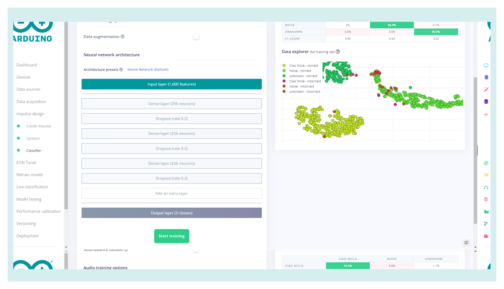

## Overview

The Arduino® Nicla Voice runs audio inputs through the powerful Syntiant NDP120 Neural Decision processor, which mimics human neural pathways to run multiple AI algorithms and automate complex tasks. In other words, it hears different events and keywords simultaneously, and is capable of understanding and learning what sounds mean. To make use of these keyword triggers, like blinking the LED when it recognizes a specific word, a machine learning model is required. With Edge Impulse it is possible to build, train these machine learning models and easily deploy the model to the Nicla Voice board. This tutorial will go through this process. 

## Goals

The goals of this tutorial are:

- Learn how to capture audio for a ML model
- Learn how to train an Edge Impulse model
- Learn how to export the model for use with the Nicla Voice
- Learn how to use this model in a sketch

## Hardware & Software Needed

- Arduino IDE ([online](https://create.arduino.cc/) or [offline](https://www.arduino.cc/en/main/software)).
- [Arduino Nicla Voice]().
- [Arduino Cloud](https://cloud.arduino.cc/)
- [Edge Impulse](https://www.edgeimpulse.com/)

## Instructions

### Testing Default Sketch

The Nicla Voice comes pre-flashed with the Alexa Demo. To test this sketch simply connect the Nicla Voice to a computer or alternative power source and say "Hey Nicla". This should make the LED on the board blink. If there is no response from the board try moving closer to it or speak louder. This function is what we are going to replicate with the custom Edge Impulse model that will be created in this tutorial.

Now lets take a look at how to create a Edge Impulse model.

## The Machine Learning Model

To be able to train a machine learning model to classify audio we first need to feed it with audio, which will be sound that it should recognize. During the training process the model will be trained using a concept called supervised learning. This means that we train the model with known data and tell it while it's "practicing" its predictions if they are correct or not. For supervised learning objects are labeled beforehand with their names, which you will see when we get to the audio recording section.

### Overfitting

If a machine learning model is overfitting, it means that it is too well geared towards your training data and won't perform well with unseen input data. You need some variation in the training dataset and adjust the parameters so that it doesn't just learn all input data by heart and makes the classification based on that but you rather want the model to learn the concept of a object or sound. In machine learning this problem is a common pitfall.

To find the right configuration for your application often requires trial and error. Edge Impulse shows in [this article](https://docs.edgeimpulse.com/docs/tips-and-tricks/increasing-model-performance) how to improve poorly performing machine learning models.

### Creating a custom Edge Impulse Model

With the Nicla Voice it is possible to train your own model for voice recognition and use it with the board. This will allow the Nicla Voice to detect words or phrases that you yourself record. First, if you do not already have a Arduino Cloud account, please go [here and create one](https://cloud.arduino.cc/home/). You can then access Edge Impulse via the Arduino Cloud, as shown in the image below.

With the account set up, now create a new project and lets move to the next step to capture data for the model.

### Capturing Data for the Model

There are various different methods for capturing sound for the model with Edge Impulse. Navigate to the [data acquisition page]() and pick the preferred method for capturing audio.

This tutorial will go through how to capture audio from the phone directly to the ML model. It is possible to capture audio from the Nicla Voice and upload it to the Edge Impulse model by using the NDP library's "Record and Stream" example.

On the data acquisition page, press the "Let's collect some data" button. Now select the "Show QR code" option in the "Use your mobile phone" section.

Scan the QR code with your phone and it will automatically connect. Set the options as shown below and you are ready to start recording audio for the ML model. On your phone select the option for recording audio and give the appropriate permissions, there should now be button on the screen that says "Start recording". Before recording set the label of the recordings to match the phrase you want to be recognized, this will make it easier to sort the data later.

When a recording is made on the phone it will automatically show up on the webpage. First start by recording around 5 minutes of the phrase you want recognized, in this tutorial "Hey Nicla" will be used. Try to vary the distance from the microphone, the pronunciation and the inflection when speaking the phrase to give the model a wider definition of the phrase that should be recognized.  Once this is done, record another 5 minutes of random words that are not the desired phrase, set the label for these recordings as "unknown". This will help with the training of the model later. And to give the model a better understanding of what sounds not to recognize as the trigger also record 5 minutes of background noise and ambient noise, set the label of these recordings as "noise". The more data collected the better the model can be trained to recognize the phrase that is wanted, feel free to collect as much of these three different categories as needed.

Make sure to have a good training / test data split ratio of around 80/20. The test data is used to test the model with "unseen" data after the training has finished. If you have an overfitting model you may see high accuracy in the training results but poor performance in the testing results. If that's the case you may have to tweak the parameters or collect more / better training data. More information on this can be found in the Edge Impulse documentation referenced above.

### Create an Impulse

Now that we have the data samples we can move on to designing the impulse. An impulse is in a nutshell a recipe with which the model is being trained. It defines actions that are performed on your input data to make them better suited for machine learning and a learning block that defines the algorithm for the classification. In the menu navigate to "Create Impulse" under "Impulse Design" and add an Audio processing block, which will be "Syntiant" in this case, as well as a Classification block. The page should now look like the image below.

Under "Impulse Design" go to the "Syntiant" page. In the "Parameters" settings the "Features extractor" has to be set to "log-bin". This means that the window will be a fixed size. The window is the size of data that will be processed per classification.

Now select the "Generate features" tab on the "Syntiant" page. On this page press the green "Generate features" button, if you have collected 15 minutes of data as suggested in the previous step this will take some time to complete. Now a visualization of the data can be seen on the right. Here you can easily see if the different classes of data collected separate, this can help you figure out if the desired phrase will be easily differentiated from the noise and random words recorded.

Now that the settings are correct and we have the data for the model it needs to be trained.

### Training the Model

Go to the "Classifier" tab under "Impulse design". We can keep the default settings here and press the "Start training" button. On the right you can see the progress of the training, this process will also take some time to complete.

Once it is complete the performance of the models training can be seen below. Ideally you want to get as close to 100% accuracy as possible for each class. If the results are poor the sound recorded may not be representative of the audio that it is being classified as. The audio that is incorrect should then be removed from the data set and replaced if the data set becomes too small.

### Deploying the Model

The model is now ready to be built and deployed. Go to the "Deployment" page. Select the "Syntiant NDP120 library" and set the posterior parameters. Click the "Find posterior parameters" button, in the window that pops up select all keywords that we have created in the steps before, we can keep the calibration settings to "No calibration". Then press the green "Find parameters" button, when the job is done you can close this window.

Next select the Nicla Voice firmware and build. When the building is done you will receive a .zip file containing the model built for the Nicla Voice.

### Uploading the Model to Nicla Voice

### Setting up Arduino IDE

Make sure the latest version of the Arduino IDE is installed. The IDE can be downloaded [here](https://www.arduino.cc/en/software). Within the Arduino IDE install the core for Nicla. Go to **Tools > Board > Boards Manager**, in the board's manager section search for **Arduino Mbed OS Nicla Boards** and install it.

Now you are ready to upload sketches to the Nicla Voice via the Arduino IDE.

### Using the Model in a Sketch

### Testing It Out

## Conclusion

This tutorial showed how to set up the Edge impulse platform to create a machine learning model to use with the Nicla Voice. It went through how to collect audio with a phone, how to train the model with the data and then how to build it to work with the board. Lastly, the tutorial shows how to upload the model to the Nicla Voice and how to use that model in a sketch.

### Troubleshoot

