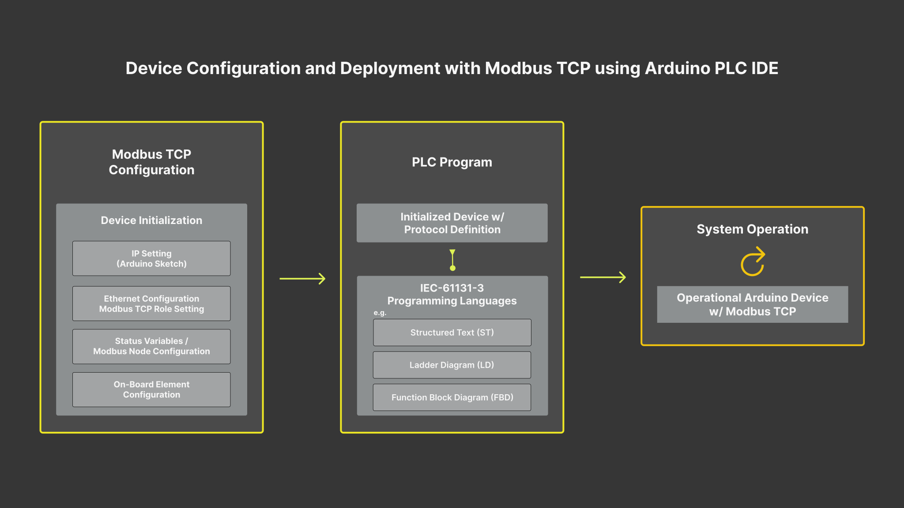
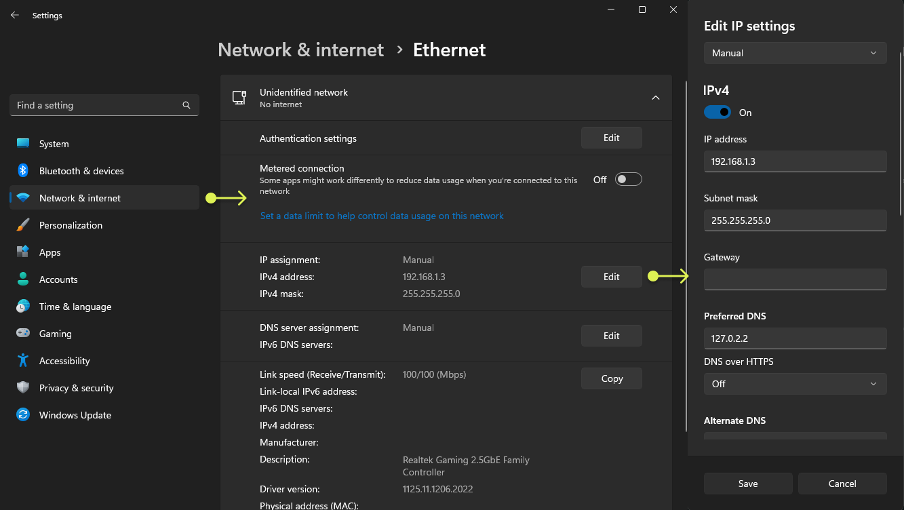
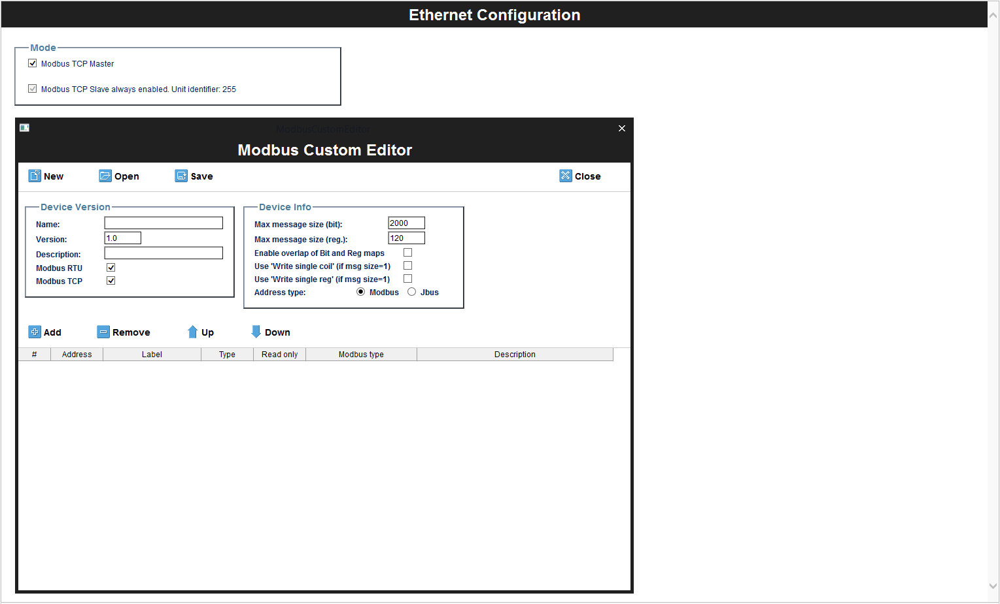
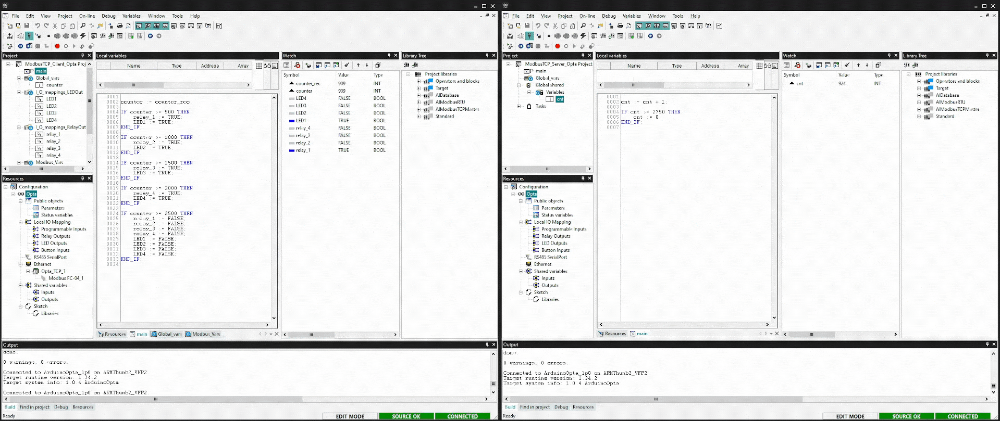

## Overview

Opta™ is distinguished by its industrial-grade hardware that ensures durability and consistent performance even in the most challenging environments. A highlight of its design is the inclusion of multiple connectivity options, notably Modbus TCP through the RJ-45 port.


In this tutorial, you will learn how to implement Modbus TCP based communication between two Opta™ devices using Arduino PLC IDE.

## Goals

- Learn how to configure the workspace environment to work with Modbus TCP using Arduino PLC IDE.
- Learn how to configure Modbus TCP for Opta™ using Arduino PLC IDE.
- Learn how to verify that Opta™ has been correctly set up using an example that uses Modbus TCP communication.

## Required Hardware and Software

### Hardware Requirements

- [Opta™ WiFi](https://store.arduino.cc/products/opta-wifi) (x2)
- USB-C® cable (x2)
- RJ-45 LAN cable (x3)
- Ethernet Switch (Recommended) (x1)

### Software Requirements

- [Arduino PLC IDE Tools](https://www.arduino.cc/en/software#arduino-plc-ide)
- [Arduino PLC IDE software](https://www.arduino.cc/en/software#arduino-plc-ide)
- If you have an Opta™, you do not need any license key to activate your product. Go to section [__License Activation With Pre-Licensed Products (Opta™)__](https://docs.arduino.cc/software/plc-ide/tutorials/plc-ide-setup-license#7-license-activation-with-pre-licensed-products-opta) to know more.
- [Opta™ Modbus TCP PLC IDE Project Example File](assets/ModbusTCP_Opta_Example.zip)

***Your Opta is already pre-licensed so no license key is need it to activate your product. Check [the license activation guide](https://docs.arduino.cc/tutorials/opta/plc-ide-setup-license#7-license-activation-with-pre-licensed-products-opta) to learn more.***

## Modbus TCP

The Modbus protocol is a messaging service structure using Client/Server or Master/Slave communication. It is an *application protocol*, with its data management being independent of the transmission method.

The **Modbus TCP/IP**, often simply referred to as **Modbus TCP**, is a variant of the Modbus RTU protocol that uses the TCP/IP interface over Ethernet to exchange data between compatible devices. Here are some key elements to understand about Modbus TCP:

* The 'Transmission Control Protocol (TCP)' is responsible for the exchange of packets.

* The 'Internet Protocol (IP)' defines the addresses for routing message destinations.

* A distinct feature of Modbus TCP concerns how it maintains data integrity. Since Modbus TCP encapsulates the basic data frame within the TCP frame, the usual checksum field of Modbus isn't utilized. Instead, the checksum method from the Ethernet TCP/IP layer ensures data integrity.

* Modbus TCP/IP adheres to TCP/IP networking standards on Ethernet, using the Modbus messaging service as its data handler. Typically, the connected devices are Modbus TCP/IP Client and Server devices. However, interconnections can also be established through routers, gateways, or bridges, forming a TCP/IP network.

***Controller/Peripheral is formerly known as Master/Slave. Arduino no longer supports the use of this terminology. Devices formerly known as Master are referred to as Controller/Client and devices formerly known as Slaves are referred to as Peripheral/Server.***

## Modbus TCP & PLC IDE

In this tutorial, we will guide you through setting up two Opta™ devices with Modbus TCP using the Arduino PLC IDE. Understanding the overall process of implementation is crucial for successful deployment.

Refer to the following diagram for a concise visualization of how Opta™ is configured and deployed with Modbus TCP:



The entire procedure is divided into three distinct stages:

* __Modbus TCP Configuration__ is the foundational step where we initialize the Opta™ device with Modbus TCP and other essential properties intrinsic to the device. A pivotal component of this stage is the IP configuration, which is essential for Modbus TCP communication and will be defined within the Arduino sketch.

  During this stage, the Modbus TCP role, either Master or Slave, is designated to the Opta™ device. Based on this role within the Modbus TCP, 'Status variables' are delineated or the Modbus node is defined to determine the communicating devices using this protocol.

* __PLC Program__, developed subsequent to device initialization, it is grounded in Modbus TCP and other properties. The beauty of this stage is the absence of a need for detailed configurations or programming related to Modbus TCP settings in the PLC code.

  The process has been simplified for user convenience. By merely referencing predefined variables in your PLC code, the system autonomously manages data exchange via Modbus TCP. This method capitalizes on the device's earlier initialization, thus cutting down on redundant steps and bolstering efficient communication.

* __System Operation__ represents the anticipated outcome post the Modbus TCP configuration and the execution of the PLC program based on the developer's designed logic. Consequently, we can observe the device engaging in communication with other devices through Modbus TCP.

The provided diagram underscores the consistency in the Modbus TCP configuration across Arduino devices using the PLC IDE. A salient feature of this system is its adaptability. Irrespective of the Modbus TCP configurations, the PLC program can operate effectively and reliably. This autonomous nature guarantees its interoperability and versatility in a variety of scenarios.

Furthermore, when it comes to creating or customizing the PLC code, we're not restricted in terms of programming language. The system supports the IEC61131-3 standard, which means it can be designed with preferred language from the suite defined under this standard. This adaptability allows for both ease of use and precision in program development.

Having provided an overview of the entire process, we can now delve into the specifics.

## Instructions

### Setting Up the Arduino PLC IDE

Access the Arduino PLC IDE software by following [Arduino PLC IDE official website](https://www.arduino.cc/pro/software-plc-ide). You will have to download two executable files for proper software installation:

- [Arduino PLC IDE Tools](https://www.arduino.cc/en/software#arduino-plc-ide)
- [Arduino PLC IDE](https://www.arduino.cc/en/software#arduino-plc-ide)


The **Arduino PLC IDE Tools** will provide all the required drivers, libraries, and cores for development while the **Arduino PLC IDE** will install the IDE software.

Install the Arduino PLC IDE Tools before the Arduino PLC IDE to avoid potential problems related to old libraries and drivers.

***For more details regarding Arduino PLC IDE setup, please take a look at [Arduino PLC IDE Setup and Board's License Activation](https://docs.arduino.cc/tutorials/portenta-machine-control/plc-ide-setup-license) tutorial.***

### Hardware Setup

For Modbus TCP communication, we will use two Opta™ devices and the PLC IDE.

#### Connection and Ethernet Switch Integration

Set up the connection by attaching the Ethernet LAN (RJ-45) cable to both devices using the `ETH RJ45` port. The following image provides a connection diagram for both devices:


The setup incorporates an Ethernet switch that monitors both Opta™ devices using the PLC IDE. This configuration not only links both Opta™ devices using the PLC IDE but also lets you employ a profile to observe information exchanges in real-time. The setup with the Ethernet switch is the recommended approach for this tutorial, ensuring optimal communication between devices.

#### Field Deployment Setup

Once the Modbus connection is active, you can directly connect the Opta™ devices without the Ethernet switch in the field application. Furthermore, you have the flexibility to add more Modbus TCP compatible devices to the communication line, expanding the setup as needed. Refer to the following image for this configuration:


### Workspace Pre-Configuration

There are some considerations that you will need to understand beforehand for proper use of Modbus TCP on Opta™ within PLC IDE. Following subsections will help briefly explain such aspects.

#### PLC IDE Project Configuration & Licenses Management

In any robust development environment, understanding the intricacies of project configuration and the nuances of license management is essential. The Arduino PLC IDE provides a unique blend of features tailored for industrial automation, but to utilize them effectively, a solid foundation is indispensable.

We highly recommend reviewing [this tutorial](https://docs.arduino.cc/tutorials/portenta-machine-control/plc-ide-setup-license) before delving into the present tutorial.

#### Opta™ Basic Configuration

To configure the Modbus TCP communication, we need to know the IP address of each Opta™. When Opta™ is connected to a computer using the RJ-45 cable and the Ethernet switch, and the ethernet configuration is left as default, an IP address is automatically provided to Opta™ by the external *Dynamic Host Configuration Protocol (DHCP)* server. You will need to scan for the address and use that IP address as the device address of Opta™. To find the automatically assigned IP address, it is possible to use this [scanner](https://angryip.org/) to identify the address.

Opta™ can also be configured manually with a specific IP address. This method is viable to assign devices with specific addresses to operate under certain policies if required. For this configuration, the IP setting must be defined by using the sketch found within the `Resources` tab of the PLC IDE. The following image shows what the configuration could look like inside the sketch.


If the IP address for Opta™ is set manually, it is necessary to configure the Ethernet interface on your computer by introducing a manual IP address setting under *IPv4*. The information set under the IPv4 configuration follows the gateway setting. A stable connection with Opta™ using the PLC IDE is essential for project development. The following image shows a configuration example on Windows 11 operating system:



The configured IP address for Opta™ also serves to connect and develop within the Arduino PLC IDE environment. The Modbus TCP option must be activated and set with Opta™ device's assigned IP address by going to `On-line -> Set up communication`. The connection between Opta™ and the development environment can be verified with the`ping <Opta™ IP Address>` command using a terminal.


Keep in mind that the correct configuration is key to work with PLC IDE and Opta™. Once the properties of Opta™ devices are correctly set, we will be able to connect to Opta™ and two devices' states without any issue.

#### Modbus TCP Master and Slave Mode

The image below shows the interface we'll encounter when accessing the Modbus TCP configuration panel in the PLC IDE.


There are two options on the Modbus TCP configuration panel:

- Modbus TCP Master
- Modbus TCP Slave always enabled. Unit Identifier: 255

If the "Modbus TCP Master" option remains unchecked, the role of a Modbus TCP Slave with its designated Unit Identifier is automatically adopted by the Opta™ device. No attention needs to be given to the Unit Identifier in such cases. It is because communication with the appropriate Opta™ device is ensured by the configured IP address, even when the same Unit Identifier is shared among multiple devices.

When "Modbus TCP Master" is checked, both Master and Slave roles are taken on by the Opta™ device. In this mode, precedence is given to the Master role. As a consequence, under the `Ethernet` configuration tab, the introduction of a *General Modbus Node* option can be observed, as will be detailed in the section that follows.

#### General Modbus Node Configuration

The General Modbus Node allows to add information regarding the devices compatible with the Modbus messaging service.


It will require you to fill in basic information under the `General` tab. The important information will be the IP address of the Modbus TCP compatible device to communicate. Other properties can be defined on the preference and project requirement if applicable.

If you have added a General Modbus Node defining Opta™ as a Modbus TCP Master initially and unchecked the Master role later, the Node option will stay. However, the Node's configuration field will change and request for a Modbus address with the `1 ... 247` range.

#### PLC IDE Modbus Custom Editor

This is an alternative way of adding a Modbus node under the `Ethernet` configuration tab. To open the Modbus Custom Editor window, go to `Tools -> Run Modbus Custom Editor` on PLC IDE.

It will allow to define the device version and information with Modbus functions pre-defined. It can be deployed later by adding it under the `Ethernet` configuration tab.



It is a useful feature to have frequently deployed device configuration stored that is compatible with Modbus protocol.
  
### Project Overview

Now that you have the prerequisites ready and the tools for Modbus TCP configuration for Opta™ using PLC IDE, an example project will be introduced. This will showcase how Modbus TCP communication between two Opta™ devices is established.

The example project will make a slight change to its default example code using the counter (`cnt`) variable. The counter data will be transmitted, allowing a real-time handshake verification to be achieved between the two Opta™ devices. For the tutorial's purpose, Ethernet properties will be assigned manually to each Opta™ device.

The status LED and relay of *Modbus TCP Master Opta™* will be activated based on the counter information received from the *Modbus TCP Slave Opta™*. Through specific sections dedicated to roles, the setting of the Modbus TCP role for each Opta™ device will be learned.

For those wishing to test without delay, the complete example project can be accessed [here](assets/ModbusTCP_Opta_Example.zip). Every essential configuration and component has been included, ensuring it's ready to be compiled and uploaded to the corresponding Opta™ device.

In the sections that follow, the configuration of each Opta™, based on its designated role in Modbus TCP communication, will be detailed.

#### Modbus TCP Slave Opta™

To set Opta™ as a Modbus TCP Slave, navigate to the `Ethernet` tab located in the `Resources` panel of the PLC IDE. Since the `Modbus TCP Slave` mode is always enabled, you don't have to change any setting in the current window. However, certain properties are essential for Opta™ to function accurately with Modbus TCP, thus it requires the subsequent configuration.

The Modbus TCP Slave Opta™ will employs following Ethernet properties.

```arduino

void setup()
{
    // Configure static IP address
    IPAddress ip(192, 168, 1, 2);
    IPAddress dns(192, 168, 1, 23);
    IPAddress gateway(192, 168, 1, 23);
    IPAddress subnet(255, 255, 255, 0);
    // If the cable is not connected this will block the start of PLC with about 60s of timeout!
    Ethernet.begin(ip, dns, gateway, subnet);
}

...
```

The Ethernet properties consist of `ip`, `dns`, `gateway`, and `subnet` elements and are called arguments for the `eth.begin()` method to assign these properties for Opta™. These elements are defined to your preference or network requirements, and previous addresses are one configuration example that can be applied. The `ip(192, 168, 1, 2)` is the IP address assigned to Modbus TCP Slave Opta™.

These properties — `ip`, `dns`, `gateway`, and `subnet` — are provided as arguments to the `Ethernet.begin()` method, setting its properties for Opta™. It can be adjusted as per your preference or based on network prerequisites. The IP address `ip(192, 168, 1, 2)` is designated for the Modbus TCP Slave Opta™.

When initializing a project file in PLC IDE, certain essential lines within the sketch are commented out. These lines should be uncommented to activate the configurations. Once this is done, the sketch should be manually downloaded to Opta™ through the `Opta™ Configuration` window.

The following image shows the `Status variables (volatile)` window. Here, you'll define the cnt variable, assigning its access address and datatype for Modbus TCP transmission.


The `cnt` status variable uses the following parameters:

* Address: 25000 (dec) / 0x61A8 (hex)
* Name: cnt
* PLC type: INT

With these settings ready, you need to go to `Resources -> Opta`, select the corresponding port, and begin the `Manual sketch download` process. Then you need to go to `On-line -> Set up Communication` and activate Modbus TCP with the assigned IP address for Opta™.


Proceed with `On-line -> Connect` and it will establish communication between your computer and the server Opta™. If everything is fine, you will be able to observe the message found at the lower right corner of the PLC IDE software stating that it is connected.


Symbols `(1)` and `(2)` denote the connection statuses: Opta™ connected without a PLC code, and Opta™ connected with an available PLC code, respectively.

Next, the main PLC code, also referred to as the primary code, must be compiled and uploaded to Opta™. To do this, navigate to the `main` tab within the `Project` panel, and input the following code:

```arduino
cnt := cnt + 1;

IF cnt >= 2750 THEN
    cnt := 0;
END_IF;
```

The server Opta™ device's task runs a simple counter and resets whenever the counter reaches `2750`. Use the `Download PLC code` option or press `F7` to initiate the code's compilation and uploading process to Opta™. A successful upload will resemble the image provided below.


With these steps completed, you've successfully configured an Opta™ device as a Modbus TCP Slave. The next section will guide you through setting up another Opta™ as a Modbus TCP Master.

#### Modbus TCP Master Opta™

To set Opta™ as a Modbus TCP Master, you will need to go to the 'Ethernet' tab under the 'Resources' panel in PLC IDE and check the 'Modbus TCP Master' option. As explained previously [here](#modbus-tcp-master-client-and-server-slave-mode), Opta™ will be assigned as a Master. Do not to worry about the greyed-out option for Slave.

A Modbus node needs to be added to set parameters to establish communication with the previously configured Modbus TCP Slave Opta™. Right-clicking on the 'Ethernet' tab under the 'Resources' panel, the 'Add' option will appear. Choose this option to add a 'Generic Modbus' node. The properties for the node for this example project are the following parameters:

* Name: Opta_TCP_1
* IP address: 192.168.1.2
* Minimum polling time: 1 ms
* Address type: Modbus

These are the properties you have to set for the Modbus TCP Slave Opta™ previously. The most important configuration is the IP address. The IP address for the node must be the address that was set for the server Opta™ or any other compatible device if you were to add additional nodes. You will have a similar configuration as the following image:


The Modbus node for client Opta™ is defined but it needs to set which Modbus function will be used to retrieve the counter (`cnt`) information from the server Opta™. Right-clicking on `Opta_TCP_1` in this case, or the name you choose to use will show the 'Add' option and will open a device catalog window listing all the available Modbus functions.


The 'Modbus FC-04 (Read Input Registers)' function is chosen to request and retrieve the counter data from the server Opta™. You will need to set some parameters in the 'General' tab to access the data appropriately using the following parameters:

* Start address: 25000
* Polling time: 0 ms (Continuous Read)
* Timeout: 1000 ms


It also needs to set a variable that will store the counter information transmitted from server Opta™. You can add the variable by going into the `Input Reg.` tab within the Modbus function configuration window. A variable named `counter_rec` will be added to store the received data over the protocol transmission.

The following image shows how the configuration should look like:


The Modbus TCP Master Opta™ will use the following Ethernet properties.

```arduino

void setup()
{
    // Configure static IP address
    IPAddress ip(192, 168, 1, 1);
    IPAddress dns(192, 168, 1, 3);
    IPAddress gateway(192, 168, 1, 3);
    IPAddress subnet(255, 255, 255, 0);
    // If the cable is not connected this will block the start of PLC with about 60s of timeout!
    Ethernet.begin(ip, dns, gateway, subnet);
}

```

The `ip(192, 168, 1, 1)` is the IP address assigned to Modbus TCP Master Opta™. The Internet Protocol properties can be changed to your preference. It is important to have the `subnet` defined to your computer's subnet to have Opta™ devices work in the same network.

The client Opta™ in this tutorial's example will use status LEDs and relays. The status LEDs need to be defined with variables of your choice. For this example, it uses `LED1` to `LED4` designations for corresponding status LEDs.

To use `relay_1` and `LED1` variables for the relay and status LED 1, these variables are defined under the 'Local IO Mapping' tab found within 'Relay Outputs' and 'LED Outputs'. Otherwise, the program compilation will result in an error because it cannot find its designations.

The following image shows how it should look within the PLC IDE interface:


The relays also require designations to be able to call later in the main PLC code. The following image shows the relay table with assigned variable names:


The following main program will be used to retrieve the counter data and control status LEDs with corresponding relays, confirming successful communication using Modbus TCP.

```arduino
counter := counter_rec;

IF counter >= 500 THEN
	relay_1 := TRUE;
	LED1 := TRUE;
END_IF;

IF counter >= 1000 THEN 
	relay_2 := TRUE;
	LED2 := TRUE;
END_IF;

IF counter >= 1500 THEN 
	relay_3 := TRUE;
	LED3 := TRUE;
END_IF;

IF counter >= 2000 THEN 
	relay_4 := TRUE;
	LED4 := TRUE;
END_IF;

IF counter >= 2500 THEN
	relay_1 := FALSE;
	relay_2 := FALSE;
	relay_3 := FALSE;
	relay_4 := FALSE;
	LED1 := FALSE;
	LED2 := FALSE;
	LED3 := FALSE;
	LED4 := FALSE;
END_IF;
```

The `counter` is a global variable for client Opta™, while the `counter_rec` is the Modbus variable which stores the counter information retrieved from server Opta™. The `counter_rec` is the variable defined when the 'Read Input Registers' Modbus function was configured.

The complete workspace interface for client Opta™ should look similar to the following image if the main PLC code was successfully compiled and uploaded to client Opta™:


Finally, Opta™ is ready as a Modbus TCP Master.

### Testing Modbus TCP Communication Between Opta™ Devices (PLC IDE)

You can access the complete example project [here](assets/ModbusTCP_Opta_Example.zip).

Set both Opta™ devices running with the corresponding main PLC code with the hardware setup explained in [this section](#hardware-setup). You will be able to observe the following results on master Opta™ periodically:

* Counter value = `500`: The status LED #1 and relay #1 will turn on
* Counter value = `1000`: The status LED #2 and relay #2 will turn on
* Counter value = `1500`: The status LED #3 and relay #3 will turn on
* Counter value = `2000`: The status LED #4 and relay #4 will turn on
* Counter value = `2500`: All status LEDs and relays will turn off

The following short clip shows a briefly expected behavior of the example project.



The left window of the clip represents the Modbus TCP Master Opta™, while the right window is the Modbus TCP Slave Opta™.

## Conclusion

In this tutorial, you have learned to configure the workspace environment to work with Modbus TCP using Arduino PLC IDE and Opta™.

You have also learned to determine that Opta™ has been correctly set up and Modbus TCP communication is effective using an example project that controls Opta™ device's on-board features such as relays and status LEDs based on customized example.

### Next Steps

Now that you have learned to implement the Modbus TCP between Opta™ devices using Arduino PLC IDE, try adding additional Modbus TCP compatible devices to your Modbus TCP communication network.

Additionally, you can explore the possibilities by combining Opta™ device's onboard features with the Modbus TCP communication network and deploy it as an enhancement solution for industrial management systems.

For more information regarding the Modbus RTU protocol implementation on an Opta™, it may interest you to check out ["Getting Started with Modbus RTU on Opta™"](https://docs.arduino.cc/tutorials/opta/getting-started-with-modbus-rtu) tutorial.