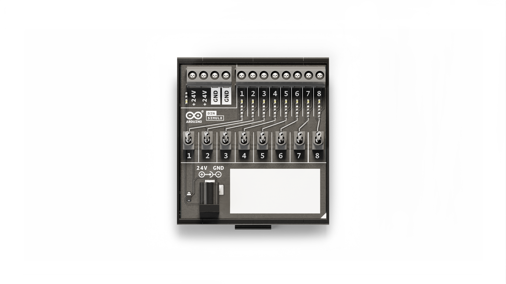
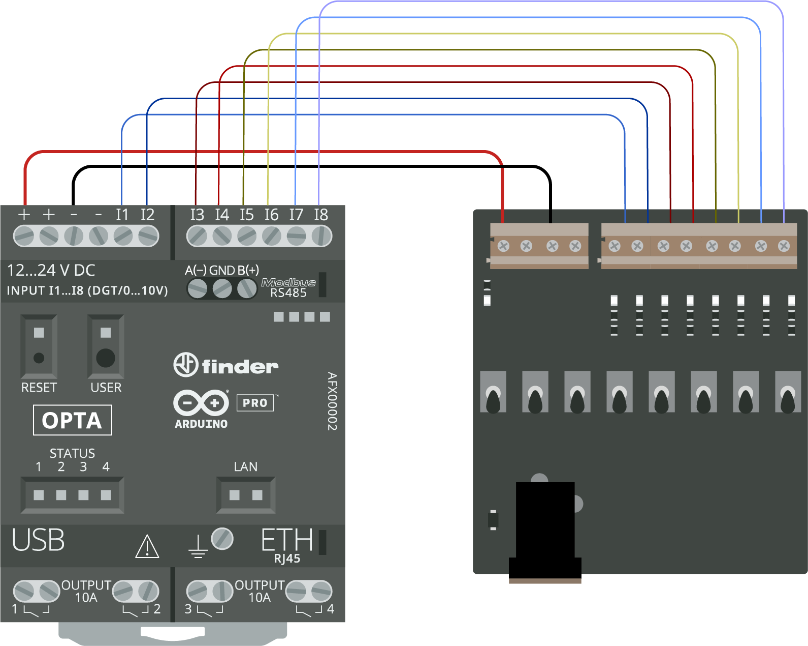
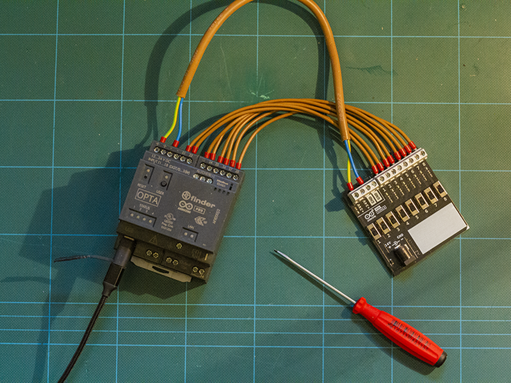
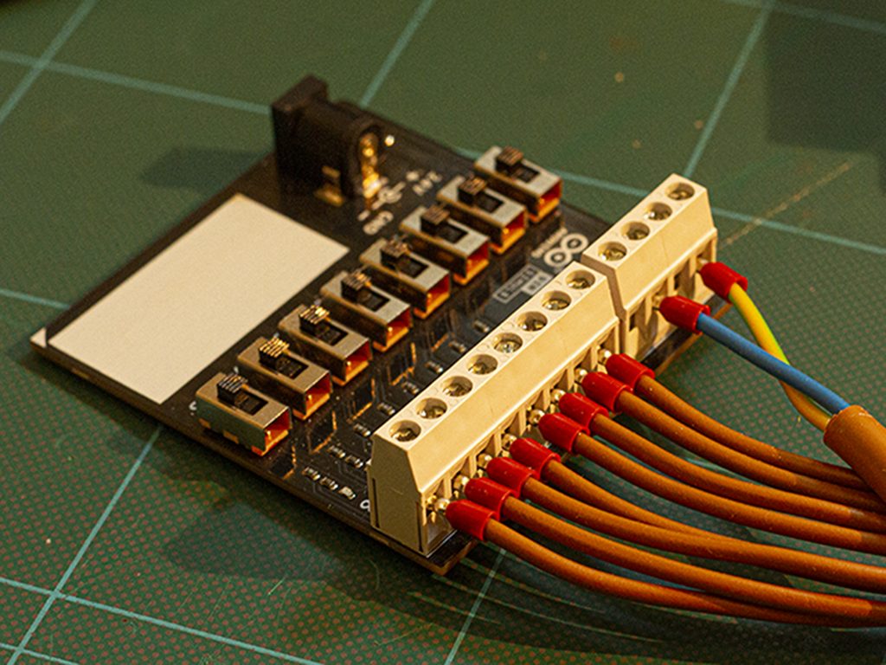
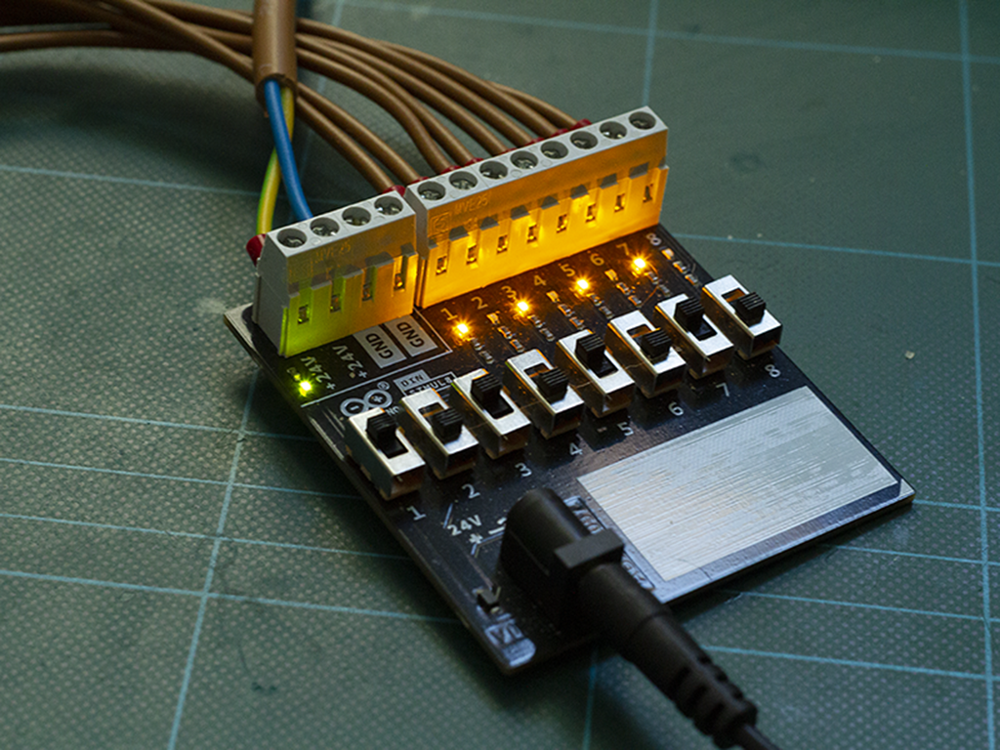
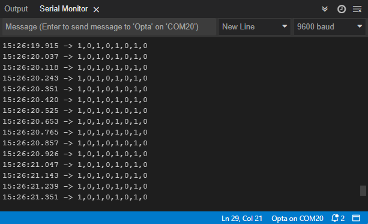
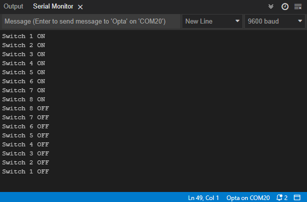

In this tutorial you'll be guided in connecting the **Arduino® DIN Simul8** to the **Arduino Opta® WiFi**, and trigger some basic functions.

## Hardware & Software Needed

### Hardware
- Arduino® DIN Simul8
- Arduino Opta® WiFi
- USB-C® cable
- 24 V power supply with barrel plug adapter
- 8x wire for signal
- 2x wire for power distribution

### Software
- [Arduino IDE 2](https://www.arduino.cc/en/software)

## Overview



DIN Simul8 is a digital-input-simulator and power distribution board for the PLC of the Opta family. It provides eight toggle switches (0 - 10 V output) and four screw terminal for bringing the 24 V and the GROUND easily to the PLC or other boards.

If you have any problems using the Opta WiFi you can read its [manual](https://docs.arduino.cc/tutorials/opta/user-manual/) before proceeding.

### Connections

To connect the DIN Simul8 to the PLC you'll need 8 wires for the signal and two for the power.



Connections are super important in an industrial project, first of all **disconnect the power plug** and then connect all the pins using cable with lugs, or be careful that no copper part of the cable touch other pins.



1. Connect the power pins: +24V and GND
2. Connect all the signal pins

 


### Upload test code

Firstly we have to test if the components and the connections works as excepted. Let's print on the [Serial Monitor](https://docs.arduino.cc/software/ide-v2/tutorials/ide-v2-serial-monitor/) what arrives to the inputs.

The Opta WiFi has eight inputs ports, at the top, named from `I1` to `I8`. They are mapped to pin `A0` to `A7`. Let's assign to each of them a variable with the name of the port on the Opta WiFi, easier to remember, we can use the [#define](https://www.arduino.cc/reference/en/language/structure/further-syntax/define/) function, like this:

```arduino
#define pin_I1 A0
```

| **Opta™ Terminal** | **Arduino Pin Mapping** | **Variable**  |
|:------------------:|:-----------------------:|:-------------:|
|        `I1`        |      `A0`/`PIN_A0`      |   `pin_I1`    |
|        `I2`        |      `A1`/`PIN_A1`      |   `pin_I2`    |
|        `I3`        |      `A2`/`PIN_A2`      |   `pin_I3`    |
|        `I4`        |      `A3`/`PIN_A3`      |   `pin_I4`    |
|        `I5`        |      `A4`/`PIN_A4`      |   `pin_I5`    |
|        `I6`        |      `A5`/`PIN_A5`      |   `pin_I6`    |
|        `I7`        |      `A6`/`PIN_A6`      |   `pin_I7`    |
|        `I8`        |      `A7`/`PIN_A7`      |   `pin_I8`    |

From now on we can refer to the port `I1` of the Opta WiFi using the `pin_I1` variable.


To read what's arriving on each input port, we can use the [digitalRead](https://www.arduino.cc/reference/en/language/functions/digital-io/digitalread/) function, inside the `Serial.print` command:

```arduino
Serial.print(digitalRead(pin_I1));
```

Now let's do this for each input port, dividing each value with a comma `,`.
Here the full code:

```arduino
#define pin_I1 A0
#define pin_I2 A1
#define pin_I3 A2
#define pin_I4 A3
#define pin_I5 A4
#define pin_I6 A5
#define pin_I7 A6
#define pin_I8 A7

void setup() {
  // put your setup code here, to run once:

  Serial.begin(9600);

}

void loop() {
  // put your main code here, to run repeatedly:

  Serial.print(digitalRead(pin_I1));
  Serial.print(",");
  Serial.print(digitalRead(pin_I2));
  Serial.print(",");
  Serial.print(digitalRead(pin_I3));
  Serial.print(",");
  Serial.print(digitalRead(pin_I4));
  Serial.print(",");
  Serial.print(digitalRead(pin_I5));
  Serial.print(",");
  Serial.print(digitalRead(pin_I6));
  Serial.print(",");
  Serial.print(digitalRead(pin_I7));
  Serial.print(",");
  Serial.println(digitalRead(pin_I8));

  delay(100);
}

```

>**Don't forget to** initialize the Serial communication with the Serial.begin command in the setup.

>**Don't forget to** call the the last `Serial.print` as `Serial.println`, in order to print a new line and wrap the text to make readable.

>**Don't forget to** put some delay, like 100ms in order to have a stable communication over serial.

Each switch in the DIN Simul8 outputs 0 V when OFF and 10 V when ON. The `digitalRead()` function will read 0 for 0 V and 1 for 10 V.
If you switch on the toggle switches 1-3-5-7 and leave off the 2-4-6-8, like in the following image:



the output should be like this:




### Upload function trigger code

If everything works we can move on and try to trigger a function when switch change state: a function that print `"Switch 1 ON"` when turned on and the inverse for the OFF state.

```arduino
void ON_function() {
  Serial.println("Switch 1 ON");
}

void OFF_function() {
  Serial.println("Switch 1 OFF");
}
```

In order to make every function runs once, only when the state changed, and not continuosly, we can save the status of the switch in a variable:

```arduino
bool stateSwitch = false;
```

and call the function when it reads the opposite state: if the state is OFF (0) and it reads ON (1) it means that is just changed to ON, so call the `ON_function()` and update the `stateSwitch` variable.

```arduino
  if (stateSwitch == 0) {
    if (digitalRead(pin_I1) == 1) {
      ON_function();
      stateSwitch = 1;
    }
  }
```

The final code should like like this and it will works only for the toggle switch 1.

```arduino
#define pin_I1 A0
#define pin_I2 A1
#define pin_I3 A2
#define pin_I4 A3
#define pin_I5 A4
#define pin_I6 A5
#define pin_I7 A6
#define pin_I8 A7


void setup() {
  // put your setup code here, to run once:

  Serial.begin(9600);
}

bool stateSwitch = false;

void loop() {
  // put your main code here, to run repeatedly:
  
  if (stateSwitch == 0) {
    if (digitalRead(pin_I1) == 1) {
      ON_function();
      stateSwitch = 1;
    }
  } else {
    if (digitalRead(pin_I1) == 0) {
      OFF_function();
      stateSwitch = 0;
    }
  }

}

void ON_function() {
  Serial.println("Switch 1 ON");
}

void OFF_function() {
  Serial.println("Switch 1 OFF");
}

```

### Upload final code

In order to make it works for all the eight switches, you can repeat the `stateSwitch` variable and the `if-else` conditions eight times... but that would be boring. What about using [arrays](https://www.arduino.cc/reference/en/language/variables/data-types/array/) and a [for-loop](https://www.arduino.cc/reference/en/language/structure/control-structure/for/)?

The idea is to replace all the variables used in the loop with arrays that stores eight values, one for each switch, and put it inside a `for loop` that will cycle trough all the eight inputs. Let's see how to do it:

First of all we need an array for all the pins definition of the inputs:

```arduino
int pins[] = { pin_I1, pin_I2, pin_I3, pin_I4, pin_I5, pin_I6, pin_I7, pin_I8 };
```
Then we need one for the `stateSwitch` variable:

```arduino
bool stateSwitch[] = { false, false, false, false, false, false, false, false };
```

And then we can substitute them:

```arduino
if (stateSwitch[ ] == 0) {
  if (digitalRead(pins[ ]) == 1) {
    ON_function();
    stateSwitch[ ] = 1;
  }
} else {
  if (digitalRead(pins[ ]) == 0) {
    OFF_function();
    stateSwitch[ ] = 0;
  }
}
```

Now we need to tell to each array-variable which values to use, you can do it by putting a number from 0 to 7 inside the `[]`, i.e. `pins[0] = pin_I1 // pins[1] = pin_I2 // etc..`.
One way of doing it is with the [`for-loop`](https://www.arduino.cc/reference/en/language/structure/control-structure/for/). We can assign a variable, like `int i`, to change from 0 to 7, and then assign it to each array-variable:

```arduino
for (int i = 0; i <= 7; i++) {
  if (stateSwitch[i] == 0) {
    if (digitalRead(pins[i]) == 1) {
      ON_function();
      stateSwitch[i] = 1;
    }
  } else {
    if (digitalRead(pins[i]) == 0) {
      OFF_function();
      stateSwitch[i] = 0;
    }
  }
}
```

Ok, that would work, but the `ON_function()` and the `OFF_function()` will print only the state of the Switch 1, unless we make the `i` variable as an [argument](https://docs.arduino.cc/learn/programming/functions/), and so we can print the number related to the switch we are switching.

Here the full code:

```arduino
#define pin_I1 A0
#define pin_I2 A1
#define pin_I3 A2
#define pin_I4 A3
#define pin_I5 A4
#define pin_I6 A5
#define pin_I7 A6
#define pin_I8 A7

int pins[] = { pin_I1, pin_I2, pin_I3, pin_I4, pin_I5, pin_I6, pin_I7, pin_I8 };

void setup() {
  // put your setup code here, to run once:

  Serial.begin(9600);
}

bool stateSwitch[] = { false, false, false, false, false, false, false, false };

void loop() {
  // put your main code here, to run repeatedly:

  for (int i = 0; i <= 7; i++) {
    if (stateSwitch[i] == 0) {
      if (digitalRead(pins[i]) == 1) {
        ON_function(i);
        stateSwitch[i] = 1;
      }
    } else {
      if (digitalRead(pins[i]) == 0) {
        OFF_function(i);
        stateSwitch[i] = 0;
      }
    }
  }
}

void ON_function(int n) {
  Serial.print("Switch ");
  Serial.print(n+1);
  Serial.println(" ON");
}

void OFF_function(int n) {
  Serial.print("Switch ");
  Serial.print(n+1);
  Serial.println(" OFF");
}
```

And here you can see what's goes on the serial monitor when you turn on all the switch from 1 to 8 and then off from 8 to 1:



## Considerations

If something strange happens when you turn a switch on or off, like if the switch was triggered on and off super rapidily, don't panic! That's normal, and it is related to something called "debounce". You can have a look [here](https://docs.arduino.cc/built-in-examples/digital/Debounce/) to understand what's going on.

## Conclusions

The Arduino DIN Simul8 is the perfect playgroung to start experiment your coding skill in the PLC world. Try creating more functions that could be triggered by some combination of switch position, or whatever you like, have fun!