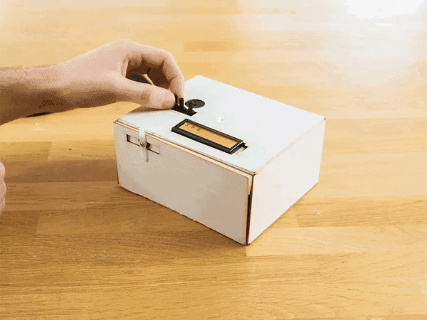
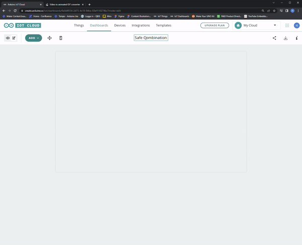
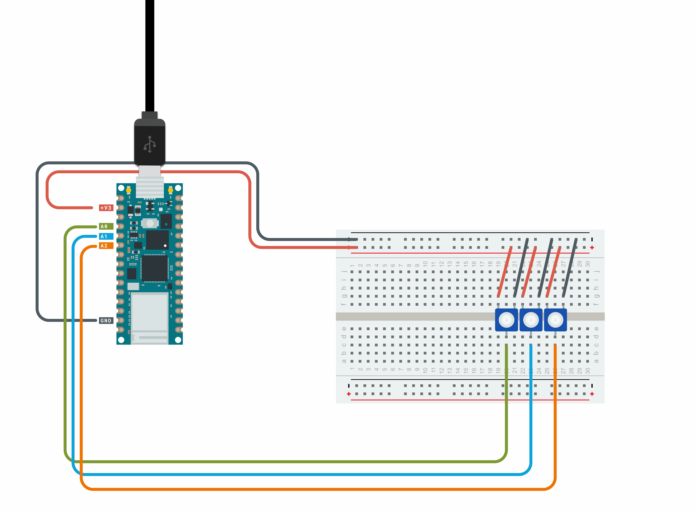
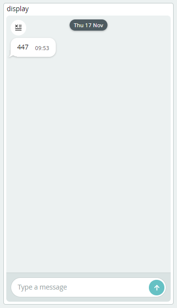
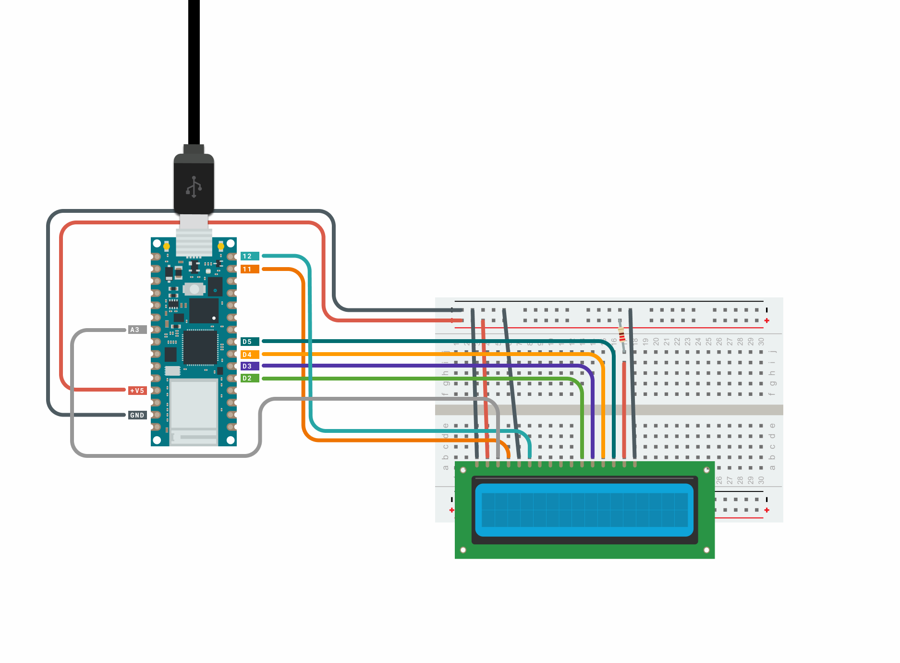
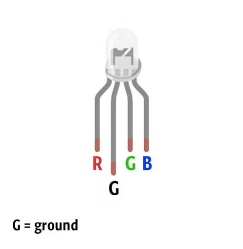
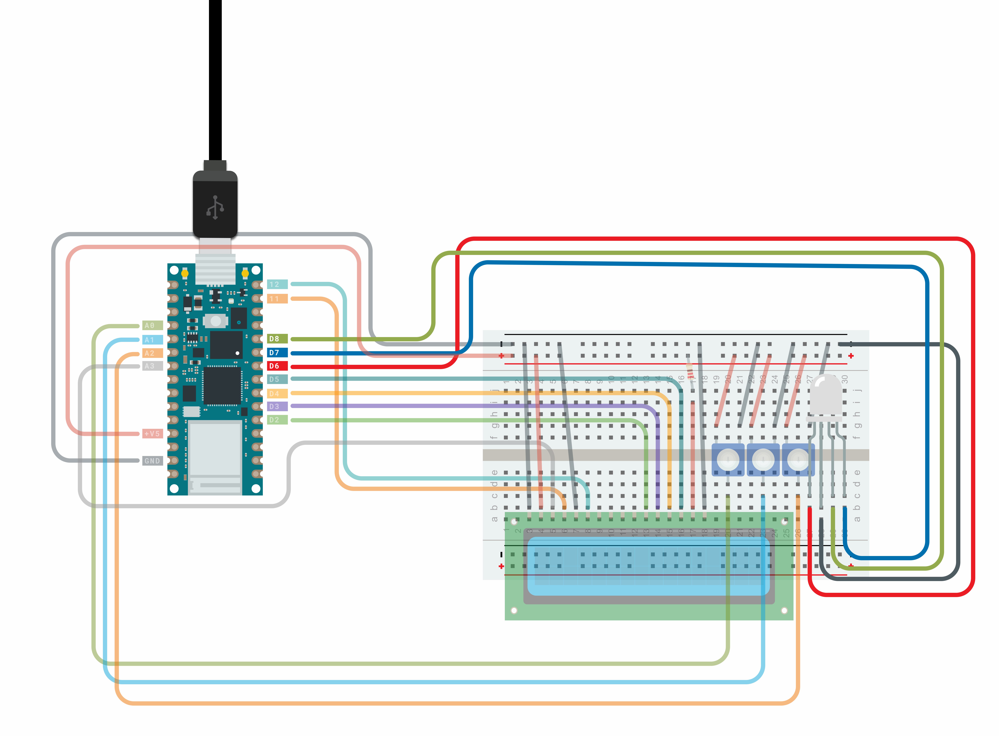
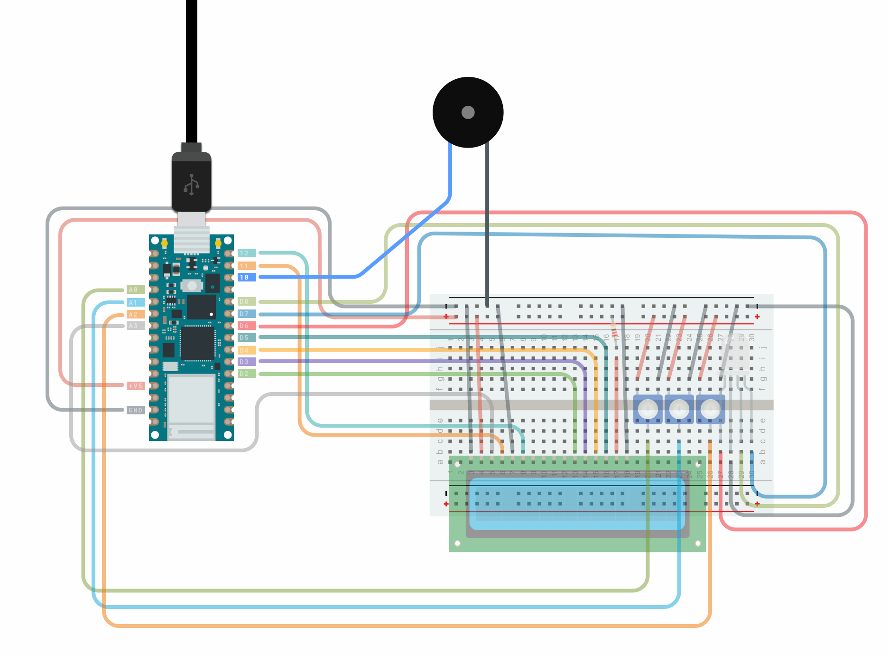
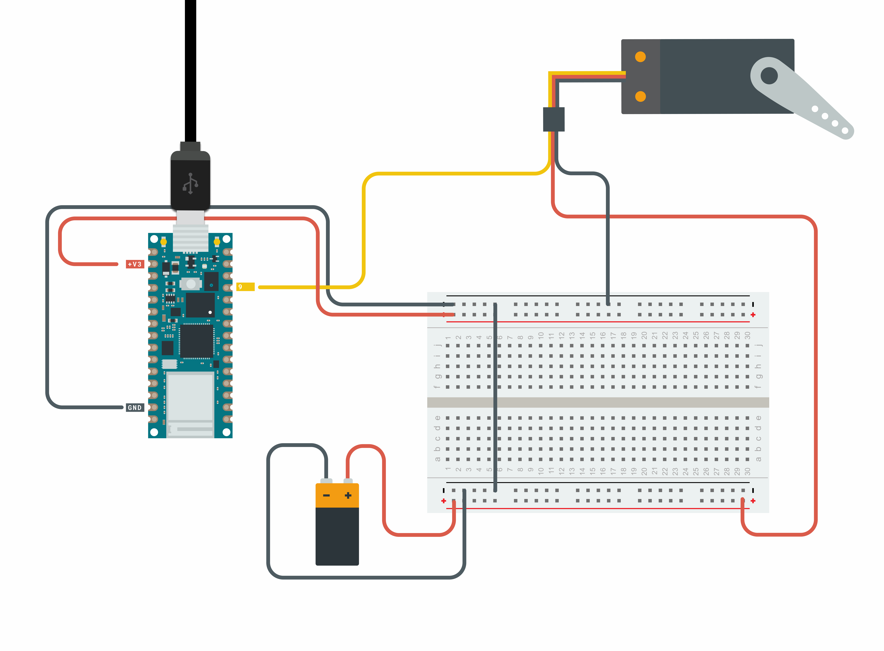

## Components and Supplies

- [Arduino IoT Bundle](https://store.arduino.cc/iot-bundle)
- 9V battery (generic)
- [9V Battery Clip](https://www.newark.com/22C4351?COM=ref_hackster)

## Apps and Online Services

- [Arduino IoT Cloud](https://cloud.arduino.cc)
- [Arduino IoT Cloud Remote app](https://play.google.com/store/apps/details?id=cc.arduino.cloudiot&hl=en&gl=US)

## About This Project

**Create a Puzzle Box with the help of the Arduino IoT Cloud!**

Keeping your valuable items away from prying eyes can be hard sometimes, unless you put it in a big safe or something similar... but who has room for that? Instead, create your own puzzle box using the components from the IoT Bundle and some cardboard! We can't guarantee the safety of your belongings, but at least it will be a fun deterrent for potential thieves. Of course, we advise you to stash your candy in there... not actual valuables.

### In a Nutshell

In order to open the box, which is held closed with a servo motor, you will have to turn the potentiometers until you get the right combination. The combination can be set through the dashboard on the Arduino IoT Cloud. An LED will help you guess, giving you colour feedbacks: the closer you are, the warmer the color. When the right combination is guessed, the box will open and a victorious melody will start playing, revealing whatever you have locked inside. In order to create our puzzle box we will need the following components:

* Buzzer
* RGB LED
* 3 potentiometers
* Servo motor



### Learning Goals

* Introducing the Arduino IoT Cloud
* Introducing the Arduino IoT Remote app
* Playing a melody with the piezo buzzer
* Creating an Arduino IoT Cloud Dashboard

### Want to Know More

This tutorial is part of a series of experiments that familiarize you with the Arduino RP2040 and IoT. All experiments can be built using the components contained in the IoT Bundle.

* [I Love You Pillow with the Arduino IoT Bundle ](/tutorials/iot-bundle/i-love-you-pillow)
* [Puzzle Box with Arduino IoT Bundle ](/tutorials/iot-bundle/puzzlebox)
* [Plant Communicator with the Arduino IoT Bundle ](/tutorials/iot-bundle/plant-communicator)
* [The Nerd with the Arduino IoT Bundle](/tutorials/iot-bundle/the-nerd)

### Setting up the Arduino IoT Cloud

If you are new to the Arduino IoT Cloud, check out our [Getting Started Guide](https://docs.arduino.cc/arduino-cloud/getting-started/iot-cloud-getting-started).

We will start by setting up the Arduino IoT Cloud by following the steps below:

* Creating a **Thing**
* Attaching a **Device**
* Adding **Variables**
* Adding **Network** credentials


### Variables

We will start by adding four variables:


### Dashboard

Before we upload the code to the board, let's create the dashboard with the sliders. We can navigate to **Dashboards > Build Dashboard > ADD**, then we can add four widget and link them to the variable as the following:

* Slider widget -> sliderOne
* Slider widget -> sliderTwo
* Slider widget -> sliderThree



### Setup Hardware & Sketch

Now we are ready to go. Upload this sketch and play with the sliders to see the result in the serial monitor.

```
#include "thingProperties.h"
void setup() {
  /* Initialize serial and wait for port to open: */
  Serial.begin(9600);
  /* This delay gives the chance to wait for a Serial Monitor without blocking if none is found */
  delay(1500);
  /* Defined in thingProperties.h */
  initProperties();
  /* Connect to Arduino IoT Cloud */
  ArduinoCloud.begin(ArduinoIoTPreferredConnection);
  setDebugMessageLevel(2);
  ArduinoCloud.printDebugInfo();
}
void loop() {
  ArduinoCloud.update();
}
void onSliderOneChange()  {
 /* Add your code here to act upon SliderValue1 change */
 Serial.print("New combination: ");
 Serial.print(sliderOne);
 Serial.print(" ");
 Serial.print(sliderTwo);
 Serial.print(" ");
 Serial.println(sliderThree);
}
void onSliderTwoChange()  {
 /* Add your code here to act upon SliderValue2 change */
 Serial.print("New combination: ");
 Serial.print(sliderOne);
 Serial.print(" ");
 Serial.print(sliderTwo);
 Serial.print(" ");
 Serial.println(sliderThree);
}
void onSliderThreeChange()  {
 /* Add your code here to act upon SliderValue3 change */
 Serial.print("New combination: ");
 Serial.print(sliderOne);
 Serial.print(" ");
 Serial.print(sliderTwo);
 Serial.print(" ");
 Serial.println(sliderThree);
}
void onDisplayChange()  {
  /* Add your code here to act upon Display change */
}
```

**Add Potentiometers**

Now it's time to connect our potentiometers, which are used to open your puzzle box. To read the value of the potentiometers we will only need an **analogRead()** on the correct pin. We are connecting them to Analog pins 0, 1, 2.



Note that the value of a potentiometer spans from 0 to 1023 making the combination impossible to guess. To map those values from 0 to 9 we will use the map() function,

```
int PotOne = map(analogRead(A0), 0, 1023, 0, 9);
```

You won't see any changes until you build your interface in the next step but you can take a look at how to map the values from the potentiometers.

```
#include "thingProperties.h"
void setup() {
  /* Initialize serial and wait for port to open: */
  Serial.begin(9600);
  /* This delay gives the chance to wait for a Serial Monitor without blocking if none is found */
  delay(1500);
  /* Defined in thingProperties.h */
  initProperties();
  /* Connect to Arduino IoT Cloud */
  ArduinoCloud.begin(ArduinoIoTPreferredConnection);
  setDebugMessageLevel(2);
  ArduinoCloud.printDebugInfo();
}
void loop() {
  ArduinoCloud.update();
  int PotOne = map(analogRead(A0), 0, 1023, 0, 9);
  int PotTwo = map(analogRead(A1), 0, 1023, 0, 9);
  int PotThree = map(analogRead(A2), 0, 1023, 0, 9);
}
void onSliderOneChange()  {
  /* Add your code here to act upon SliderValue1 change */
  Serial.print("New combination: ");
  Serial.print(sliderOne);
  Serial.print(" ");
  Serial.print(sliderTwo);
  Serial.print(" ");
  Serial.println(sliderThree);
}
void onSliderTwoChange()  {
  /* Add your code here to act upon SliderValue2 change */
  Serial.print("New combination: ");
  Serial.print(sliderOne);
  Serial.print(" ");
  Serial.print(sliderTwo);
  Serial.print(" ");
 Serial.println(sliderThree);
}
void onSliderThreeChange()  {
  /* Add your code here to act upon SliderValue3 change */
  Serial.print("New combination: ");
  Serial.print(sliderOne);
  Serial.print(" ");
  Serial.print(sliderTwo);
  Serial.print(" ");
  Serial.println(sliderThree);
}
void onDisplayChange() {
/* Add your code here to act upon Display change */
}
```

### Display

**Dashboard**

We already have one dashboard allowing you to set the combination to your puzzle box. But now we are going to create a new one so you can use your phone to check the current position you’re at.

Start by creating a new dashboard, add a messenger widget and link it to the display variable. For printing the potentiometer values to the display you can use the following logic:

```
String numberOne = String(PotOne);
String numberTwo = String(PotTwo);
String numberThree = String(PotThree);
```

Then simply assign all three strings to our display variable to see them in the messenger widget.

```
display =String(numberOne + numberTwo + numberThree);
```

You will see a new message appear every time you turn one of the potentiometers.



Upload this code to see it working:

```
#include "thingProperties.h"
void setup() {
  /* Initialize serial and wait for port to open: */
  Serial.begin(9600);
  /* This delay gives the chance to wait for a Serial Monitor without blocking if none is found */
  delay(1500);
  /* Defined in thingProperties.h */
  initProperties();
  /* Connect to Arduino IoT Cloud */
  ArduinoCloud.begin(ArduinoIoTPreferredConnection);
  setDebugMessageLevel(2);
  ArduinoCloud.printDebugInfo();
}
void loop() {
  ArduinoCloud.update();
  int PotOne = map(analogRead(A0), 0, 1023, 0, 9);
  int PotTwo = map(analogRead(A1), 0, 1023, 0, 9);
  int PotThree = map(analogRead(A2), 0, 1023, 0, 9);
  String numberOne = String(PotOne);
  String numberTwo = String(PotTwo);
  String numberThree = String(PotThree);
  display =String(numberOne + numberTwo + numberThree);
}
void onSliderOneChange()  {
  /* Add your code here to act upon SliderValue1 change */
  Serial.print("New combination: ");
  Serial.print(sliderOne);
  Serial.print(" ");
  Serial.print(sliderTwo);
  Serial.print(" ");
  Serial.println(sliderThree);
}
void onSliderTwoChange()  {
  /* Add your code here to act upon SliderValue2 change */
  Serial.print("New combination: ");
  Serial.print(sliderOne);
  Serial.print(" ");
  Serial.print(sliderTwo);
  Serial.print(" ");
 Serial.println(sliderThree);
}
void onSliderThreeChange()  {
  /* Add your code here to act upon SliderValue3 change */
  Serial.print("New combination: ");
  Serial.print(sliderOne);
  Serial.print(" ");
  Serial.print(sliderTwo);
  Serial.print(" ");
  Serial.println(sliderThree);
}
void onDisplayChange() {
/* Add your code here to act upon Display change */
}
```

**LCD**

You could also use the LCD screen that comes with the kit, though we recommend using the dashboard because not all the components fit on the breadboard at the same time.

> **Note**: The LCD has a 5V operating voltage, so you have to enable the 5V pad on the back of the board by soldering it. See [here](https://support.arduino.cc/hc/en-us/articles/360014779679-About-Nano-boards-with-disabled-5-V-pins) for more details.



We are using a 220 Ohm resistor and the brightness can be regulated by changing the output value of the Analog pin 3 from 0 to 255 with 0 being the maximum value. Add the following line inside **void** setup().

```
analogWrite(A3, 0);
```

Upload this code to see "**hello, world!"**  on your display.

```
#include "thingProperties.h"
#include "LiquidCrystal.h"
/* initialize the library by associating any needed LCD interface pin with the arduino pin number it is connected to LCD screen pins */
const int rs = 12,
en = 11,
d4 = 2,
d5 = 3,
d6 = 4,
d7 = 5;
LiquidCrystal lcd(rs, en, d4, d5, d6, d7);
void setup() {
  /* Initialize serial and wait for port to open: */
  Serial.begin(9600);
  /* This delay gives the chance to wait for a Serial Monitor without blocking if none is found */
  delay(1500);
  /* Defined in thingProperties.h */
  initProperties();
  /* Connect to Arduino IoT Cloud */
  ArduinoCloud.begin(ArduinoIoTPreferredConnection);
  setDebugMessageLevel(2);
  ArduinoCloud.printDebugInfo();
  analogWrite(A3, 0); /* Set the brightness to its maximum value */
  /* set up the LCD's number of columns and rows: */
  lcd.begin(16, 2);  /* Print a message to the LCD. */
  lcd.print("hello, world!");
}
void loop() {
  ArduinoCloud.update();
  int PotOne = map(analogRead(A0), 0, 1023, 0, 9);
  int PotTwo = map(analogRead(A1), 0, 1023, 0, 9);
  int PotThree = map(analogRead(A2), 0, 1023, 0, 9);
  String numberOne = String(PotOne);
  String numberTwo = String(PotTwo);
  String numberThree = String(PotThree);
  display =String(numberOne + numberTwo + numberThree);
}
void onSliderOneChange()  {
  /* Add your code here to act upon SliderValue1 change */
  Serial.print("New combination: ");
  Serial.print(sliderOne);
  Serial.print(" ");
  Serial.print(sliderTwo);
  Serial.print(" ");
  Serial.println(sliderThree);
}
void onSliderTwoChange()  {
  /* Add your code here to act upon SliderValue2 change */
  Serial.print("New combination: ");
  Serial.print(sliderOne);
  Serial.print(" ");
  Serial.print(sliderTwo);
  Serial.print(" ");
 Serial.println(sliderThree);
}
void onSliderThreeChange()  {
  /* Add your code here to act upon SliderValue3 change */
  Serial.print("New combination: ");
  Serial.print(sliderOne);
  Serial.print(" ");
  Serial.print(sliderTwo);
  Serial.print(" ");
  Serial.println(sliderThree);
}
void onDisplayChange() {
/* Add your code here to act upon Display change */
}
```

**RGB LED**

We will use the RGB LED as a feedback to help people guessing the combination, the closer they get to the right value the warmer the colour of the LED, spanning from blue, aqua, yellow and red.



RGB LED




To control the RGB we can use the following logic:

```
setColor(0, 0, 255); /* blue */ 
   delay(1000); 
   setColor(0, 255, 255); /* aqua */
   delay(1000); 
   setColor(255, 255, 0); /* yellow */
   delay(1000); 
   setColor(255, 0, 0); /* Red */
   delay(1000);
```

You can use this example sketch to see the RGB in action!

```
#include "thingProperties.h"
#include "LiquidCrystal.h"
/* RGB LED pins */
int redPin = 6;
int greenPin = 8;
int bluePin = 7;
bool start = true;
/* initialize the library by associating any needed LCD interface pin with the arduino pin number it is connected to LCD screen pins */
const int rs = 12,
en = 11,
d4 = 2,
d5 = 3,
d6 = 4,
d7 = 5;
LiquidCrystal lcd(rs, en, d4, d5, d6, d7);
void setup() {
  /* Initialize serial and wait for port to open: */
  Serial.begin(9600);
  /* This delay gives the chance to wait for a Serial Monitor without blocking if none is found */
  delay(1500);
  /* Defined in thingProperties.h */
  initProperties();
  /* Connect to Arduino IoT Cloud */
  ArduinoCloud.begin(ArduinoIoTPreferredConnection);
  setDebugMessageLevel(2);
  ArduinoCloud.printDebugInfo();
  analogWrite(A3, 0); /* Set the brightness to its maximum value */
  /* set up the LCD's number of columns and rows: */
  lcd.begin(16, 2);  /* Print a message to the LCD. */
  pinMode(redPin, OUTPUT);
  pinMode(greenPin, OUTPUT);
  pinMode(bluePin, OUTPUT);
}
void loop() {
  ArduinoCloud.update();
  int PotOne = map(analogRead(A0), 0, 1023, 0, 9);
  int PotTwo = map(analogRead(A1), 0, 1023, 0, 9);
  int PotThree = map(analogRead(A2), 0, 1023, 0, 9);
  lcd.setCursor(0, 0);
  lcd.print(PotOne);
  lcd.setCursor(2, 0);
  lcd.print(PotTwo);
  lcd.setCursor(4, 0);
  lcd.print(PotThree);
  String numberOne = String(PotOne);
  String numberTwo = String(PotTwo);
  String numberThree = String(PotThree);
  display =String(numberOne + numberTwo + numberThree);
  setColor(0, 0, 255); /* blue */
   delay(1000); 
   setColor(0, 255, 255); /* aqua */
   delay(1000); 
   setColor(255, 255, 0); /* yellow */
   delay(1000); 
   setColor(255, 0, 0); /* Red */
   delay(1000);
}
void onSliderOneChange()  {
  /* Add your code here to act upon SliderValue1 change */
  Serial.print("New combination: ");
  Serial.print(sliderOne);
  Serial.print(" ");
  Serial.print(sliderTwo);
  Serial.print(" ");
  Serial.println(sliderThree);
}
void onSliderTwoChange()  {
  /* Add your code here to act upon SliderValue2 change */
  Serial.print("New combination: ");
  Serial.print(sliderOne);
  Serial.print(" ");
  Serial.print(sliderTwo);
  Serial.print(" ");
 Serial.println(sliderThree);
}
void onSliderThreeChange()  {
  /* Add your code here to act upon SliderValue3 change */
  Serial.print("New combination: ");
  Serial.print(sliderOne);
  Serial.print(" ");
  Serial.print(sliderTwo);
  Serial.print(" ");
  Serial.println(sliderThree);
}
/* Send RGB values to the LED pins */
void setColor(int red, int green, int blue) {
  analogWrite(redPin, red);
  analogWrite(greenPin, green);
  analogWrite(bluePin, blue);
}
void onDisplayChange() {
/* Add your code here to act upon Display change */
}
```

### Connect It to the Arduino IoT Cloud

Now we are starting to put things together: we have connected the potentiometers to unlock the box, created two dashboards for setting the combination and seeing your current position, as well as installed a RGB which will tell you how close you are to the right combination.

- Note that we will use the function `giveColorFeedback()` to set the color of the RGB LED when the absolute value of each potentiometer is closer than a certain threshold to the correct combination.

```
void giveColorFeedback(int PotOne, int PotTwo, int PotThree){...}
```

- Note that the initial value is set to 1, it will change only if you modify the values of the sliders on the cloud dashboard. If you reset the board the combination will be back to the default value.

A boolean variable **bool start = true;**  is used to detect when the combination has already been guessed, so to avoid reopening the the box at every loop.

Upload this example sketch and turn the potentiometers to see it in action.

```arduino
#include "LiquidCrystal.h"
#include "SPI.h"
#include "thingProperties.h"
/* RGB LED pins */
int redPin = 6;
int greenPin = 8;
int bluePin = 7;
/* LCD screen pins */
const int rs = 12,
          en = 11,
          d4 = 2,
          d5 = 3,
          d6 = 4,
          d7 = 5;
bool start = true;
LiquidCrystal lcd(rs, en, d4, d5, d6, d7);
void setup() {
 pinMode(redPin, OUTPUT);
 pinMode(greenPin, OUTPUT);
 pinMode(bluePin, OUTPUT);
 analogWrite(A3, 0); /* set the brightness of the LCD screen to the maximum value */
 Serial.begin(9600);
 delay(1500);
 initProperties();
 ArduinoCloud.begin(ArduinoIoTPreferredConnection);
 setDebugMessageLevel(2);
 ArduinoCloud.printDebugInfo();
 lcd.begin(16, 2); /* begin LCD screen with 16 columns and 2 rows */
}
void loop() {
 ArduinoCloud.update();
 int PotOne = map(analogRead(A0), 0, 1023, 0, 9);
 int PotTwo = map(analogRead(A1), 0, 1023, 0, 9);
 int PotThree = map(analogRead(A2), 0, 1023, 0, 9);
 lcd.setCursor(0, 0);
 lcd.print(PotOne);
 lcd.setCursor(2, 0);
 lcd.print(PotTwo);
 lcd.setCursor(4, 0);
 lcd.print(PotThree);
  String numberOne = String(PotOne);
  String numberTwo = String(PotTwo);
  String numberThree = String(PotThree);
  display =String(numberOne + numberTwo + numberThree);
 if (start) {
  giveColorFeedback(PotOne, PotTwo, PotThree);
  if (PotOne == sliderOne && PotTwo == sliderTwo && PotThree == sliderThree)                        
  {
   blinkGreenLed();
   start = false;
  }
 }
 if (!start) {
  if (PotOne == 0 && PotTwo == 0 && PotThree == 0) {
   start = true;
  }
 }
}
/* Give feedback based on how close the potentiometer are to the combination value
The more it's close the warmer is the color of the LED */
void giveColorFeedback(int PotOne, int PotTwo, int PotThree) {
 if (abs(PotOne - sliderOne) <= 1 && abs(PotTwo - sliderTwo) <= 1 && abs(PotThree - sliderThree) <= 1 ) {
  /* Red */
  setColor(255, 0, 0);
 }
 else if (abs(PotOne - sliderOne) <= 3 && abs(PotTwo - sliderTwo) <= 3 && abs(PotThree - sliderThree) <= 3 ) {
  /* yellow */
  setColor(255, 255, 0);
 }
 else if (abs(PotOne - sliderOne) <= 4 && abs(PotTwo - sliderTwo) <= 4 && abs(PotThree - sliderThree) <= 4 ) {
  /* aqua */
  setColor(0, 255, 255);
 }
 else {
  /* blue */
  setColor(0, 0, 255);
 }
}
void blinkGreenLed() {
 for (int a = 0; a < 2; a++) {
  for (int b = 0; b <= 255; b += 5) {
   setColor(0, b, 0);
   delay(5);
  }
  for (int b = 255; b >= 0; b -= 5) {
   setColor(0, b, 0);
   delay(5);
  }
 }
 for (int b = 0; b <= 255; b += 5) {
  setColor(0, b, 0);
  delay(5);
 }
}
void initLCD() {
  Serial.println(">>> begin LCD");
  lcd.begin(16, 2);
  lcd.print("  Initialising");
  
  delay(100);
}
void onSliderOneChange()  {
 /* Add your code here to act upon SliderValue1 change */
 Serial.print("New combination: ");
 Serial.print(sliderOne);
 Serial.print(" ");
 Serial.print(sliderTwo);
 Serial.print(" ");
 Serial.println(sliderThree);
}
void onSliderTwoChange()  {
 /* Add your code here to act upon SliderValue2 change */
 Serial.print("New combination: ");
 Serial.print(sliderOne);
 Serial.print(" ");
 Serial.print(sliderTwo);
 Serial.print(" ");
 Serial.println(sliderThree);
}
void onSliderThreeChange()  {
 /* Add your code here to act upon SliderValue3 change */
 Serial.print("New combination: ");
 Serial.print(sliderOne);
 Serial.print(" ");
 Serial.print(sliderTwo);
 Serial.print(" ");
 Serial.println(sliderThree);
}
/* Send RGB values to the LED pins */
void setColor(int red, int green, int blue) {
 analogWrite(redPin, red);
 analogWrite(greenPin, green);
 analogWrite(bluePin, blue);
}
void onDisplayChange() {
/* Add your code here to act upon Display change  
}
```

**Buzzer**

We will use the buzzer to play a melody when the box is opened. Connect the buzzer to **digital pin 10**, as shown in the picture below.




Now, navigate into the Arduino Web Editor through **Thing > Sketch tab >  open full editor**. This will open up our automatically generated sketch in the full Arduino Web Editor. Next we need to add an extra tab containing all the necessary notes to play the song. Click the arrow on the right side to add a new tab called `"Melody.h"` and add the code below.

```
#define NOTE_B0 31
#define NOTE_C1 33
#define NOTE_CS1 35
#define NOTE_D1 37
#define NOTE_DS1 39
#define NOTE_E1 41
#define NOTE_F1 44
#define NOTE_FS1 46
#define NOTE_G1 49
#define NOTE_GS1 52
#define NOTE_A1 55
#define NOTE_AS1 58
#define NOTE_B1 62
#define NOTE_C2 65
#define NOTE_CS2 69
#define NOTE_D2 73
#define NOTE_DS2 78
#define NOTE_E2 82
#define NOTE_F2 87
#define NOTE_FS2 93
#define NOTE_G2 98
#define NOTE_GS2 104
#define NOTE_A2 110
#define NOTE_AS2 117
#define NOTE_B2 123
#define NOTE_C3 131
#define NOTE_CS3 139
#define NOTE_D3 147
#define NOTE_DS3 156
#define NOTE_E3 165
#define NOTE_F3 175
#define NOTE_FS3 185
#define NOTE_G3 196
#define NOTE_GS3 208
#define NOTE_A3 220
#define NOTE_AS3 233
#define NOTE_B3 247
#define NOTE_C4 262
#define NOTE_CS4 277
#define NOTE_D4 294
#define NOTE_DS4 311
#define NOTE_E4 330
#define NOTE_F4 349
#define NOTE_FS4 370
#define NOTE_G4 392
#define NOTE_GS4 415
#define NOTE_A4 440
#define NOTE_AS4 466
#define NOTE_B4 494
#define NOTE_C5 523
#define NOTE_CS5 554
#define NOTE_D5 587
#define NOTE_DS5 622
#define NOTE_E5 659
#define NOTE_F5 698
#define NOTE_FS5 740
#define NOTE_G5 784
#define NOTE_GS5 831
#define NOTE_A5 880
#define NOTE_AS5 932
#define NOTE_B5 988
#define NOTE_C6 1047
#define NOTE_CS6 1109
#define NOTE_D6 1175
#define NOTE_DS6 1245
#define NOTE_E6 1319
#define NOTE_F6 1397
#define NOTE_FS6 1480
#define NOTE_G6 1568
#define NOTE_GS6 1661
#define NOTE_A6 1760
#define NOTE_AS6 1865
#define NOTE_B6 1976
#define NOTE_C7 2093
#define NOTE_CS7 2217
#define NOTE_D7 2349
#define NOTE_DS7 2489
#define NOTE_E7 2637
#define NOTE_F7 2794
#define NOTE_FS7 2960
#define NOTE_G7 3136
#define NOTE_GS7 3322
#define NOTE_A7 3520
#define NOTE_AS7 3729
#define NOTE_B7 3951
#define NOTE_C8 4186
#define NOTE_CS8 4435
#define NOTE_D8 4699
#define NOTE_DS8 4978
/* notes in the melody: */
int melody[] = {
  NOTE_C4, NOTE_G3, NOTE_G3, NOTE_A3, NOTE_G3, 0, NOTE_B3, NOTE_C4
};
/* note durations: 4 = quarter note, 8 = eighth note, etc.: */
int noteDurations[] = {
  4, 8, 8, 4, 4, 4, 4, 4
};
void playMelody() {
  /* iterate over the notes of the melody: */
  for (int thisNote = 0; thisNote < 8; thisNote++) {
  /* to calculate the note duration, take one second divided by the note type. */
  /*e.g. quarter note = 1000 / 4, eighth note = 1000/8, etc.*/
  int noteDuration = 1000 / noteDurations[thisNote];
  tone(10, melody[thisNote], noteDuration);
  /* to distinguish the notes, set a minimum time between them. */
  /* the note's duration + 30% seems to work well: */
  int pauseBetweenNotes = noteDuration * 1.30;
  delay(pauseBetweenNotes);
  /* stop the tone playing: */
  noTone(10);
  }
}
```

Now, we need to go back to our main sketch to play the melody. In order to use the notes we need to add " **#include "Melody.h"** " at the top of our code and inside **setup()** we need to add our **buzzerPin** as **Output.** To test our melody we can call **playMelody()** inside **loop()** if the combination has been set right.

```
#include "LiquidCrystal.h"
#include "SPI.h"
#include "thingProperties.h"
#include "Melody.h"
/* RGB LED pins */
int redPin = 6;
int greenPin = 8;
int bluePin = 7;
/* LCD screen pins */
const int rs = 12,
          en = 11,
          d4 = 2,
          d5 = 3,
          d6 = 4,
          d7 = 5;
bool start = true;
LiquidCrystal lcd(rs, en, d4, d5, d6, d7);
void setup() {
 pinMode(redPin, OUTPUT);
 pinMode(greenPin, OUTPUT);
 pinMode(bluePin, OUTPUT);
 analogWrite(A3, 0); /* set the brightness of the LCD screen to the maximum value */
 Serial.begin(9600);
 delay(1500);
 initProperties();
 ArduinoCloud.begin(ArduinoIoTPreferredConnection);
 setDebugMessageLevel(2);
 ArduinoCloud.printDebugInfo();
 lcd.begin(16, 2); /* begin LCD screen with 16 columns and 2 rows */
}
void loop() {
 ArduinoCloud.update();
 int PotOne = map(analogRead(A0), 0, 1023, 0, 9);
 int PotTwo = map(analogRead(A1), 0, 1023, 0, 9);
 int PotThree = map(analogRead(A2), 0, 1023, 0, 9);
 lcd.setCursor(0, 0);
 lcd.print(PotOne);
 lcd.setCursor(2, 0);
 lcd.print(PotTwo);
 lcd.setCursor(4, 0);
 lcd.print(PotThree);
 String numberOne = String(PotOne);
 String numberTwo = String(PotTwo);
 String numberThree = String(PotThree);
 display =String(numberOne + numberTwo + numberThree);
 if (start) {
  giveColorFeedback(PotOne, PotTwo, PotThree);
  if (PotOne == sliderOne && PotTwo == sliderTwo && PotThree == sliderThree)                        
  {
   blinkGreenLed();
   start = false;
   playMelody();
  }
 }
 if (!start) {
  if (PotOne == 0 && PotTwo == 0 && PotThree == 0) {
   start = true;
  }
 }
}
/* Give feedback based on how close the potentiometer are to the combination value
The more it's close the warmer is the color of the LED */
void giveColorFeedback(int PotOne, int PotTwo, int PotThree) {
 if (abs(PotOne - sliderOne) <= 1 && abs(PotTwo - sliderTwo) <= 1 && abs(PotThree - sliderThree) <= 1 ) {
  /* Red */
  setColor(255, 0, 0);
 }
 else if (abs(PotOne - sliderOne) <= 3 && abs(PotTwo - sliderTwo) <= 3 && abs(PotThree - sliderThree) <= 3 ) {
  /* yellow */
  setColor(255, 255, 0);
 }
 else if (abs(PotOne - sliderOne) <= 4 && abs(PotTwo - sliderTwo) <= 4 && abs(PotThree - sliderThree) <= 4 ) {
  /* aqua */
  setColor(0, 255, 255);
 }
 else {
  /* blue */
  setColor(0, 0, 255);
 }
}
void blinkGreenLed() {
 for (int a = 0; a < 2; a++) {
  for (int b = 0; b <= 255; b += 5) {
   setColor(0, b, 0);
   delay(5);
  }
  for (int b = 255; b >= 0; b -= 5) {
   setColor(0, b, 0);
   delay(5);
  }
 }
 for (int b = 0; b <= 255; b += 5) {
  setColor(0, b, 0);
  delay(5);
 }
}
void initLCD() {
  Serial.println(">>> begin LCD");
  lcd.begin(16, 2);
  lcd.print("  Initialising");
  
  delay(100);
}
void onSliderOneChange()  {
 /* Add your code here to act upon SliderValue1 change */
 Serial.print("New combination: ");
 Serial.print(sliderOne);
 Serial.print(" ");
 Serial.print(sliderTwo);
 Serial.print(" ");
 Serial.println(sliderThree);
}
void onSliderTwoChange()  {
 /* Add your code here to act upon SliderValue2 change */
 Serial.print("New combination: ");
 Serial.print(sliderOne);
 Serial.print(" ");
 Serial.print(sliderTwo);
 Serial.print(" ");
 Serial.println(sliderThree);
}
void onSliderThreeChange()  {
 /* Add your code here to act upon SliderValue3 change */
 Serial.print("New combination: ");
 Serial.print(sliderOne);
 Serial.print(" ");
 Serial.print(sliderTwo);
 Serial.print(" ");
 Serial.println(sliderThree);
}
/* Send RGB values to the LED pins */
void setColor(int red, int green, int blue) {
 analogWrite(redPin, red);
 analogWrite(greenPin, green);
 analogWrite(bluePin, blue);
}
void playMelody() {
  /* iterate over the notes of the melody: */
  for (int thisNote = 0; thisNote < 8; thisNote++) {
  /* to calculate the note duration, take one second divided by the note type. */
  /*e.g. quarter note = 1000 / 4, eighth note = 1000/8, etc. */
  int noteDuration = 1000 / noteDurations[thisNote];
  tone(10, melody[thisNote], noteDuration);
  /* to distinguish the notes, set a minimum time between them. */
  /* the note's duration + 30% seems to work well: */
  int pauseBetweenNotes = noteDuration * 1.30;
  delay(pauseBetweenNotes);
  /* stop the tone playing: */
  noTone(10);
  }
}
void onDisplayChange() {
/* Add your code here to act upon Display change */
}
```

**Servo Motor**

> **Note:** for the servo motor you will need a 9V battery which is not included in the IoT Bundle! Alternatively you can use another external power supply such as a phone charger with open ended cables.

The servo motor is the lock of our box, we will need it to turn 90 degrees when the combination is correct, so that the box will open. Connecting the servo only requires three wires though you will need a 9V battery to power the servo motor. Connect **9V**, **GND** and **pin9** as shown below.




To use the servo motor we need to `#include "Servo.h"` at the top of our code as well as set starting position to 0 and include the `Servo myservo` object. Now we can create two functions, one for opening the box and one for closing it.

```arduino
#include "LiquidCrystal.h"
#include "SPI.h"
#include "thingProperties.h"
#include "Melody.h"
#include "Servo.h"
int pos = 0;
Servo myservo;
/* RGB LED pins */
int redPin = 6;
int greenPin = 8;
int bluePin = 7;
/* LCD screen pins */
const int rs = 12,
          en = 11,
          d4 = 2,
          d5 = 3,
          d6 = 4,
          d7 = 5;
bool start = true;
LiquidCrystal lcd(rs, en, d4, d5, d6, d7);
void setup() {
 pinMode(redPin, OUTPUT);
 pinMode(greenPin, OUTPUT);
 pinMode(bluePin, OUTPUT);
 analogWrite(A3, 0); /* set the brightness of the LCD screen to the maximum value */
 Serial.begin(9600);
 delay(1500);
 initProperties();
 ArduinoCloud.begin(ArduinoIoTPreferredConnection);
 setDebugMessageLevel(2);
 ArduinoCloud.printDebugInfo();
 lcd.begin(16, 2); /* begin LCD screen with 16 columns and 2 rows */
myservo.attach(9);
myservo.write(pos);
}
void loop() {
 ArduinoCloud.update();
 int PotOne = map(analogRead(A0), 0, 1023, 0, 9);
 int PotTwo = map(analogRead(A1), 0, 1023, 0, 9);
 int PotThree = map(analogRead(A2), 0, 1023, 0, 9);
 lcd.setCursor(0, 0);
 lcd.print(PotOne);
 lcd.setCursor(2, 0);
 lcd.print(PotTwo);
 lcd.setCursor(4, 0);
 lcd.print(PotThree);
 String numberOne = String(PotOne);
 String numberTwo = String(PotTwo);
 String numberThree = String(PotThree);
 display =String(numberOne + numberTwo + numberThree);
 if (start) {
  giveColorFeedback(PotOne, PotTwo, PotThree);
  if (PotOne == sliderOne && PotTwo == sliderTwo && PotThree == sliderThree)                        
  {
   blinkGreenLed();
   start = false;
  open_the_box();
   playMelody();
  }
 }
 if (!start) {
  if (PotOne == 0 && PotTwo == 0 && PotThree == 0) {
   start = true;
   close_the_box();
  }
 }
}
/* Give feedback based on how close the potentiometer are to the combination value
The more it's close the warmer is the color of the LED */
void giveColorFeedback(int PotOne, int PotTwo, int PotThree) {
 if (abs(PotOne - sliderOne) <= 1 && abs(PotTwo - sliderTwo) <= 1 && abs(PotThree - sliderThree) <= 1 ) {
  /* Red */
  setColor(255, 0, 0);
 }
 else if (abs(PotOne - sliderOne) <= 3 && abs(PotTwo - sliderTwo) <= 3 && abs(PotThree - sliderThree) <= 3 ) {
  /* yellow */
  setColor(255, 255, 0);
 }
 else if (abs(PotOne - sliderOne) <= 4 && abs(PotTwo - sliderTwo) <= 4 && abs(PotThree - sliderThree) <= 4 ) {
  /* aqua */
  setColor(0, 255, 255);
 }
 else {
  /* blue */
  setColor(0, 0, 255);
 }
}
void blinkGreenLed() {
 for (int a = 0; a < 2; a++) {
  for (int b = 0; b <= 255; b += 5) {
   setColor(0, b, 0);
   delay(5);
  }
  for (int b = 255; b >= 0; b -= 5) {
   setColor(0, b, 0);
   delay(5);
  }
 }
 for (int b = 0; b <= 255; b += 5) {
  setColor(0, b, 0);
  delay(5);
 }
}
void open_the_box() {
  for (pos = 0; pos <= 90; pos += 1) { /* goes from 0 degrees to 90 degrees */
    myservo.write(pos);              /* tell servo to go to position in variable 'pos' */
    delay(15);                       /* waits 15ms for the servo to reach the position */
  }
}
void close_the_box() { 
  for (pos = 90; pos >= 0; pos -= 1) { /* goes from 90 degrees to 0 degrees */
    myservo.write(pos);              /* tell servo to go to position in variable 'pos' */
    delay(15);                       /* waits 15ms for the servo to reach the position */
  }
}
void initLCD() {
  Serial.println(">>> begin LCD");
  lcd.begin(16, 2);
  lcd.print("  Initialising");
  
  delay(100);
}
void onSliderOneChange()  {
 /* Add your code here to act upon SliderValue1 change */
 Serial.print("New combination: ");
 Serial.print(sliderOne);
 Serial.print(" ");
 Serial.print(sliderTwo);
 Serial.print(" ");
 Serial.println(sliderThree);
}
void onSliderTwoChange()  {
 /* Add your code here to act upon SliderValue2 change */
 Serial.print("New combination: ");
 Serial.print(sliderOne);
 Serial.print(" ");
 Serial.print(sliderTwo);
 Serial.print(" ");
 Serial.println(sliderThree);
}
void onSliderThreeChange()  {
 /* Add your code here to act upon SliderValue3 change */
 Serial.print("New combination: ");
 Serial.print(sliderOne);
 Serial.print(" ");
 Serial.print(sliderTwo);
 Serial.print(" ");
 Serial.println(sliderThree);
}
/* Send RGB values to the LED pins */
void setColor(int red, int green, int blue) {
 analogWrite(redPin, red);
 analogWrite(greenPin, green);
 analogWrite(bluePin, blue);
}
void onDisplayChange() {
/* Add your code here to act upon Display change */
}
```

Note that in order to turn the servo back and close the box all you'll have to do is to turn all potentiometer to 0.

### Build Your Puzzle Box

It wouldn't be a box without a box, so download the case file below and use it as guide to build your own. Note that we used a 2mm cardboard.

### Want to Know More?

This tutorial is part of a series of experiments that familiarize you with the Arduino IoT Bundle. All experiments can be built using the components contained in the IoT Bundle.

* [I Love You Pillow with the Arduino IoT Bundle](/tutorials/iot-bundle/i-love-you-pillow)
* [Pavlov's Cat with the Arduino IoT Bundle](/tutorials/iot-bundle/pavlovs-cat)
* [Plant Communicator with the Arduino IoT Bundle](/tutorials/iot-bundle/plant-communicator)
* [The Nerd with the Arduino IoT Bundle](/tutorials/iot-bundle/the-nerd)

## Full Code

<iframe src=https://create.arduino.cc/editor/Arduino_Genuino/77796ee5-af44-422c-99a8-fde653a8a51b/preview?embed style="height:510px;width:100%;margin:10px 0" frameborder=0></iframe>