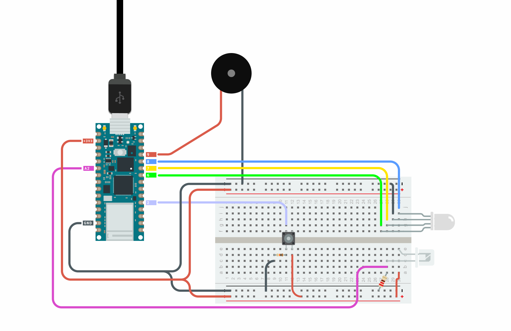
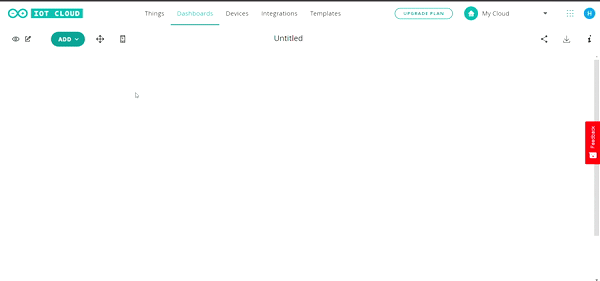

## Components and Supplies

- [Arduino IoT Bundle](https://store.arduino.cc/iot-bundle)

## Apps and Online Services

- [Arduino IoT Cloud](https://cloud.arduino.cc)

## About This Project

**Create a desktop pet with the help of the Arduino IoT Cloud!**

The Nerd is a desktop electronic pet that survives by eating and some sunlight. In order for it to thrive, you must feed it periodically and expose it to sunlight. If it is running out of food, it will communicate an SOS in Morse code using its built-in piezo speaker.

### In a Nutshell

The Nerd will need food which you can give it by pressing its button. Otherwise it will complain by making noise with the buzzer until you either feed it or put it in sunlight. The nerd will be connected to the Arduino Cloud, where we can visualize the amount of food the Nerd has and the level of light it is in. The cloud will also handle the timing elements needed in the code. If the Nerd runs out of food, it will die dramatically, making a lot of noise.

### Components

* RGB LED
* Phototransistor
* Buzzer
* Push button
* 220 Ohm resistor
* 10K Ohm resistor

### Learning Goals

* Introducing the Arduino IoT Cloud
* Introducing the Arduino IoT Remote app
* Managing sensors with the Arduino IoT Cloud
* Creating an Arduino IoT Cloud Dashboard

### Want to Know More?

This tutorial is part of a series of experiments that familiarise you with the Arduino MKR IoT Bundle. All experiments can be built using the components contained in the Arduino MKR IoT Bundle.

* [I Love You Pillow with the Arduino IoT Bundle ](/tutorials/iot-bundle/i-love-you-pillow)
* [Puzzle Box with Arduino IoT Bundle ](/tutorials/iot-bundle/puzzlebox)
* [Plant Communicator with the Arduino IoT Bundle ](/tutorials/iot-bundle/plant-communicator)
* [The Nerd with the Arduino IoT Bundle](/tutorials/iot-bundle/the-nerd)

### Circuit

In this project, we will be using the following circuit. In it we have a 220 ohm resistor connected between ground and the A2 pin used for the phototransistor. And a 10k ohm resistor connected between between ground and the push button.



### Setting up the Arduino IoT Cloud

If you are new to the Arduino IoT Cloud, check out our [Getting Started Guide](https://docs.arduino.cc/arduino-cloud/getting-started/iot-cloud-getting-started).

Creating a new thing and dashboard is really easy. First go to the Arduino Cloud site [here.](https://create.arduino.cc/iot) Setting up the cloud consists of the following parts:

* Creating a **Thing**
* Attaching a **Device**
* Adding **Variables**
* Adding **Network** credentials


### Variables

We will start by adding three variables:


### Dashboard

The next step to deploying our project is adding a control panel using the Arduino IoT Dashboards. We can navigate to **Dashboards > Build Dashboard > ADD**, then we can add two widgets and link them to the variable as the following:

* Gauge widget -> nerdsFood (max. 12)
* Gauge widget -> nerdsLight (max. 500)



### Setup Hardware & Sketch

**Keeping track of the Nerds food**

To keep track of the Nerds food we will be using an **int** variable. When the Nerd is in enough sunlight and the button is pressed it will be fed. Making a sound so you know that it received the food. The RGB led will change color depending on the Nerds hunger state.

```
/* Set color status feedback */
if(nerdsFood < 4){        /* if starving show red */
    setColor(255, 0, 0);  /* Red */
}
else if(nerdsFood >= 4 && nerdsFood < 8){
    setColor(255, 255, 0); /* yellow */
}
else{
    setColor(0, 255, 0); /* green */
}
```

And we can use the Arduino Cloud dashboard to keep track of the food numerically. We will also use a time variable from the Arduino Cloud to easily manage when the food count should go down. Here we will let it take 10 minutes before the food supply is decreased by one. The max food storage is set to 12, this can be expanded by changing the threshold in the "**if"** operator, and don't forgot to update the tracker on the dashboard as well so you can accurately track the food that the Nerd has.

```
void onNerdsFoodChange(){
    if(nerdsFood == 0 && justWokeUp==false){
        /* DIE :( */
        SOS();
    }
}
```

The Nerd will start with 2 food the first time it wakes up, then this value will be tracked by the Cloud. If it dies it will start over with 2 food as well.

**Checking the light level**

To check so that our Nerd gets enough sunlight we will use a Phototransistor. Keeping track of the light level with the **nerdsLight** cloud variable.

```
int SensorPin = A2;
nerdsLight = analogRead(SensorPin);
```

When the Nerd first wakes up, this is when the device is started and the Nerd first receives sunlight. It will make a sound and blink its light. Then the variable will be checked every time you try to give the Nerd some food. The threshold of the light level can be changed if you are having trouble feeding the Nerd. You can use the Cloud to check what values you get when the Nerd is in the light, and then change the threshold here in the code:

```
if(nerdsFood < 12 && nerdsLight>150)
```

**Time tracker with the Arduino Cloud**

The Nerd will get hungry every 10 minutes and eat the food it has been given. To keep track of when the Nerd gets hungry we will use a time variable from the Arduino Cloud. We will use the auto generated functions we get from the Arduino cloud to make the changes to the Nerds food when it eats. This function will be executed after a amount of time has passed. The time is determined in the nerdsTime variable configuration. In this example we set the time to be 10 minutes, this has to be stated in seconds.

### Want to Know More?

This tutorial is part of a series of experiments that familiarize you with the Arduino IoT Bundle. All experiments can be built using the components contained in the IoT Bundle.

* [I Love You Pillow with the Arduino IoT Bundle ](/tutorials/iot-bundle/i-love-you-pillow)
* [Puzzle Box with Arduino IoT Bundle ](/tutorials/iot-bundle/puzzlebox)
* [Plant Communicator with the Arduino IoT Bundle ](/tutorials/iot-bundle/plant-communicator)
* [The Nerd with the Arduino IoT Bundle](/tutorials/iot-bundle/the-nerd)

## Full Code

<iframe src="https://create.arduino.cc/editor/Arduino_Genuino/68fecf75-d394-4063-8082-8a5a21226ce3/preview?embed" style="height:510px;width:100%;margin:10px 0" frameborder="0"></iframe>