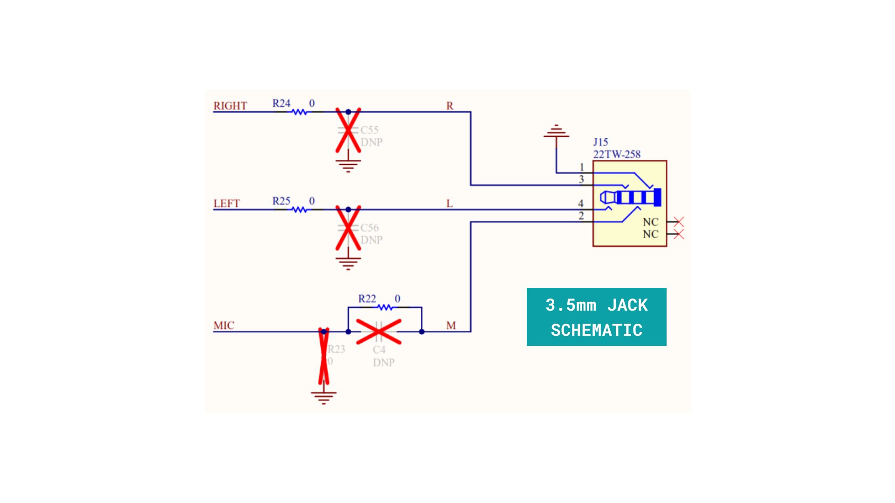
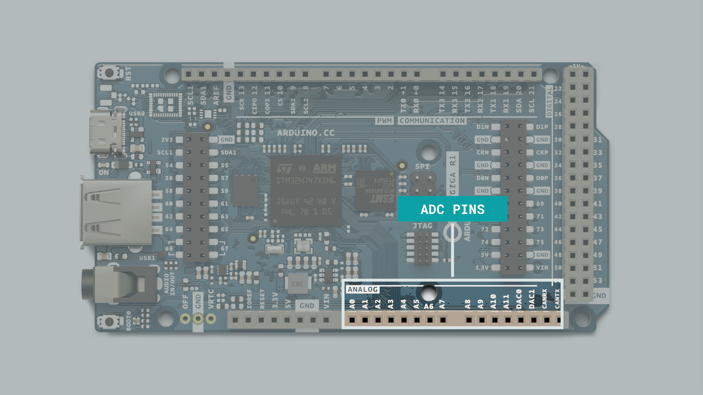

The GIGA R1 is one of the most feature-packed boards from Arduino up to date. In the GIGA R1, you can find the powerful STM32H747XI, a dual-core 32-bit Arm® Cortex® microcontroller from STMicroelectronics; this is the same microcontroller found in the Arduino Portenta H7 family boards. This guide will show you how to use the Arduino ecosystem to turn a versatile and powerful board like the GIGA R1 into a professional audio tool suitable for everyone, from hobbyists to professionals. Let's start with the audio pins of the GIGA R1!

## Audio Pins and Connectors

The GIGA gives you access to more pins than any other Arduino board accessible for makers. Many have unique features; we will focus on the pins that have audio features or can be used for developing audio applications. Audio pins and connectors in the GIGA can be divided into three important groups:

- Analog-to-Digital Converters (ADC) pins
- Digital-to-Analog Converters (DAC) pins
- Tip, Ring, Ring, Sleeve (TRRS) 3.5mm jack

The image below shows the position of the audio pins and connectors of the GIGA R1:


The table below explains the full functionality of the listed on it; notice that some pins have more than one functionality, such as `DAC0`, `DAC1`, `CANRX`, and `CANTX`:

|  Pin  |  Functionality |
|:-----:|:--------------:|
|   A0  |       ADC      |
|   A1  |       ADC      |
|   A2  |       ADC      |
|   A3  |       ADC      |
|   A4  |       ADC      |
|   A5  |       ADC      |
|   A6  |       ADC      |
|   A7  |       ADC      |
|   A8  |       ADC      |
|   A9  |       ADC      |
|  A10  |       ADC      |
|  A11  |       ADC      |
|  DAC0 |   ADC and DAC  |
|  DAC1 |   ADC and DAC  |
| CANRX | ADC and CAN RX |
| CANTX | ADC and CAN TX |

Pins `A7`, `DAC0`, and `DAC1` can also be accessed via the built-in TRRS 3.5mm jack. `DAC0` is connected to ring 1 (right channel), `DAC1` is connected to the tip (left channel), and `A7` is connected to ring 2 (microphone) of the jack, as shown in the schematic below:



## Analog-to-Digital Converters 

An analog-to-digital converter (ADC) is a device that converts an analog voltage, or signal, into digital data. The GIGA R1 microcontroller, the STM32H747XI, embeds three ADCs whose resolution can be configured to 8, 10, 12, 14, or 16 bits. Each ADC shares up to 20 external channels that can be accessed in the GIGA R1 board through pins `A0`, `A1`, `A2`, `A3`, `A4`, `A5`, `A6`, `A7`, `A8`, `A9`, `A10`, and `A11`; pins `DAC0`, `DAC1`, `CANRX`, and `CANTX` can also be used as ADCs.



The GIGA R1 ADCs can be used with the [built-in analog input/output functions of the Arduino programming language](https://www.arduino.cc/reference/de/language/functions/analog-io/analogread/), though they only provide the basic functionalities of the ADCs. To use all of the capabilities of the DACs from the GIGA R1, we can use the `AdvancedAnalogRedux` library from Arduino. Let's check some interesting examples that show some capabilities of the GIGA R1 ADCs!

### Using Two GIGA R1 ADCs Simultaneously

The following example code show how to use two GIGA R1 ADCs simultaneously with the `AdvancedAnalogRedux` library from Arduino:

```arduino
#include "AdvancedADC.h"

AdvancedADC adc1(A0);
AdvancedADC adc2(A1);
uint64_t last_millis = 0;

void setup() {
    Serial.begin(9600);

    // Resolution, sample rate, number of samples per channel, and queue depth of the ADC
    if (!adc1.begin(AN_RESOLUTION_16, 16000, 32, 64)) {
        Serial.println("Failed to start analog acquisition!");
        while (1);
    }
    
    // Resolution, sample rate, number of samples per channel, and queue depth of the ADC
    if (!adc2.begin(AN_RESOLUTION_16, 8000, 32, 64)) {
        Serial.println("Failed to start analog acquisition!");
        while (1);
    }
}

void adc_print_buf(AdvancedADC &adc) {
    if (adc.available()) {
        SampleBuffer buf = adc.read();

        // Print first sample
        Serial.println(buf[0]);

        // Release the buffer to return it to the pool
        buf.release();
    }
}

void loop() {
    if (millis() - last_millis > 1) {
        adc_print_buf(adc1);
        adc_print_buf(adc2);
        last_millis = millis();
    }
}
```

### Visualizing Two GIGA R1 ADCs Simultaneously in the Serial Plotter

The following example code showS how to use two GIGA R1 ADCs simultaneously with the `AdvancedAnalogRedux` library from Arduino and displays the readings via the Serial Plotter of the Arduino IDE:

```arduino
#include "AdvancedADC.h"

AdvancedADC adc(A0, A1);
uint64_t last_millis = 0;

void setup() {
    Serial.begin(9600);

    // Resolution, sample rate, number of samples per channel, and queue depth of the ADC
    if (!adc.begin(AN_RESOLUTION_16, 16000, 32, 128)) {
        Serial.println("Failed to start analog acquisition!");
        while (1);
    }
}

void loop() {
    if (adc.available()) {
        SampleBuffer buf = adc.read();
        
        // Process the buffer
        if ((millis() - last_millis) > 20) {
          Serial.println(buf[0]);   // Sample from the first channel
          Serial.println(buf[1]);   // Sample from the second channel
          last_millis = millis();
        }

        // Release the buffer to return it to the pool
        buf.release();
    }
}
```

## Digital-to-Analog Converters 

A digital-to-analog converter (DAC) is a device that has a function opposite to that of the analog-to-digital converter (ADC); a DAC converts digital data to an analog voltage. The GIGA R1 microcontroller, the STM32H747XI, features two 12-bit buffered DAC channels that can convert two digital signals into two analog voltage signals. Some of the features of the DACs found in the GIGA R1 are the following:

- 8-bit or 12-bit monotonic output
- Left or right data alignment in 12-bit mode
- Dual DAC channel independent or simultaneous conversions 
- DMA capability for each channel
- External triggers for conversion
- Input voltage reference or internal voltage reference
- Analog waveform generation

The GIGA R1 DACs are named `DAC0` and `DAC1`; they can be found on pins `A12` and `A13` correspondingly, as shown in the image below:


Besides pins `A12` and `A13`, `DAC0` and `DAC1` can also be accessed via the built-in TRRS 3.5mm jack. `DAC0` is connected to the right channel (tip), while `DAC1` is connected to the left channel (ring) of the input jack as shown in the schematic below:


The GIGA R1 DACs can be used with the built-in analog input/output functions of the Arduino programming language, though they only provide the basic functionalities of the DACs. To use all of the capabilities of the DACs from the GIGA R1, we can use the `AdvancedAnalogRedux` library from Arduino. Let's check some interesting examples that show some capabilities of the GIGA R1 DACs!

### Waveform Generation with the GIGA R1 DACs

```arduino
#include "AdvancedDAC.h"

AdvancedDAC dac1(A12);

void setup() {
    Serial.begin(9600);

    while (!Serial) {}

    if (!dac1.begin(AN_RESOLUTION_12, 8000, 32, 64)) {
        Serial.println("Failed to start DAC1 !");
        while (1);
    }
}

void dac_output_sq(AdvancedDAC &dac_out) {
    if (dac_out.available()) {

        // Get a free buffer for writing
        SampleBuffer buf = dac_out.dequeue();

        // Write data to buffer
        for (int i=0; i<buf.size(); i++) {
            buf.data()[i] =  (i % 2 == 0) ? 0: 0xfff;
        }

        // Write the buffer data to DAC
        dac_out.write(buf);
    }
}

void loop() {
    dac_output_sq(dac1);
}
```

### Playback with the GIGA R1 DACs