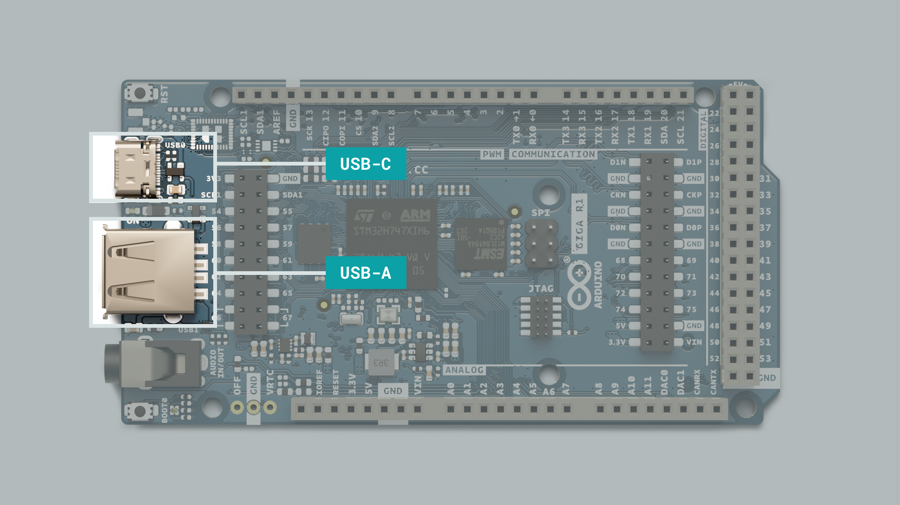
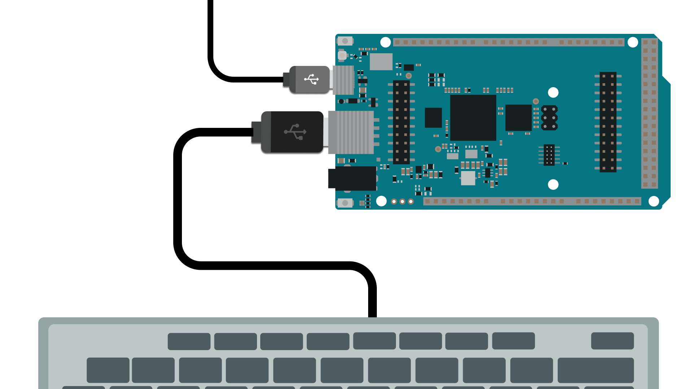
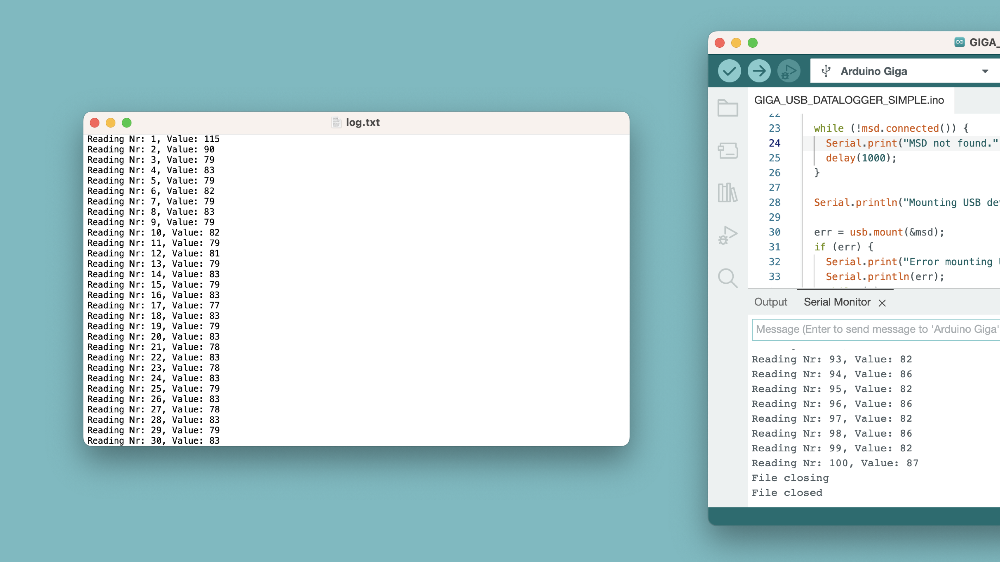

The GIGA R1 comes with a great range of supported USB features, including **USB HID, USB Host** and **Mass Storage**. It also comes with a USB-A connector that allow you to plug devices directly to your GIGA R1 board.

It can easily be configured to act as a mouse or keyboard (HID device) or as a USB Host (connect a keyboard, USB stick). This makes it possible to create powerful interfaces, and build complex interactive projects.

In this guide, we will take a look at the available features, how to enable them in a sketch and what circuit (if any) is required.

## Hardware & Software Needed

- [Arduino GIGA R1 WiFi](/hardware/giga-r1-wifi).
- USB Mass Storage Device (USB Stick).
- Keyboard.

### Libraries

USB features on the GIGA R1 is currently enabled through three separate libraries.
- [USBHID](https://github.com/arduino/ArduinoCore-mbed/tree/master/libraries/USBHID) - included in the core.
- [Arduino_USBHostMbed5](https://github.com/arduino-libraries/Arduino_USBHostMbed5/) - can be downloaded through the Arduino IDE.
- [USBHostGiga (Alpha)](https://github.com/arduino-libraries/USBHostGiga) - library only available through its GitHub repository.

These libraries each provides a set of methods to access the USB features on the board. This includes using the GIGA R1 as a mouse/keyboard (HID), reading & writing to mass storage devices & connecting external keyboards.

The examples provided in this guide are based on these libraries.

## USB Overview

The GIGA R1 has two USB connectors:
- **USB-C** - for powering, programming & HID communication.
- **USB-A** - for USB-Host (connecting keyboards, USB sticks etc).



***Note: do NOT connect the USB-A connector to your computer. This is not a programming port and if the `PA15` pin is enabled, it can damage your computer's USB port.***

Below is an example of how you should use the USB-C / USB-A connectors. 



## Enable/Disable USB-A Port

To enable the USB-A port, you will need to define it as an output. You can also disable it inside of a sketch by writing a LOW state to it.

```arduino
void setup(){
  pinMode(PA_15, OUTPUT); //enable the USB-A port
}

void loop(){
  digitalWrite(PA_15, HIGH); //write a high state
  digitalWrite(PA_15, LOW); //write a low state
}
```

***Please note that connecting devices to the USB-A that draw high amounts of current may cause the board to reset.***

## USB Mass Storage

The USB-A connector onboard the GIGA R1 can be used to connect **USB mass storage devices**, for example, a USB stick. This can be used for a number of applications, including:
- Accessing large files such as images & audio files,
- Logging large amounts of data,
- Storing images or videos captured with a camera.

USB mass storage devices connected needs to be formatted with the **FAT32** as a file system, using the **MBR partitioning scheme**. This is a requirement, and reading & writing will not work otherwise.

The USB mass storage features are based on the [Arduino_USBHostMbed5](https://github.com/arduino-libraries/Arduino_USBHostMbed5/) library.

### USB Designation

To access the correct USB mass storage device, we need to specify the **designation** in the code.

```arduino
mbed::FATFileSystem usb("USB_DRIVE_DESIGNATION")
```

This is so that our GIGA R1 can target the right USB device. In addition, when reading & writing to files, please ensure that the designation is included in the path.

The below line of code is an example of how you need to use the designation in the path, `/usb/` before accessing the file.

```arduino
FILE *f = fopen("/usb/text.txt", "r+");
```

***The designation is essential to consider when using the examples in this guide. All examples are based on the designation = `usb`. You will need to change this in the code, or else it will not work.***

### List File Directory

Below is an example sketch that can be used to **list** files in a USB mass storage device.

```arduino
#include <DigitalOut.h>
#include <FATFileSystem.h>
#include <Arduino_USBHostMbed5.h>

USBHostMSD msd;
mbed::FATFileSystem usb("usb");


void setup()
{
    Serial.begin(115200);
    
    pinMode(PA_15, OUTPUT); //enable the USB-A port
    digitalWrite(PA_15, HIGH);
    
    while (!Serial)
        ;

    Serial.println("Starting USB Dir List example...");

    // if you are using a Max Carrier uncomment the following line
    // start_hub();

    while (!msd.connect()) {
        //while (!port.connected()) {
        delay(1000);
    }

    Serial.print("Mounting USB device... ");
    int err = usb.mount(&msd);
    if (err) {
        Serial.print("Error mounting USB device ");
        Serial.println(err);
        while (1);
    }
    Serial.println("done.");

    char buf[256];

    // Display the root directory
    Serial.print("Opening the root directory... ");
    DIR* d = opendir("/usb/");
    Serial.println(!d ? "Fail :(" : "Done");
    if (!d) {
        snprintf(buf, sizeof(buf), "error: %s (%d)\r\n", strerror(errno), -errno);
        Serial.print(buf);
    }
    Serial.println("done.");

    Serial.println("Root directory:");
    unsigned int count { 0 };
    while (true) {
        struct dirent* e = readdir(d);
        if (!e) {
            break;
        }
        count++;
        snprintf(buf, sizeof(buf), "    %s\r\n", e->d_name);
        Serial.print(buf);
    }
    Serial.print(count);
    Serial.println(" files found!");

    snprintf(buf, sizeof(buf), "Closing the root directory... ");
    Serial.print(buf);
    fflush(stdout);
    err = closedir(d);
    snprintf(buf, sizeof(buf), "%s\r\n", (err < 0 ? "Fail :(" : "OK"));
    Serial.print(buf);
    if (err < 0) {
        snprintf(buf, sizeof(buf), "error: %s (%d)\r\n", strerror(errno), -errno);
        Serial.print(buf);
    }
}

void loop()
{
}
```

### File Read

Below is an example sketch that can be used to **read** files from a USB mass storage device.

```arduino
#include <Arduino_USBHostMbed5.h>
#include <DigitalOut.h>
#include <FATFileSystem.h>

USBHostMSD msd;
mbed::FATFileSystem usb("usb");

// If you are using a Portenta Machine Control uncomment the following line
mbed::DigitalOut otg(PB_14, 0);
 
void setup() {
  Serial.begin(115200);
  
  pinMode(PA_15, OUTPUT); //enable the USB-A port
  digitalWrite(PA_15, HIGH);  
  
  while (!Serial);

  delay(2500);
  Serial.println("Starting USB File Read example...");

  // if you are using a Max Carrier uncomment the following line
  //start_hub();

  while (!msd.connect()) {
    delay(1000);
  }

  Serial.println("Mounting USB device...");
  int err =  usb.mount(&msd);
  if (err) {
    Serial.print("Error mounting USB device ");
    Serial.println(err);
    while (1);
  }
  Serial.print("read done ");
  mbed::fs_file_t file;
  struct dirent *ent;
  int dirIndex = 0;
  int res = 0;
  Serial.println("Open file..");
  FILE *f = fopen("/usb/Arduino.txt", "r+");
  char buf[256];
  Serial.println("File content:");

  while (fgets(buf, 256, f) != NULL) {
    Serial.print(buf);
  }

  Serial.println("File closing");
  fflush(stdout);
  err = fclose(f);
  if (err < 0) {
    Serial.print("fclose error:");
    Serial.print(strerror(errno));
    Serial.print(" (");
    Serial.print(-errno);
    Serial.print(")");
  } else {
    Serial.println("File closed");
  }
}

void loop() {

}
```

### File Write

Below is an example sketch that can be used to **write** files from a USB mass storage device.

```arduino
#include <Arduino_USBHostMbed5.h>
#include <DigitalOut.h>
#include <FATFileSystem.h>

USBHostMSD msd;
mbed::FATFileSystem usb("usb");

// mbed::DigitalOut pin5(PC_6, 0);
mbed::DigitalOut otg(PB_8, 1);

void setup() {
  Serial.begin(115200);
  
  pinMode(PA_15, OUTPUT); //enable the USB-A port
  digitalWrite(PA_15, HIGH);
  
  while (!Serial);
  
  msd.connect();

  while (!msd.connected()) {
    //while (!port.connected()) {
    delay(1000);
  }

  Serial.println("Mounting USB device...");
  int err =  usb.mount(&msd);
  if (err) {
    Serial.print("Error mounting USB device ");
    Serial.println(err);
    while (1);
  }
  Serial.print("read done ");
  mbed::fs_file_t file;
  struct dirent *ent;
  int dirIndex = 0;
  int res = 0;
  Serial.println("Open /usb/numbers.txt");
  FILE *f = fopen("/usb/numbers.txt", "w+");
  for (int i = 0; i < 10; i++) {
    Serial.print("Writing numbers (");
    Serial.print(i);
    Serial.println("/10)");
    fflush(stdout);
    err = fprintf(f, "%d\n", i);
    if (err < 0) {
      Serial.println("Fail :(");
      error("error: %s (%d)\n", strerror(errno), -errno);
    }
  }

  Serial.println("File closing");
  fflush(stdout);
  err = fclose(f);
  if (err < 0) {
    Serial.print("fclose error:");
    Serial.print(strerror(errno));
    Serial.print(" (");
    Serial.print(-errno);
    Serial.print(")");
  } else {
    Serial.println("File closed");
  }
}

void loop() {

}
```

### Datalogger Example

In the example below, we are reading logging the `A0` pin, where we are defining two parameters:
- `interval` - how long between each reading.
- `number_of_readings` - how many readings we should take.

This is useful if you e.g. want to log a specific amount of samples for a specific amount of time.

```arduino
#include <Arduino_USBHostMbed5.h>
#include <DigitalOut.h>
#include <FATFileSystem.h>

USBHostMSD msd;
mbed::FATFileSystem usb("usb");

int err;
int count;
int number_of_readings = 100; //how many readings you want to take
int interval = 10; //how long between readings (milliseconds)

void setup() {
  Serial.begin(115200);

  pinMode(PA_15, OUTPUT);  //enable the USB-A port
  digitalWrite(PA_15, HIGH);

  while (!Serial); //stop program from executing until serial port opens

  msd.connect();

  while (!msd.connected()) {
    Serial.print("MSD not found.");
    delay(1000);
  }

  Serial.println("Mounting USB device...");

  err = usb.mount(&msd);
  if (err) {
    Serial.print("Error mounting USB device ");
    Serial.println(err);
    while (1)
      ;
  }
  Serial.print("read done ");
  
  //function to write to file
  WriteToFile();
}

void loop() {
}

void WriteToFile() {
  mbed::fs_file_t file;
  struct dirent *ent;
  int dirIndex = 0;
  int res = 0;

  Serial.println("Opening file..");
  FILE *f = fopen("/usb/log.txt", "w+");

  for (int i = 0; i < number_of_readings; i++) {
    count += 1;

    Serial.print("Reading Nr: ");
    Serial.print(count);
    Serial.print(", Value: ");
    Serial.println(analogRead(A0));
    
    fflush(stdout);
    
    int reading = analogRead(A0);

    err = fprintf(f, "%s", "Reading Nr: ");
    err = fprintf(f, "%d", count);
    err = fprintf(f, "%s", ", Value: ");
    err = fprintf(f, "%d\n", reading);

    if (err < 0) {
      Serial.println("Fail :(");
      error("error: %s (%d)\n", strerror(errno), -errno);
    }
    delay(interval);
  }

  Serial.println("File closing");
  fflush(stdout);
  err = fclose(f);

  if (err < 0) {
    Serial.print("fclose error:");
    Serial.print(strerror(errno));
    Serial.print(" (");
    Serial.print(-errno);
    Serial.print(")");
  } else {
    Serial.println("File closed");
  }
}
```

After logging data, remove the USB stick from your board, and insert it in your computer to see the data logged:



## USB Host Keyboard

It is possible to connect generic USB keyboards to the GIGA R1's USB-A connector without any additional circuitry. 

The library used for this can be downloaded through Github.
- [USBHostGiga](https://github.com/arduino-libraries/USBHostGiga)

***The USBHostGiga library is not available in the Arduino IDE and needs to be installed manually. You can do so my navigating to `Sketch` > `Include Library` > `Add .ZIP Library`.***

```arduino
#include "HIDHost.h"

Keyboard keyb; //create object

void setup() {
  // put your setup code here, to run once:
  Serial.begin(115200);
  while (!Serial);
  pinMode(PA_15, OUTPUT); //enable the USB-A port //enable the USB-A connector
  keyb.begin(); //init the library
}


void loop() {
  if (keyb.available()) {
    Serial.println(keyb.read()); //print any incoming character
  }
}
```

***Please note that he `PA15` pin must be configured as an `OUTPUT`.***

## USB HID

It is possible to turn your GIGA R1 board into a Human Interface Device **(HID)**, aka mouse & keyboard, using the [USBHID](https://github.com/arduino/ArduinoCore-mbed/tree/master/libraries/USBHID) library which is included in the GIGA core. 

Among other things, you can:
- Create a custom keyboard, or a keyboard accessory,
- Create sophisticated game controllers,
- Accessories for VR/AR applications.

### Keyboard

***Important! When using the GIGA as a keyboard, make sure to include some sort of delay. Otherwise, you may end up printing things very fast, which can be an annoyance. If this happens nonetheless, double tap the reset button and upload a blank sketch to reset the board.*** 

To emulate a keyboard, we need to include `PluggableUSBHID.h` and `USBKeyboard.h`, and create an object using the `USBkeyboard` constructor. 

```arduino
#include "PluggableUSBHID.h"
#include "USBKeyboard.h"

USBKeyboard Keyboard;
```

To send a single character, we can use the `putc()` method.

```arduino
Keyboard.putc(97); //prints the letter 'a'
```

See the `DEC` column at [ascii-code.com](https://www.ascii-code.com/) to understand what number you need to print a specific character.

To print a whole string, use the `printf()` method.

```arduino
Keyboard.printf("Hello World!"); 
```

To use modifiers and function keys, use the `key_code()` method.

```
Keyboard.key_code(KEY_F1);
```

To use media keys, use the `media_control()` method.

```
Keyboard.media_control(KEY_NEXT_TRACK);
```

***All modifiers, function and media control keys can be found in [this header file](https://github.com/arduino/ArduinoCore-mbed/blob/master/libraries/USBHID/src/USBKeyboard.h).***

### Mouse

To emulate a mouse, we need to include `PluggableUSBHID.h` and `USBMouse.h`, and create an object using the `USBMouse` constructor. 

```arduino
#include "PluggableUSBHID.h"
#include "USBMouse.h"

USBMouse Mouse;
```

To move the cursor, we can write the **x** and **y** coordinates directly, using the `move()` method.

```arduino
Mouse.move(100,100);
```

For clicking the mouse, use the `click()` method.

```arduino
Mouse.click(MOUSE_LEFT);
Mouse.click(MOUSE_RIGHT);
Mouse.click(MOUSE_MIDDLE);
```

For double clicking the mouse, use the `double_click()` method.

```
Mouse.double_click(MOUSE_LEFT);
```

To press and release the buttons on the mouse, we can use the `press()` and `release()` methods. This way, we can define how long we want the button to be pressed for.

```arduino
Mouse.press(MOUSE_LEFT);
Mouse.press(MOUSE_RIGHT);
Mouse.press(MOUSE_MIDDLE);

delay(1000);

Mouse.release(); 
```

## Summary

The goal with this guide was to provide a summary of all the GIGA R1's features, including:
- Enabling and disabling the USB-A port.
- Read & Write to a USB mass storage device (MSD).
- Connecting keyboards and reading key presses.
- Emulate a mouse/keyboard through the HID interface.