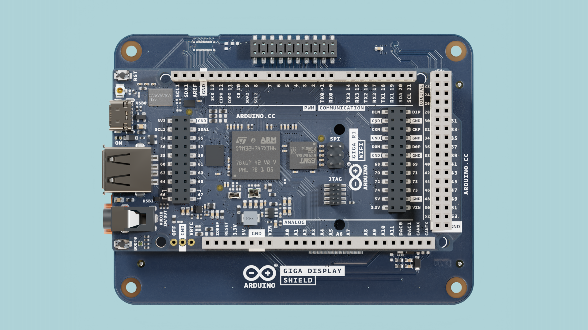

The [GIGA Display Shield](/hardware/giga-display-shield) is an accessory shield designed for the [GIGA R1 WiFi](/hardware/giga-r1-wifi) board. With it, you can render fast & sophisticated user interfaces on a **800x480** display with **touch support**.

In this guide you will learn how to set your board up with the GIGA R1 WiFi board & become familiar with the available libraries to control it.

## Hardware & Software Needed

- [GIGA R1 WiFi](/hardware/giga-r1-wifi).
- [GIGA Display Shield](/hardware/giga-display-shield)
- [Arduino IDE](https://www.arduino.cc/en/software)

## Overview

There are three official libraries available to use the display & touch interface:
- [Arduino_H7_Video](https://github.com/arduino/ArduinoCore-mbed/tree/main/libraries/Arduino_H7_Video) - manages the video output and integrates third party libraries such as [LVGL](https://lvgl.io/) and [emWin](https://www.segger.com/products/user-interface/emwin/). This library is used to configure and initialize the display and to perform basic draw functions.
- [ArduinoGraphics](https://www.arduino.cc/reference/en/libraries/arduinographics/) - a graphics primitive library that provides draw, text and animation functions.
- [Arduino_GigaDisplayTouch](https://github.com/arduino-libraries/Arduino_GigaDisplayTouch) - to handle the touch interface of the display.

The above libraries provides a basic set of functionalities. To build more sophisticated UI's, frameworks such as [LVGL](https://lvgl.io/) is required.

The LVGL framework allows you to build user interfaces using existing widgets such as buttons, gauges, text fields, drop down menus and much more.  

***To get started with LVGL and get access to some useful examples, visit the [Guide to LVGL with GIGA Display Shield](/tutorials/giga-display-shield/lvgl-guide) tutorial.***

## Installation

The GIGA Display Shield requires you to install the core for GIGA boards, along with some additional software libraries.

### Install GIGA Core

To use the shield you will need a GIGA R1 WiFi board. You also need to install the **GIGA core**, which can be done directly in the Arduino IDE, under "Board Manager".


***For more details, see [Getting Started with GIGA R1 WiFi](/tutorials/giga-r1-wifi/giga-getting-started).***


### Install ArduinoGraphics

The [ArduinoGraphics](https://www.arduino.cc/reference/en/libraries/arduinographics/) is required for drawing operations on the screen. 

You can install it directly in the IDE, in the "Library Manager":


***For source code and issues with the ArduinoGraphics library, please see the [GitHub repository](https://github.com/arduino-libraries/ArduinoGraphics).***

### Install Arduino_GigaDisplayTouch

The [Arduino_GigaDisplayTouch](https://www.arduino.cc/reference/en/libraries/arduino_gigadisplaytouch/) is required for reading touch points on the screen, and is needed when using the LVGL's framework.  


***For source code and issues with the Arduino_GigaDisplayTouch library, please see the [GitHub repository](https://github.com/arduino-libraries/Arduino_GigaDisplayTouch).***

## Hardware Setup

To use the GIGA Display Shield, mount it on the **bottom** side of the GIGA R1 WiFi board. The GIGA R1 WiFi board will be flipped upside down when the display is used.



### Camera Connector

Located on the top side of the shield is a camera connector that enables when you connect it to the GIGA R1 WiFi board. 

## IMU

This shield has a built-in IMU module, the **BMI270**. This sensor can be used for a number of purposes, for example to automatically orientate an object on the screen, see the following tutorial: 

- [Giga Display Shield Automatic Orientation](/tutorials/giga-display-shield/image-orientation)

To access **BMI270**, use the [BMI270-250](https://www.arduino.cc/reference/en/libraries/arduino_bmi270_bmm150/) library. Please note that the sensor is not connected to the main I2C bus, so you will need to initialize the sensor on another bus. To do so, simply add the line below to the top of your sketch:

```arduino
BoschSensorClass imu(Wire1);
``` 

Note that the examples use the default `IMU` (uppercase) class, which you will need to replace. Example:

```
IMU.begin() //for other boards
imu.begin() //for GIGA Display Shield
```

## Microphone

This shield has an embedded omnidirectional microphone, **MP34DT06JTR**, which can be used together with the [PDM](https://docs.arduino.cc/learn/built-in-libraries/pdm) library. This library is shipped with the GIGA core, so there's no need to manually install it.

Below is a minimal sketch that will print out the samples in the serial plotter (See [Using the Serial Plotter Tool](/software/ide-v2/tutorials/ide-v2-serial-plotter) for more information). 

<CodeBlock url="https://github.com/arduino/ArduinoCore-mbed/blob/main/libraries/PDM/examples/PDMSerialPlotter/PDMSerialPlotter.ino" className="arduino"/>

## RGB

This shield has a built in RGB pixel that is controlled via I2C. To use this, install the [Arduino_GigaDisplay](https://github.com/arduino-libraries/Arduino_GigaDisplay) library. The following sketch is a minimal example that will blink the blue pixel every second.

```arduino
#include <Arduino_GigaDisplay.h>

GigaDisplayRGB rgb; //create rgb object

void setup() {
  rgb.begin(); //init the library
}

void loop() {
  rgb.on(0, 0, 255); //turn on blue pixel
  delay(1000);
  rgb.off(); //turn off all pixels
  delay(1000);
}
```

## Summary

In this guide we have covered the requirements & installation needs for using the GIGA Display Shield, as well as demonstrating how to access the RGB, IMU & Microphone peripherals. 

For more tutorials, visit the [documentation page for GIGA Display Shield](/hardware/giga-display-shield).