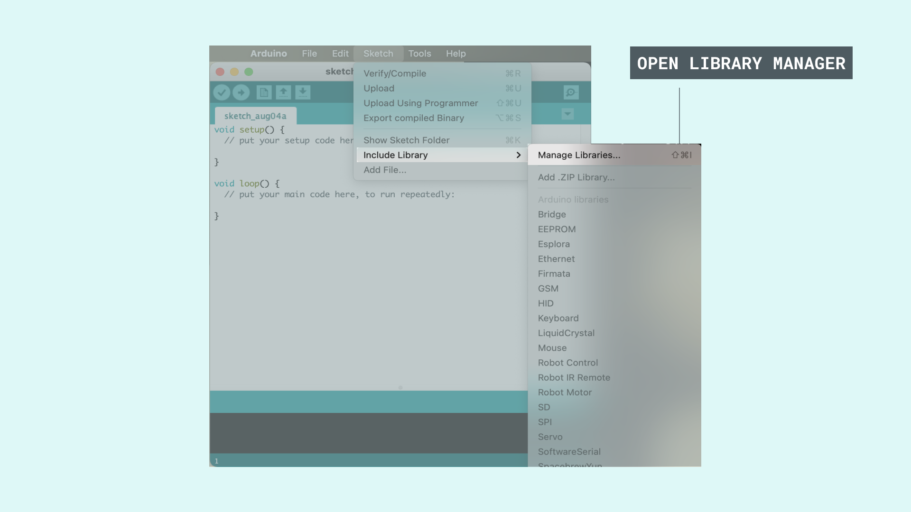
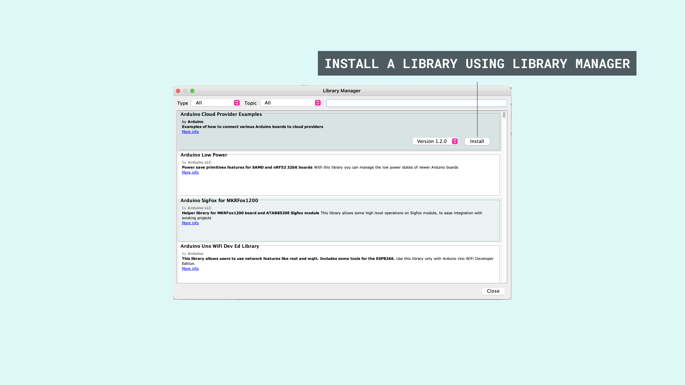
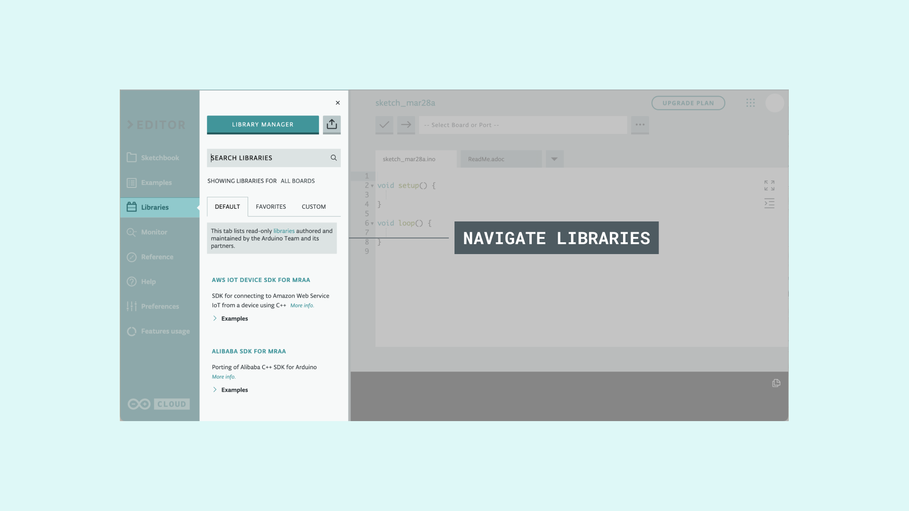

The Arduino environment can be extended through the use of libraries. Just like most programming platforms, libraries provide extra functionality for use in sketches, e.g. working with hardware or manipulating data. To use a library in a sketch, select it from **Sketch > Import Library**.

### Offline IDE

A number of libraries come installed with the IDE, but you can also download or create your own. Here are some instructions for **setting up a library on the offline IDE:**

**1.** Open the IDE and click "Sketch" on the menu tab and then **Include Library > Manage Libraries**.

**2.** **Search for the library** that you need, click on it, then select the version of the library you want to install.

**3.** Finally, **click on install** and wait for the IDE to install the new library. 

Once it has finished, an **Installed** tag should appear next to the Bridge library, so you can go ahead and close the library manager.

Now the new library will be available in the **Sketch > Include Library** menu. If you want to add your own library to Library Manager, follow [these instructions](https://github.com/arduino/Arduino/wiki/Library-Manager-FAQ).

### Online IDE

The process of **setting up libraries on the online IDE** (Arduino Web Editor) is quite similar to the offline one:

**1.** Login to the [Arduino Web Editor](https://create.arduino.cc/editor).

**2.** Open the "Libraries" tab from the left menu, and search for libraries. The list displays read-only libraries, authored and maintained by the Arduino team and its partners.

**3.** When you find the library, you can **add it to your sketch** by selecting the "Include" button. You can also see the related examples, and select a specific version, if available.

**4.** If you can't find a specific library on the list, you can search every existing library through **the library manager**. From there you also have the option to add them to your favorites list by clicking on the star next to the library you want. Once you star a library, you can view it under the "favorites" tab and use its examples (if available).

