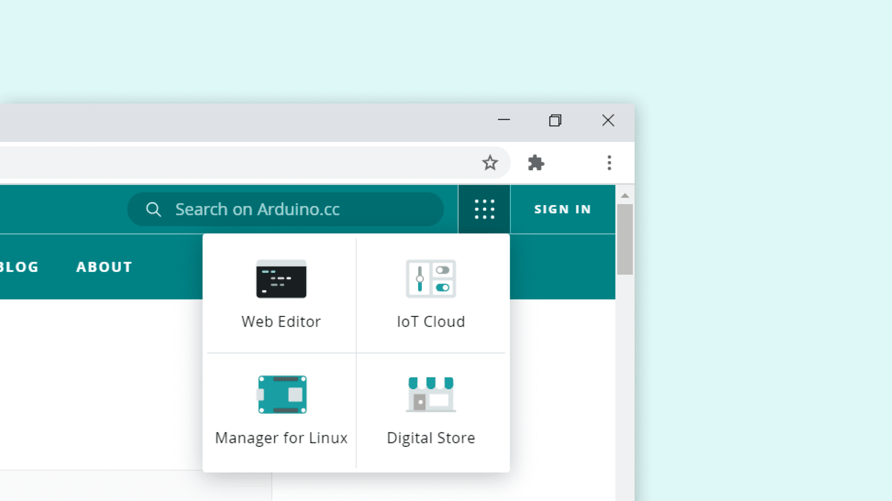
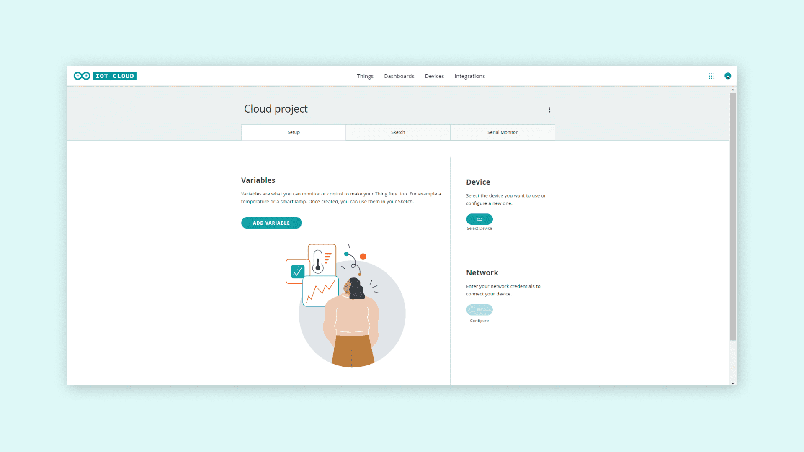
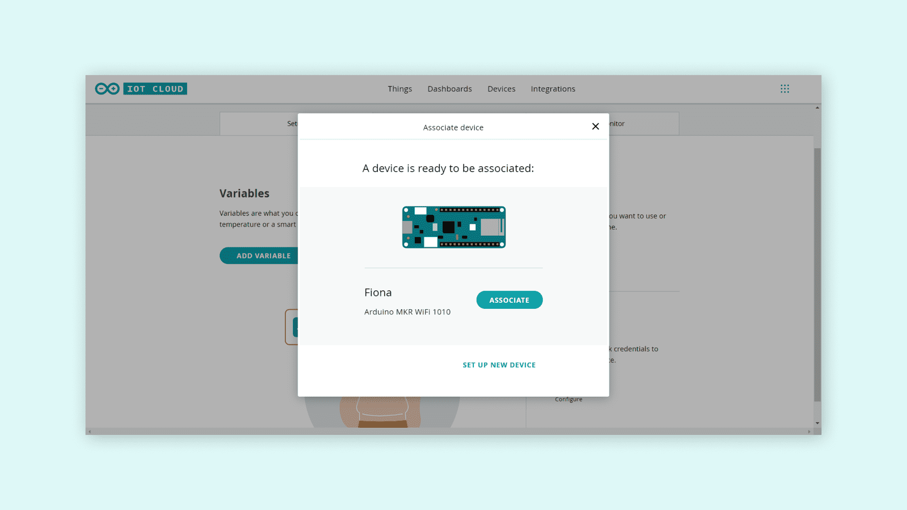
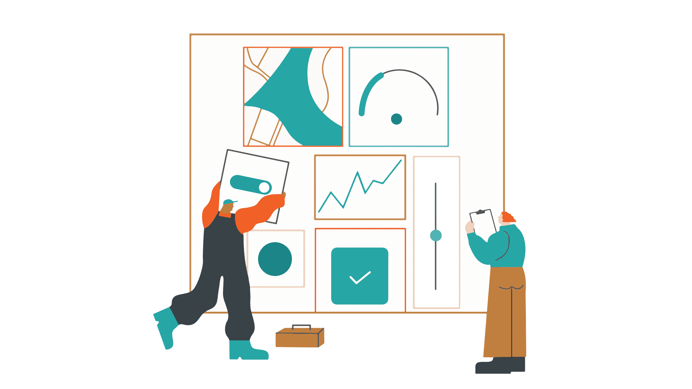
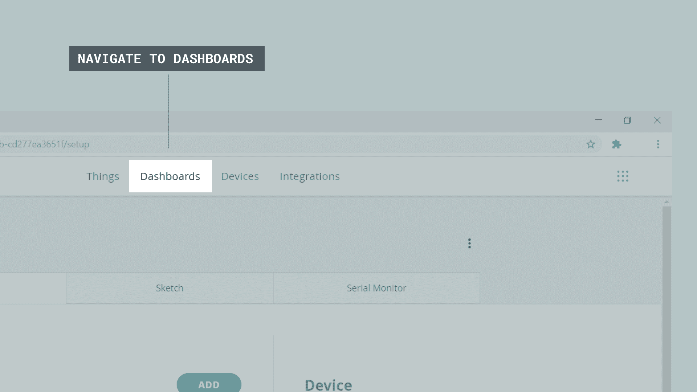
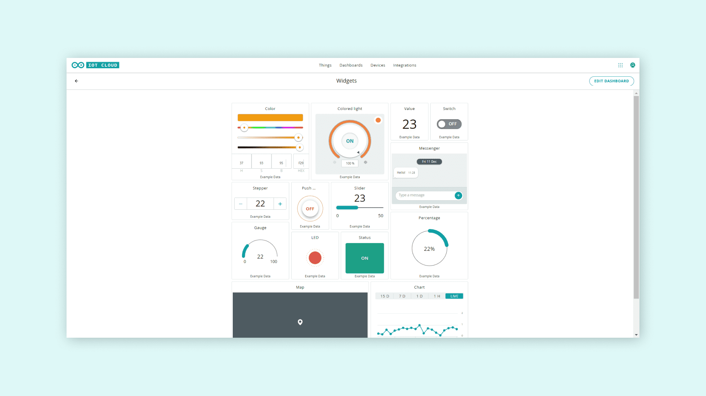

## Using the Arduino IoT Cloud

With the Arduino IoT Cloud desktop or mobile platform, you can quickly connect, manage and monitor your devices from anywhere in the world. 

Arduino IoT Cloud allows you to automatically create any code to program your device with - just add a couple of lines to customize it how you want. If you’re new to Arduino don’t worry there’s example code for hundreds of sensors and actuators. 

The following steps will guide you to start using the Arduino IoT Cloud:

**1.** Install the [Arduino Create Agent](https://create.arduino.cc/getting-started/plugin/welcome) plugin.

**2.** Check if you have a **cloud compatible board**. The picture below shows all official Arduino boards that are compatible. 

***Note: The MKR GSM 1400 and MKR NB 1500 require a SIM card to connect to the Cloud, as they communicate over the mobile networks. The MKR WAN 1300 and 1310 board requires a Arduino PRO Gateway LoRa to connect to the cloud.***

**3.** Create an Arduino account by [signing up to Arduino](https://login.arduino.cc/login).

**4.** **Access the Arduino IoT Cloud** from any page on [arduino.cc](https://www.arduino.cc/) by clicking on the bento menu (9-dots) on the top right corner, or you can go directly to the  [Arduino IoT Cloud](https://create.arduino.cc/iot/).

### Creating a Thing

**1.** The user journey always begins by **creating a new Thing**. In the Thing overview, we can choose what device to use, what Wi-Fi network we want to connect to, and create variables that we can monitor and control.

**2.** Next we need to **add a device** by clicking on the "Select device" button on the Thing overview. Here, we choose from any board that we have already been configured, or select the **Configure new device** option.

**3.** Now we can **add our first variable** by clicking on the **Add variable** button. We can choose name, data type, update the setting and interaction mode for our variable. There are several data types we can choose from, such as **int, float, boolean, long, char**. There’s also special variables, such as **Temperature, Velocity, and Luminance** that can be used. The variables we create are automatically generated into a sketch file.

**4.** Finally, we need to **connect to a Wi-Fi network** by simply clicking the **Configure** button in the network section. Enter your network credentials and click **Save**. This information will also be generated into your sketch file!

### Building the Sketch 

Now that you are all set up, **let’s have a look at the interface!**

A special sketch file can now be found in the **Sketch** tab, which includes all of the configurations that you have made. When the sketch has been uploaded, it will work as a regular sketch, but it will also update the Cloud variables that we use!

Additionally, each time we create a variable that has the **Interaction Mode** enabled, a function will also be generated. Every time this variable is triggered from the Cloud, it will execute the code within this function! This means that we can leave most of the code out of the **loop()** and only run code when needed.

When we are happy with our sketch, we can **upload** it to our board, by clicking the upload button.

After we have successfully uploaded the code, we can open the **Serial Monitor** tab to view information regarding our connection. If it is successful, it will print **connected to network_name** and **connected to cloud**. 

If it fails to connect, it will print the errors here as well.
Now that we have configured the device & network, created variables, completed the sketch and successfully uploaded the code, we can move on to the fun part, the **dashboard**!

### Creating the dashboard

Dashboards are visual user interfaces for interacting with your boards over the Cloud, and we can set up many different setups depending on what your IoT project needs. 

We can access our dashboards by clicking on the **Dashboards** tab at the top of the Arduino IoT Cloud interface, where we can create new dashboards, and see a list of dashboards created for other Things.

If we click on **Create new dashboard**, we enter a dashboard editor. Here, we can create something called **widgets**. Widgets are the visual representation of our variables we create, and there are many different ones to choose from. Below is an example using several types of widgets.

When we create widgets, we also need to **link them to our variables**. This is done by clicking on a widget we create, selecting a Thing, and selecting a variable that we want to link. 

Once it is linked, we can either interact with it, for example a button, or we can monitor a value from a sensor. As long as our board is connected to the cloud, the values will update automatically!

**Congratulations!** Now you are ready to create your own IoT system. You can find more information about the [Arduino IoT Cloud here](https://docs.arduino.cc/cloud/iot-cloud/tutorials/iot-cloud-getting-started).

## Network Configuration

***Note: that the Arduino IoT Cloud operates with different domains and ports, which means that if we want devices working with the Arduino IoT Cloud, they need to be allowed access to certain domains through your firewall.***

If you are connected to your **school or university networks**, please provide your admin with the following instructions:

**1.** **Whitelist** the following domains and ports in your firewall:

|Domain                  |Port          |
| -------                | -----        |
|mqtts-up.iot.arduino.cc |8884          |
|mqtts-sa.iot.arduino.cc |8883          |
|wss.iot.arduino.cc      |8443          |

**2.** Provide **NTP access** to [time.arduino.cc](<time.arduino.cc>), note that the NTP port for [time.arduino.cc](<time.arduino.cc>) is **123 UDP**.

If you are having issues connecting to the Arduino IoT Cloud through your home network, follow these instructions:

**For Windows users**

**1.** Navigate to your firewall, go to Start > search **firewall** > open **Windows Firewall**.

**2.** Click on **Allow a program/app or feature through Windows Firewall**.

**3.** Then open **Change Settings**.
