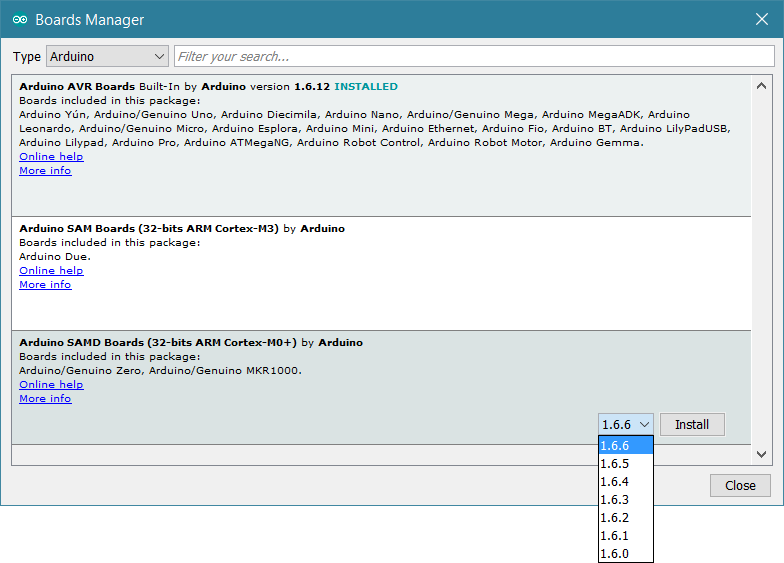
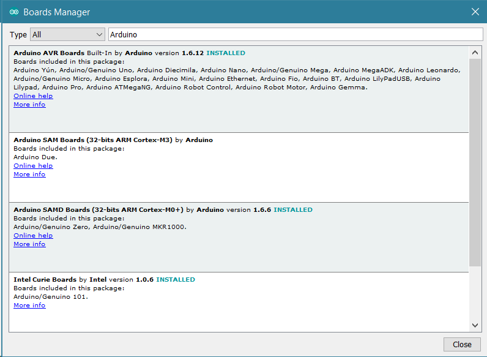
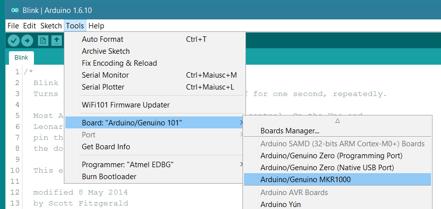
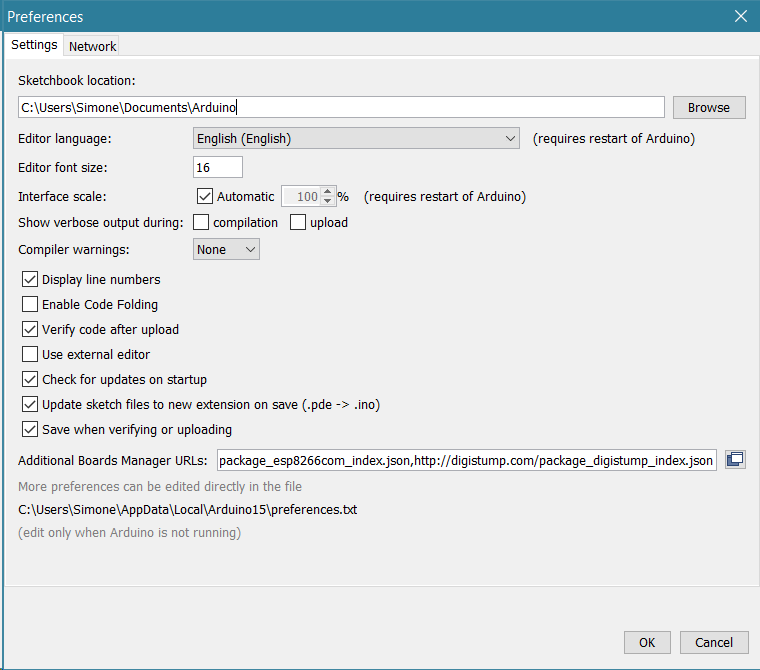
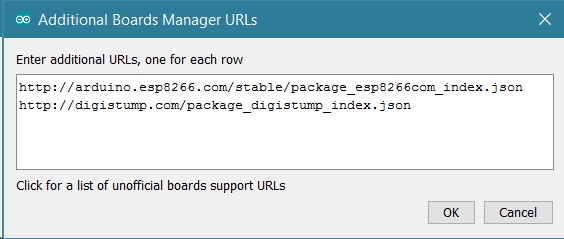

Starting from the Arduino Software (IDE) version 1.6.2, all Arduino AVR boards are installed by default.
Some Arduino boards require an additional core to be installed, therefore we have implemented the **Boards Manager** as the preferred tool to add cores to your Arduino Software (IDE).

Cores are necessary to make new microcontrollers compatible with your Arduino Software (IDE) and, possibly, the existing sketches and libraries. We develop the cores for the new microcontrollers used in our new generation boards, but anyone may develop a core for their own boards following the rules and requirements we have issued.

## How to install an Arduino core

Our board cores are already available in the Boards Manager and are updated on every new Arduino Software (IDE) release.

Click on Tools menu and then _Board > Boards Manager_.

Boards manager will open and you will see a list of installed and available boards; the download of the index file could take some time and the list appears at the end of this process; please be patient.

Click on the Arduino SAM Boards core, choose the version in the drop-down menu and click on Install.

The download time will depend on your connection speed.

After installation is complete an _Installed_ tag appears next to the core name. You can close the Board Manager.

Now you can find the new board in the Tools > Board menu.

## How to install a third party core

We have provided a solution for the easy installation of a core developed by a third party. This requires a specific file, written in JSON format, that must be put in the dedicated field _Additional Board Manager URLs_ inside Arduino Software (IDE) _Preferences_.

If you have more JSON files to add, click on the little icon on the right of the field and open a specific window where you may input more URLs, one line at a time.

After this procedure, the new cores will be available for install in the Boards Manager. Please refer to the information provided by the third party core author to get more specific instructions.

The text of the Arduino getting started guide is licensed under a
[Creative Commons Attribution-ShareAlike 3.0 License](http://creativecommons.org/licenses/by-sa/3.0/). Code samples in the guide are released into the public domain.
