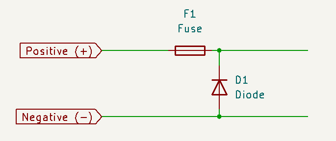
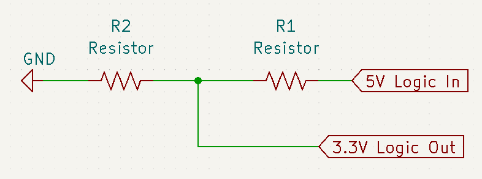
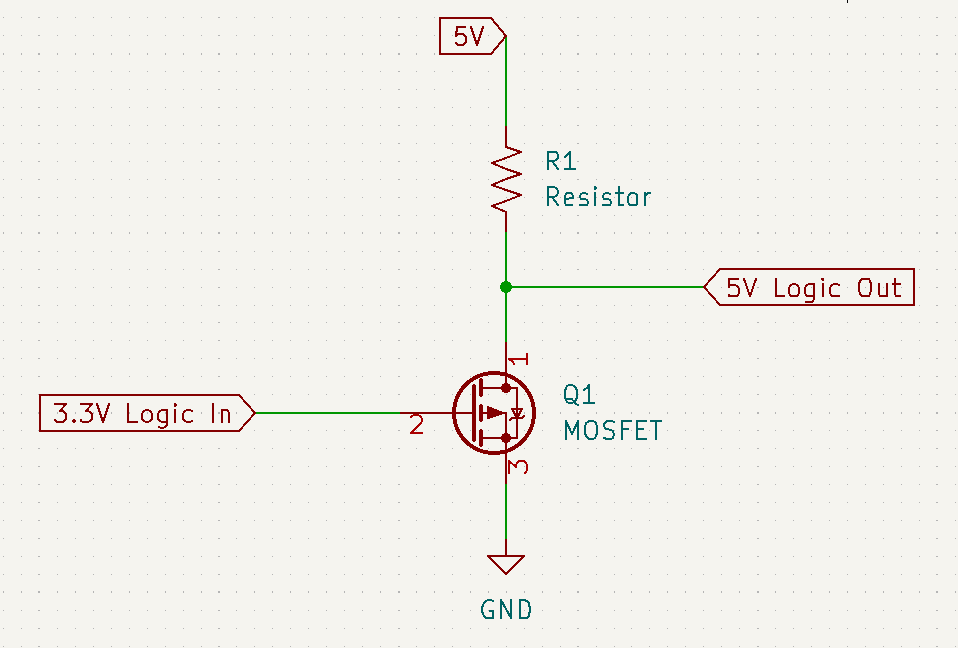

## 5.0V vs. 3.3V

Most electronic devices, when designed, tends to choose between 5.0V or 3.3V that will feed voltage to its designed system. Voltage design selection can be usually either due to its convenience of availability of the power source, or the need of power efficiency that the system itself has as a requirement.

Although 5.0V and 3.3V in numerical difference only have a 1.7V of difference it is sufficient enough to provide major power difference in electronic systems. In this guide, we will show you why 3.3V is the modern standard voltage level, and general tips when designing and handling these voltage levels. 

## 3.3V, the Standard Voltage Level

So, why is the **3.3V** level a standard voltage level? There are several reasons that contributes for standardising the 3.3V level, and in world of electronics, we are in constant search for more efficient and performant yet density-low package devices or machines. 

The industry is always moving forward, and in electronics, the transistors have reduced in its size than previous years and due to its reduced size, voltage threshold also follows the trend by going lower. The industry continuously is working to develop faster electronic devices, and one general way to achieve this is to lower the applied voltage level. Lowering applied voltage level implies much faster logic level changes. Power usage is a concerning topic if we discuss about power efficiency, and lower voltage levels will help us achieve this goal. 

In the end, the industry has moved from 5V TTL by achieving lower optimal voltage level due to chip development improvement and introduction of CMOS (Complementary Metal-Oxide Semiconductor). Also, it is always better to have a clear working standard which ensures compatibility of device development and operation. To manage this standard, **JEDEC Standard** made **JESD8 standard** which defines 3.3V level as the standard voltage level. 

***For more in-depth information about current microelectronic standards, please look into [JEDEC](https://www.jedec.org/)***

Usually, such broad classification given to **low power** electronic devices are usually defined at voltage of 3.3V to 5V with current at 0.5A to 3A for example. **High power** electronic devices can be designated for devices requiring 12V of voltage and 10A of current, and beyond. Although, in this two types of device classification, a common factor usually relies within by using 3.3V level internally. 

The power inputs and outputs may vary, depending on the requirement of the electronic design. Which it also means it could use ambiguous voltage levels mostly for power inputs, implying to drive the voltage down in most cases. In contrast, most of the electronic components and modules are regulated by its electrical specification. The electrical specification for these components used internally, in exception for specialized components for specific cases, are designed to have 3.3V as a operating voltage level, otherwise specified in range. 

***Fun Fact of 3.3V - The number 3.3 dates by going back to early days of IC (Integrated Circuit) development of semiconductor technology, and it is rumoured that it is the result of RTL (Register-Transfer Level) designs.***

## How to Avoid Burning Circuits 101

Every electronic designer and developers driving the power lines of the electronic devices always keeps its effort to avoid frying the system. Depending on the power design integrated to the electronic device, it might be a slip of a hand to short the electronic or it could be an all-out effort to short the system. In the end, it is inevitable not to short the electronic if the misimplementation is made. So, how do we avoid frying the electronics? 

The simple answer to this is to **keep an eye** on it. The electronic devices, still at the moment, are not intelligent enough to avoid circuit short, and it is designed all by human engineers. Decoding further this present answer, it can be listed to following tips to take it into account. 

### Color Coded Power Lines

Color coding the power lines is the easiest yet effective visual method of avoiding incorrectly connecting the power lines. One common issue for shorting the electronic device is often due to connecting the power lines inverted. When prototyping an electronic device, common mistake made by some developers is to use same color on every cable while being jumbled all over the places, making it impossible to identify which is which. This applies also to power lines. 

Color coding the power lines, the voltage and the Ground lines, makes much easier to identify which is the voltage cable and which is the Ground cable. Given the industry regulation, normally color Red is used to indicate Voltage line; while the color Black is used to indicate Ground line. The colors can be varied depending on the regulation that is applied given organization if required. For example, instead of Red for Voltage line, it can be either Brown or bright Orange. 

***For more information on electrical code, please have a look at [NFPA 70®](https://www.nfpa.org/NEC/electrical-codes-and-standards/NFPA-70?code=70) and [IEEE NESC®](https://standards.ieee.org/products-programs/nesc/)***

### Fuse Integration

The smart way of protecting the electronic devices is to integrate an on-board power protection circuit. There are several designs to achieve this, and one common way to do is to use the **Fuse**. Using the fuse as part of the electronic offers inexpensive cost and power protection at certain extent. 

Fuse integration to electronic devices is not a difficult design process either. Usually it is found as bridge between operation circuit, and it requires using an intervention of a diode to complete the circuit protection. Following simple schematic shows a simple reverse polarity protection circuit that can be applied for DC electronic applications. 

This simple reverse polarity protection circuit uses a fuse and a diode, that later connects to the circuit, which we can refer as the **Protected Load**. 

For the low power applications, if the power supply is connected with the polarities reversed, the diode will clamp the voltage to relatively low negative voltage. While, there will be a large current passing through to blow the fuse as the result of shorting the supply. The Load is protected and the user will have to change the fuse. 

As the simplicity of the circuit might work for low power applications, it is different for high power applications. For high power applications, where the nominal operating current is matched to a fuse rated at much higher current, the fuse must receive higher than specified current to be broken in time. When it passes through the general diode, it will clamp to relatively high negative voltage. 

As a result, this will **damage the load**, resulting in a useless protection circuit for high power applications; on the other hand, typically good implementations for low power circuits. Although, it is good practice to implement better protection design to keep the electronic as robust as possible and this is where a proper reverse polarity protection comes into play.

### Reverse Polarity Protection

Implementing complicated power protection circuit does not mean the load is protected. Depending on the component selection and cost for implementation, the solution can become much more elegant, and the same applies for reverse polarity protection. The following reverse polarity protection is designed by Mehdi Sadaghdar.

The key points of the circuit presented above are the Transient Voltage Suppressor diode and the MOSFET of P-Channel type. This protection circuit will help you save the Protected Load and to have it as a good reference for protection design. Although due to its electric components, it becomes a little more advanced to cover in the scope of this guide.

***If you are interested in reading more, visit [this article](https://www.electroboom.com/?p=914) by Mehdi Sadaghdar.***

### Over-Voltage and Over-Current Protection

Sometimes the electronic device, that should receive 3.3V level of input from the supply may receive a "dirty" tension. This causes the electronic device to suffer abnormal electronic behaviour. As it could destabilise the system completely or change the logic forcefully due to changed logic range to be unrecognised. There are more of this undesired behaviour, if over-voltage or over-current is introduced to the system. 

So for this matter, how do we protect the system? The solution can be based of the proper Reverse Polarity Protection showed previously. The proper Polarity Reverse Polarith Protection implements a bidirectional Transient Voltage Suppressor while adding the P-Channel MOSFET with a zenerdiode and two resistors to get all its flavours. 

***To give quick explanation on Transient Voltage Suppressor - It is a type of a diode that helps to protect high-spike voltages generated at the output of Power Supply.***

But a simple Reverse Polarity Protection, with a Transient Voltage Suppressor diode can be used to protect the over-voltage and over-current issues. If you want to go further into protecting the Load from over-voltage and over-current, it is possible to integrate **Surge Stopper** to provide active protection. May increase the cost, however it is a good measure to protect the Load. 

## Stepping the Voltage - Level Shifters

Arduino boards relies on 3.3V and 5V levels. But sometimes there may not be available pins that matches the voltage requirement to adequately drive the sensor or any such line. In this section, we will take a look at how we can **step up and down voltages.**   

We will use a bidirectional Logic Level Converter to step the voltage level, to be able to use sensors or logics at higher or lower voltage levels. This is an option to use if tight electric specification is implemented on the board. 

***The bidirectional Logic Level Converter to be used can be found [here](https://www.sparkfun.com/products/12009) from SparkFun.***

### Stepping Down

We will begin by learning how to step down the voltage. Usually, voltage is driven down to lower level needed by the external module or sensors. It can also be due to need of lower voltage line to handle a separate circuit. It is crucial that you know the electric requirement that will demand if the electronic design is more complex than usual design. Such as tight electric specification and multiple signal lines to handle with operating at high speeds.

The **Voltage Divider** is the simplest yet easy to implement solution. It uses 2 resistors to create a lower voltage output. So, knowing the Input Voltage and targeted Output Voltage and a reference resistor, it is simple enough to calculate the other required resistor to implement to produce desired result. The Votlage Divider is as follows. 

As it is as simple as it can be, when using this circuit, you will need to be cautious of the residing capacitance that is connected at the output of this circuit and with the quick rise times, as for certain application with cautious timing requirements or modules non-response to quick rise times will be affected. 

### Stepping Up

On the contrary to stepping down the voltage using simple voltage divider, to **step up** the voltage, due to uncompatible TTL threshold scenario as in the previous, you will need to use a little bit more constructive electric circuit by using diodes. Following circuit shows how it is done.

You will need to biase the diodes with precaution and the resistor that is much lower than the input impedance of the 5V gate. One of the know-hows shared by Microchip is to use a **Schottky** diodes to gain slight high-level voltage and reduce low-level voltage from incrementing. Following circuit uses a different setup. 

This circuit uses the MOSFET as a switch and takes the 5V logic from the drain. It is useful if the logic inversion can be treated, as 3.3V logic becomes inverted. To begin with MOSFET, a 2N7000 or a BSS138 MOSFET can be used for this circuit. 

### Bi-Directional Logic Level Converter

Previous electric circuits are **uni-directional** logic level shifters. Meaning that to use different stepping configuration, you will need to change the entire electric circuit to go from stepping up to down, and vice-versa. On top of it, if the electronic size is factor to take it into account, then you can use a off-the-shelf logic level converter.

You can use the [Bi-Directional Logic Level Shifter](https://www.sparkfun.com/products/12009) from SparkFun to test and also for deployment if the requirements enables its integration. The advantage of this particular shifter is that it provides 4 channels to shift within the voltage references given. High Voltage level and Low Voltage level references are injected with desired voltage level and channels are used to transmit the data in between.

The circuit above uses the bi-directional logic shifter to establish I2C interface with any sensor capable of the protocol. The SCL and SDA lines go through a High Voltage channel and establishes communication with the sensor that is connected at its respective Low Voltage Channel. 

The configuration of the Logic Shifter usually does not change, as the the purpose is to transmit the signal from a High to a Low Level or vice-versa, depending on the architecture operation. Thus, the previous schematic illustrates usual global connection configuration. As it can be to interface the Arduino board with another computing module working on a different voltage level. Below schematic shows the specific of each channel and focus the scope inside the schematic symbol box of the Logic Shifter. 

Each channel is composed by two resistors and a MOSFET that will use the reference High and Low voltages to transfer the signal from the respective module. 

## Further Reading and Resources

Handling different voltage levels covers vast electronic department, and without exception for 3.3V and 5V levels which are the most used voltage levels. To get deeper into the topic handling voltage levels, you can follow some of the links that might get our attention.

- If you want to know about some know-hows from Microchip, you can read [Microchip: 3V Tips 'n Tricks](https://www.newark.com/pdfs/techarticles/microchip/3_3vto5vAnalogTipsnTricksBrchr.pdf) to learn about wide variety of techniques used with 3.3V and 5V levels.
- Level Shifting the voltage has its own science dedicated to it and Philips Semiconductor welcomes you if you are ready learn deeper about [Bi-Directional Level Shifter for I2C Bus and Other Systems](http://cdn.sparkfun.com/tutorialimages/BD-LogicLevelConverter/an97055.pdf) with their Application Note AN97055.  

## References

[1] Larsson, E. (2006). Introduction to Advanced System-on-Chip Test Design and Optimization. Springer Publishing. 
[2] Kularatna, N. (2018). DC Power Supplies Power Management and Surge Protection for Power Electronic Systems. Amsterdam University Press. 
[3] Ballan, H., & Declercq, M. (2010). High Voltage Devices and Circuits in Standard CMOS Technologies. Springer Publishing.