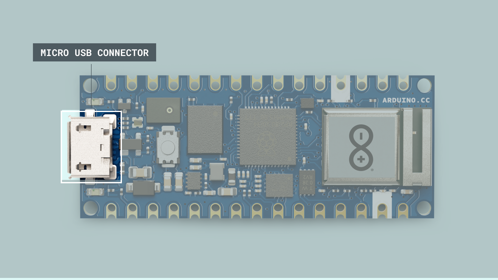
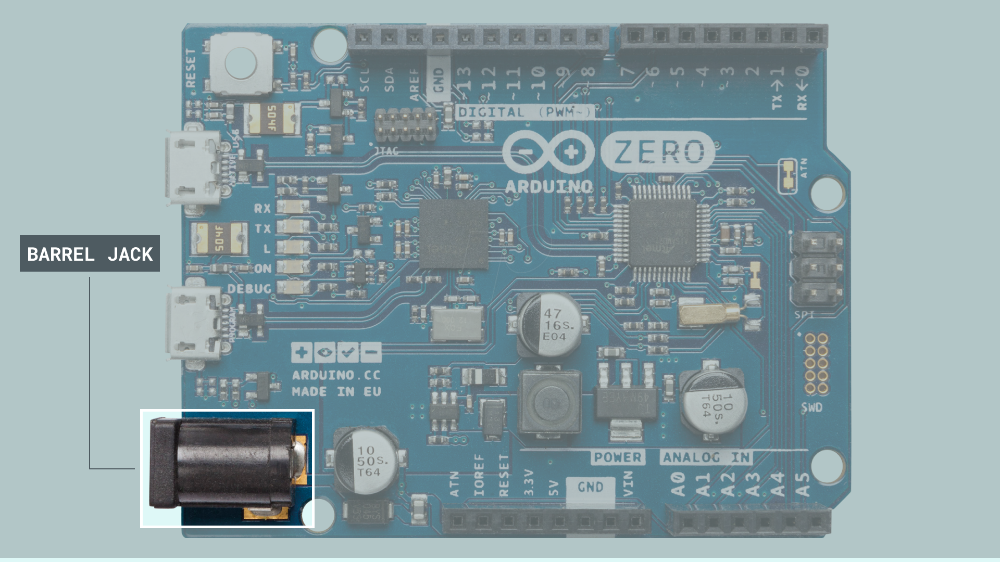
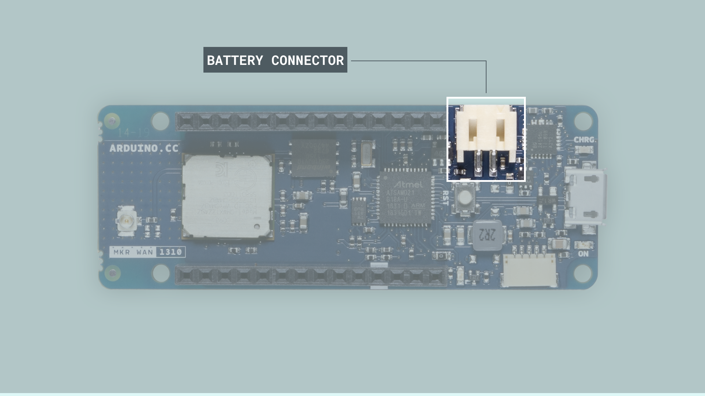

Arduino boards can be powered in several ways; we can use dedicated **connectors** (USB ports, barrel jacks or battery connectors) or dedicated **pins**. One fundamental question that usually arises when using an Arduino board in real-life applications is what dedicated power connector or pin we should use. This article will describe the main characteristics and correct use of power pins and connectors of Arduino boards.

## Powering Alternatives

Arduino boards have **five** options in which they can be powered:

1. Powering via USB connector

2. Powering via the onboard barrel jack connector (if available on the board)
   
3. Powering via the onboard battery connector (if available on the board)

4. Powering via the VIN (Voltage In) pin

5. Powering via the 3V3/5V pin*

***\*Powering your board via the 3V3/5V pins is not recommended, as it can damage your board's voltage regulator. Read more [here](#3v35v-pin).***

This article will examine these alternatives more in-depth.

## USB Connector

The most common and easiest way we can power an Arduino board is by using its **onboard USB connector**. The USB connector provides a regulated 5V line to power the board's electronics. However, **5V from the USB connector can also power external components through the 5V pin** that can be found in Arduino boards.

Something important about the USB connection is the current rating of the USB host device. For example, a USB host device can be a computer; this means that the computer's USB port is the 5V power source of the Arduino board connected to it. Besides USB ports of computers, we can also use power banks, for example, as power sources for Arduino boards. Power banks usually have one or more USB outputs that provide regulated 5V lines at different current ratings. Arduino boards that run at 5V use the USB-regulated 5V line directly, boards that run at 3V3 regulate the 5V line from the USB connector to 3V3 using their onboard voltage regulator. Output current rating from the 5V pin will vary, depending on the 5V power source.   

***Current from USB ports of computers is usually limited to 500mA.***

## Barrel Jack Connector

Some Arduino boards have an **onboard barrel jack connector** that is used to connect external power supplies. The Arduino boards with an onboard barrel jack connector are the following:

- [Arduino UNO Rev3](https://store.arduino.cc/collections/boards/products/arduino-uno-rev3)
- [Arduino UNO WiFi Rev2](https://store.arduino.cc/collections/boards/products/arduino-uno-wifi-rev2)
- [Arduino Leonardo](https://store.arduino.cc/collections/boards/products/arduino-leonardo-with-headers) 
- [Arduino Mega 2560 Rev3](https://store.arduino.cc/collections/boards/products/arduino-mega-2560-rev3)
- [Arduino Due](https://store.arduino.cc/collections/boards/products/arduino-due)
- [Arduino Zero](https://store.arduino.cc/collections/boards/products/arduino-zero)

***Arduino boards with onboard barrel jacks are configured with positive polarity; this means a negative sleeve and a positive pin. Boards with an onboard barreljack use a a negative 5.5mm sleeve and a 2.1mm positive pin***

The voltage line from the barrel jack connector is regulated in Arduino boards using their onboard voltage regulator; usually, it is first regulated to 5V and then regulated again to 3V3 in most Arduino boards. The **recommended voltage and current ratings for external regulated DC power supplies** connected to the barrel jack connector are summarized in the table below:

|        **Board**       | **External Power Supply Voltage (V)** | **External Power Supply Current (A)** |
|:----------------------:|:-------------------------------------:|:-------------------------------------:|
|    Arduino UNO Rev3    |                  7-12                 |                   1                   |
|  Arduino UNO WiFi Rev2 |                  7-12                 |                  1.5                  |
|    Arduino Leonardo    |                  7-12                 |                   1                   |
| Arduino Mega 2560 Rev3 |                  7-12                 |                   1                   |
|       Arduino Due      |                  7-12                 |                  1.5                  |
|      Arduino Zero      |                  5-18                 |                   1                   |

 ## Battery Connector

 Some Arduino boards have an **onboard battery connector** to connect a battery to the board and use it as its primary or secondary power supply. The Arduino boards with an onboard battery connector are the following:

-  [Arduino Portenta H7](https://store.arduino.cc/collections/boards/products/portenta-h7)
-  [Arduino Nicla Sense ME](https://store.arduino.cc/collections/boards/products/nicla-sense-me)
-  [Arduino Nicla Vision](https://store.arduino.cc/collections/boards/products/nicla-vision)
-  [Arduino MKR NB 1500](https://store.arduino.cc/collections/boards/products/arduino-mkr-nb-1500)
-  [Arduino MKR Vidor 4000](https://store.arduino.cc/collections/boards/products/arduino-mkr-vidor-4000)
-  [Arduino MKR WiFi 1010](https://store.arduino.cc/collections/boards/products/arduino-mkr-wifi-1010)
-  [Arduino MKR ZERO](https://store.arduino.cc/collections/boards/products/arduino-mkr-zero-i2s-bus-sd-for-sound-music-digital-audio-data)
-  [Arduino MKR WAN 1310](https://store.arduino.cc/collections/boards/products/arduino-mkr-wan-1310)
-  [Arduino MKR GSM 1400](https://store.arduino.cc/collections/boards/products/arduino-mkr-gsm-1400)

***Pro family boards use a 3-pin, 1.2mm SMD ACH battery connector; MKR family boards use a 2-pin, 2mm SMD PH battery connector.***

The boards mentioned before have an **onboard integrated battery charge management circuit**. This circuit integrates the most common battery and power management functions, like a battery charger, a voltage regulator, and a load switch, all in one. 

***Arduino boards with an onboard battery connector can work with single cell 3V7 Li-Ion and Li-polymer batteries***. 

 ## VIN Pin

The VIN pin in Arduino boards is a power pin with a dual function. This pin can work as a **voltage input for regulated external power supplies** that do not use a barrel jack connector. This pin can also work as a **voltage output when an external power supply is connected to the barrel jack connector** present in some Arduino boards. An important consideration is that the VIN pin is connected directly to the input pin of the onboard voltage regulator on Arduino boards. Since the VIN pin is directly connected to the voltage regulator, the **VIN pin does not have reverse polarity protection**. 

***Use the VIN pin carefully to avoid damaging your Arduino board since it does not have reverse polarity protection.***

The **minimum and maximum voltages** that can be applied to the VIN pin are determined by the onboard voltage regulator on Arduino boards, varying from board to board. Those voltages are summarized in the table below:

|      **Board**      | **VIN Voltage (V)** |
|:-------------------:|:-------------------:|
|       UNO Mini      |         5-18        |
|       UNO Rev3      |         7-12        |
|    UNO WiFi Rev2    |         7-12        |
|     UNO Rev3 SMD    |         7-12        |
|       Leonardo      |         7-12        |
|    Mega 2560 Rev3   |         7-12        |
|         Due         |         7-12        |
|        Micro        |         7-12        |
|         Zero        |         5-18        |
|     Portenta H7     |          5          |
|    Nicla Sense ME   |          5          |
| Nano RP2040 Connect |         5-18        |
|     MKR NB 1500     |         5-7         |
|     MKR GSM 1400    |         5-7         |
|    MKR Vidor 4000   |         5-7         |
|    MKR WiFi 1010    |         5-7         |
|       MKR Zero      |        5-5.5        |
|     MKR1000 WIFI    |        5-5.5        |
|     MKR WAN 1300    |        5-5.5        |
|     MKR WAN 1310    |         5-7         |
|         Nano        |         7-12        |
|      Nano Every     |         7-18        |
|     Nano 33 IoT     |         5-18        |
|     Nano 33 BLE     |         5-18        |
|  Nano 33 BLE Sense  |         5-18        |

## 3V3/5V Pin 

3V3 and 5V pins are also power pins with a dual function. They can work as **power outputs** since these pins are directly connected to the onboard 3V3 and 5V voltage regulators outputs (depending on the board). Moreover, 3V3 and 5V pins can also be used as **power inputs if no regulated power supply is connected through the other power inputs (USB port, barrel jack connector or VIN pin)**.

***Since 3V3 and 5V pins are directly connected to the onboard's 3V3 and 5V voltage regulators outputs, these pins have no reverse polarity protection. Use them carefully when working as power inputs to avoid damaging your board's voltage regulator.***

Although 3V3 and 5V pins can be used as power inputs, **it is not recommended** if no power supply is connected through the USB port, the barrel jack connector, or the VIN pin. 3V3 and 5V pins are connected directly to the onboard voltage regulator's output pin. Suppose the voltage in the voltage regulator output pin becomes higher than the input voltage of the voltage regulator. In that case, a large current may flow into the voltage regulator from its output pin to its input pin. That large current can permanently damage your board's voltage regulator.

***It is safe **but not recommended** to apply a voltage to the 3V3 or 5V pins that are not higher than the input voltage of the voltage regulators.*** 

The **maximum current** that can be drawn from the 3V3 and 5V pins when working as power outputs are summarized below. Notice that these currents can be provided by the 3V3 and 5V onboard voltage regulators, or from the power source connected to the board:

|      **Board**      | **5V Pin Output Current (A)** | **3V3 Pin Output Current (A)** |
|:-------------------:|:-----------------------------:|:------------------------------:|
|       UNO Mini      |               1               |               0.5              |
|       UNO Rev3      |               1               |              0.15              |
|    UNO WiFi Rev2    |               1               |               0.5              |
|     UNO Rev3 SMD    |               1               |              0.15              |
|       Leonardo      |               1               |              0.15              |
|    Mega 2560 Rev3   |              0.8              |              0.05              |
|        Micro        |               1               |              0.15              |
|         Zero        |               1               |               0.5              |
|     Portenta H7     |               -               |                1               |
|   Nicla Sense ME*   |               -               |               0.5              |
| Nano RP2040 Connect |               -               |                1               |
|     MKR NB 1500     |               -               |               0.5              |
|    MKR Vidor 4000   |               1               |               0.3              |
|    MKR WiFi 1010    |               1               |               0.5              |
|       MKR Zero      |               -               |               0.5              |
|     MKR1000 WIFI    |               -               |               0.5              |
|     MKR WAN 1300    |               -               |               0.5              |
|     MKR WAN 1310    |               -               |               0.5              |
|         Nano        |              0.8              |              0.15              |
|      Nano Every     |               1               |               0.5              |
|     Nano 33 IoT     |               1               |               0.5              |
|     Nano 33 BLE     |               -               |                1               |
|  Nano 33 BLE Sense  |               -               |                1               |

## Choosing a Power Input

Now that we know more about the powering alternatives of Arduino boards, we can answer that question we made at the beginning of this article about what power connector or pin we should use. When choosing a power connector or pin for a specific application or project, we should consider the **available power source** and the **power budget** of our application or project.

***A power budget analyzes how much power our application or project requires for its correct working.***

Let's talk about when it is recommended to use each of the **options** ways in which Arduino boards can be powered:

### USB Connector

This option is often recommended when experimenting with small loads that require 5V; the current would be constrained by the USB host device where the board is connected.

### Barrel Jack Connector

This option is recommended when a regulated power supply with a barrel jack connector is available. Current is constrained by the regulated power supply and the onboard voltage regulator. 

### Battery Connector

This option is recommended for portable projects or projects that need a secondary o backup power supply. Currently, 3V7 Li-Ion and Li-polymer batteries are supported only; the battery's capacity constrains current. 

### VIN Pin

This option is recommended when a regulated power supply without a barrel jack connector is available. Take into account that using VIN pin should be made carefully since this pin does not have reverse polarity protection. Current is constrained by the regulated power supply and the onboard voltage regulator. 

### 3V3/5V Pin 

**Avoid this option** since the risk of damaging the onboard voltage regulator is high. It can be done safely if the applied voltage to the 3V3 or 5V pins is not higher than the input voltage of the voltage regulators.

## Further Reading and Resources

If you want to learn more about power supplies, check out the following links: 

- Power supplies are one of the most popular and most needed electronic testing equipment. Check out more about them in [this](https://www.bkprecision.com/support/downloads/power-supply-guide.html) guide from BK Precision®.
- LiPo batteries are everywhere. Check out [this](https://rogershobbycenter.com/lipoguide) guide from Roger's Hobby Center to learn more about LiPo batteries. 