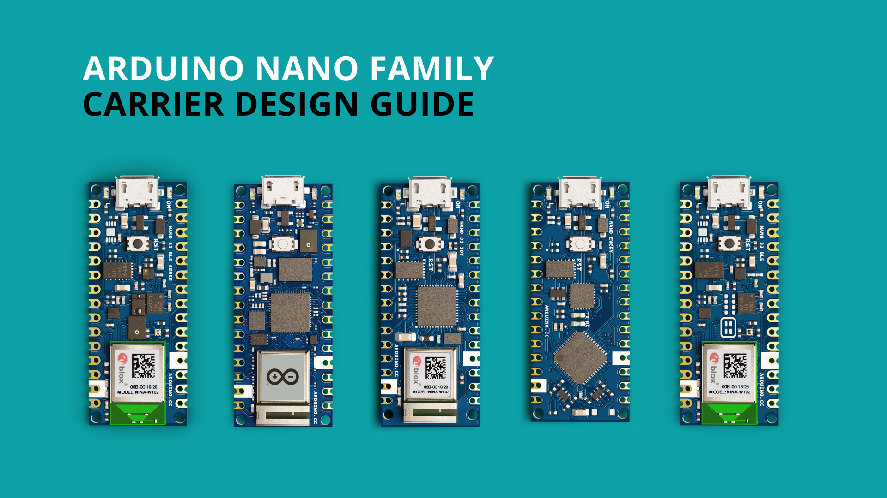
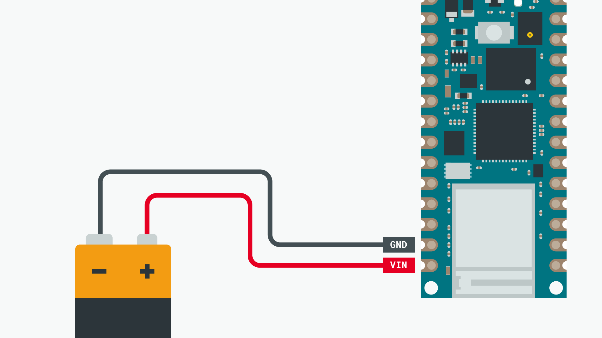

The Arduino Nano Family is a series of boards with a tiny footprint. This guide is dedicated to you who wants to design your own customized hardware for the Nano Family. 

This article aims to provide you with technical information that will aid the design of your own customized Nano hardware.

## Documentation

Each Nano Family board has a dedicated documentation page, see the list below:

- [Nano (classic)](/hardware/nano)
- [Nano Every](/hardware/nano-every)
- [Nano 33 BLE](/hardware/nano-33-ble)
- [Nano 33 BLE Sense](/nano-33-ble-sense)
- [Nano 33 IoT](/nano-33-iot)
- [Nano RP2040 Connect](/hardware/nano-rp2040-connect)

Inside the documentation page, you will find design files such as full pinout, CAD and Fritzing files. You will also find tutorials and compatible libraries with the respective boards in this page.

## Technical Overview

### Dimensions

The following dimensions apply to all of the Nano

| Format | Measurement |
| ------ | ----------- |
| Width  | 18 mm       |
| Length | 45 mm       |
| Pitch\*  | 2.54 mm     |

***\*Pitch is the space between the pins (e.g. between A1, A2. This specification is important when choosing header pins.***

### Feature Comparisons

Below is a comparison between the different Nano Family boards. 

| Board        | Nano          | Nano Every     | Nano 33 BLE  | Nano 33 BLE Sense | Nano 33 IoT       | Nano RP2040 Connect |
| ------------ | ------------- | -------------- | ------------ | ----------------- | ----------------- | ------------------- |
| Processor    | **ATmega328** | **ATmega4809** | **nRF42840** | **nRF42840**      | **SAMD21G18A**    | **RP2040**          |
| Radio Module | x             | x              | NINA-B306    | NINA-B306         | NINA-W102         | NINA-W102           |
| Connectivity | x             | x              | Bluetooth®   | Bluetooth®        | Wi-Fi, Bluetooth® | Wi-Fi, Bluetooth®   |
| Clock Speed  | 16 Mhz        | 16 Mhz         | 64 Mhz       | 64 Mhz            | 48 Mhz            | 133 MHz             |
| Flash Memory | 32 KB         | 48 KB          | 256 KB       | 256 KB            | 264 KB            | 16 MB               |
| SRAM         | 2 KB          | 6 KB           | 1 MB         | 1 MB              | 256 KB            | 16 MB               |
| EEPROM       | 1 KB          | 256 byte       | x            | x                 | x                 | x                   |
| I/O Voltage  | 5V            | 5V             | 3.3V         | 3.3V              | 3.3V              | 3.3V                |

There are several embedded sensors on the Nano boards, which can be seen below:

| Board       | Nano | Nano Every | Nano 33 BLE | Nano 33 BLE Sense | Nano 33 IoT | Nano RP2040 Connect |
| ----------- | ---- | ---------- | ----------- | ----------------- | ----------- | ------------------- |
| IMU         | x    | x          | **LSM9DS1** | **LSM9DS1**       | **LSM6DS3** | **LSM6DSOX**        |
| Microphone  | x    | x          | x           | **MP34DT05**      | x           | **MP34DT05**        |
| Gesture     | x    | x          | x           | **APDS-9960**     | x           | x                   |
| Light       | x    | x          | x           | **APDS-9960**     | x           | x                   |
| Color       | x    | x          | x           | **APDS-9960**     | x           | x                   |
| Pressure    | x    | x          | x           | **LPS22HB**       | x           | x                   |
| Temperature | x    | x          | x           | **HTS221**        | x           | x                   |
| Humidity    | x    | x          | x           | **HTS221**        | x           | x                   |

## Power Considerations

### Voltage (3.3V / 5V)

It is important to understand that the Nano family boards operates on different voltage. Any board with a radio module (Nano 33 BLE, Nano 33 BLE Sense, Nano 33 IoT, Nano RP2040 Connect) operates on **3.3V**. The Nano (classic), and Nano Every operates on **5V**.

As the boards with radio modules operate on 3.3V logic, the 5V pin is disabled by default. When powering the board via USB, the VIN pin can instead be used as a 5V pin. This is useful when powering circuits requiring 5V.

### VUSB Pads

The 5V pin is also referred to as **"VUSB"**. The purpose of this pin is to power devices connected to the board via USB. To enable it, you will need to solder together the VUSB pads on the bottom of the board, as shown in the image below:

***If you solder the VUSB pads, and then power the board via USB, it also enables the 5V pin to be used. Be very cautios with this, as you risk damaging your board's ICs.***

### VIN Min/Max

The min/max voltage supply varies between boards. This is important to consider when choosing the battery source, that you do not exceed the limits to damage the board. 

| Nano  | Nano Every | Nano 33 BLE | Nano 33 BLE Sense | Nano 33 IoT | Nano RP2040 Connect |
| ----- | ---------- | ----------- | ----------------- | ----------- | ------------------- |
| 7-12V | 7-18V      | 5-18V       | 5-18V             | 5-18V       | 5-18V               |

### Battery Connection

None of the Nano Family boards have a battery connector due to its small form factor. This means it also has no battery charging circuit, such as the one onboard the [MKR WiFi 1010](https://store.arduino.cc/arduino-mkr-wifi-1010).

To power the Nano board using a battery, you will need to use the VIN pin (refer to the table in the section above).

Note that Nano boards does not have a battery protection circuit, meaning it will continue to drain the battery even when it is below the discharge value, which can damage the battery. This issue can be addressed by using a battery with a built in battery protection circuit.

## Pinout

Nano boards largely share the placement of many pins, to make it easy for accessories to be designed for different Nano boards.

### Serial Buses

The Nano Family boards have serial buses attached to the following pins:

| Protocol | Pins                        |
| -------- | --------------------------- |
| UART     | RX,TX                       |
| SPI      | COPI(11), CIPO(12), SCK(13) |
| I²C      | SDA(A4), SCL(A5)            |

The location of these pins are located in the pinout for each board. These are found in the **Resources Section** product page of each board.

## Nano Form Factor Design Files

### PCB

Below are template files for creating your custom **Printable Circuit Board (PCB)**.

- [Nano Carrier PCB template (solder pads)](/resources/cad/NanoCarrier_SolderPads.zip) - an empty carrier template with solder pads. This is useful if you want to create a design where you solder the Nano directly on top of the PCB.
- [Nano Carrier PCB template (connectors)](/resources/cad/NanoCarrier_Socket.zip) - an empty carrier template with connectors. This is useful if you want to create a design where you can attach and remove a Nano board easily.

The files can be used together with various PCB design programs, such as [Altium](https://www.altium.com/) and [Eagle](https://www.autodesk.com/products/eagle/free-download) to create your own Nano accessories.

### 3D Files

The design file(s) below can be used for 3D printing, e.g. enclosures, mounts.

- [Nano Board Enclosure (.stl)](/resources/3d/nano-enclosure.stl)
- [Nano Board Enclosure (.stp)](/resources/3d/nano-enclosure.stp)

## Soldering Directly To PCB

All Nano boards can be purchased **without headers attached.** This makes it possible to solder it directly to a custom PCB, using the castellated holes on the board. 

This method is useful for more robust applications, where the Nano board needs to be permanently attached.

***Do not attempt to solder any Arduino Nano boards using the SMT (Surface Mount Technology) method. Since Arduino boards are shipped without anti-static bags, the board may absorb humidity which will cause issues during the SMT process. Boards should always be soldered manually.***