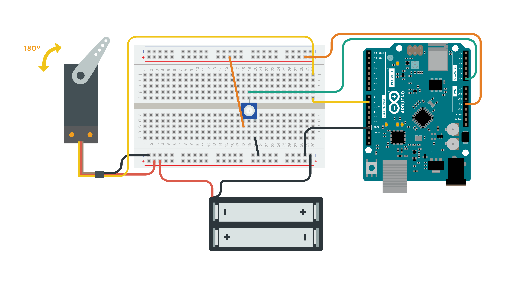

This is a guide for creating clear Arduino approved screenshots, circuit diagrams and schematics for your contributed content. This can be read and used for beginners and advanced users alike. This is not a set of hard and fast rules, it's a set of guidelines. Some of these guidelines might even conflict with each other. Use your judgment on when they're best followed, and if you're not sure, ask someone who'll be learning from what you write what makes the most sense. You might also be interested in the [Writing Style Guide](/content/hacking/01.software/ArduinoStyleGuide) and [Writing Libraries](/content/hacking/01.software/LibraryTutorial) for Arduino.

This tutorial will focus on creating **circuit diagrams**, **schematics** and **screenshots** for your contributed content.

## Creating images

- Don't over-use images.
- Format images to be 1920x1080
- 

### Suggested creation platforms

- Fritzing
- Figma
- 

## Image styles

### Circuit Diagrams

**Circuit diagrams** represent how Arduino products work with components in order to function. 

**Basic rules**

* Rounded wire corners are to be done in increments of 8. eg 8,16,32.
* Try to avoid wires crossing if possible, to make the circuit look tidy and keep the breadboard clear of wires.

**Wire colors**

|Color|Code|
|-----|----|
|Bronze|#9E826D|
|Teal|#008184|
|Sunflower|#F1C40F|
|Red|#FF0000|
|Green|#72D075|
|Black|#000000|
|Blue|#1D71B8|
|Orange|#F1970F|

### Schematics

A **schematic** is a stylized electronic diagram explaining electric circuits.

Standard circuit diagrams or schematics are non stylised and are used primarily by hardware engineers and programmers internally. An example of this can be seen below.

The schematics for the Arduino Documentation website however are a bit more simple.

**Basic rules**

* The wires should be colored with brown (#9E826D) color.
* Try to avoid wires crossing if possible, to make the circuit look tidy and keep the breadboard clear of wires.

### Screenshots

**Screenshots** are most often used to show the program in the Arduino IDE or any other chosen software.

