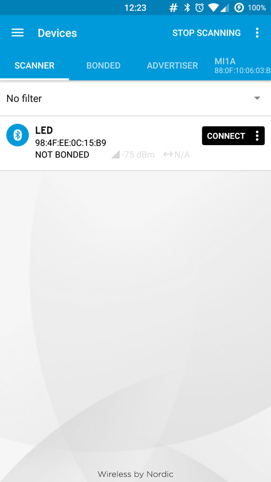
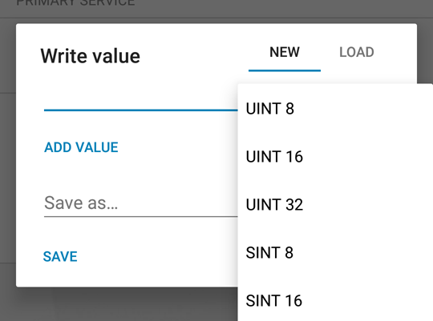
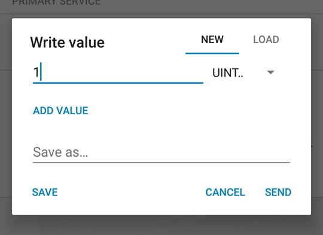

With this tutorial you use the Arduino 101's onboard Bluetooth® Low Energy capabilities to turn on and of the LED connected to Pin 13 from a smartphone or tablet. You create a LED service and keep reading the Bluetooth® Low Energy central, looking for a writing event of the characteristic associated with the LED you want to control. This tutorial is similar to the [Callback LED](https://www.arduino.cc/en/Tutorial/Genuino101CurieBLECallbackLED) where the change is managed by polling and callback functions. The values are sent using nRF Master Control Panel (BLE) app, available for Android and iOS.

## Hardware Required

- [Arduino 101](https://www.arduino.cc/en/Main/ArduinoBoard101)
- Smartphone or Tablet Android or iOS

## Software Required

- nRF Master Control Panel (BLE) for [Android](https://play.google.com/store/apps/details?id=no.nordicsemi.android.mcp&amp;hl=en) and [iOS](https://itunes.apple.com/us/app/nrf-master-control-panel-ble/id1054362403?mt=8)

## The Circuit


image developed using [Fritzing](http://www.fritzing.org).

## Software Essentials

### Libraries

*CurieBLE.h* is the library that gives access to all the parameters, features and functions of the Bluetooth® Low Energy module of the 101 board. With Bluetooth® Low Energy it is possible to connect to and communicate with smartphones, tablets and peripherals that support this standard. In this tutorial it is used to establish a connection with a control application on the smartphone and get the value used to turn on or off a LED.

### Functions

None

## On the Smartphone

To drive the onboard LED of Arduino 101, you need the nRF Master Control Panel (BLE) for [Android](https://play.google.com/store/apps/details?id=no.nordicsemi.android.mcp&amp;hl=en) and [iOS](https://itunes.apple.com/us/app/nrf-master-control-panel-ble/id1054362403?mt=8). Launch it and do a SCAN. You should find the **LED** tab with a *connect* button.



Tap on *connect* to open the following screen, where you find the description of our Bluetooth® Low Energy service offered by the 101 board. The unknown service has a UUID 19B10000-E8F2-537E-4F6C-D104768A1214 and it is set by the `BLEService ledService("19B10000-E8F2-537E-4F6C-D104768A1214");` statement at the beginning of the sketch.


Tap the **Unknown Service** to open up its characteristic, as shown below. It includes properties that can be written with a Write Request. you also find two icons on the right of the Unknown Characteristic. The arrow pointing down means *read*, the other means *write*.


Tap the arrow pointing up to open the **Write value** popup, then set the data type to *UINT 8*



Now tap on the line to write your chosen value (either "0" or "1"). As soon as you tap on *send* the value is sent to the 101 board and the LED instantly changes accordingly.



## Code

In this sketch you use the setup() to initialise and configure the Bluetooth® Low Energy peripheral. You start setting device name to LED, and configuring service UUID:

`blePeripheral.setLocalName("LED");`
`blePeripheral.setAdvertisedServiceUuid(ledService.uuid());`
Then you configure the Bluetooth® Low Energy service, and add switch characteristics (which is used to control the LED):

`blePeripheral.addAttribute(ledService);`
`blePeripheral.addAttribute(switchCharacteristic);`
You set switch characteristics value to 0 (default - LED off):

`switchCharacteristic.setValue(0);`
And finally you begin advertising the Bluetooth® Low Energy service that was set up in the previous steps:

`blePeripheral.begin();`

In the loop() you check the connection with a Bluetooth® Low Energy central and if connected you check if switch characteristic was written, and if so you read its value and set the LED state accordingly.

```arduino
/*

 * Copyright (c) 2016 Intel Corporation.  All rights reserved.

 * See the bottom of this file for the license terms.

 */

#include <CurieBLE.h>

BLEPeripheral blePeripheral;  // Bluetooth® Low Energy Peripheral Device (the board you're programming)

BLEService ledService("19B10000-E8F2-537E-4F6C-D104768A1214"); // BLE LED Service

// BLE LED Switch Characteristic - custom 128-bit UUID, read and writable by central

BLEUnsignedCharCharacteristic switchCharacteristic("19B10001-E8F2-537E-4F6C-D104768A1214", BLERead | BLEWrite);

const int ledPin = 13; // pin to use for the LED

void setup() {

  Serial.begin(9600);

  // set LED pin to output mode

  pinMode(ledPin, OUTPUT);

  // set advertised local name and service UUID:

  blePeripheral.setLocalName("LED");

  blePeripheral.setAdvertisedServiceUuid(ledService.uuid());

  // add service and characteristic:

  blePeripheral.addAttribute(ledService);

  blePeripheral.addAttribute(switchCharacteristic);

  // set the initial value for the characeristic:

  switchCharacteristic.setValue(0);

  // begin advertising BLE service:

  blePeripheral.begin();

  Serial.println("BLE LED Peripheral");
}

void loop() {

  // listen for Bluetooth® Low Energy peripherals to connect:

  BLECentral central = blePeripheral.central();

  // if a central is connected to peripheral:

  if (central) {

    Serial.print("Connected to central: ");

    // print the central's MAC address:

    Serial.println(central.address());

    // while the central is still connected to peripheral:

    while (central.connected()) {

      // if the remote device wrote to the characteristic,

      // use the value to control the LED:

      if (switchCharacteristic.written()) {

        if (switchCharacteristic.value()) {   // any value other than 0

          Serial.println("LED on");

          digitalWrite(ledPin, HIGH);         // will turn the LED on

        } else {                              // a 0 value

          Serial.println(F("LED off"));

          digitalWrite(ledPin, LOW);          // will turn the LED off

        }

      }

    }

    // when the central disconnects, print it out:

    Serial.print(F("Disconnected from central: "));

    Serial.println(central.address());

  }
}

/*

   Copyright (c) 2016 Intel Corporation.  All rights reserved.

   This library is free software; you can redistribute it and/or

   modify it under the terms of the GNU Lesser General Public

   License as published by the Free Software Foundation; either

   version 2.1 of the License, or (at your option) any later version.

   This library is distributed in the hope that it will be useful,

   but WITHOUT ANY WARRANTY; without even the implied warranty of

   MERCHANTABILITY or FITNESS FOR A PARTICULAR PURPOSE.  See the GNU

   Lesser General Public License for more details.

   You should have received a copy of the GNU Lesser General Public

   License along with this library; if not, write to the Free Software

   Foundation, Inc., 51 Franklin Street, Fifth Floor, Boston, MA  02110-1301  USA

*/
```

*Last revision 2016/04/05*