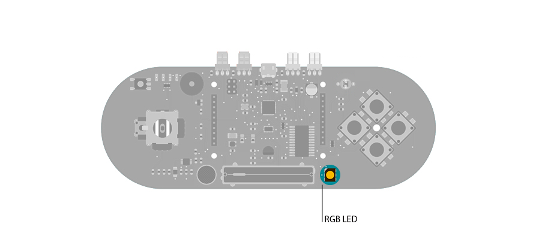

## Esplora Blink

This sketch blinks the Esplora's RGB LED. It goes through all three primary colors (red, green, blue), then it  combines them for secondary colors(yellow, cyan, magenta), then it turns on all the colors to create white.

For best results, cover the LED with a piece of white paper to see the colors blend.

## Hardware Required

- Arduino Esplora

## Circuit

Only your Arduino Esplora is needed for this example. Connect the Esplora to your computer with a USB cable.



 

## Code

The RGB LED is comprised of three colors that represent the three primary colors: red, green, and blue.

To control all the colors with one instruction you use the [writeRGB()](https://www.arduino.cc/en/Reference/EsploraWriteRGB) function. It take three arguments. Each value represents the brightness of the red, green, and blue element, respectively. The brightness scales between 0 (for completely off) to 255 (for completely on).

After setting the brightness of an LED, use [delay()](https://www.arduino.cc/en/Reference/Delay) to pause the sketch for a second, so the light stays in the state you left it.

It's also possible to control each light individually with the following functions :

- [writeRed()](https://www.arduino.cc/en/Reference/EsploraWriteRed)
- [writeGreen()](https://www.arduino.cc/en/Reference/EsploraWriteRed)
- [writeBlue()](https://www.arduino.cc/en/Reference/EsploraWriteRed)

```arduino

/*

  Esplora Blink

 This  sketch blinks the Esplora's RGB LED. It goes through

 all three primary colors (red, green, blue), then it

 combines them for secondary colors(yellow, cyan, magenta), then

 it turns on all the colors for white.

 For best results cover the LED with a piece of white paper to see the colors.

 Created on 22 Dec 2012

 by Tom Igoe

 This example is in the public domain.

 */

#include <Esplora.h>

void setup() {

  // There's nothing to set up for this sketch
}

void loop() {

  Esplora.writeRGB(255, 0, 0);  // make the LED red

  delay(1000);                  // wait 1 second

  Esplora.writeRGB(0, 255, 0);  // make the LED green

  delay(1000);                  // wait 1 second

  Esplora.writeRGB(0, 0, 255);  // make the LED blue

  delay(1000);                  // wait 1 second

  Esplora.writeRGB(255, 255, 0); // make the LED yellow

  delay(1000);                  // wait 1 second

  Esplora.writeRGB(0, 255, 255); // make the LED cyan

  delay(1000);                  // wait 1 second

  Esplora.writeRGB(255, 0, 255); // make the LED magenta

  delay(1000);                  // wait 1 second

  Esplora.writeRGB(255, 255, 255); // make the LED white

  delay(1000);                  // wait 1 second

}
```
