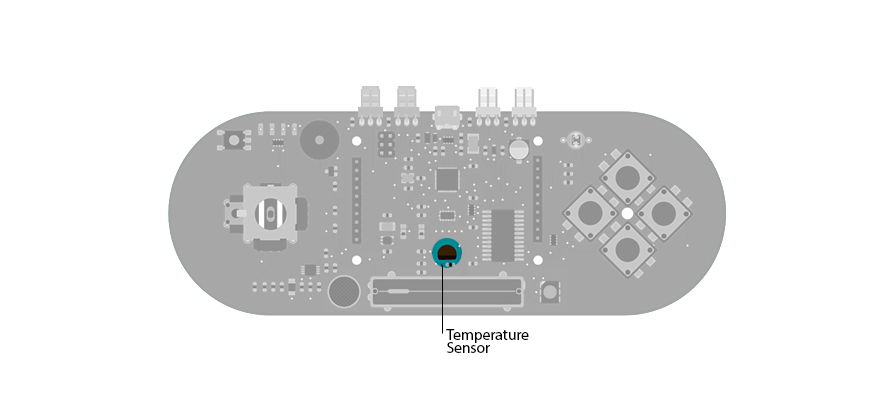

## Esplora Temperature Sensor

This  sketch shows you how to read  the Esplora's temperature sensor. You can read the temperature sensor in Farhenheit or Celsius.

## Hardware Required

- Arduino Esplora

## Circuit

Only your Arduino Esplora is needed for this example. Connect the Esplora to your computer with a USB cable and open the Arduino's Serial Monitor.



 

## Code

To send data to your computer, you need to open a serial connection. use [Serial.begin](/en/Serial/Begin)() to open a serial port at 9600 baud on the Esplora.

The [Esplora.readTemperature](https://www.arduino.cc/en/Reference/EsploraReadTemperature)() function gets the value from the temperature sensor. It will give you the temperature in degrees Celsius or degrees Fahrenheit, depending on your choice. It takes one parameter, DEGREES_C for Celsius or DEGREES_F for Fahrenheit.

To send the values to the Serial Monitor, you call [Serial.print](/en/Serial/Print)(). When the Esplora is connected, and the Serial Monitor is open, you should start to see values reported like this:

```arduino
Temperature is: 22 degrees Celsius, or 72 degrees Fahrenheit.
Fahrenheit = (9/5 * Celsius) + 32
Temperature is: 21 degrees Celsius, or 72 degrees Fahrenheit.
Fahrenheit = (9/5 * Celsius) + 32
```

```arduino

/*

  Esplora Temperature Sensor

 This  sketch shows you how to read the Esplora's temperature sensor

 You can read the temperature sensor in Farhenheit or Celsius.

 Created on 22 Dec 2012

 by Tom Igoe

 This example is in the public domain.

 */
#include <Esplora.h>

void setup() {

  Serial.begin(9600);      // initialize serial communications with your computer
}

void loop() {

  // read the temperature sensor in Celsius, then Fahrenheit:

  int celsius = Esplora.readTemperature(DEGREES_C);

  int fahrenheit = Esplora.readTemperature(DEGREES_F);

  // print the results:

  Serial.print("Temperature is: ");

  Serial.print(celsius);

  Serial.print(" degrees Celsius, or ");

  Serial.print(fahrenheit);

  Serial.println(" degrees Fahrenheit.");

  Serial.println("     Fahrenheit = (9/5 * Celsius) + 32");

  // wait a second before reading again:

  delay(1000);
}
```
