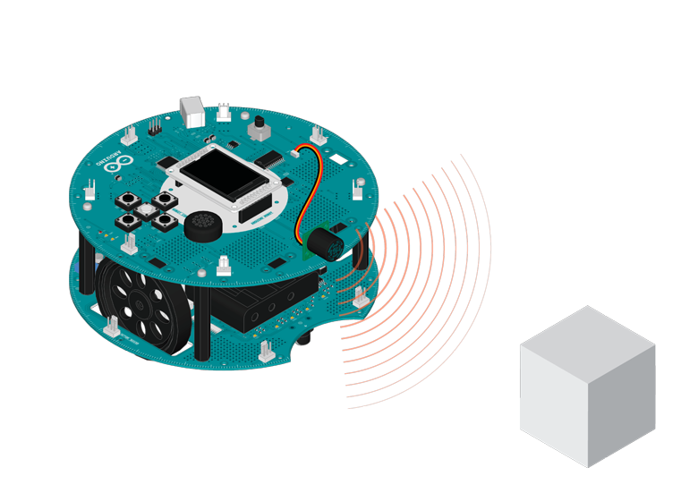

## Runaway Robot

Is your robot bumping into walls? This quickly solves that problem. By attaching a ultrasonic rangefinder, the robot can find out if it's too close to obstacles, and turn around to avoid collision.

## Hardware Required

- Arduino Robot

- ultrasonic rangefinder

- cable to plug the Ultrasonic sensor

## Instruction

1. Connect the Ultrasonic ranger to TK1
2. Fix the sensor to the front of the robot

3. Upload the example, unplug USB and turn on power

4. Put the robot on the floor

5. The robot will move around, avoiding obstacles in front of it

6. If you want to change the detection range, in the code below, find the line @@while (getDistance()<20)**, 20 here means 20cm; change it to another value to try out other sensitivities.

7. You can also change the robot speed, look at motorWrite() for a hint on how to do that.

## Try it out




## Code

```arduino

/* Runaway Robot

 Play tag with your robot! With an ultrasonic

 distance sensor, it's capable of detecting and avoiding

 obstacles, never bumping into walls again!

 You'll need to attach an untrasonic range finder to M1.

 Circuit:

 * Arduino Robot

 * US range finder like Maxbotix EZ10, with analog output

 created 1 May 2013

 by X. Yang

 modified 12 May 2013

 by D. Cuartielles

 This example is in the public domain

 */

// include the robot library
#include <ArduinoRobot.h>
#include <Wire.h>

int sensorPin = M1;  // pin is used by the sensor

void setup() {

  // initialize the Robot, SD card, and display

  Serial.begin(9600);

  Robot.begin();

  Robot.beginTFT();

  Robot.beginSD();

  Robot.displayLogos();

  // draw a face on the LCD screen

  setFace(true);
}

void loop() {

  // If the robot is blocked, turn until free

  while (getDistance() < 40) { // If an obstacle is less than 20cm away

    setFace(false); //shows an unhappy face

    Robot.motorsStop(); // stop the motors

    delay(1000); // wait for a moment

    Robot.turn(90); // turn to the right and try again

    setFace(true); // happy face

  }

  // if there are no objects in the way, keep moving

  Robot.motorsWrite(255, 255);

  delay(100);
}

// return the distance in cm
float getDistance() {

  // read the value from the sensor

  int sensorValue = Robot.analogRead(sensorPin);

  //Convert the sensor input to cm.

  float distance_cm = sensorValue * 1.27;

  return distance_cm;
}

// make a happy or sad face
void setFace(bool onOff) {

  if (onOff) {

    // if true show a happy face

    Robot.background(0, 0, 255);

    Robot.setCursor(44, 60);

    Robot.stroke(0, 255, 0);

    Robot.setTextSize(4);

    Robot.print(":)");

  } else {

    // if false show an upset face

    Robot.background(255, 0, 0);

    Robot.setCursor(44, 60);

    Robot.stroke(0, 255, 0);

    Robot.setTextSize(4);

    Robot.print("X(");

  }
}
```

