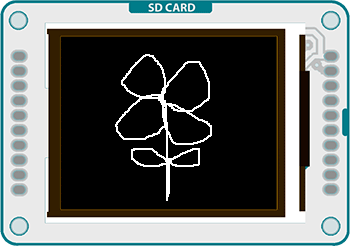
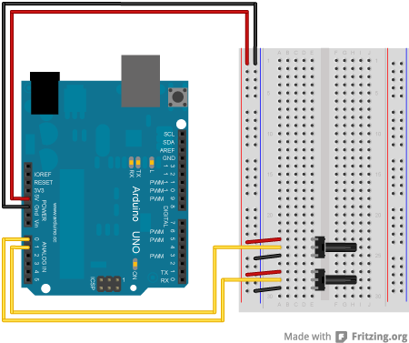
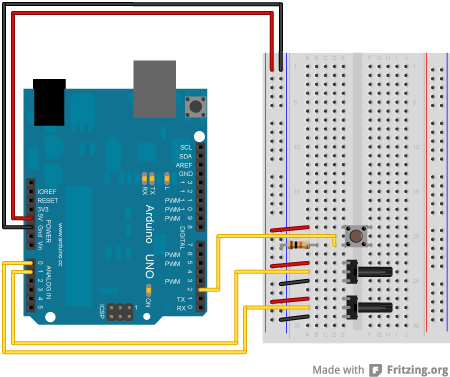
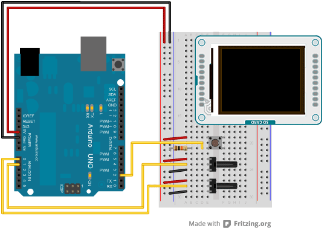

## TFT EtchASketch



This example for the Arduino TFT draws a white line on the screen, based on the position of 2 potentiometers. If you press a momentary button, the screen will erase.

## Hardware Required

- Arduino Uno

- Arduino TFT screen

- breadboard

- hookup wire

- two 10-kilohm potentiometers

- momentary switch

- 10-kilohm resistor

## Circuit

Connect power and ground to the breadboard.


Place the potentiometers on the breadboard. On each pot, connect one side to ground, and the other to power. Connect the middle pin of one potentiometer to A0, the other one to A1.



Put a switch across the center of the breadboard. Connect one end to power, the other end to the Arduino digital pin 2. Connect the same pin to ground through a 10-kilohm pull-down resistor



Connect the screen to the breadboard. The headers on the side of the screen with the small blue tab and arrow should be the ones that attach to the board. Pay attention to the orientation of the screen, in these images, it is upside down.



Connect the BL and +5V pins to power, and GND to ground. Connect CS-LD to pin 10, DC to pin 9, RESET to pin 8, MOSI to pin 11, and SCK to pin 13. If uyou're using a Leonardo, you'll be using different pins. see the [getting started page](arduino.cc/en/Guide/TFT) for more details.


Click the image for a larger version

## Code

To use the screen you must first include the SPI and TFT libraries.

```arduino
#include <SPI.h>
#include <TFT.h>
```

Define the pins you're going to use for controlling the screen, and create an instance of the TFT library named `TFTscreen`. You'll reference that object whenever you're working with the screen.

```arduino
#define cs   10
#define dc   9
#define rst  8

TFT TFTscreen = TFT(cs, dc, rst);
```

Set up the cursor's x & y position. In the example, it starts in the center of the screen; determined by dividing the height and width of the screen by 2. Create a named pin for your erase switch.

```arduino
int xPos = LCDscreen.width()/2;
int yPos = LCDscreen.height()/2;

int erasePin = 2;
```

In `setup()`, after declaring the erase pin as an input, initialize the display and clear the screen's background.

```arduino
void setup() {

  pinMode(erasePin, INPUT);

  TFTscreen.begin();

  TFTscreen.background(0,0,0);
}
```

Read the values of the pots and map them to smaller numbers.

```arduino
void loop()
{

  int xValue = analogRead(A0);

  int yValue = analogRead(A1);

  xPos = xPos + (map(xValue, 0, 1023, 2, -2));

  yPos = yPos + (map(yValue, 0, 1023, -2, 2));
```

You'll want to keep the cursor from moving offscreen with a few `if()` statements before you draw the point.

```arduino
if(xPos > 159){

    (xPos = 159);

  }

  if(xPos < 0){

    (xPos = 0);

  }

  if(yPos > 127){

    (yPos = 127);

  }

  if(yPos < 0){

    (yPos = 0);

  }

  TFTscreen.stroke(255,255,255);

  TFTscreen.point(xPos,yPos);
```

Finally, check the button. If it is being pressed and is `HIGH`, clear the screen with `background()`.

```arduino
if(digitalRead(erasePin) == HIGH){

    TFTscreen.background(0,0,0);

  }

  delay(33);
}
```

The complete sketch is below :

```arduino

/*

 TFT EtchASketch

 This example for the Arduino screen draws a white point

 on the GLCD based on the values of 2 potentiometers.

 To clear the screen, press a button attached to pin 2.

 This example code is in the public domain.

 Created 15 April 2013 by Scott Fitzgerald

 http://www.arduino.cc/en/Tutorial/TFTEtchASketch

 */

#include <TFT.h>  // Arduino LCD library
#include <SPI.h>

// pin definition for the Uno
#define cs   10
#define dc   9
#define rst  8

// pin definition for the Leonardo
// #define cs   7
// #define dc   0
// #define rst  1

TFT TFTscreen = TFT(cs, dc, rst);

// initial position of the cursor
int xPos = TFTscreen.width() / 2;
int yPos = TFTscreen.height() / 2;

// pin the erase switch is connected to
int erasePin = 2;

void setup() {

  // declare inputs

  pinMode(erasePin, INPUT);

  // initialize the screen

  TFTscreen.begin();

  // make the background black

  TFTscreen.background(0, 0, 0);
}

void loop() {

  // read the potentiometers on A0 and A1

  int xValue = analogRead(A0);

  int yValue = analogRead(A1);

  // map the values and update the position

  xPos = xPos + (map(xValue, 0, 1023, 2, -2));

  yPos = yPos + (map(yValue, 0, 1023, -2, 2));

  // don't let the point go past the screen edges

  if (xPos > 159) {

    (xPos = 159);

  }

  if (xPos < 0) {

    (xPos = 0);

  }

  if (yPos > 127) {

    (yPos = 127);

  }

  if (yPos < 0) {

    (yPos = 0);

  }

  // draw the point

  TFTscreen.stroke(255, 255, 255);

  TFTscreen.point(xPos, yPos);

  // read the value of the pin, and erase the screen if pressed

  if (digitalRead(erasePin) == HIGH) {

    TFTscreen.background(0, 0, 0);

  }

  delay(33);
}
```

<iframe src='https://create.arduino.cc/example/library/tft_1_0_6/tft_1_0_6%5Cexamples%5CArduino%5CTFTEtchASketch/TFTEtchASketch/preview?embed' style='height:510px;width:100%;margin:10px 0' frameborder='0'></iframe>