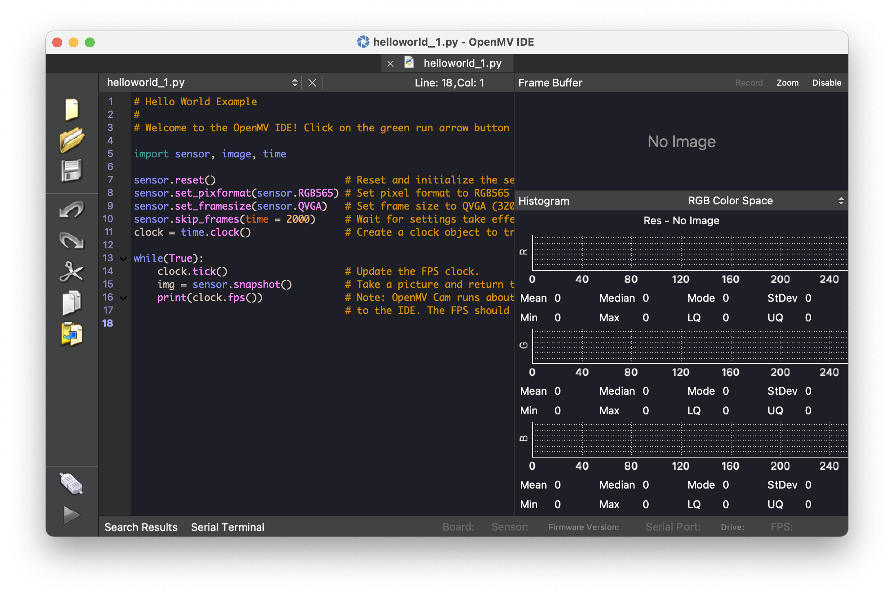

To write and load scripts to your board, you will also need a Code Editor. In this page, you will find two alternatives:
- **Arduino Lab for MicroPython:** an experimental editor from Arduino, designed for simpler projects.
- **OpenMV:** an editor for  more complex projects, such as computer vision.

## Arduino Lab for MicroPython

Arduino Lab for MicroPython is a software that supports programming Arduino boards with MicroPython. Through the customized editor, we can install MicroPython, and upload scripts directly to the board.  The editor is able to manage the files and you can see what is uploaded on the board and vice versa.

- [Download Arduino Lab for MicroPython](https://labs.arduino.cc/en/labs/micropython).

## OpenMV Editor

OpenMV is a platform that supports programming Arduino boards with MicroPython. Through the OpenMV editor, we can install MicroPython and upload scripts directly to the board. There's also a number of examples available directly in the editor.

- [Download OpenMV](https://openmv.io/pages/download).

***You can also check out the full list of examples in the [OpenMV's GitHub repository](https://github.com/openmv/openmv/tree/master/scripts/examples/10-Arduino-Boards).***