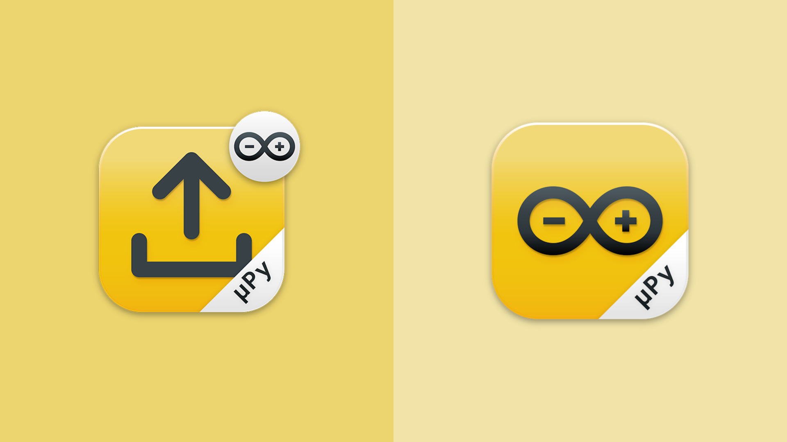

## Goals

In this chapter we will go over how to install the prerequisite software: the **code editor** and the **MicroPython firmware installer**, that will enable you to dive into the learning activities of this course.




The softwares you will have installed are:

- [Arduino Lab for MicroPython](https://labs.arduino.cc/en/labs/micropython)
- The Arduino MicroPython firmware installer


Once this has been completed, you will use the MicroPython firmware installer to install the firmware to your board, which lets you access this new MicroPython Arduino workflow.

## Step by Step Installation

**1. Download the Arduino Lab for MicroPython**

This editor will acts as your development environment, and it is here you will write your code as well as load it to your board.

First, [download the app here](https://labs.arduino.cc/en/labs/micropython). It will be downloaded as a `.zip` archive. Extract the files into a folder on your computer, and launch the `.exe` to start up the code editor. 

If you're on macOS, move the application to your **Applications** folder.

**2. Put the Board in Bootloader Mode**

Before we can install MicroPython, we need to place our board in a "bootloader" mode as we call it. This will make it possible to send a new firmware to it.

Connect your board to your computer, and connect B1 to GND with a jumper wire, tweezers, or something else metallic you have handy. Once you see a green light on the board, press the reset button on the board. If you remove the connection between B1 and GND, you should see a dim purple light if this step was successful. If not, then try again.


**3. Download the Firmware Installer**

The **Firmware Installer** program will help install MicroPython on your board. 

It will automatically download the latest version of the MicroPython firmware and install it on your board, so that all you need to do is to connect the board and press a button.

First [download the app here](), and extract the files to a folder on your computer.

If you're on macOS, move the application to your **Applications** folder.

**4. Flash Firmware**

Now open the Firmware Installer tool, select the Arduino Nano ESP32, and press **"Install MicroPython"**. Wait for the installer to do its magic and after some seconds, we are ready to go!


**5. Connect your Code Editor and Board**

In the Arduino Lab for MicroPython app, press **connect** in the top left corner and choose the serial port that comes up. This is your Nano ESP32.


**6. Verify**

Now, to verify things are working as they should, copy the script script below into your `main.py` file, and run it by clicking the **"Run"** button.

```python
from machine import Pin
import time

myLED = Pin(45, Pin.OUT)

while True:
    myLED.value(0)
    time.sleep(1)  
    myLED.value(1)
    time.sleep(1) 
```

After loading the script, we should be seeing a green light blink on the board.


So what just happened? We just loaded a script to our board, instructing it to blink a green LED every second. This is to confirm things are working, and if you see blinking green light, you successfully installed and uploaded a script to your board! 

## Summary

Congratulations! You’ve completed the installation chapter of MicroPython 101. 

Having trouble? Continue to the troubleshooting section. Otherwise, move on to the [Next chapter](/micropython-course/course/python-cc).

## Troubleshooting
Got stuck? Here are a few common issues you may run into and tips on how to move forward.

### Board not Detected

If your board is not detected by the MicroPython firmware installer app, double check that you've correctly put your board in bootloader mode.

Go back to step 3 in the [Step by Step](#step-by-step) section, and make sure that your board has a purple light by the end of it.

### Connection Fail

If you cannot connect to your board in the code editor, make sure you're selecting the right port. 

You can try **disconnecting** any other serial device such as other arduino boards from your computer, to make sure that only one device appears in the list.