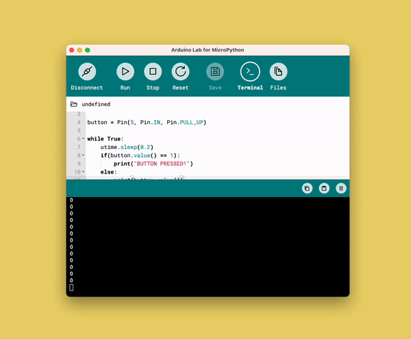

In this chapter, we will work with digital signals through practical examples, working with some electronic components and MicroPython code modules.

You will learn the following in this chapter:
- How to read a button,
- how to turn on an LED,
- how to make the Nano ESP32 perform a continuous action (placing it in a loop).

## Digital Signals

A digital signal has only two states: a **HIGH** or a **LOW** state. They can for example be used to read the state of a button (pressed/not pressed), or turn on an LED (on/off).

So how does digital signals work? Well, it is quite simple! In the case of the button, the Arduino can be programmed to check whether **current** is flowing through, and if it is, we will read a HIGH state, or a "1". If it is not, we will read a LOW state, or a "0".

For the LED, we can do sort of the reverse: we can write a HIGH / LOW state to it. If we connect the LED to a **digital pin** on the Arduino, we can therefor turn it on or off, by writing a "1" or "0" to it.


## Exercise 1: Read a Button

In this exercise, we will read a button, which we will need to connect to our Nano ESP32 board, following the circuit diagram below:


Open the code editor, and copy paste the following script to the `main.py` file:

```python
from machine import Pin
import utime

button = Pin(5, Pin.IN, Pin.PULL_UP)

while True:
    print(button.value())
    utime.sleep(0.2)
    if button.value == 1:
        print("BUTTON PRESSED!")
```

Then, click on the **”PLAY"** symbol to run the script. Now, if we click the button, we should see a message in the terminal: **"BUTTON PRESSED!"**.

.

Woho! We have now succesfully read the state of a button, one of the world's most commonly used circuits!

## Exercise 2: Turn on an LED

In the next exercise, we will turn on an LED, which we will need to connect to our Nano ESP32 board, following the circuit diagram below:


Open the code editor, and copy paste the following script to the `main.py` file:

```python
from machine import Pin
import time

myLED = Pin(9, Pin.OUT) 

while True:
    myLED.value(0)
    time.sleep(1)  
    myLED.value(1)
    time.sleep(1)
```

Then, click on the **”PLAY"** symbol to run the script. 

When we launch the script, we should see the LED flashing. This is because we added the `time.sleep(1)` command to the script. Whenever this line is executed, the Nano ESP32 pauses for a second, before resuming its tasks.


Note that we also used a `while True:` statement, which puts the Nano ESP32 into a loop mode, continuing forever and ever (or until you pause the script).

## Summary

Digital signals are characterized by two states: a HIGH state and a LOW state. They are commonly used to determine the state of a button (pressed or not pressed) and control the on/off state of an LED. They can also be used for many, many more applications and are a fundamental part of any electronic design.

These exercises provide hands-on experience with digital signals, enabling the reader to understand how to read input from a button and control output to an LED using the Nano ESP32 board.

- [Next Chapter: Analog I/O & PWM Signals](/micropython-course/course/analog)