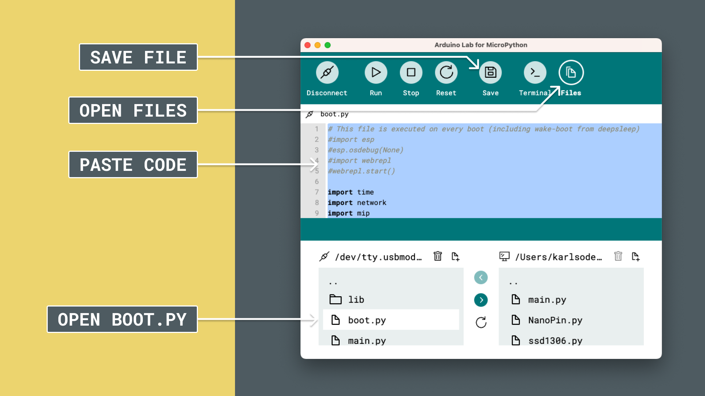
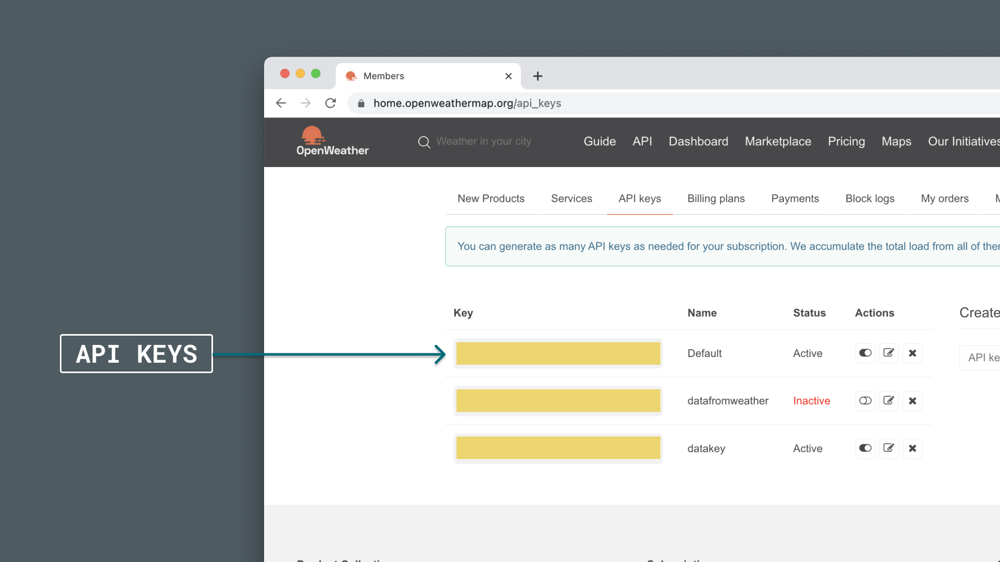
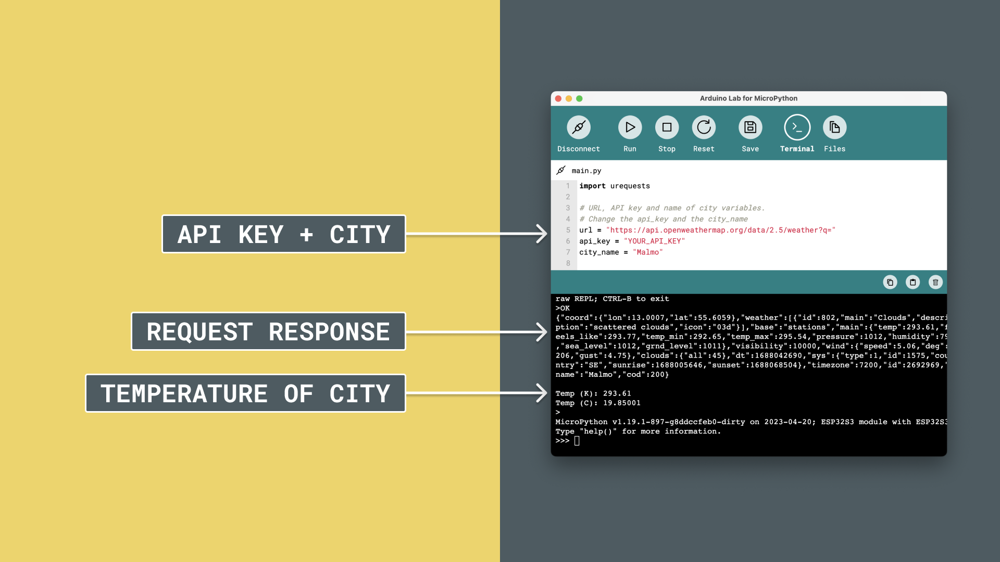
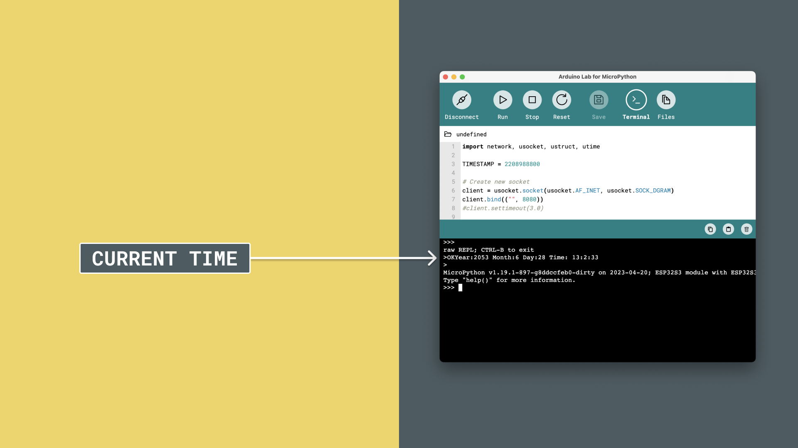

Internet of Things (IoT) is a collective term for any devices that are connected to the Internet, and your Nano ESP32 is one of them. Using its built-in antenna, the board can connect and communicate over the Internet.

In this chapter, we are going to look into the essential steps needed to connect your board to a Wi-Fi network, and how to make a test call to the Internet.

You will learn the following in this chapter:
- How to connect your Nano ESP32 to a Wi-Fi network,
- how to make a request to an API over the Internet,
- how to convert the response in to a readable format using JSON.

## Internet of Things (IoT)

Internet of Things is a very vast area to explore, and in this chapter, we will solely focus on how to achieve a simple request to the Internet.

When working with IoT, there are a number of important factors to consider. For the sake of simplicity, we are going to divide them into two separate parts:
- How to connect to a Wi-Fi network (a router),
- how to make a request over the Internet.

In this chapter, we will be using a number of new modules: `network`, `socket` & `urequests`. These make it possible to connect, maintain the connection, and make requests to the Internet.

### Connect to Wi-Fi

Connecting to Wi-Fi is pretty straightforward concept, and is very similar to how we connect using our phones / computers.

With MicroPython, we can do it with just a few lines of code, seen in the script below:

```python
SSID='your_network_name'
KEY='your_network_password'

wlan = network.WLAN(network.STA_IF)
wlan.active(True)
wlan.connect(SSID, KEY)

print("Connected to ",SSID)
```

Here we simply add our network name/password, create teh `wlan` object, set it to `active` and then `connect` to the Wi-Fi network!

Once we are connected to the Wi-Fi network, we can move on to make requests to the Internet!

### Make a Request

Being connected to a Wi-Fi network means we now have access to the Internet. We will now test out our connection, by making a request to a server!

To make a request, we need to use the `urequests` module. With `urequests` module, we can input an URL (and more information), to construct a request that is sent to a server. In this case, we will send a test request to google.com.

To do this, we need first to include the Wi-Fi connection code we used in the previous example, and add a few more lines to make the request!

```python
import urequests
import network

# Request a random cat fact from the Meowfacts API
url = "https://meowfacts.herokuapp.com/"

SSID=''
KEY=''

wlan = network.WLAN(network.STA_IF)
wlan.active(True)
wlan.connect(SSID, KEY)

print("Connected to ",SSID)

response = urequests.get(url)

print(response.text)
```

What we just did, was to connect a server, and request something. This is one of the most common methods to exchange data over the Internet, and is a fundamental building block when working with IoT devices.

## Exercise 1: Automatic Wi-Fi Connection

If you are planning to do a lot of IoT projects, you might want to make sure your board connects to your Wi-Fi network automatically.

To do this, we can edit our `boot.py` file. Remember, the code on this file is the first to be executed when our board is powered. To edit your `boot.py` file, open the editor, and select the file from the list of files to the left.



Then, in the `boot.py` file, we can past the Wi-Fi connection code that we just previously.

```python
"""
This code goes into "boot.py".
It will automatically run when
you start your board, and connects
to the Wi-Fi network specified.
"""

SSID=''
KEY=''

wlan = network.WLAN(network.STA_IF)
wlan.active(True)
wlan.connect(SSID, KEY)
```

Remember now to also click the **SAVE** button in the editor. This will overwrite the existing `boot.py` file with your new changes.

## Exercise 2: Extract Weather Data

***This example requires you to register an account at [OpenWeather](https://openweathermap.org/), and obtain something called an "API KEY".***

In this exercise, we will be making a request to an API that provides weather data. We will see how we can manipulate the request to specify which city in the world we want the data from, and how to extract exactly what data we want from the request.

**1.** Register an account at [OpenWeather](https://home.openweathermap.org/users/sign_up).

**2.** Go to the [API keys](https://home.openweathermap.org/api_keys) section, and create a new API key. 



**3.** Open the code editor, and copy paste the following script to the `main.py` file. Notice that at the top of the code, we have an `API_KEY` variable. Paste your API key obtained from **step 2** here. 

```python
"""
Simple GET request to OpenWeather.
This prints out the current temperature
of the city specified in the city_name
variable.
"""
import urequests

# URL, API key and name of city variables.
# Change the api_key and the city_name
url = "https://api.openweathermap.org/data/2.5/weather?q="
api_key = "YOUR_API_KEY"
city_name = "YOUR_CITY"

# Here we build a request URL
response = urequests.get(url + city_name + "&appid=" + api_key)

# Print out the complete response
print(response.text)
print()

# Convert to a JSON object
response_data = response.json()

# Access temperature object
temp_kelvin = response_data['main']['temp']

# Because it is in kelvin, convert to celsius
temp_celsius = int(temp_kelvin) - 273.15

print("Temp (K):", temp_kelvin)
print("Temp (C):", temp_celsius)
```

Then, click on the **”PLAY"** symbol to run the script.

Once we run the script, after a while, we should be receiving the response. This script is designed to:

1. Make a request, and receive a response.
2. The response is not very readable for humans (it has a lot of data), so we convert it to a JSON object, which allows us to access specific data!
3. Once we have accessed the data, we print it out. 

.

We now have a device that is capable of accessing the weather from anywhere in the world!

## Exercise 2: Internet Clock

In this exercise, we will make a request to something called an network time protocol (NTP) server. 

As our board does not know the current time, it is necessary for it to make a request to a server that keeps track on it.

Open the code editor, and copy paste the following script to the `main.py` file:

```python
import network, usocket, ustruct, utime

TIMESTAMP = 2208988800

# Create new socket
client = usocket.socket(usocket.AF_INET, usocket.SOCK_DGRAM)
client.bind(("", 8080))
#client.settimeout(3.0)

# Get addr info via DNS
addr = usocket.getaddrinfo("pool.ntp.org", 123)[0][4]

# Send query
client.sendto('\x1b' + 47 * '\0', addr)
data, address = client.recvfrom(1024)

# Print time
t = ustruct.unpack(">IIIIIIIIIIII", data)[10] - TIMESTAMP
print ("Year:%d Month:%d Day:%d Time: %d:%d:%d" % (utime.localtime(t)[0:6]))

# Close socket
client.close()
```

Then, click on the **”PLAY"** symbol to run the script. 

Note that this example is a little bit more advanced compared to the previous examples we have worked with. But in a nutshell, what happens is:

1. We make a request to a specific server (ntp.pool.org). This server stores the current time, and makes it available for other devices to request it.
2. The response comes in a Year/Month/Day/Hour/Minute/Second format, and is printed in the terminal.



Congratulations, you have now succesfully retrieved the latest time, meaning your board is in sync with the rest of the world!

### Project Idea: Alarm Clock

In the exercises above, we retrieved **weather data** and **current time**. Combined, this makes for an excellent alarm clock that can keep track of time, set alarms and also give you weather updates!

If you want to make this, you should look into getting a display, in which you can print out the time, as well as a short weather summary, or an icon to represent what the weather is!

Below are some links that you may find useful:

- [4 Digit Display Example](/micropython-course/course/examples#4-digit-display)
- [Buzzer Example](/micropython-course/course/examples#buzzer)
- [OLED Display Example](/micropython-course/course/examples#oled-screen)

## Summary

In this chapter, we got a brief introduction to the Internet of Things (IoT), a collective term for devices connected to the Internet.

We learned how to:
- succesfully connect to a Wi-Fi network,
- how to make an HTTP request over the Internet and,
- how to obtain useful data (weather data + current time)

IoT is a *very* broad field and you have only just discovered a fraction of it. MicroPython makes it easier for you to build projects that are in sync with the world.

- [Next Chapter: Component Examples](/micropython-course/course/examples)
