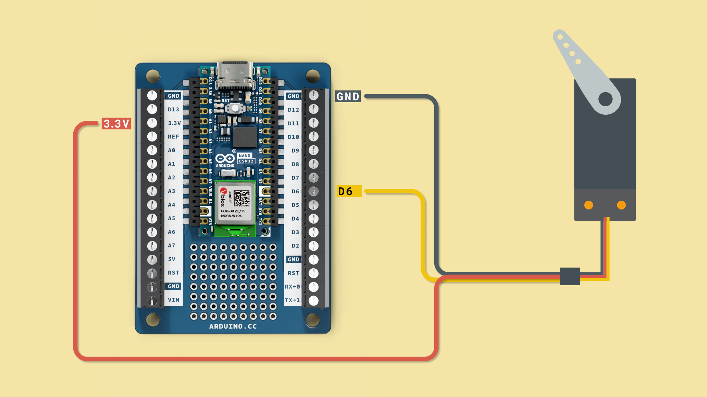
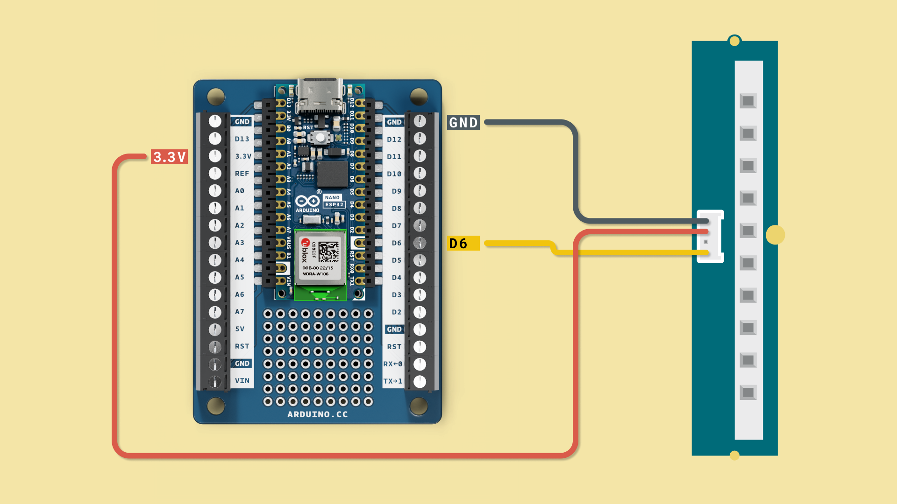
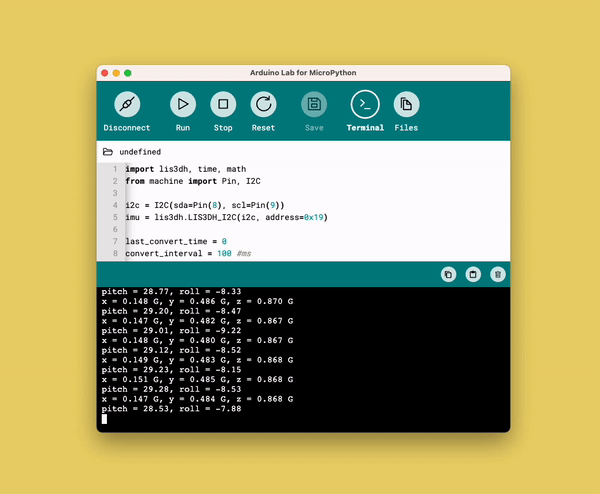
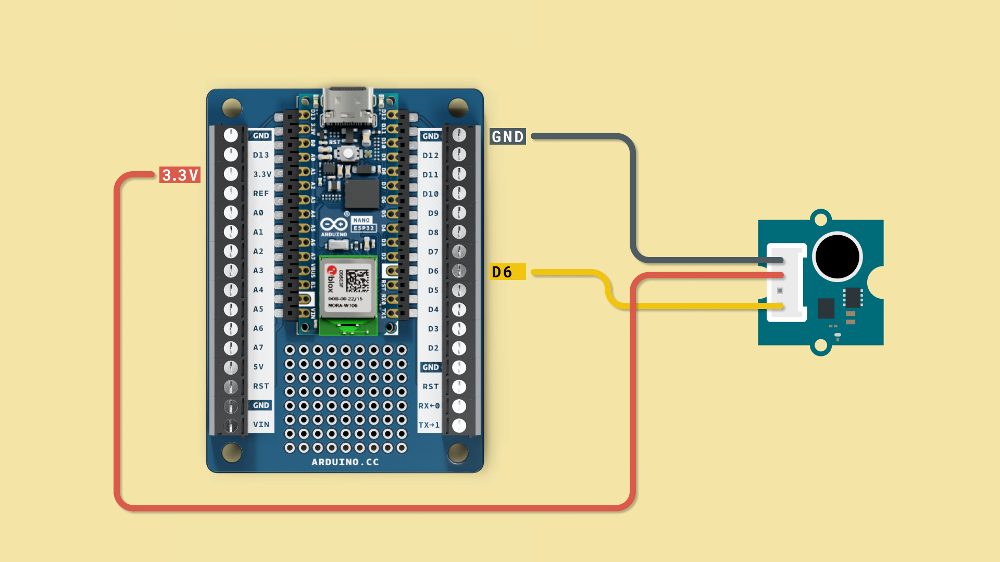
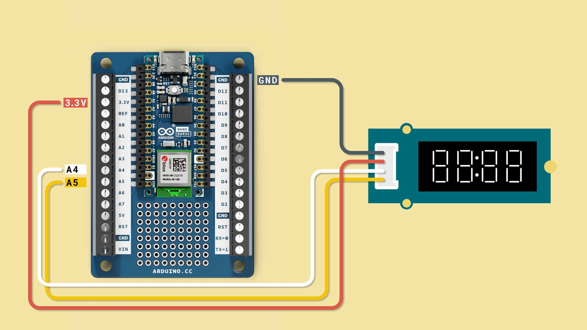
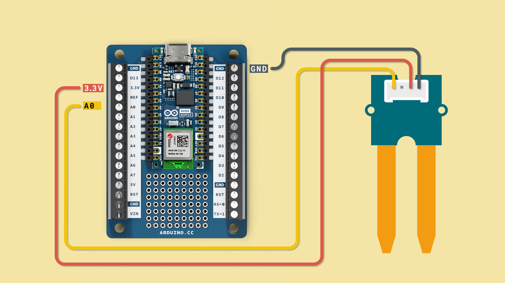

The following section shows how to use a selection of the most popular sensors used together with Arduino. All the sensors have Grove connections and are linked in every example. 

## Button

This example shows how to use a [pushbutton](https://store.arduino.cc/products/grove-button-p?queryID=3db0c95a3af43412f59d48a243453a53) with MicroPython.


```python
from machine import Pin    # Import the Pin class from the machine module
from time import sleep     # Import the sleep function from the time module

button = Pin(5, Pin.IN, Pin.PULL_UP)    # Create a Pin object for pin 5 as an input with a pull-up resistor

while True:    # Start an infinite loop
    button_state = button.value()    # Read the current state of the button
    if button_state == 0:    # Check if the button state is LOW (0)
        print("Button not pressed")    # If the button is not pressed, print a message
    else:
        print("Button pressed")    # If the button is pressed, print a message
    sleep(0.5)    # Pause the program for 0.5 seconds

```

<video width="100%" loop autoplay>
<source src="assets/button.mp4" type="video/mp4" />
</video>

## LED

This example shows how to create the classic blink example using MicroPython and a [Grove LED](https://www.seeedstudio.com/Grove-Red-LED.html).


```python
from machine import Pin    # Import the Pin class from the machine module
from time import sleep     # Import the sleep function from the time module

led = Pin(5, Pin.OUT)    # Create a Pin object for pin 5 as an output

while True:    # Start an infinite loop
    led.on()    # Turn on the LED
    sleep(1)    # Pause the program for 1 second
    led.off()   # Turn off the LED
    sleep(1)    # Pause the program for 1 second

```

<video width="100%" loop autoplay>
<source src="assets/led.mp4" type="video/mp4" />
</video>

## Servo

This code controls a [servo motor](https://store.arduino.cc/products/grove-servo?queryID=5a2a481038aab78eec2ab1d0b51687a0) connected to Pin 5 (D2) using PWM. As with any motor if the current being drawn due to the motor needing too much power the board resets.



```python
from machine import Pin, PWM   # Import the Pin and PWM classes from the machine module
import time                    # Import the time module

servo = PWM(Pin(5, mode=Pin.OUT))    # Create a PWM object named 'servo' on pin 5 configured as an output
servo.freq(50)                      # Set the frequency of the PWM signal to 50Hz

while True:    # Start an infinite loop
    servo.duty(26)    # Set the duty cycle of the PWM signal to 26 (position 1 of the servo)
    time.sleep(1)     # Pause the program for 1 second
    servo.duty(123)   # Set the duty cycle of the PWM signal to 123 (position 2 of the servo)
    time.sleep(1)     # Pause the program for 1 second

```

## Neopixel

This example shows how to use a [Neopixel](https://www.seeedstudio.com/Grove-RGB-LED-Stick-10-WS2813-Mini.html) strip with 10 RGB leds.



```python
from machine import Pin
from time import sleep
import neopixel

PIXEL_NUMBER = 24
np = neopixel.NeoPixel(Pin(21), PIXEL_NUMBER)   # Create a NeoPixel object with 24 pixels connected to pin 21

purple = (200, 0, 200)
black = (0, 0, 0)

np.fill(black)   # Fill the entire strip with black color (turn off all pixels)
np.write()       # Update the NeoPixel strip to reflect the changes

def ringUp():
    for i in range(0, PIXEL_NUMBER):
        np[i] = purple   # Set the i-th pixel to purple color
        np.write()       # Update the NeoPixel strip to reflect the changes
        sleep(0.1)       # Pause for 0.1 seconds
        
def ringDown():
    for i in range(0, PIXEL_NUMBER):
        np[i] = black    # Set the i-th pixel to black color
        np.write()       # Update the NeoPixel strip to reflect the changes
        sleep(0.1)       # Pause for 0.1 seconds
        
def ringOff():
    for i in range(0, PIXEL_NUMBER):
        np[i] = black    # Set the i-th pixel to black color
    np.write()           # Update the NeoPixel strip to reflect the changes
    
def runPixelRun():
    while(1):             # Loop indefinitely
        ringUp()          # Turn on pixels from 0 to 23 in sequence
        ringDown()        # Turn off pixels from 0 to 23 in sequence
    
runPixelRun()             # Start running the pixel animation
```

<video width="100%" loop autoplay>
<source src="assets/neopixel.mp4" type="video/mp4" />
</video>

## DHT11

This example shows how to use a [DHT11](https://www.seeedstudio.com/Grove-Temperature-Humidity-Sensor-DHT11.html?queryID=feac683b68679492e4f168b43f6a6bdd&objectID=1826&indexName=bazaar_retailer_products) with an Arduino Nano ESP32.


```python
import dht
from machine import Pin
from time import sleep_ms

SENSOR_PIN = 5

TEMP_SENSOR = dht.DHT11(Pin(SENSOR_PIN))   # Create a DHT11 object with the specified pin number
sleep_ms(500)                             # Pause for 500 milliseconds to allow the sensor to stabilize

while(1):                                 # Loop indefinitely
    TEMP_SENSOR.measure()                  # Trigger a measurement from the DHT11 sensor
    print(TEMP_SENSOR.temperature())       # Print the measured temperature
    print(TEMP_SENSOR.humidity())          # Print the measured humidity
    sleep_ms(1000)                         # Pause for 1 second before taking the next measurement

```

## OLED Screen

This example shows how to use an [OLED](https://store.arduino.cc/products/grove-oled-display-0-96?queryID=e9abc3d3ad2ef916bd26c57c9b311ce9) screen via I2C.


```python
from machine import SoftI2C, Pin
import ssd1306_1315 as ssd1306
import gc
from random import randint
from time import sleep_ms

DISPLAY_WIDTH = 128   # Set the display width to 128 pixels
DISPLAY_HEIGHT = 64   # Set the display height to 64 pixels

class Point():
    def __init__(self, x, y):
        self.x = x   # Initialize the x-coordinate of the point
        self.y = y   # Initialize the y-coordinate of the point
    
    def set_coords(coords):
        return  # Placeholder method, does not perform any action

old_coords = Point(64, 32)   # Create a Point object with initial coordinates (64, 32)
new_coords = Point(64, 32)   # Create a Point object with initial coordinates (64, 32)
# old_coords = {"x": 0, "y":0}
# new_coords = {"x": 0, "y": 0}

i2cbus = SoftI2C(scl=Pin(12), sda=Pin(11), freq=100000)   # Create a SoftI2C object for I2C communication with the specified pins and frequency
print(i2cbus)

oled = ssd1306.SSD1306_I2C(DISPLAY_WIDTH, DISPLAY_HEIGHT, i2cbus)   # Create an SSD1306 OLED object with the specified width, height, and I2C bus
# oled.fill(0)
oled.show()

oled.text('Arduino', 40, 12)         # Display the text "Arduino" at the specified coordinates
oled.text('vs', 60, 26)              # Display the text "vs" at the specified coordinates
oled.text('MicroPython', 23, 45)     # Display the text "MicroPython" at the specified coordinates

oled.show()                          # Update the OLED display to reflect the changes
```

## Buzzer

This example shows how to use a [Grove Buzzer](https://store.arduino.cc/products/grove-buzzer-piezo?queryID=9655030cc2165861ec71fa900ef46f8b).


```python
from machine import Pin, PWM
import time

# Pin connected to the Grove Speaker
SPEAKER_PIN = 5

# Frequency and duration of the sound
FREQUENCY = 220  # Hz
DURATION = 2  # seconds

# Create a controllable Pin for the speaker
speaker = PWM(Pin(SPEAKER_PIN))

# Function to play a sound
def play_sound(frequency, duration):
    speaker.freq(frequency)
    speaker.duty(512)
    time.sleep(duration)
    speaker.duty(0)

# Play the sound
play_sound(FREQUENCY, DURATION)
```

## Accelerometer

This example shows how to use a [Grove Accelerometer](https://store.arduino.cc/products/grove-3-axis-digital-accelerometer-16g?queryID=cf10960cf012640816efcf27f84dc92c) using I2C.


```python
import lis3dh, time, math
from machine import Pin, I2C

i2c = I2C(sda=Pin(8), scl=Pin(9)) # Correct I2C pins for TinyPICO
imu = lis3dh.LIS3DH_I2C(i2c, address=0x19)

last_convert_time = 0
convert_interval = 100 #ms
pitch = 0
roll = 0


# Convert acceleration to Pitch and Roll
def convert_accell_rotation( vec ):
    x_Buff = vec[0] # x
    y_Buff = vec[1] # y
    z_Buff = vec[2] # z

    global last_convert_time, convert_interval, roll, pitch

    # We only want to re-process the values every 100 ms
    if last_convert_time < time.ticks_ms():
        last_convert_time = time.ticks_ms() + convert_interval

        roll = math.atan2(y_Buff , z_Buff) * 57.3
        pitch = math.atan2((- x_Buff) , math.sqrt(y_Buff * y_Buff + z_Buff * z_Buff)) * 57.3

    # Return the current values in roll and pitch
    return ( roll, pitch )

# If we have found the LIS3DH
if imu.device_check():
    # Set range of accelerometer (can be RANGE_2_G, RANGE_4_G, RANGE_8_G or RANGE_16_G).
    imu.range = lis3dh.RANGE_2_G

    # Loop forever printing values
    while True:
        # Read accelerometer values (in m / s ^ 2).  Returns a 3-tuple of x, y,
        # z axis values.  Divide them by 9.806 to convert to Gs.
        x, y, z = [value / lis3dh.STANDARD_GRAVITY for value in imu.acceleration]
        print("x = %0.3f G, y = %0.3f G, z = %0.3f G" % (x, y, z))

        # Convert acceleration to Pitch and Roll and print values
        p, r = convert_accell_rotation( imu.acceleration )
        print("pitch = %0.2f, roll = %0.2f" % (p,r))

        # Small delay to keep things responsive but give time for interrupt processing.
        time.sleep(0.1)
```



## Sound Sensor

This example shows how to use a [sound sensor](https://store.arduino.cc/products/grove-sound-sensor?queryID=undefined).



```python
from machine import Pin, ADC
import time

pin_adc = ADC(Pin(5))      # Create an ADC object and associate it with pin 5
pin_adc.atten(ADC.ATTN_11DB)   # Set the attenuation level to 11dB, which allows for a wider input voltage range

while True:
    sum_value = 0

    for i in range(32):
        sum_value += pin_adc.read()   # Read the ADC value and add it to the sum

    sum_value >>= 5   # Right shift the sum by 5 bits (equivalent to dividing by 32) to get the average value

    print(sum_value)   # Print the average value
    time.sleep_ms(100)   # Pause for 100 milliseconds

```

## 4 Digit Display

This example shows how to use a [Grove 4-digit display](https://store.arduino.cc/products/grove-4-digit-display?queryID=a24e1359995118c4ec489ddc59e622c4).



```python
from machine import Pin
from time import sleep
import tm1637

tm = tm1637.TM1637(clk=Pin(10), dio=Pin(11))

tm.write([63, 191, 63, 63])  # Write a specific pattern of segments to the TM1637 display
sleep(1)

tm.numbers(17, 23)  # Display the numbers 17 and 23 on the TM1637 display
sleep(1)
tm.show('abcd')  # Display the characters 'abcd' on the TM1637 display
sleep(1)
tm.show('bcde')  # Display the characters 'bcde' on the TM1637 display
sleep(1)
tm.show('cdef')  # Display the characters 'cdef' on the TM1637 display
sleep(1)

tm.temperature(20)  # Display the temperature value 20 on the TM1637 display

```

## Moisture Sensor

This example shows how to use a [moisture sensor](https://store.arduino.cc/products/grove-moisture-sensor?queryID=undefined).



```python
import machine
import time

adc_pin = machine.Pin(4)
adc = machine.ADC(adc_pin)

#function mapping sensor values from 0 to 100.
def map_value(value, in_min, in_max, out_min, out_max):
    return (value - in_min) * (out_max - out_min) / (in_max - in_min) + out_min

while True:
    reading = adc.read_u16()
    mapped_reading = map_value(reading, 0, 65535, 0, 100)  # Mapping the reading to the range 0-100
    print("Moisture: ", reading, " Mapped Moisture: ", mapped_reading)
    time.sleep_ms(500)
```