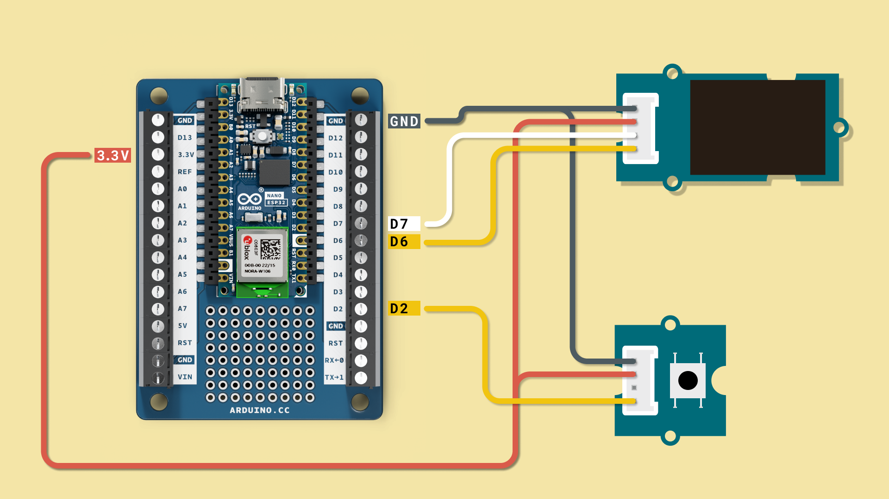

***Please complete the basic installation-chapters before starting a project.***

This project will show you how to interact with a screen using a button. The script will follow a sequence when the button is pressed and change what is displayed. It will call different functions depending on the current function that is displayed.

## Required Hardware

You will need the following to build this project:

- [Nano ESP32](https://store.arduino.cc/products/nano-esp32)
- [Nano Screw Terminal Adapter](https://store.arduino.cc/products/nano-screw-terminal)
- [OLED Display 0.96"](https://store.arduino.cc/products/grove-oled-display-0-96)
- [Button](https://store.arduino.cc/products/grove-button-p)
- [Grove to male cables](https://store.arduino.cc/products/grove-4-pin-male-to-grove-4-pin-cable-5-pcs)

## Circuit

Assemble the components according to the circuit diagram below:



## Code

Read the comments in the code and change the variables as necessary then upload it to your board.

```python
from machine import SoftI2C, Pin
from Button import Button
import ssd1306_1315 as ssd1306
import framebuf
import gc
​
DISPLAY_WIDTH = 128
DISPLAY_HEIGHT = 32
class Point():
    def __init__(self, x, y):
        self.x = x
        self.y = y
    def set_coords(coords):
        return
​
i2cbus = SoftI2C(scl = Pin(12), sda = Pin(11), freq = 100000)
print(i2cbus)
oled = ssd1306.SSD1306_I2C(DISPLAY_WIDTH, DISPLAY_HEIGHT, i2cbus)
​
counter_pressed = 0
total_pressed = 0
​
def textDisplay():
    oled.show()
    oled.text('Arduino', 40, 0)
    oled.text('and', 60, 12)
    oled.text('MicroPython', 23, 24)
    oled.show()
​
def arduinoLogo():
    global total_pressed
    oled.fill(0)
    oled.show()
    total_pressed = total_pressed + counter_pressed
    oled.text('Number of times', 5, 0)
    oled.text(f'button was', 5, 10)
    oled.text(f'pressed: {total_pressed}', 5, 20)
    oled.show()
​
def micropythonLogo():
    oled.fill(0)
    oled.fill_rect(0, 0, 32, 32, 1)
    oled.fill_rect(2, 2, 28, 28, 0)
    oled.vline(9, 8, 22, 1)
    oled.vline(16, 2, 22, 1)
    oled.vline(23, 8, 22, 1)
    oled.fill_rect(26, 24, 2, 4, 1)
    oled.show()
        
def button_change(button, event):
    global counter_pressed
    if event == Button.PRESSED:
        counter_pressed += 1
        if counter_pressed == 1:
            textDisplay()
        if counter_pressed == 2:
            arduinoLogo()
        if counter_pressed == 3:
            micropythonLogo()
        if counter_pressed > 3:
            oled.fill(0)
            oled.show()
            counter_pressed = 0
        
button_one = Button(17, False, button_change)
​
while(1):
    button_one.update()
```