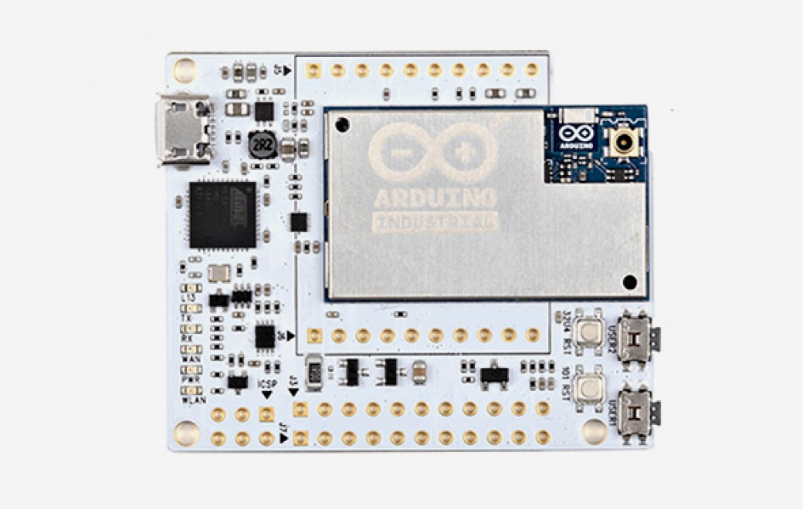
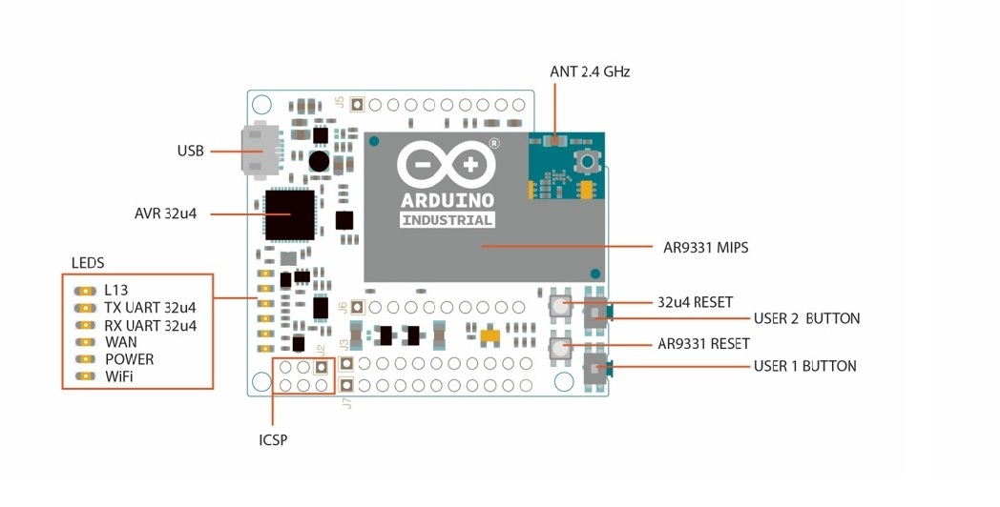
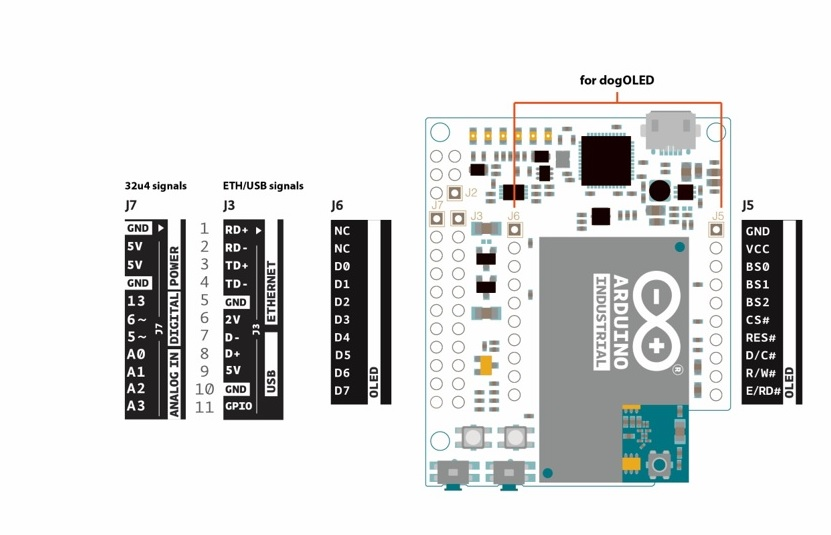

**Arduino Industrial 101** is an Evaluation board for Arduino 101 LGA module. The ATmega32u4 microcontroller is integrated in the baseboard. The module supports a Linux distribution based on OpenWRT named LininoOS. The board has built-in WiFi (IEEE 802.11b/g/n operations up to 150Mbps 1x1 2.4 GHz), 3 GPIOs (of which 2 can be used as PWM Outputs), 4 Analog Inputs, 1 USB, 1 Ethernet signal on pin headers and a built-in DC/DC converter. Check out the assembling guide and simply connect your board to a computer with a micro USB cable to get started.

NB: In some countries, it is prohibited to sell WiFi enabled devices without government approval. While waiting for proper certification, some local distributors are disabling WiFi functionality. Check with your dealer before purchasing a Industrial 101 if you believe you may live in such a country.

## Getting Started

You can find in the [Getting Started section](https://www.arduino.cc/en/Guide/HomePage) all the information you need to configure your board, use the [Arduino Software (IDE)](https://www.arduino.cc/en/Main/Software), and start tinker with coding and electronics.

### Need Help?

* On the Software [on the Arduino Forum](https://forum.arduino.cc/index.php?board=63.0)
* On Projects [on the Arduino Forum](https://forum.arduino.cc/index.php?board=3.0)
* On the Product itself through [our Customer Support](https://support.arduino.cc/hc)

## Documentation

### OSH: Schematics

The Arduino Industrial 101 is open-source hardware! You can build your own board using the following files:

[DSN FILES IN .ZIP](https://www.arduino.cc/en/uploads/Main/INDUSTRIAL101-V022-20151105.DSN.zip) 

[SCHEMATICS IN .PDF](https://www.arduino.cc/en/uploads/Main/industrial-101-V022-20151105_SCH-1.pdf)

### Power

It is recommended to power the board via the micro-USB connection with 5VDC. If you are powering the board though the Vin pin, you must supply a regulated 5VDC. There is no on-board voltage regulator for higher voltages, which will damage the board. The power pins are as follows:

* VIN. The input voltage to the Arduino board. Unlike other Arduino boards, if you are going to provide power to the board through this pin, you must provide a regulated 5V.
* 5V. The power supply used to power the microcontrollers and other components on the board. This can come either from VIN or be supplied by USB.
* 3V3\. A 3.3 volt supply generated by the on-board regulator. Maximum current draw is 50 mA.
* GND. Ground pins.
* IOREF. The voltage at which the i/o pins of the board are operating (i.e. VCC for the board). This is 5V on the Industrial 101.

### Memory

The ATmega32u4 has 32 KB (with 4 KB used for the bootloader). It also has 2.5 KB of SRAM and 1 KB of EEPROM (which can be read and written with the EEPROM library). The memory on the AR9331 is not embedded inside the processor.

The RAM and the storage memory are externally connected. The Industrial 101 has 64 MB of DDR2 RAM and 16 MB of flash memory. The flash memory is preloaded in factory with a Linux distribution based on OpenWrt called Linino OS. You can change the content of the factory image, such as when you install a program or when you change a configuration file. You can return to the factory configuration by pressing the "USER1" button for 30 seconds.

The Linino OS installation occupies around 9 MB of the 16 MB available of the internal flash memory. You can use a micro SD card (adding an external slot) if you need more disk space for installing applications.

### Input and Output

It is not possible to access the I/O pins of the Atheros AR9331\. All I/O lines are tied to the 32U4.Each of the 7 digital i/o pins on the Industrial 101 can be used as an input or output, using pinMode(), digitalWrite(), and digitalRead() functions. They operate at 5 volts. Each pin can provide or receive a maximum of 40 mA and has an internal pull-up resistor (disconnected by default) of 20-50 kOhms. In addition, some pins have specialized functions:

* Serial: Used to receive and transmit TTL serial data using the ATmega32U4 hardware serial capability via Serial1 class. The hardware serials of the ATmega32U4 and the AR9331 on the Industrial 101 are connected together and are used to communicate between the two processors. As is common in Linux systems, on the serial port of the AR9331 is exposed the console for access to the system, this means that you can access to the programs and tools offered by Linux from your sketch.
* TWI: Support TWI communication using the Wire library, it is reserved for Oled slot.
* PWM: 5, 6\. Provide 8-bit PWM output with the analogWrite() function.
* SPI: on the ICSP header. These pins support SPI communication using the SPI library. Note that the SPI pins are not connected to any of the digital I/O pins as they are on the Uno, They are only available on the ICSP connector. The SPI pins are also connected to the AR9331 gpio pins, where it has been implemented in software the SPI interface. This means that the ATMega32u4 and the AR9331 can also communicate using the SPI protocol.
* LED: 13\. There is a built-in LED connected to digital pin 13\. When the pin is HIGH value, the LED is on, when the pin is LOW, it's off. There are several other status LEDs on the Industrial 101, indicating power (PWR), WLAN connection, WAN connection,TX and RX.
* Analog Inputs: A0 - A3 and A7 (on digital pins 6). The Industrial 101 has 4 analog inputs, labeled A0 through A3, all of which can also be used as digital i/o; and A7 is on digital i/o pin 6\. Each analog input provide 10 bits of resolution (i.e. 1024 different values). By default the analog inputs measure from ground to 5 volts, though is it possible to change the upper end of their range using the AREF pin and the analogReference() function.
* AREF. Reference voltage for the analog inputs. Used with analogReference().

There are 4 reset buttons with different functions on the board:

* 101 RST: reset the AR9331 microprocessor. Resetting the AR9331 will cause the reboot of the linux system. All the data stored in RAM will be lost and all the programs that are running will be terminated.
* 32U4 RST: reset the ATmega32U4 microcontroller. Typically used to add a reset button to shields which block the one on the board.
* USER1: connected to GP20 MIPS side and used to reset Wlan.This button has a double feature. Primarily serves to restore the WiFi to the factory configuration. The factory configuration consist to put the WiFi of the Industrial 101 in access point mode (AP) and assign to it the default IP address that is 192.168.240.1, in this condition you can connect with your computer to the a WiFi network that appear with the SSID name "Arduino-Ind-101-XXXXXXXXXXXX", where the twelve 'X' are the MAC address of your Industrial 101\. Once connected you can reach the web panel of the Industrial 101 with a browser at the 192.168.240.1 or "http://arduino.local" address. Note that restoring the WiFi configuration will cause the reboot of the linux environment. To restore your WiFi configuration you have to press and hold the WLAN RST button for more 5 seconds but less 10 second. When you press the button the WLAN blue LED will start to blink and will keep still blinking when you release the button after 5 seconds indicating that the WiFi restore procedure has been recorded. The second function of the USER1 button is to restore the linux image to the default factory image. To restore the linux environment you must press the button for 30 seconds. Note that restoring the factory image make you lose all the files saved and software installed on the on-board flash memory connected to the AR9331.
* USER2: connected GP23 MIPS side and available to the user.

### Communication

The Industrial 101 has a number of facilities for communicating with a computer, another Arduino, or other microcontrollers. The ATmega32U4 provides a dedicated UART TTL (5V) serial communication. The 32U4 also allows for serial (CDC) communication over USB and appears as a virtual com port to software on the computer. The chip also acts as a full speed USB 2.0 device, using standard USB COM drivers. The Arduino software includes a serial monitor which allows simple textual data to be sent to and from the Arduino board. The RX and TX LEDs on the board will flash when data is being transmitted via the USB connection to the computer.

Digital pins 0 and 1 , not reported on final layout , are used for serial communication between the 32U4 and the AR9331\. You can use to communication between the processors the Ciao library.

Arduino Ciao is an easy-to-use and powerful technology that enables Arduino sketches to communicate intuitively with the "outside World". It aims to simplify interaction between microcontroller and Linino OS, allowing a variety of connections with most common protocols, third-party services and social networks.

Ciao has been designed and developed to be modular and easily configurable. Its goal is to support several connectors capable of interacting with the system resources (filesystem, console, memory) and to communicate with the most common and useful protocols (XMPP, HTTP, WebSocket, COAP, etc..) and applications (Jabber, WeChat, Twitter, Facebook, etc.). Ciao Library is a lightweight library that can be used inside sketches for MCU to send and receive data, via serial communication, in a simple and intuitive way. The SoftwareSerial library allows to use digital pins to transmit and receive data. The library relies on change interrupt pins to receive data, therefore only the pins that support that can be used as RX pins. On the Industrial 101 this type of pins are available on the ICSP connector and are mapped as follows:   

SCK = 15  
MOSI = 16  
MISO = 14   

You can create up to 3 SoftwareSerial ports using the pins 13, 5 and 6 for TX and 14, 15 and 16 for RX. .

The ATmega32U4 also supports I2C (TWI) and SPI communication. The Arduino software includes a Wire library to simplify use of the I2C bus. For SPI communication, use the SPI library.

The Industrial 101 appears as a generic keyboard and mouse, and can be programmed to control these input devices using the Keyboard and Mouse classes.

The onboard Ethernet (you need the "Ethernet add-on" for example dogrj45) and WiFi interfaces are exposed directly to the AR9331 processor. To send and receive data through them, use the Bridge or Ciao library.

The Industrial 101 is prepared to add an USB host (for example the dogUSB) that you allow to connect peripherals like USB flash devices for additional storage, keyboards, or webcams. You may need to download and install additional software for these devices to work.

### Programming

The Industrial 101 can be programmed with the Arduino software (download). Select "Arduino Industrial 101 from the Tools > Board menu (according to the microcontroller on your board).

The ATmega32U4 on the Arduino Industrial 101 comes preburned with a bootloader that allows you to upload new code to it without the use of an external hardware programmer. It communicates using the AVR109 protocol. You can also bypass the bootloader and program the microcontroller through the ICSP (In-Circuit Serial Programming) header using Arduino ISP or similar;

### Automatic (Software) Reset

Rather than requiring a physical press of the reset button before an upload, the Industrial 101 is designed in a way that allows it to be reset by software running on a connected computer. The reset is triggered when the Industrial 101's virtual (CDC) serial / COM port is opened at 1200 baud and then closed. When this happens, the processor will reset, breaking the USB connection to the computer (meaning that the virtual serial / COM port will disappear). After the processor resets, the bootloader starts, remaining active for about 8 seconds.

The bootloader can also be initiated by pressing the reset button on the Industrial 101\. Note that when the board first powers up, it will jump straight to the user sketch, if present, rather than initiating the bootloader. Because of the way the Industrial 101 handles reset it's best to let the Arduino software try to initiate the reset before uploading, especially if you are in the habit of pressing the reset button before uploading on other boards. If the software can't reset the board you can always start the bootloader by pressing the reset button on the board.

### Physical Characteristics

The maximum length and width of the Industrial 101 PCB are 2.0 and 1.7 inches respectively, with the USB connector extending beyond the former dimension. Three screw holes allow the board to be attached to a surface or case.

### Pinout

## Tech Specs

**Arduino Microprocessor** 

|                  |                                           |
| ---------------- | ----------------------------------------- |
| Processor        | Atheros AR9331                            |
| Architecture     | MIPS                                      |
| Operating Voltag | 3.3V                                      |
| Flash Memory     | 16 MB                                     |
| RAM              | 64 MB DDR2                                |
| Clock Speed      | 400 MHz                                   |
| WiFi             | 802.11 b/g/n 2.4 GHz                      |
| Ethernet         | 802.3 10/100 Mbit/s (Exported on headers) |
| USB              | 2.0 Host (Exported on headers)            |

**Arduino Microcontroller**

|                         |                           |
| ----------------------- | ------------------------- |
| Microcontroller         | ATmega32u4                |
| Architecture            | AVR                       |
| Operating Voltage       | 5V                        |
| SRAM                    | 2.5 KB                    |
| Clock Speed             | 16 MHz                    |
| Analog I/O Pins         | 12 (4 exported on header) |
| EEPROM                  | 1 KB                      |
| DC Current per I/O Pins | 40 mA                     |

**General**

|                   |                           |
| ----------------- | ------------------------- |
| Input Voltage     | 5 V                       |
| Digital I/O Pins  | 20 (7 exported on header) |
| PWM Output        | 7 ( 2 exported on header) |
| Power Consumption | 130 mA                    |
| PCB Size          | 42 x 51 mm                |
| GPIO              | 3 Exported on headers     |
| DogOLED Support   | 1 Exported on headers     |
| Weight            | 0.012 Kg                  |
| Product Code      | A000126                   |