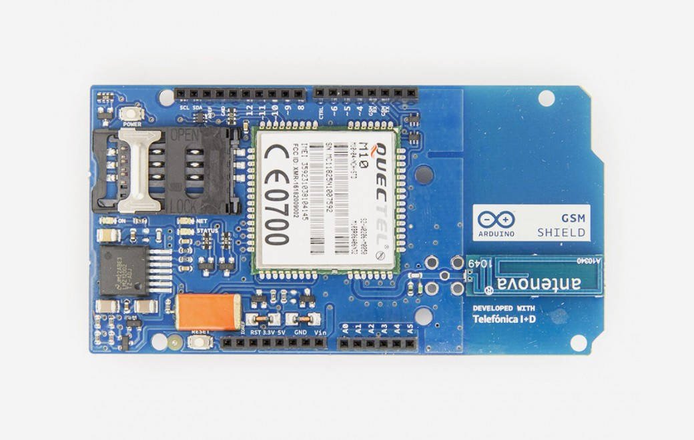
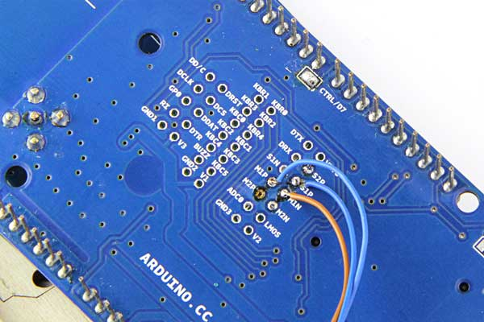
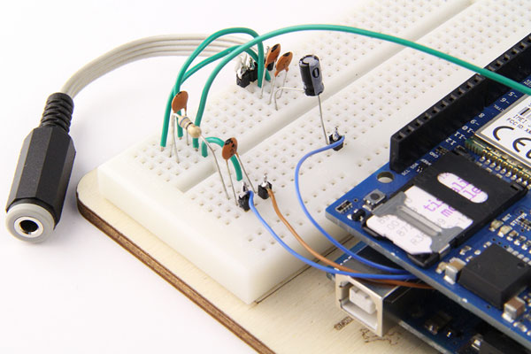
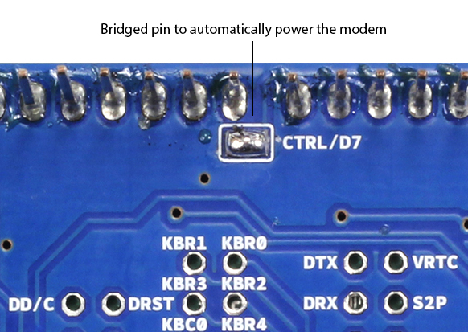

The Arduino GSM Shield V1 connects your Arduino to the internet using the GPRS wireless network. Just plug this module onto your Arduino board, plug in a SIM card from an operator offering GPRS coverage and follow a few simple instructions to start controlling your world through the internet. You can also make/receive voice calls (you will need an external speaker and microphone circuit) and send/receive SMS messages.

The Arduino GSM Shield V1 allows an Arduino board to connect to the internet, make/receive voice calls and send/receive SMS messages. The shield uses a radio modem [M10 by Quectel](https://www.arduino.cc/en/uploads/Main/Quectel_M10_datasheet.pdf). It is possible to communicate with the board using [AT commands](https://www.arduino.cc/en/en/uploads/Main/Quectel_M10_AT_commands.pdf). The [GSM library](https://www.arduino.cc/en/Reference/GSM) has a large number of methods for communication with the shield.

The shield uses digital pins 2 and 3 for software serial communication with the M10\. Pin 2 is connected to the M10’s TX pin and pin 3 to its RX pin. [See these notes](https://www.arduino.cc/en/en/Guide/GSMShieldLeonardoMega) for working with an Arduino Mega, Mega ADK, or Leonardo. The modem's PWRKEY pin is connected to Arduino pin 7.

The M10 is a Quad-band GSM/GPRS modem that works at frequencies GSM850MHz, GSM900MHz, DCS1800MHz and PCS1900MHz. It supports TCP/UDP and HTTP protocols through a GPRS connection. GPRS data downlink and uplink transfer speed maximum is 85.6 kbps.

To interface with the cellular network, the board requires a SIM card provided by a network operator. See the [getting started page](https://www.arduino.cc/en/Guide/ArduinoGSMShield#toc4) for additional information on SIM usage.  
  
The most recent revision of the board uses the 1.0 pinout on rev 3 of the Arduino Uno board.

As always with Arduino, every element of the platform – hardware, software and documentation – is freely available and open-source. This means you can learn exactly how it's made and use its design as the starting point for your own circuits. Hundreds of thousands of Arduino boards are already fuelling people’s creativity all over the world, everyday. Join us now, Arduino is you!

* Requires an Arduino board (not included)
* Operating voltage 5V (supplied from the Arduino Board)
* Connection with Arduino Uno on pins 2, 3 (Software Serial) and 7 (reset). See [these notes ](https://www.arduino.cc/en/Guide/GSMShieldLeonardoMega)for working with a Mega, Mega ADK, or Leonardo.

You can find your board warranty information [here](https://www.arduino.cc/en/Main/warranty).

## Getting Started

In the [Getting Started section](https://www.arduino.cc/en/Guide/ArduinoGSMShield), you can find all the information you need to configure your board, use the [Arduino Software (IDE)](https://www.arduino.cc/en/Main/Software), and start to tinker with coding and electronics.

### Need Help?

* On the GSM Shield V1 [on the GSM Library](https://www.arduino.cc/en/en/Reference/GSM)
* On Projects [on the Arduino Forum](https://forum.arduino.cc/index.php?board=3.0)
* On the Product itself through [our Customer Support](https://store.arduino.cc/index.php?main_page=contact_us&language=en)

## Documentation

### OSH: Schematics

Arduino GSM Shield V1 is open-source hardware! You can build your own board using the following files:

[EAGLE FILES IN .ZIP](https://www.arduino.cc/en/uploads/Main/arduino-gsm-shield-06-reference-design.zip) 

[SCHEMATICS IN .PDF](https://www.arduino.cc/en/uploads/Main/arduino-gsm-shield-schematic.pdf) 

### Telefonica/Movilforum SIM included with the shield

The GSM shield V1 comes bundled with a SIM from Telefonica/Movilforum that will work well for developing machine to machine (M2M) applications. It is not necessary to use this specific card with the shield. You may use any SIM that works on a network in your area.  
  
The Movilforum SIM card includes a roaming plan. It can be used on any supported GSM network. There is coverage throughout the Americas and Europe for this SIM, check the [Movilforum service availability page](http://arduinosim.movilforum.com/service.php) for specific countries that have supported networks.

Activation of the SIM is handled by Movilforum. Detailed instructions on how to register and activate your SIM online and add credit are included on a [small pamphlet](https://www.arduino.cc/en/uploads/Main/GSMShield_Flyer.pdf) that comes with your shield. The SIM must be inserted into a powered GSM shield that is mounted on an Arduino for activation.

These SIM card come without a PIN, but it is possible to set one using the GSM library's [GSMPIN class](https://www.arduino.cc/en/Reference/GSMPINConstructor).   
  
You cannot use the included SIM to place or receive voice calls.   
  
You can only place and receive SMS with other SIMs on the Movilforum network.   
  
It's not possible to create a server that accepts incoming requests from the public internet. However, the Movilforum SIM will accept incoming requests from other SIM cards on the Movilforum network.   
  
For using the voice, and other functions of the shield, you'll need to find a different network provider and SIM. Operators will have different policies for their SIM cards, check with them directly to determine what types of connections are supported.

### Power

It is recommended that the board be powered with an external power supply that can provide between 700mA and 1000mA. Powering an Arduino and the GSM shield from a USB connection is not recommended, as USB cannot provide the required current for when the modem is in heavy use.

### On board indicators

The shield contains a number of status LEDs:

* **On**: shows the Shield gets power.
* **Status**: turns on to when the modem is powered and data is being transferred to/from the GSM/GPRS network.
* **Net**: blinks when the modem is communicating with the radio network.

### On board interfaces

The shield supports AIN1 and AOUT1 as audio interfaces; an analog input channel and an analog output channel. The input, exposed on pins MIC1P/MIC1N, can be used for both microphone and line inputs. An electret microphone can be used for this interface. The output, exposed as lines SPK1P/SPK1N, can be used with either a receiver or speaker. Through the modem, it is possible to make voice calls. In order to speak to and hear the other party, you will need to add a speaker and microphone.

On page 53 of the [modem documentation](https://www.arduino.cc/en/uploads/Main/Quectel_M10_datasheet.pdf), there is an example voice and sound circuit that will connect to an earphone:

There are two small buttons on the shield. The button labeled "Reset" is tied to the Arduino reset pin. When pressed, it will restart the sketch. The button labeled "Power" is connected to the modem and will power the modem on and off. For early versions of the shield, it was necessary to press the power button to turn on the modem. Newer versions of the board will turn the modem on automatically.

If you have an early version of the shield, and it does not turn on automatically, you can solder a jumper to the CTRL/D7 pad on the reverse side of the board, and it will turn on when an attached Arduino receives power.

Several of the modem pins are exposed on the underside of the board. These provide access to the modem for features like speaker output and microphone input. See the datasheet for complete information.

