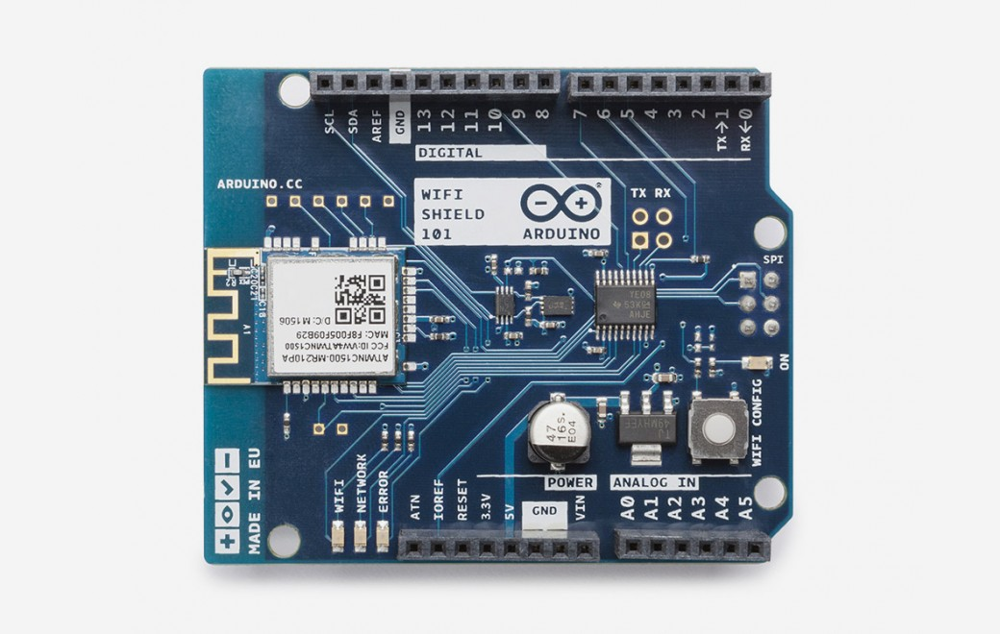

**Arduino WiFi Shield 101** is a powerful IoT shield with crypto-authentication, developed with[ ATMEL](http://www.atmel.com/), that connects your Arduino or Genuino board to the internet wirelessly. Connecting it to a WiFi network is simple, no further configuration in addition to the SSID and the password are required. The WiFi 101 Shield comes with an [easy-to-use library](https://www.arduino.cc/en/Reference/WiFi101) that allows to connect your Arduino or Genuino board to the internet with few instructions. As always, every element of the platform – hardware, software and documentation – are freely available and open-source. This means that you can learn exactly how it's made and use its design as the starting point for your own projects.

* Operating voltage both 3.3V and 5V (supplied from the host board)
* Connection via: IEEE 802.11 b/g/n for up to 72 Mbps networks
* Encryption types: WEP and WPA2 Personal
* Support TLS 1.1 (SHA256)
* Connection with Arduino or Genuino on SPI port
* Onboard CryptoAuthentication by ATMEL

You can find [here](https://www.arduino.cc/en/Main/warranty) your board warranty information.  
  
The WiFi Shield 101 needs certificates to ensure SSL connection. To upload new certificates and update the firmware, please refer to the Utilities section in the [WiFi101 Library](https://arduino.cc/en/Reference/WiFi101) reference.

## Getting Started

You can find in the [Getting Started section](https://www.arduino.cc/en/Guide/HomePage) all the information you need to configure your board, use the [Arduino Software (IDE)](https://www.arduino.cc/en/Main/Software), and start tinker with coding and electronics.

### Need Help?

* On the Software [on the Arduino Forum](https://forum.arduino.cc/index.php?board=100.0)
* On Projects [on the Arduino Forum](https://forum.arduino.cc/index.php?board=3.0)
* On the Product itself through [our Customer Support](https://support.arduino.cc/hc)

## Documentation 

### OSH: Schematics

The Arduino WiFi Shield 101 is open-source hardware! You can build your own board using the following files:

[EAGLE FILES IN .ZIP](https://www.arduino.cc/en/uploads/Main/ArduinoWiFiShield101.zip) 

[SCHEMATICS IN .PDF](https://www.arduino.cc/en/uploads/Main/Arduino-WiFi101-schematic.pdf)

The Arduino WiFi Shield 101 allows an Arduino or Genuino board to connect to the internet using the IEEE 802.11 wireless specifications (WiFi). It is based on the Atmel SmartConnect-WINC1500 module, compliant with the IEEE 802.11 b/g/n standard. The WINC1500 module provided is a network controller capable of both TCP and UDP protocols. Use the WiFI library to write sketches which connect to the internet using the shield. The WiFI shield connects to an Arduino or Genuino board using long wire-wrap headers which extend through the shield. This keeps the pin layout intact and allows another shield to be stacked on top.

The WiFi Shield 101 also features an hardware encryption/decryption security protocol provided by the ATECC508A CryptoAuthentication chip that is an ultra secure method to provide key agreement for encryption/decryption, specifically designed for the IoT market.

Digital pin 7 is used as a handshake pin between the WiFi 101 Shield and the board, and should not be used.  

Digital pin 5 is used as RESET pin between the WiFi 101 Shield and the board, and should not be used.

Usage with Arduino/Genuino UNO board

Please note that Uno + WiFi Shield 101 is not compatible with the [Software Serial library.](https://www.arduino.cc/en/Reference/SoftwareSerial)  

The WiFi Shield 101 carries a library that is very complex and occupies more than 60% of the available memory, leaving little room for sketches.  

Please keep in mind even if that basic usage is supported for the Uno, for complex projects we strongly recommend to use the WiFi Shield 101 with a Arduino/Genuino [Zero](https://www.arduino.cc/en/Main/ArduinoBoardZero), [101](https://www.arduino.cc/en/Main/ArduinoBoard101) or [Mega 2560](https://www.arduino.cc/en/Main/ArduinoBoardMega2560).

|           | Example MQTT (complex) | Example WiFi Web Server (easy) |
| --------- | ---------------------- | ------------------------------ |
| UNO       | 87%                    | 76%                            |
| 101       | 48%                    | 27%                            |
| MEGA 2560 | 11%                    | 10%                            |
| ZERO      | 9%                     | 8%                             |

(Reference: [MQTT sketch](https://cloud.arduino.cc/#/), [Wifi Web server example from WiFiShield101 library](https://www.arduino.cc/en/Tutorial/Wifi101WiFiWebServer))

For a better understanding, the table above shows the memory usage (in %) of two different sketches (Example MQTT and WiFi Web Server) on a Uno, Mega 2560, Zero and 101 board.

### On-board Indicators

The shield contains a number of signalling LEDs:

* ON (green): indicates that the shield is properly powered
* WIFI (green): indicates a connection to a network
* ERROR (red): indicates when there is a communication error
* NETWORK (yellow): indicates that data is received/transmitted