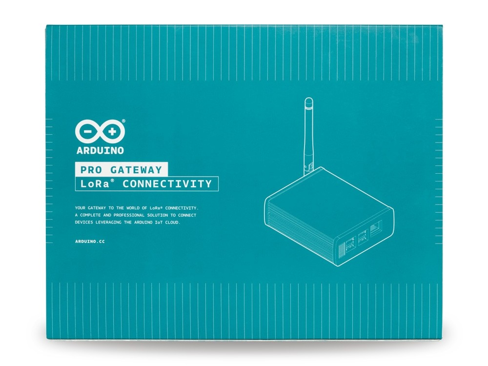

*** Note: This page refers to a product that has been retired***

## Description

The gateway offers up to 8 LoRa® Channels in the 868Mhz frequency allowing it to receive up to 8 LoRa® packets simultaneously making it the ideal device to use in **LoRaWAN® gateways applications**.

It is designed around the SX1301 from Semtech, which enables robust connection between the gateway and a massive amount of wireless end-points spread over a very wide range of distances.
It has the Listen Before Talk capability, and when enabled, the device monitors channels continuously and transmits only if the channel is free.

It's the perfect companion for the Arduino MKR WAN 1300.
Installation, provisioning and remote management of the Gateway are made incredibly simple through the Arduino Create platform.
This gateway enables people to leverage the LoRa® connectivity in many use cases:

- Automated Meter Reading
- Environmental Monitor
- Smart Cities
- Home and Building Automation
- Wireless Alarm and Security System
- Industrial Monitoring and Control
- Long-Range Irrigation System
- Agricultural Monitoring

The gateway radio hardware is powered by Embit and Arduino hardware design team.
The network server and the packet forwarder running on the Arduino Create platform are powered by A2A.

## Getting Started

You can follow the [Arduino Pro Gateway Assembly](https://docs.arduino.cc/tutorials/generic/lora-gateway-assembly) to learn about how to assemble your Arduino Pro Gateway.

If you have already set up your Pro Gateway, you can go directly to the [setup page](https://create.arduino.cc/getting-started/loragw/welcome) to connect your LoRaWAN devices to the Arduino Device Manager.

### Datasheet
You can follow the next link to [download the datasheet](https://content.arduino.cc/assets/AKX00016-datasheet.pdf).

### Need Help?

* On the Software [on the Arduino Forum](https://forum.arduino.cc/index.php?board=86.0)
* On the Product itself through [our Customer Support](https://support.arduino.cc/hc)