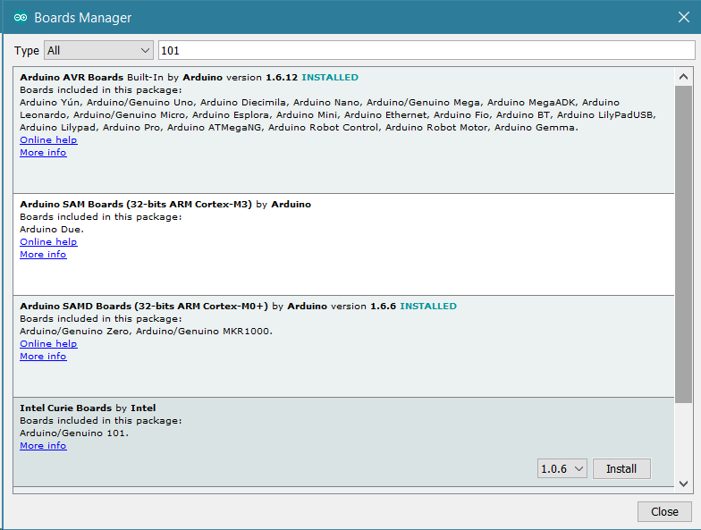
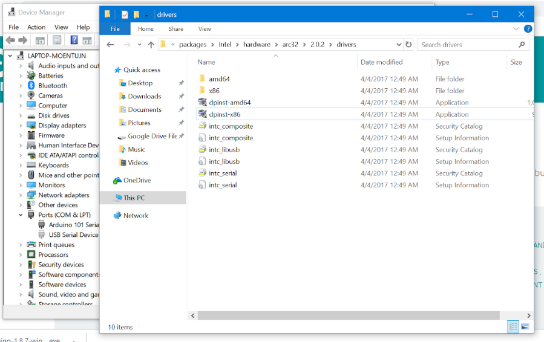
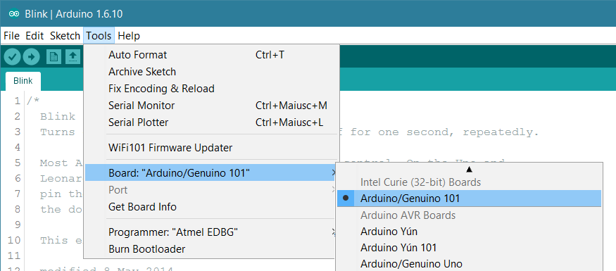
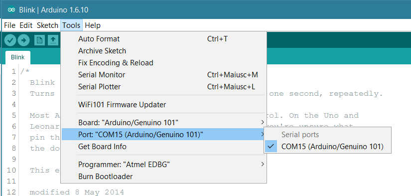
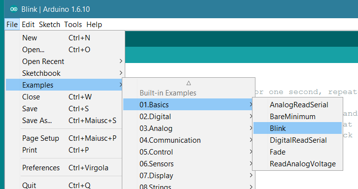
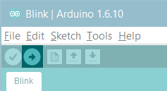
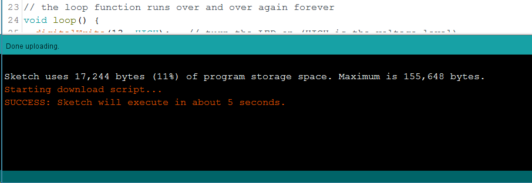

The Arduino 101 is a learning and development board which contains the [Intel® Curie™](http://www.intel.com/content/www/us/en/wearables/wearable-soc.html) Module, designed to integrate the core's low power-consumption and high performance with the Arduino's ease-of-use. The 101 adds Bluetooth® Low Energy capabilities and has an on-board 6-axis accelerometer/gyroscope, providing exciting opportunities for building creative projects in the connected world. 

The Arduino 101 is programmed using the [Arduino Software (IDE)](/en/Main/Software), our Integrated Development Environment common to all our boards and running both [online](https://create.arduino.cc/editor) and offline. For more information on how to get started with the Arduino Software visit the [Getting Started page](/en/Guide/HomePage).

### Use your Arduino 101 on the Arduino Web IDE

All Arduino boards, including this one, work out-of-the-box on the [Arduino Web Editor](https://create.arduino.cc/editor), you only need to install Arduino Create Agent to get started.

The Arduino Web Editor is hosted online, therefore it will always be up-to-date with the latest features and support for all boards. Follow this [simple guide](https://create.arduino.cc/projecthub/Arduino_Genuino/getting-started-with-arduino-web-editor-4b3e4a) to start coding on the browser and upload your sketches onto your board.

### Use your Arduino 101 on the Arduino Desktop IDE

If you want to program your 101 while offline you need to install the [Arduino Desktop IDE](/en/Main/Software) and add the Intel Curie Core to it. This simple procedure is done selecting **Tools menu**, then **Boards** and last **Boards Manager**, as documented in the [Arduino Boards Manager](/en/Guide/Cores) page.

Here you can search _Intel Curie_ or _101_ to find the core. Click on its box and click on the **install** button. On the bottom bar of the window you can follow the download and install procedure, including the installation of the proper driver, needed by the operating system to use the 101 board. For more information about cores, see the [guide on installing additional Arduino cores](/en/Guide/Cores).

#### Installing Drivers for the Arduino 101

Now that the Curie Core is installed, you can connect the board to the computer using a standard USB cable. The very first time your computer may go through the new hardware installation process.

Whenever an user wants to install the IDE form the zip file, or the windows store and installs the 101 board from the board manager the driver isn't installed and therefore the board is not recognized.

This issue is easily solved doing a manual installation.

Please go to your _documents_ folder and then here: _C:\Users\name\AppData\Local\Arduino15\packages\Intel\hardware\arc32\2.0.4\drivers_ . The folder contains the **dpinst-x86.exe** and **dpinst-amd54.exe** that are the install executables. Chose the right one for your 32 or 64 bit OS and double clic on it.

After the manual procedure the driver installation will properly happen when you connect the board.

On old Windows machines the time taken to install the driver is more than the 5 seconds allowed by the board's firmware. If the board disappears while the driver is installed, the process aborts and no driver is installed. To solve this issue please keep pressing every second the MASTER RESET until the driver installation is completed.

#### Select your board type and port

From **Tools** select the **Board Arduino/Genuinio 101**

and then the **Port** that is labeled with the same name.

#### Open your first sketch

Everything is now ready to upload your first sketch.
Go to File on the Arduino Software (IDE) and open the Examples tree; select **01. Basic** and then **Blink**

This sketch just flashes the built in LED connected to Digital pin 13 at one second pace for on and off, but it is very useful to practice the loading of a sketch into the Arduino Software (IDE) and the Upload to the connected board.

#### Upload the program

Press the second round icon from left on the top bar of the Arduino Software (IDE) or press **Ctrl+U** or select the menu **Sketch** and then **Upload**.

The sketch will be compiled and then uploaded. After a few seconds the bottom bar should show _Done Uploading_.

After this process the 101 board takes around 5 seconds to reset and restart, then the built in LED should start blinking.

#### Learn more on the Desktop IDE

[See this tutorial](https://create.arduino.cc/projecthub/Arduino_Genuino/getting-started-with-the-arduino-software-ide-623be4) for a generic guide on the Arduino IDE with a few more infos on the Preferences, the Board Manager, and the Library Manager.

You have successfully set up your 101 board and uploaded your first sketch. You are ready to move on with our tutorials and projects: choose your next destination below.

### Tutorials

Now that you have set up and programmed your 101 board, you may find inspiration in our [Project Hub](https://create.arduino.cc/projecthub/products/arduino-101-genuino-101) tutorial platform, or learn how to use the specific features of the 101 board with the 101 library examples.

<iframe frameborder='0' height='410' scrolling='no' src='https://create.arduino.cc/projecthub/31926/arduino101-ble-autonomous-rover-2cb19f/embed?use_route=project' width='354' style='margin-top:30px; margin-right:20px'></iframe><iframe frameborder='0' height='410' scrolling='no' src='https://create.arduino.cc/projecthub/MarJoh/arduino-pokeball-5555d8/embed?use_route=project' width='354' style='margin-top:30px'></iframe><iframe frameborder='0' height='410' scrolling='no' src='https://create.arduino.cc/projecthub/gov/voronoi101-light-your-lamp-a22a9e/embed?use_route=project' style='margin-top:30px;margin-right:20px' width='354'></iframe><iframe frameborder='0' height='410' scrolling='no' src='https://create.arduino.cc/projecthub/Lucas_Ainsworth/kaleidoscope-infinity-mirror-bdcd36/embed?use_route=project' style='margin-top:30px' width='354'></iframe>

Here a list of tutorials that will help you in making very cool things!

[CurieIMU Orientation Visualiser](/en/Tutorial/Genuino101CurieIMUOrientationVisualiser)
[CurieIMU Step Count](/en/Tutorial/Genuino101CurieIMUStepCount)
[CurieIMU Raw data example](/en/Tutorial/Genuino101CurieIMURawImuDataSerial)
[CurieIMU tap detection](/en/Tutorial/Genuino101CurieIMUTapDetect)
[CurieIMU Shock detection](/en/Tutorial/Genuino101CurieIMUShockDetect)
[CurieBLE Smartphone Led interaction](/en/Tutorial/Genuino101CurieBLECallbackLED)
[CurieBLE Heart Rate Monitor](/en/Tutorial/Genuino101CurieBLEHeartRateMonitor)

more examples on the respective library pages

### Libraries for Bluetooth, Accelerometer + Gyroscope, and Real-Time Clock

All 101's embedded peripherals have dedicated libraries, namely:

[CureBLE (to control Bluetooth® Low Energy module)](/en/Reference/CurieBLE)
[CurieIMU(to control the 6-axis accelerometer + gyro)](/en/Reference/CurieIMU)
[Curie Timer One (to control Timer functions)](/en/Reference/CurieTimerOne)

All of these libraries contain example sketches and tutorials have been written to get you started with using and understanding the functionalities of the modules (see _Tutorials_ at the bottom of this page).
All these libraries are automatically installed with the Intel Curie core.

### Please Read...

In this section we have collected some information that is worth reading to use your Arduino 101 board properly. Some behaviours differ from the Uno board and if you come from a former experience with that board, it is worth spending a few minutes reading through these notes. If this is your first board, we suggest you have a look at them anyway.

#### Operating Voltage

The microcontroller on the 101 runs at 3.3V but all I/O pins are protected against 5V overvoltage.
This means that the output signals will be in the range 0 - 3.3V but you can apply up to 5V on a pin without damaging the board.
Applying more than 5V on any pin will damage the board.

#### Serial ports on the 101

The 101 has a number of facilities for communicating with a computer or other microcontrollers.
The USB connector exposes as a virtual serial port that can be controlled by writing and reading to the **Serial** object. Pins 0/1, instead, expose a Hardware serial port mapped to **Serial1** object.
Opening and closing the USB Serial port at a baud rate other than 1200bps will not reset the 101. To use the serial monitor, and see what your sketch does from the beginning, you'll need to add few lines of code inside the setup().
This will ensure the Curie module will wait for the serial port to open before executing the sketch:
`while (!Serial) ;`
Pressing the Reset button on the 101 causes the microcontroller to reset as well as resetting the USB communication.

This interruption means that if the serial monitor is open, it's necessary to close and reopen it to restart the communication.
The SoftwareSerial library allows serial communication on any of the 101's digital pins up to 57600 bps.

#### Upload Procedure

After a sketch is uploaded to the board, there's a delay of a few seconds before it starts to execute. This happens at powered up and when RESET M button gets pressed. The serial monitor can't be opened during this time, so the user must wait for around 10 seconds before serial communication can start. In order not to miss any serial information that is sent before you open serial monitor, you can write the same line of code as aforementioned inside setup(), which will wait until you open the monitor to start the program:
`while (!Serial) ;`
**Linux only**: some distributions need to be configured to perform the upload. After installing the core, execute `sudo ~/.arduino15/packages/Intel/tools/arduino101load/1.6.4+1.18/scripts/create_dfu_udev_rule` inside a shell to gain upload permissions.

#### Drivers

On Windows, drivers are needed to allow the board communication. These drivers will be installed automatically when [adding the core](/en/Guide/Cores).
On MacOS and Linux no driver is needed.

For more details on the Arduino 101, see the [product page](https://store.arduino.cc/arduino-101-619).

Note: to ensure optimal performance and protect the board during use, use a third-party plastic enclosure. Use a screw head not greater than 0.25 inch (6.35mm) in diameter to mount the board in the enclosure. If testing the board on an ungrounded metal surface, a minimum 10mm (0.393 inch) separation should be kept between the
metal surface and the board to maintain antenna performance.

The text of the Arduino getting started guide is licensed under a
[Creative Commons Attribution-ShareAlike 3.0 License](http://creativecommons.org/licenses/by-sa/3.0/). Code samples in the guide are released into the public domain.
