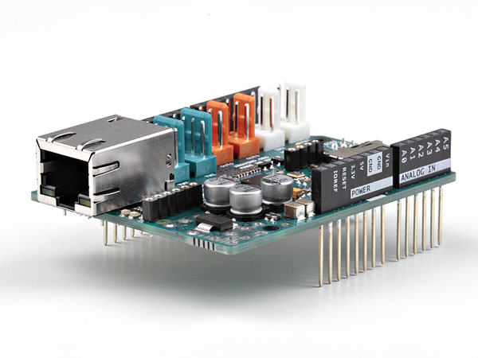

**The Ethernet Shield is a retired product. The Arduino Ethernet Shield 2 is available to buy .**

The [Arduino Ethernet Shield 2](/en/Main/ArduinoEthernetShield) allows an Arduino board to connect to the internet using the [Ethernet library](/en/Reference/Ethernet) and to read and write an SD card using the [SD library](/en/Reference/SD). This shield is fully compatible with the former version but relies on the newer W5500 chip.

### Connecting the Shield

To use the shield, mount it on top of an Arduino board (e.g. the Uno). To upload sketches to the board, connect it to your computer with a USB cable as you normally would. Once the sketch has been uploaded, you can disconnect the board from your computer and power it with an external power supply.

Connect the shield to your computer or a network hub or router using a standard ethernet cable (CAT5 or CAT6 with RJ45 connectors). Connecting to a computer may require the use of a cross-over cable (although many computers, including [all recent Macs](http://support.apple.com/kb/HT2274) can do the cross-over internally).

### Tutorials

You may find inspiration in our [Project Hub](https://create.arduino.cc/projecthub/products/arduino-ethernet-shield-2) tutorial platform with some projects developed by our users

<iframe frameborder='0' height='410' scrolling='no' src='https://create.arduino.cc/projecthub/thomas_sxt/automated-garden-77bee8/embed?use_route=project' width='354' style='margin-top:30px; margin-right:20px'></iframe><iframe frameborder='0' height='410' scrolling='no' src='https://create.arduino.cc/projecthub/ThereIsNoTry/water-leakage-detector-and-valve-control-f45048/embed?use_route=project' width='354' style='margin-top:30px'></iframe>

or have a look to the tutorial pages that explain how to use the various features of your shield.

Here is a list of tutorials that will help you in making very cool things!

- [ChatServer](/en/Tutorial/LibraryExamples/ChatServer): set up a simple chat server.

- [WebClient](/en/Tutorial/LibraryExamples/WebClient): make a HTTP request.

- [WebClientRepeating](/en/Tutorial/LibraryExamples/WebClientRepeating): Make repeated HTTP requests.

- [WebServer](/en/Tutorial/LibraryExamples/WebServer): host a simple HTML page that displays analog sensor values.

- [BarometricPressureWebServer](/en/Tutorial/LibraryExamples/BarometricPressureWebServer): outputs the values from a barometric pressure sensor as a web page.

- [UDPSendReceiveString](/en/Tutorial/LibraryExamples/UDPSendReceiveString): Send and receive text strings via UDP.

- [UdpNtpClient](/en/Tutorial/LibraryExamples/UdpNtpClient): Query a Network Time Protocol (NTP) server using UDP.

- [DnsWebClient](/en/Tutorial/DnsWebClient): DNS and DHCP-based Web client.

- [DhcpChatServer](/en/Tutorial/LibraryExamples/DhcpChatServer): A simple DHCP Chat Server

- [DhcpAddressPrinter](/en/Tutorial/LibraryExamples/DhcpAddressPrinter): Get an IP address via DHCP and print it out

- [TelnetClient](/en/Tutorial/LibraryExamples/TelnetClient): A simple Telnet client

### Network Settings

The shield must be assigned a MAC address and a fixed IP address using the [Ethernet.begin()](/en/Reference/EthernetBegin) function. A MAC address is a globally unique identifier for a particular device. Current Ethernet shields come with a sticker indicating the MAC address you should use with them. For older shields without a dedicated MAC address, inventing a random one should work, but don't use the same one for multiple boards. Valid IP addresses depend on the configuration of your network. It is possible to use DHCP to dynamically assign an IP to the shield. Optionally, you can also specify a network gateway and subnet.

### SD Card

The latest revision of the Ethernet Shield includes a micro-SD card slot, which can be interfaced with using the [SD library](/en/Reference/SD).

The text of the Arduino getting started guide is licensed under a
[Creative Commons Attribution-ShareAlike 3.0 License](http://creativecommons.org/licenses/by-sa/3.0/). Code samples in the guide are released into the public domain.
