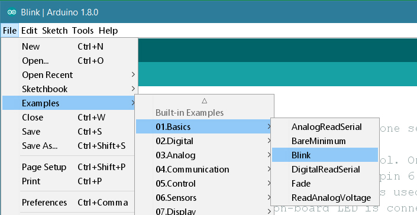
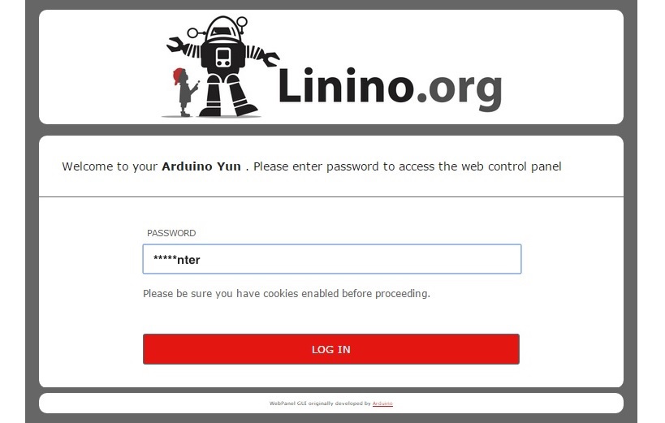
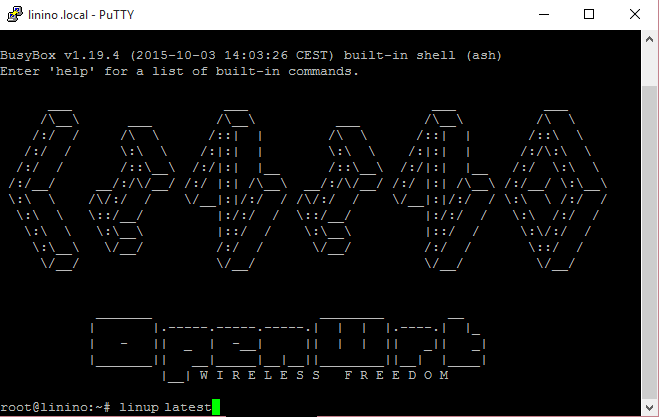
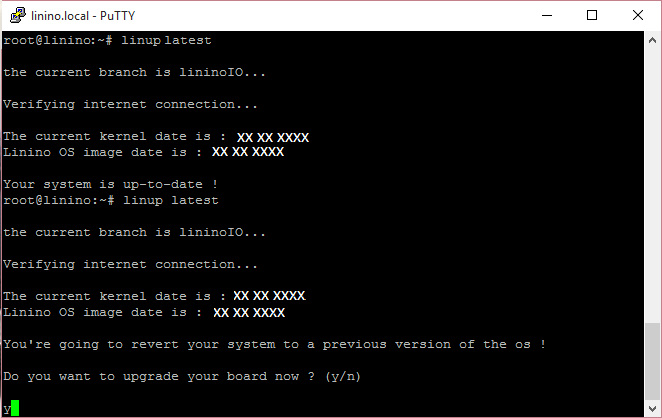
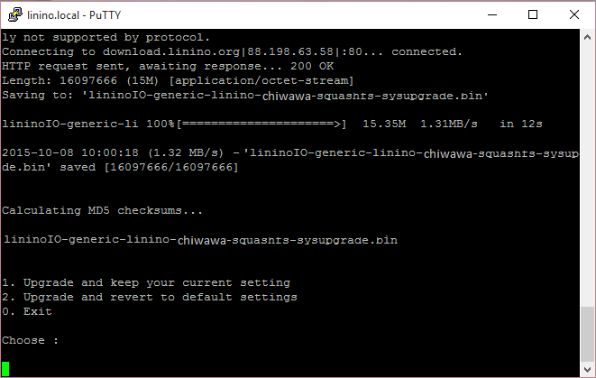

**This is a retired product.**

The Arduino Industrial 101 is a WiFi board based on a MIPS Linux processor.

The Arduino Industrial 101 is programmed using the [Arduino Software (IDE)](/en/Main/Software), our Integrated Development Environment common to all our boards and running both [online](https://create.arduino.cc/editor) and offline. For more information on how to get started with the Arduino Software visit the [Getting Started page](/en/Guide/HomePage).

### Use your Arduino Industrial 101 on the Arduino Web IDE

::: div download-page-row

::: div download-page-desc

All Arduino boards, including this one, work out-of-the-box on the [Arduino Web Editor](https://create.arduino.cc/editor), you only need to install Arduino Create Agent to get started.

The Arduino Web Editor is hosted online, therefore it will always be up-to-date with the latest features and support for all boards. Follow this [simple guide](https://create.arduino.cc/projecthub/Arduino_Genuino/getting-started-with-arduino-web-editor-4b3e4a) to start coding on the browser and upload your sketches onto your board.

:::

:::

### Use your Arduino Industrial 101 on the Arduino Desktop IDE

If you want to program your Arduino Industrial 101 while offline you need to install the [Arduino Desktop IDE](/en/Main/Software)

#### Open your first sketch

Open the LED blink example sketch: **File > Examples >01.Basics > Blink**.

#### Select your board type and port

You'll need to select the entry in the **Tools > Board** menu that corresponds to your Arduino board.

Select the serial device of the board from the Tools | Serial Port menu. This is likely to be **COM3** or higher (**COM1** and **COM2** are usually reserved for hardware serial ports). To find out, you can disconnect your board and re-open the menu; the entry that disappears should be the Arduino board. Reconnect the board and select that serial port. When your board is properly configured on WiFi, you will find it in the Port list, as in our screenshot.

#### Upload the program

Now, simply click the "Upload" button of the Arduino Software (IDE). Wait a few seconds - you should see the RX and TX LEDs on the board flashing. If the upload is successful, the message "Done uploading." will appear in the bottom status bar.

A few seconds after the upload finishes, you should see the on-board LED start to blink. If it does, congratulations! You've gotten your Arduino Industrial 101 up-and-running. If you have problems, please see the [troubleshooting suggestions](/en/Guide/Troubleshooting).

### Tutorials

Now that you have set up and programmed your Arduino Tian board, you may find inspiration in our [Project Hub](https://create.arduino.cc/projecthub/products/arduino-industrial-101) tutorial platform, or you can dig in deeper with the [Bridge library and examples](/en/Reference/YunBridgeLibrary), [Ciao library and examples](/en/Reference/Ciao). You can also check out the [Arduino Industrial 101 hardware page](/en/Main/ArduinoBoardIndustrial101) for additional technical information.

### Please Read...

#### Setup WiFi connection

The Arduino Industrial 101 is a WiFi board based on a MIPS Linux processor. When you first plug it to your computer it starts as an Access Point. In this way you can configure it to connect to your WiFi network.

- First Connect your Arduino Industrial 101 to the computer through a micro-USB cable.

- Search your Arduino board among the WiFi networks available on your PC; you should see something similar to **Linino-B4218ADA0FED**;

- Open a web browser and write the following address [http://linino.local](http://linino.local) or the ip address [http://192.168.240.1](http://192.168.240.1) in the address bar.

After a few moments, a web page will appear asking for a password.

- Enter the default password: **doghunter** and click Log In button;

- The next page shows some diagnostic information about the current network connections. The first is your WiFi interface, the second is your ethernet connection;

- Press the Configuration button to proceed.

- On this page, you may configure your Industrial 101, giving it a unique name and identifying what network you want to connect to. In the Industrial 101 NAME field, give your Arduino a unique name. You will use it to refer to the board in the future. Choose a password of 8 or more characters for your Arduino Industrial 101. If you leave this field blank, the system retains the default password. If you wish, you can set the timezone and country. It is recommended to set these options as it may help connecting to local WiFi networks. Setting the local timezone also selects the country's regulatory domain. Enter the name of the WiFi network you wish to connect to. Select the security type, and enter the password.

- At the bottom of the page, you will see the toggles to change the access of REST API.

REST is an acronym for "Representational State Transfer". It is a software architecture that exposes various parts of the Arduino hardware through URLs. By default, the REST API access is password protected. It is possible to change this setting to access the services without a password, clicking on Open;

- When you are done, click "Configure & Restart". After few moment, the configuration will be saved and the Arduino Industrial 101 will restart;

#### Linino OS upgrade

If it is the first time that you use your board, please follow these steps to upgrade the latest release of linino OS:

- Connect your board via SSH: for Linux user using command Shell: >**ssh root@yourBoard.local** for Windows user for example using Putty;

- Login as "root";

- Insert the your password or the default if you didn't change it **doghunter**;

* Insert the command: **linup latest** or **linup specif release**;

- Start the update responding **y**;

- Choose the option **2**: Upgrade and revert to default settings;

- Wait the end of upgrade;

The text of the Arduino getting started guide is licensed under a
[Creative Commons Attribution-ShareAlike 3.0 License](http://creativecommons.org/licenses/by-sa/3.0/). Code samples in the guide are released into the public domain.
