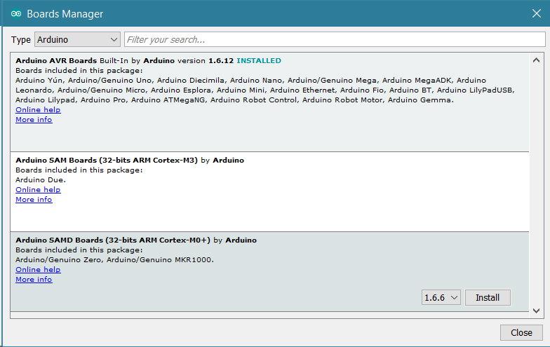
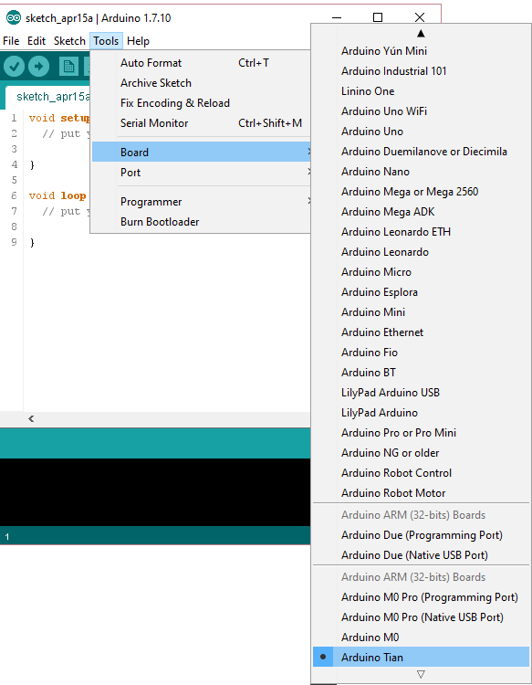
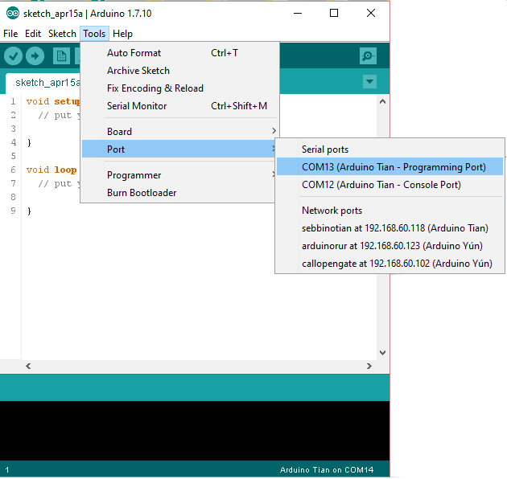
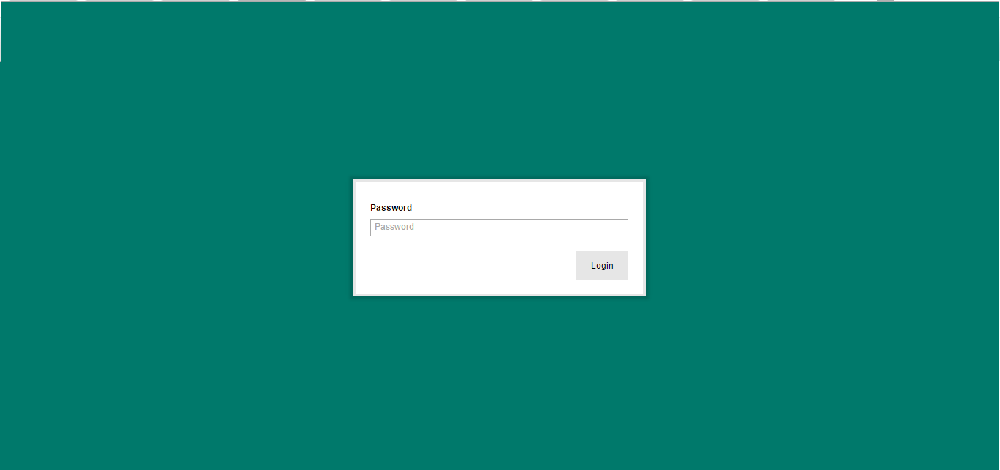
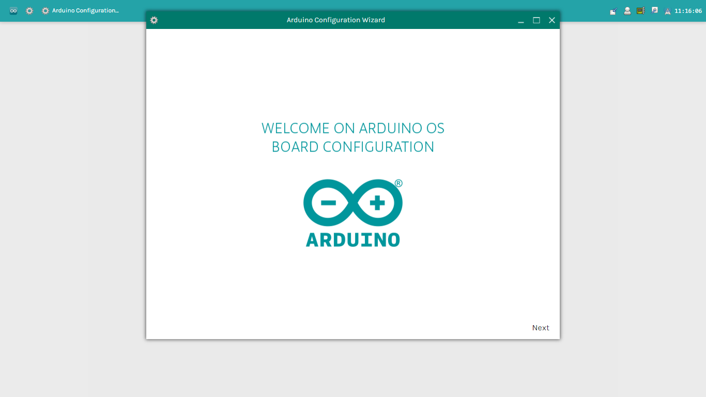
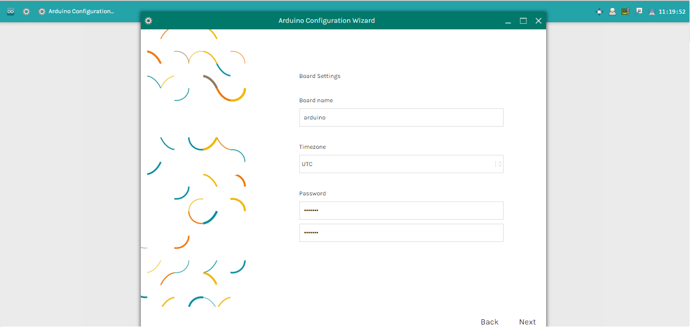
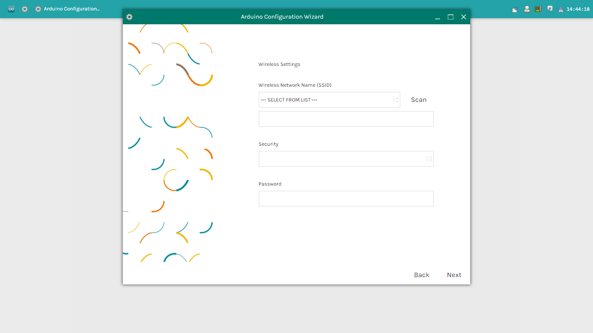
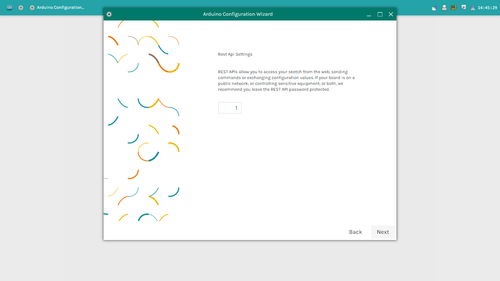
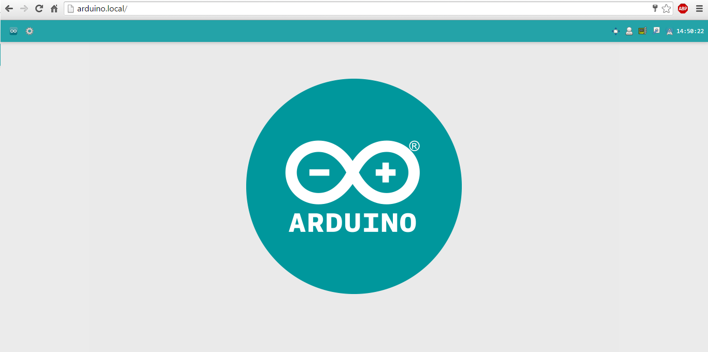
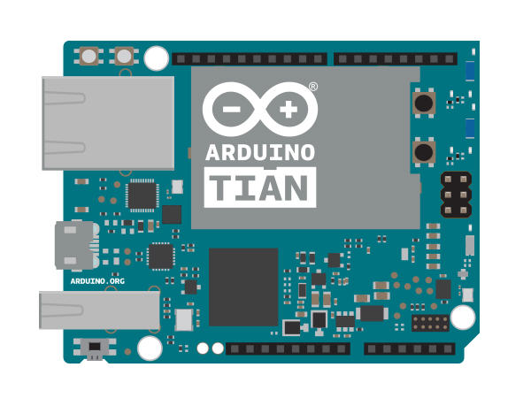

**This is a retired product.**

The Arduino Tian is based on the Atheros AR9342 connected to an Atmel Cortex® M0+ 32-bit microcontroller plus all connectivity: Ethernet, Wi-Fi, Bluetooth.

The Arduino Tian is programmed using the [Arduino Software (IDE)](https://arduino.cc/en/Main/Software), our Integrated Development Environment common to all our boards and running both [online](https://create.arduino.cc/editor) and offline. For more information on how to get started with the Arduino Software visit the [Getting Started page](https://arduino.cc/en/Guide/HomePage).

### Use your Arduino Tian on the Arduino Web IDE

All Arduino boards, including this one, work out-of-the-box on the [Arduino Web Editor](https://create.arduino.cc/editor), you only need to install Arduino Create Agent to get started.

The Arduino Web Editor is hosted online, therefore it will always be up-to-date with the latest features and support for all boards. Follow this [simple guide](https://create.arduino.cc/projecthub/Arduino_Genuino/getting-started-with-arduino-web-editor-4b3e4a) to start coding on the browser and upload your sketches onto your board.

### Use your Arduino Tian on the Arduino Desktop IDE

If you want to program your Arduino Tian while offline you need to install the [Arduino Desktop IDE](https://arduino.cc/en/Main/Software) and add the Atmel SAMD Core to it. This simple procedure is done selecting **Tools menu**, then **Boards** and last **Boards Manager**, as documented in the [Arduino Boards Manager](https://arduino.cc/en/Guide/Cores) page.

#### Installing Drivers for the Arduino Tian

Arduino Tian uses the CP201x driver and you must install it on the computer before you connect the board. You find the drivers for your OS at this [link](http://www.silabs.com/products/interface/Pages/CP2105EK.aspx). Please download the package for your OS and proceed as described below.

**OSX**
You downloaded a ZIP file that contains an installable package. Please extract it and proceed launching the extracted package. The installation procedure is assisted and you will end up with a Virtual COM port available every time you connect the Tian board and that is the one to use in the Arduino Software (IDE) to program the board.

**Windows (tested on 7, 8 and 10)**
Run the downloaded exe file and install the Virtual COM port driver. When you connect the Tian board, a new COM port will be available and that is the one to use in the Arduino Software (IDE) to program the board.

**Linux**
The Linux package is downloaded as a bin file and when installed creates a Virtual COM port every time the TIAN board is connected to your pc. That is the one to use in the Arduino Software (IDE) to program the board.

#### Open your first sketch

Open the LED blink example sketch: **File > Examples >01.Basics > Blink**.

#### Select your board type and port

You'll need to select the entry in the **Tools > Board** menu that corresponds to your Arduino board.

Select the serial device of the board from the Tools | Serial Port menu. This is likely to be **COM3** or higher (**COM1** and **COM2** are usually reserved for hardware serial ports). To find out, you can disconnect your board and re-open the menu; the entry that disappears should be the Arduino board. Reconnect the board and select that serial port.

#### Upload the program

Now, simply click the "Upload" button in the environment. Wait a few seconds - you should see the RX and TX leds on the board flashing. If the upload is successful, the message "Done uploading." will appear in the status bar.

A few seconds after the upload finishes, you should see the on-board LED start to blink (in orange). If it does, congratulations! You've gotten your Arduino Tian up-and-running. If you have problems, please see the [troubleshooting suggestions](https://arduino.cc/en/Guide/Troubleshooting).

### Tutorials

Now that you have set up and programmed your Arduino Tian board, you may find inspiration in our [Project Hub](https://create.arduino.cc/projecthub/products/arduino-tian) tutorial platform

### Please Read...

#### Configuration Guide

This guide will show, step by step, how to configure, the first time, your Arduino Tian. The board must be powered with one power supply that provides output at least 2A. For connecting it to your computer you may need to use a Y-Cable (USB Micro-B to Standard Male A).
Now that the board is powered, after about twenty seconds, search your Arduino board between the WiFi networks available on your PC.

Note: If you would reset the Arduino's Wifi you must press the wlan reset button (WLAN RST) for 5-30 seconds.
Connect your computer to the board hotspot. Open a web browser and write the follow address [http://arduino.local](http://arduino.local) or the ip address [http://192.168.240.1in](http://192.168.240.1in) the address bar. After a few moments, a web page will appear asking for a password.

Enter default password: arduino and click Login button. Now, you are in Arduino OS, and it will start the Arduino Configuration wizard that it will help you, step by step, to configure your board.

Give an unique Name, choose your Password (8 or more characters) and select your Timezone/country. It is recommended to set these options as it may help connecting to local WiFi networks. Setting the local timezone also selects the country's regulatory domain. If you leave this field blank, the system retains the default arduino password.

When you finish then click on Next.

Select your Wireless Network and type the network password. Click Next to continue the configuration.

You will see toggles for changing the access of Reset API, 1 ON - 0 OFF.

REST is an acronym for "Representational State Transfer". It is a software architecture that exposes various parts of the Arduino hardware through URLs. By default, the REST API access is password protected. It is possible to change this to access the services without a password, clicking on Open.

After that you have completed click "Save".

Wait the end operation. Now connect your PC to the same network of Tian and access to your board typing the hostname.local/ oripaddress on the bar:

If you can reach your board then you have correctly configured it:

#### Differences between Yun and Tian

The Arduino Tian is a new board that it has, as Arduino Yun, a WiFi module and a MIPS Linux.

The main differences between the two boards are here summarized:

- The Tian use the ARM Microcontroller SAMD21G18 (Operating voltage 3.3V, SRAM 32KB and Flash memory 256KB) while the Yun use the AVR Microcontroller ATmega 32u4 (Operating voltage 5, SRAM 2.5KB and Flash memory 32KB).
- Also the MIPS are different. The Tian mounts the Atheros AR9342 to 560 MHz while the Yun uses the Atheros AR9331 to 400 MHz.
- Other differences are that the Tian board has Bluethoot 4.0 technology and it has 4GB eMMC memory.

- Also the Wifi module is different. The Arduino Tian has IEEE802.11n 2x2 2.4/5 GHz dualband.

So as the Arduino Yun also Tian has three reset buttons one for microcontroller, one for WiFi, and one for MIPS processor.

There are eight status LEDs on the Tian that indicate:TX UART SAMD21, RX UART SAMD21, POWER, WLAN, USB, LED ACT, LED 10/100 and LED 13, as shown in the picture.

#### OpenWrtLininoOS

LininoOS is based on OpenWRT distribution with about 3000 package built and available. LininoOS provides a fully writable filesystem with package management with GPG signature. Integrated with LininoIO it is a complete linux system for IoT space. LininoOS features many innovations for your Arduino Tian.

LininoIO is a software framework able to integrate microcontroller features inside the microprocessor environment. You can simply write your application using Node.js, Python, Bash, etc., on linux side using LininoOS to control completely the board and all the devices attacched.

Node.js with Ideino Node.js is a platform built on Chrome's JavaScript runtime for easily building fast, scalable network applications. Node.js uses an event-driven, non-blocking I/O model that makes it lightweight and efficient, perfect for data-intensive real-time applications that run across distributed devices. Ideino is an embedded editor to write and debug your node.js application.

All Joyn supported, which is an open source project which provides a universal software framework and core set of system services that enable interoperability among connected products and software applications to create dynamic proximal networks.

#### Python

An installation of Python 2.7 is included with LininoOS, which you can use to write applications or scripts.
For more on Python, visit the Python 2.7 [documentation pages](https://docs.python.org/2/).

#### Install additional software on Linux

The Tian comes with several pieces of software pre-installed on LininoOS, including "curl" and "python". You may want to install other software on the Tian. On Linux systems, additional software can be installed using a tool called the "opkg".
You can find pre-compiled packages for LininoOS on their latest version, [here](http://download.linino.org/linino_distro/lininoIO/latest/packages/).

#### Resetting the processors (AR9342, WiFi, and SAMD21)

To restart the AR9342, which reboots LininoOS, press the "AR9342 Reset" button.
To restart the SAMD21 and restart the currently installed Arduino sketch, tap the button "SAMD21 Reset" one times.
To reset Wifi there is a button and when you press the "WiFi Reset" button, the WLAN LED will flash.

If you move to a different network and can no longer wirelessly access the Tian through its web interface, you can reset the Tian's network configuration by pressing the WiFi reset button (WLAN RST) for longer longer than 5 seconds, but less than 30, the AR9331 processor will reboot. The WiFi configuration will be reset and the Industrial 101 will start its own WiFi network Linino-XXXXXXXXXXXX. Any other modification/configuration will be retained.

To reset the LininoOS distribution to its default state, press the WiFi reset button (WLAN RST) for at least 30 seconds. The board reverts to the original settings: like just taken out of the box or to the latest update of the LininoOS image you have reflashed before. Among other things, this removes all installed files and network settings.

#### Serial re-enumeration on reset.

Since the Tian does not have a dedicated chip to handle serial communication, it means that the serial port is virtual - it's a software routine, both on your operating system, and on the board itself. Just as your computer creates an instance of the serial port driver when you plug in any Arduino, the SAMD21 creates a serial instance whenever it runs its bootloader. The board is an instance of USB's Connected Device Class (CDC) driver.
This means that every time you reset the SAMD21 processor, the USB serial connection will be broken and re-established. The board will disappear from the list of serial ports, and the list will re-enumerate. Any program that has an open serial connection to the Tian will lose its connection. This is in contrast to the Arduino Uno, with which you can reset the main processor (the ATmega328P) without closing the USB connection (which is maintained by the secondary ATmega8U2 or ATmega16U2 processor). This difference has implications for driver installation, uploading, and communication.

#### No reset when you open the serial port.

The Tian won't restart your sketch when you open a serial port on the computer. That means you won't see serial data that's already been sent to the computer by the board, including, for example, most data sent in setup().
This also applies to the Console, described below.

This means that if you're using any Serial or Console print(), println() or write() statements in setup(), they won't show up when you open the serial monitor or Console connection. To work around this, you can check to see if the port is open like so:

//stops the program until Serial Monitor is opened while (!Serial) ;

or

// stops the program until Console is opened while (!Console) ;

#### Configuring the on board WiFi

Programming the SAMD21 over WiFi
If you Tian is in your computer's same network, you can upload a sketch using the Wireless Connection.
After configuring your board, connect it to the network that you have specified in the configuration settings. Open the Arduino IDE.
Under the Tools > Port menu, you should see an entry that lists your Tian's name and its IP address. Under the Board menu, select Arduino Tian.
Open the Blink example (File > Examples > 01Basics > Blink) and upload the sketch to the board. You will be prompted for the administrator password. Use the one you entered in the configuration screen.
Once the program is uploaded, the SAMD21 processor will restart. You should see the LED connected to pin 13 blinking.
Using the onboard Ethernet (via dogEthernet)
When you connect the Tian to a wired network with an ethernet cable, it will try to connect automatically via DHCP. The board will show up on the ports menu just as it would over WiFi.
If you want to connect the Industrial101 directly to your computer, either configure the computer's interfaces to have a static IP address, or act as a DHCP server.

NB: the ethernet interface is eth1, not eth0

The text of the Arduino getting started guide is licensed under a
[Creative Commons Attribution-ShareAlike 3.0 License](http://creativecommons.org/licenses/by-sa/3.0/). Code samples in the guide are released into the public domain.
