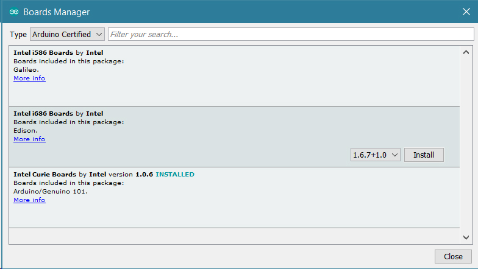
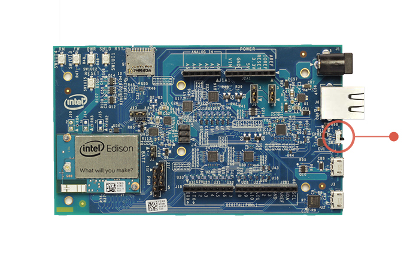
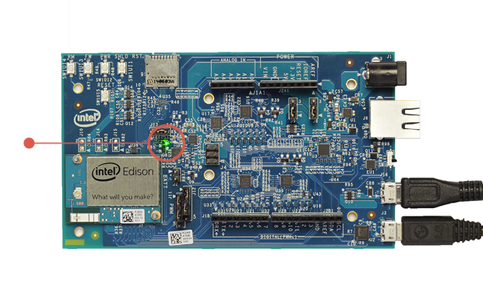
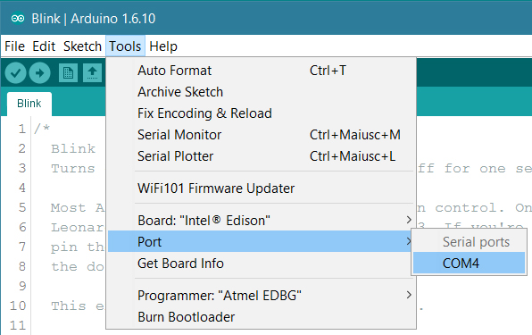
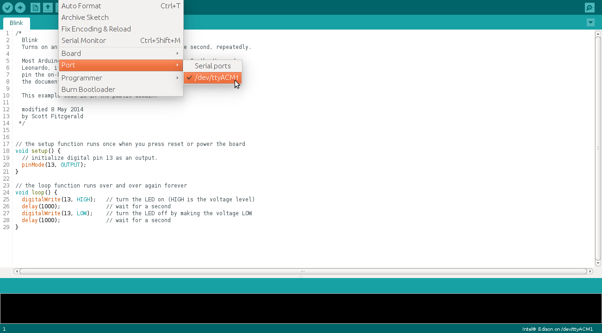
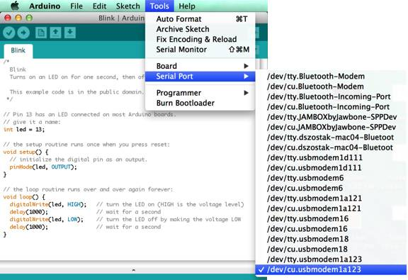
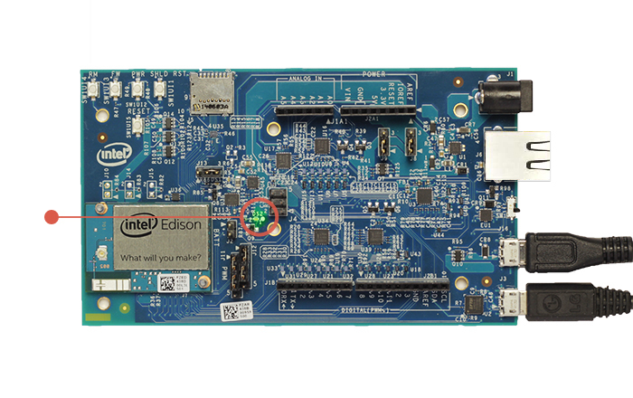

The Intel® Edison Kit for Arduino is designed to be hardware and software pin-compatible with Arduino shields designed for the Arduino Uno R3. Digital pins 0 to 13 (and the adjacent AREF and GND pins), Analog inputs 0 to 5, the power header, ICSP header, and the UART port pins (0 and 1), are all in the same locations as on the Arduino Uno R3.

The digital IOs and analog pins can be configured to operate at either 5V or 3.3V. The outputs can source or sink 24 mA at 3.3V and 32 mA at 5V.

In this guide it is assumed that you are using theIntel® Edison kit for Arduino, but the same explanation is valid for the Intel® Edison Breakout Board. It is also assumed that you have connected the Intel® Edison to the Breakout Board. If not please make reference to the [Intel® Tutorial](https://software.intel.com/en-us/articles/intel-edison-arduino-expansion-board-assembly) about how to do that.

The Intel® Edison is programmed using the [Arduino Software (IDE)](/en/Main/Software), our Integrated Development Environment common to all our boards and running both [online](https://create.arduino.cc/editor) and offline. For more information on how to get started with the Arduino Software visit the [Getting Started page](/en/Guide/HomePage).

### Use your Intel® Edison on the Arduino Web IDE

All Arduino boards, including this one, work out-of-the-box on the [Arduino Web Editor](https://create.arduino.cc/editor), you only need to install Arduino Create Agent to get started.

The Arduino Web Editor is hosted online, therefore it will always be up-to-date with the latest features and support for all boards. Follow this [simple guide](https://create.arduino.cc/projecthub/Arduino_Genuino/getting-started-with-arduino-web-editor-4b3e4a) to start coding on the browser and upload your sketches onto your board.

### Use your Intel® Edison on the Arduino Desktop IDE

If you want to program your Intel® Edison while offline you need to install the [Arduino Desktop IDE](/en/Main/Software) and add the Intel Edison Core to it. This simple procedure is done selecting **Tools menu**, then **Boards** and last **Boards Manager**, as documented in the [Arduino Boards Manager](/en/Guide/Cores) page.

This simple procedure is done selecting **Tools menu**, then **Boards** and last **Boards Manager**. Select _Arduino Certified_ as type and then click on the _Intel i686 boards by Intel_. Select the latest core and then Install.

When the process is completed, the Intel Edison board will be available in the boards list.

#### Connect the board to your PC

To upload Arduino sketches the Intel® Edison board must be powered up and connected to your computer. It is suggested to use two micro USB cables to connect the board to your PC because in this way more current is available if needed.

Find the microswitch in between the USB ports on the expansion board. Switch the microswitch down towards the micro-USB ports, if it isn't already, as shown in the figure below:

A green light should light up on the expansion board. If it does not, check your connection.

Wait a moment for the board to boot up. You will know that the board is fully initialized when your computer mounts a new drive (much like inserting a SD card into your computer).

Note: If you do not see a new drive, and the LED light (DS1 on the Arduino expansion board) is occasionally turning on and off, it is likely that your computer is not providing enough current. You may need to use a DC power supply as explained at _Power Through DC Plug_[here](https://software.intel.com/en-us/articles/intel-edison-arduino-expansion-board-assembly).

#### Open the blink example

Open the LED blink example sketch: **File > Examples > 1.Basics > Blink**.

#### Select your board

You'll need to select the Intel® Edison in the **Tools > Board** menu as shown below:

#### Select your serial port

Select the serial device of the board from the **Tools > Serial Port** menu. The easiest way to find what port the board is using is by disconnecting your board, restarting the IDE, and re-opening the menu; the entry that disappears should be the Intel® Edison board. Reconnect the board, restart the IDE, and select that serial port.

**On Windows**

The port is likely to be COM3 or higher and is called "Intel Edison Virtual Com Port" in the Device Manager. It is NOT "USB Serial Port". COM1 and COM2 are usually reserved for hardware serial ports:

**On Linux**

The port is likely to be /dev/ttyACM1:

**On Mac OS X**

The port is likely to be /dev/cu.usbmodemxxxx. If you have multiple such devices, select any one of them as they should all give the same results:

#### Upload and Run your first Sketch

Click the **Upload** button in the upper left to load and run the sketch on your board:

You should see a **Transfer complete** message when it has uploaded:

The **DS2 LED** on your board should now blink with a 1 second delay.

You have successfully set up your Intel® Edison board and uploaded your first sketch. You are ready to move on with our tutorials and projects: choose your next destination below.

### Tutorials

Now that you have set up and programmed your Intel® Edison board, you may find inspiration in our [Project Hub](https://create.arduino.cc/projecthub/search?q=edison) tutorial platform, or learn how to use the specific features of the Edison board.

<iframe frameborder='0' height='410' scrolling='no' src='https://create.arduino.cc/projecthub/4378/3d-controller-bot-8e0ee1/embed?use_route=project' width='354' style='margin-top:30px'></iframe>

Here a list of tutorials that will help you in making very cool things!

[Edison Mini-breakout Board Tutorial](https://communities.intel.com/docs/DOC-23838)
[Movie Reccomender](https://communities.intel.com/docs/DOC-23878)
[Robotics and Motor Control](https://communities.intel.com/docs/DOC-23864)
[Motion detecting video streaming doorbell](https://communities.intel.com/docs/DOC-23972)
[Audio Manipulation](https://communities.intel.com/docs/DOC-24006)
[Color Recognition - Candy locker](https://communities.intel.com/docs/DOC-24179)

The text of the Arduino getting started guide is licensed under a
[Creative Commons Attribution-ShareAlike 3.0 License](http://creativecommons.org/licenses/by-sa/3.0/). Code samples in the guide are released into the public domain.
