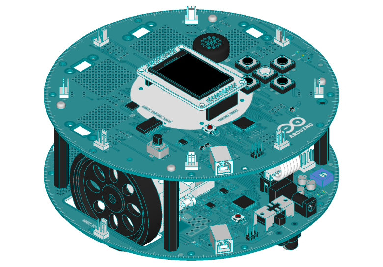
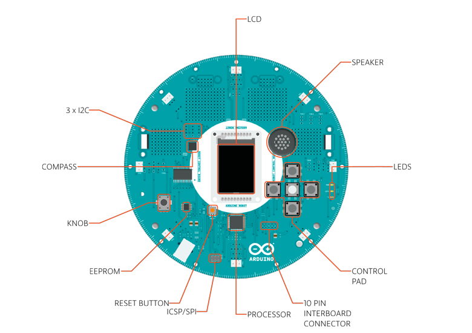
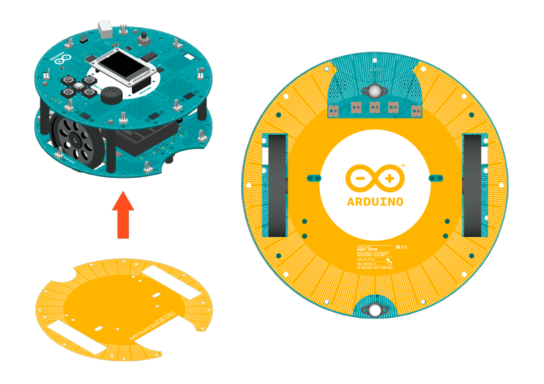
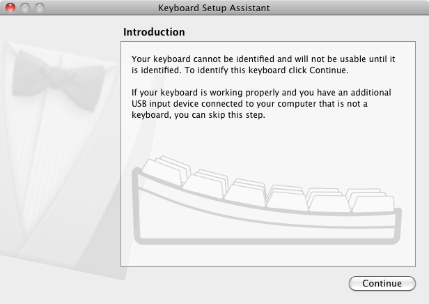
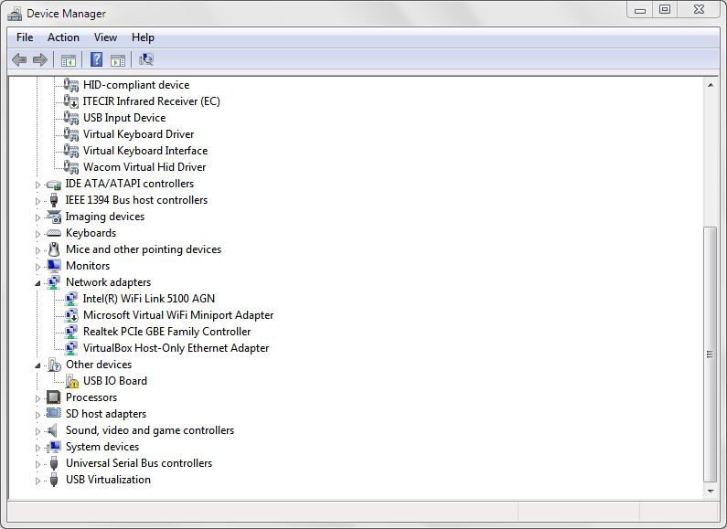
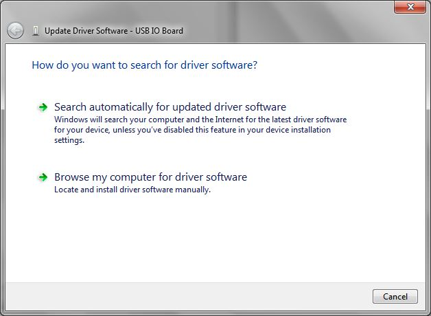
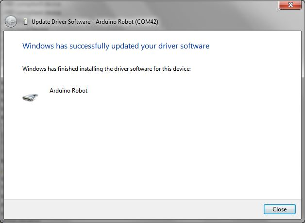
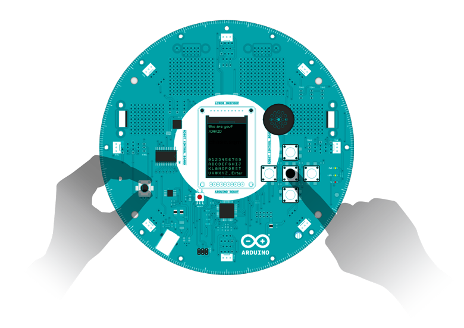

**This is a retired product.**

With the Arduino Robot, you can learn about electronics, mechanics, and software. It is a tiny computer on wheels. It comes with a number of of project examples you can easily replicate, and it is a powerful robotics platform that you can hack to perform all sorts of tasks.



The robot comes with a large number of inputs; two potentiometers, five buttons, a digital compass, five floor sensors, and an SD card reader. It also has a speaker, two motors, and a color screen as outputs. You can control all these sensors and actuators through the [Robot library](/en/Reference/RobotLibrary).

There are two different boards on the Robot: the Control Board (top) and the Motor Board (bottom). If you're just getting started with electronics and programming, you should work with the Control Board. As you become more experienced, you may want to tinker with the Motor Board.



_Robot Control board_


_Robot Motor Board_

### Setting up the Robot

When you first open the robot, you'll need to set up a pair of things before it is ready to roll.

First, you'll need to insert the SD card into the slot on the backside of the TFT screen, and then insert the screen into the socket on the control board of the robot. The screen should be oriented so that the blue text with the text "SD Card" is close to the buttons and speaker.


Once that's in place, you'll need to attach the protective cover for the botom board. This will help prevent any objects on the ground from damaging the motor board. Attach the protective covering to the underside of the robot as shown below.



### Content on the SD card

The SD card is used to store information for the robot to read. It comes preloaded with images and sound files used in the _Explore_ examples. Once comfortable with the robot's functionality, you should be able to add your own files. If you ever accidentally remove files used by the explore sketches, you can copy them over from the SDcontent directory found in the robot library. Alternatively you can [download the files here](/en/uploads/Guide/sdContent.zip).

### Connecting the robot to your computer

Each board on the robot has a microcontroller, which is programmed independently of the other. It is recommended that you should only program the control board (the top board) until you are familiar with the robot's functionality. The motor board (the bottom board) has a stock firmware that fulfills most general purpose applications.


Connect the control board to your computer with a USB cable.

After you have connected the board, the green LED labelled as PWR on the Control Board will be on. LED1 beneath it will flash a few times. On the Motor Board, the red LEDs labelled as LED1 to LED5 (opposite side to the power switch) should be on as well.

If the LEDs on either board do not turn on, check if the flat 10-pin communication cable next to the power switch is connected to both boards.

### Installing the drivers

#### OSX

- The first time you plug a robot into a computer running OSX, the "Keyboard Setup Assistant" will launch. There's nothing to configure with the robot, so you can close this dialogue by clicking the red button in the top left of the window.



#### Windows

The following instructions are for Windows 7. They are valid also for Windows XP, with small differences in the dialog windows.

- Plug in your board and wait for Windows to begin its driver installation process. If the installer does not launch automatically, navigate to the Windows Device Manager (Start>Control Panel>Hardware) and find the Arduino Robot listing. Right click and choose **Update driver**.



- At the next screen, choose "Browse my computer for driver software", and click **Next**.



- Click the **Browse...** button. Another dialog appears: navigate to the folder with the Arduino software that you just downloaded. Select the **drivers** folder an click **OK**, then click **Next**.


- You will receive a notification that the board has not passed Windows Logo testing. Click on the button **Continue Anyway**.



- After a few moments, a window will tell you the wizard has finished installing software for Arduino Robot. Press the **Close** button.

#### Linux

There is no need to install drivers for Linux. (Tested with Ubuntu 12.04)

### Hello User!

The Arduino Robot comes with a preloaded application that will ask for your name, what you want to name the robot, and where you are located. Look at the screen on the robot for information on how to input your information using the buttons and potentiometer.

You can power the robot by with 4 AAA batteries, or connect a USB cable to either the motor or control board.



Once you have gone through the setup process with the robot, you can start writing your own programs to control it.

### Uploading a test sketch

To program the robot, connect the **Control Board** to your computer via USB. Open the Arduino IDE, and load the sketch located in File > Examples > Robot_Control > learn > MotorTest.

You need to tell the IDE which Arduino board you are targeting with your software, so open the **Tools > Board** menu and choose **Arduino Robot Control**.

The Arduino IDE must know which of your USB ports the robot is connected to. The **Tools > Serial** menu lists the available ports.

- if only one item is shown, click on that one.

- if two or more are shown, you can disconnect the Control Board and re-open the menu; the entry that disappears should be the robot. Reconnect the board and select that serial port.

Click the "Upload" button in the top left of the IDE window. Wait a few seconds - you should see the RX and TX leds on the board flashing. If the upload is successful, the message "Done uploading." will appear in the status bar of the software. Once this appears, you can disconnect the robot from the USB cable

With batteries in the robot, turn on the power switch and put it on the ground. The robot should show you a few basic moves. Congratulations! You've gotten the robot up and running.

If the robot is not moving, turn the power switch off. Connect the **motor board** to the computer with a USB cable. Load the File > Examples > Robot_Motor > Robot_Motor_Core sketch in the IDE, and select **Arduino Robot Motor** from the **Boards** menu. Upload this sketch, disconnect from the computer and try turning it on again.

**Note: If no Serial port shows up after you plug in the robot, and restarting the IDE/unplug-replug the robot does not help, follow the steps below:**

- Open a very simple sketch, like Blink or BareMinimum
- Press the upload button

- When the status bar shows "Uploading...", double press the reset button on the Control Board

- The Serial port should appear as normally.

### Moving the Robot

This sketch moves the robot back and forth repeatedly.

Whenever you're writing code for the robot, make sure to include `<ArduinoRobot.h>` at the beginning of the sketch. This imports the necessary libraries to control the robot.

There's no need to initialize the Robot object.

To get the wheels to move, call [Robot.motorsWrite()](/en/Reference/RobotMotorsWrite). motorsWrite() requires 2 arguments, the speed of the left motor, and the speed of the right motor. These values range from -255 to 255, where -255 is full reverse, and 255 is full speed forward. If you pass a value of 0, the motor will stop spinning the wheel.

Once you've uploaded the sketch, unplug the USB cable for the robot. Whenever the USB is connected, the robot's motors are disengaged. Turn on the power and watch it move around!

```c
#include <ArduinoRobot.h> // import the robot library

void setup(){

  Robot.begin(); // initialize the library
}

void loop(){

  // move forward for one second

  Robot.motorsWrite(255,255);

  delay(1000);

  Robot.motorsWrite(0,0); // stop moving

  delay(1000);

  // move backwards for one second

  Robot.motorsWrite(-255,-255);

  delay(1000);

  Robot.motorsWrite(0,0); // stop moving

  delay(1000);
}
```

#### Read the buttons

You'll be writing a sketch that prints the button presses to the screen.

First, you need to include the Robot library.

```c
#include <ArduinoRobot.h>
```

In `setup()`, start the robot and the screen.

```c
void setup(){

  Robot.begin();

  Robot.beginTFT();
}
```

In `loop()`, every 100ms, read the state of the buttons. If one is being pressed, write the name to the screen.

```c
void loop(){

  Robot.debugPrint(Robot.keyboardRead(), 10, 10);

  delay(100);
}
```

In the _explore_ folder of the robot examples, there is a sketch called _Logo_, which incorporates this example with the robot movement from above.

### Change the motor speed with the potentiometer

This lets you control the speed at which the robot moves in a straight line. By turning the knob and mapping the values to -255 to 255, you will set the speed and direction (forward or backwards) of the robot.

First, you need to include the Robot library.

```c
#include <ArduinoRobot.h>
```

In `setup()`, you must call `Robot.begin()` to initialize the robot's functions. Also call `Robot.beginTFT()` to initialize the screen.

```c
void setup(){

  Robot.begin();

  Robot.beginTFT();
}
```

In `loop()`, read the value of the potentiometer with `Robot.knobRead()`. Map its value (a number between 0 and 1023) to -255 to 255. Print this value to the screen, and use it to change the speed of the motors.

```c
void loop(){

  int val=map(Robot.knobRead(),0,1023,-255,255);

  Robot.debugPrint(val);

  Robot.motorsWrite(val,val);

  delay(10);
}
```

The robot's motor is disengaged when plugged in via USB. After programming the robot, unplug the USB cable and add batteries. Turn on the power switch and watch the robot move. Catch the robot, and change the knob to change its speed.

### Making some noise

The robot has two different means of producing sounds. There's simple beeping, but the robot can also create more complex sounds by reading sequenced music off the SD card. In this example you'll start with the beeping. To learn about the more complex playback, see the _Melody_ example in the _learn_ folder.

```arduino
First, you need to include the Robot library.
```

```c
#include <ArduinoRobot.h>
```

In `setup()`, you must call `Robot.begin()` to initialize the robot's functions. Also call `Robot.beginSpeaker()` to initialize the speaker.

```c
void setup(){

  Robot.begin();

  Robot.beginSpeaker();
}
```

In `loop()`, you can call `Robot.beep()` to create a beep. There are three different kinds of beeping; a simple beep, a double beep, and a long beep.

```c
void loop() {

  Robot.beep(BEEP_SIMPLE);

  delay(1000);

  Robot.beep(BEEP_DOUBLE);

  delay(1000);

  Robot.beep(BEEP_LONG);

  delay(1000);
}
```

### Next steps

There are many things you can do with the robot. The few examples on this page don't do it justice. To see some more complex examples that of what the robot can do, look at the sketches found in the _Explore_ folder of the robot examples. These are more complete examples that show you some different applications for the robot.

You'll need to calibrate the compass module of the robot so it rotates smoothly. If you're using an old model, which has Honeywell HMC 6352, you can refer to this tutorial: [Calibrate Compass](/en/Tutorial/LibraryExamples/RobotCompassCalibration)

To learn about more of the functionality of the specific inputs and outputs of the robot, look at the _learn_ folder in the robot examples.

Be sure to check out the [Robot's library](/en/Reference/RobotLibrary) page and the [hardware page](/en/Main/Robot) for more information about the technical aspects of the Robot.

The text of the Arduino getting started guide is licensed under a
[Creative Commons Attribution-ShareAlike 3.0 License](http://creativecommons.org/licenses/by-sa/3.0/). Code samples in the guide are released into the public domain.
