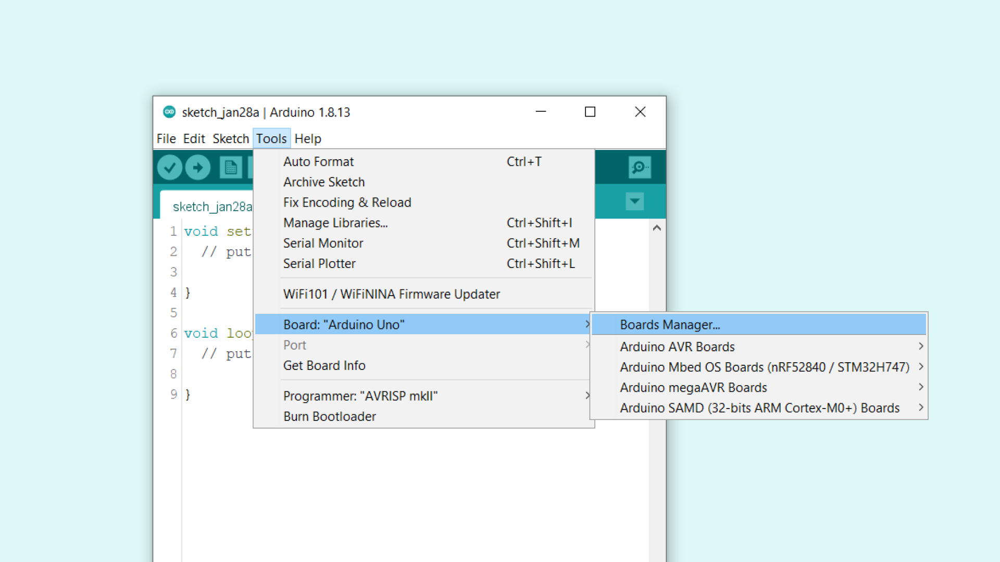
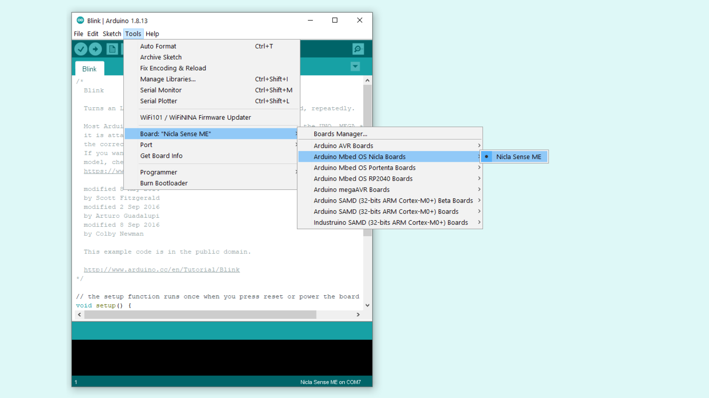
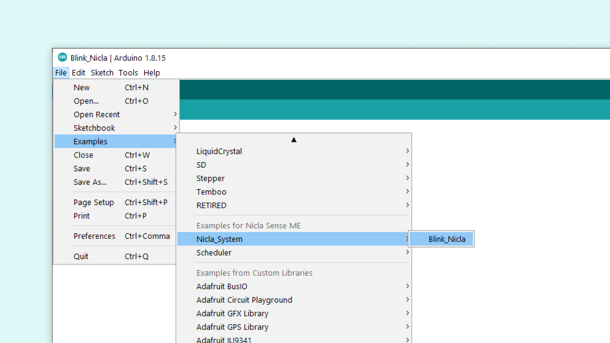
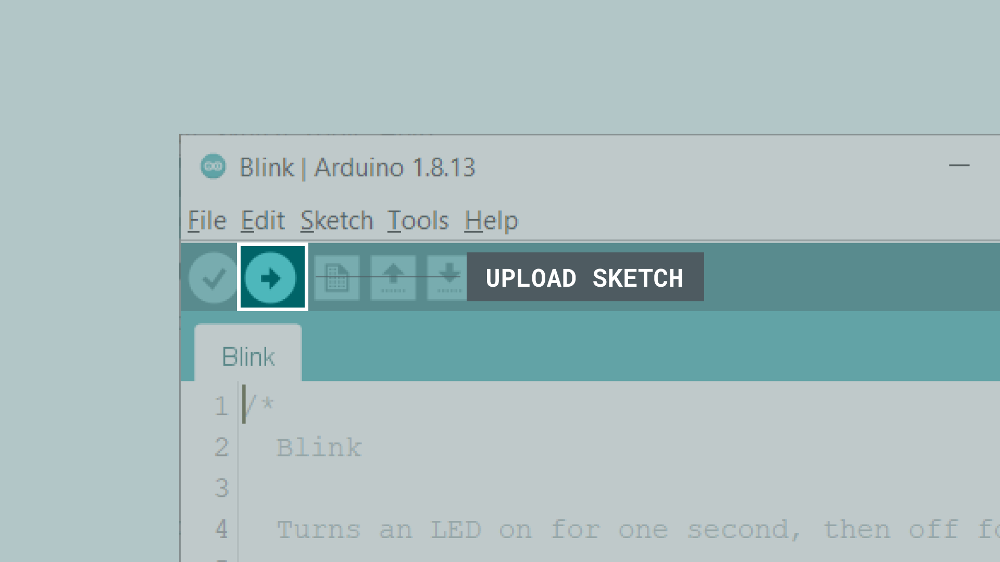

## Installing Mbed OS Nicla boards

In this tutorial, we will go through a few simple steps on installing the core needed for the **Nicla** boards. This installation is necessary to use your board with the offline Arduino IDE.

This tutorial uses the **Arduino IDE**. You can download the editor easily from [our software page](https://www.arduino.cc/en/software).

If you are using the **Web Editor**, you can follow the [getting started with the Web Editor tutorial](/cloud/web-editor/tutorials/getting-started/getting-started-web-editor).

### Boards using the Mbed Nicla core

- Arduino Nicla Sense ME
- Arduino Nicla Vision

### Downloading and installing

1. First, we need to download the Arduino IDE, which can be done from the [software page](https://www.arduino.cc/en/software).

2. Install the Arduino IDE on your local machine.

3. Open the Arduino IDE.

### Installing the Mbed OS core for the Nicla boards

After we have downloaded, installed and opened the Arduino IDE, let's continue to install the core needed.

When we open the editor, we will see an empty sketch.

Now we need to navigate to **Tools > Board > Board Manager**.

This will open up a new window, with all available cores. Find the one named **Arduino Mbed OS Nicla Boards** and install it.

This process may take some time, and you may need to accept the installation window that comes up (depending on your operative system). When it is finished, it should say `"INSTALLED"` under the title.

>**Note:** This process may take several minutes.

Exit the board manager, and go to **Tools > Board > Arduino Mbed OS Nicla Boards**. Here you can see all the Mbed boards listed, where you can select the board you are using. You have now successfully installed the core.

### Selecting the port

Now, let's make sure that our board is found by our computer, by selecting the port. Regardless what kind of program we are uploading to the board, we **always** need to choose the port for the board we are using. This is simply done by navigating to **Tools > Port**, where you select your board from the list.

This will look different depending on what kind of operative system you are using.

For **Windows** users, it could look like this:

- `<COM14> (Nicla Sense ME)`

For **MAC** users, it could look like this:

- `/dev/cu.usbmodem14112 (Nicla Sense ME)`

If you are using a Nicla Vision board it will say (Arduino Nicla Vision), instead of (Nicla Sense ME).

### Uploading a simple example

You are now ready to start using your board! The easiest way to check that everything is working, is to upload just a simple blink example to your board. This is done by navigating to **File > Examples > Nicla_System > Blink_Nicla**, if you are using a **Nicla Sense ME**.

If you are using the **Nicla Vision**, then please use the **File > Examples > 01.Basics > Blink**

To upload the sketch, simply click on the arrow in the top left corner. This process takes a few seconds, and it is important to not disconnect the board during this process.

When the code is uploaded, the text `"Done uploading."` is visible in the bottom left corner.

If you look closely at your board, you will notice an green LED blink with an interval of one second. This means you have successfully uploaded a program to your board.

**Please read:** The microcontroller runs at min 3V and max 5V.
>**Note:** Connecting higher voltage signals will damage the board.

### Troubleshooting

If you are having issues uploading a sketch to your **Nicla Vision** board and you are using Windows, it might be necessary to install the drivers manually. When you have the Nicla Mbed OS core installed, go to the core's folder, usually located in **C:\Users\USER\AppData\Local\Arduino15\packages\arduino\hardware\mbed_nicla\3.0.1\drivers**. Here you can find *dpinst-x86.exe*, running this program will install the necessary drivers for the **Nicla Vision**.