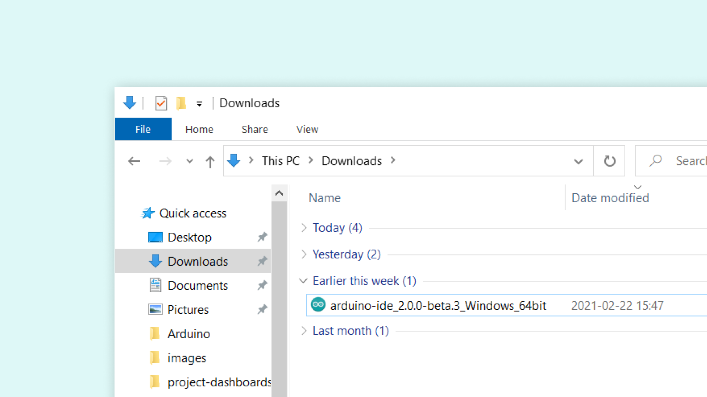
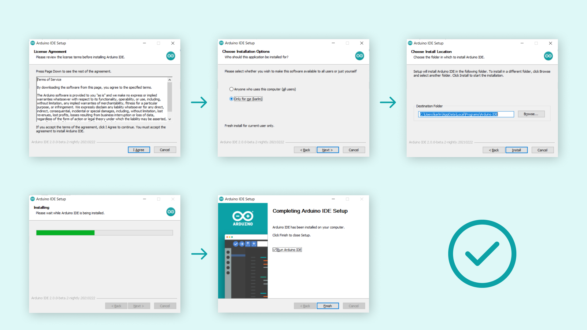

## Downloading and Installing the Arduino IDE 2

In this tutorial, we will show how to download and install the Arduino IDE 2 on your Windows, Mac, or Linux computer.

You can easily download the editor from the [Arduino Software page](https://www.arduino.cc/en/software). 

### Requirements

- **Windows** - Win 10 and newer, 64 bits
- **Linux** - 64 bits
- **Mac OS X** - Version 10.15: "Catalina" or newer, 64 bits

### The Arduino IDE 2

The Arduino IDE 2 is an open-source project. It is a big step from its sturdy predecessor, Arduino IDE 1.x, and comes with revamped UI, improved board & library manager, debugger, autocomplete feature and much more. 

### Download the Editor

Downloading the Arduino IDE 2 is done through the [Arduino Software page](https://www.arduino.cc/en/software). Here you will also find information on the other editors available to use. 

### Installation

#### Windows

To install the Arduino IDE 2 on a Windows computer, simply run the file downloaded from the software page.



Follow the instructions in the installation guide. The installation may take several minutes.



You can now use the Arduino IDE 2 on your Windows computer!

#### macOS

To install the Arduino IDE 2 on a macOS computer, simply copy the downloaded file into your application folder. 


You can now use the Arduino IDE 2 on your macOS computer!

#### Linux 

To install the Arduino IDE 2 on Linux, first download the **AppImage 64 bits (X86-64)** from the [Arduino Software page](https://www.arduino.cc/en/software). 

Before we can launch the editor, we need to first make it an **executable file**. This is done by:
- right-click the file,
- choose **Properties**,
- select **Permissions** tab, 
- tick the **Allow executing file as program** box.


You can now double click the file to launch the Arduino IDE 2 on your Linux machine. In case you cannot run the AppImage file, make sure that FUSE is installed on your system.

In Ubuntu (>= 22.04):
```bash
sudo add-apt-repository universe
sudo apt install libfuse2
```

In Fedora
```bash
dnf install fuse
```

See instructions for installing FUSE on your distribution [here](https://github.com/AppImage/AppImageKit/wiki/FUSE).

To enable the Arduino IDE to access the serial port and upload code to your board, the following rule can be added to `/etc/udev/rules.d/99-arduino.rules`. 
```
SUBSYSTEMS=="usb", ATTRS{idVendor}=="2341", GROUP="plugdev", MODE="0666"
```
