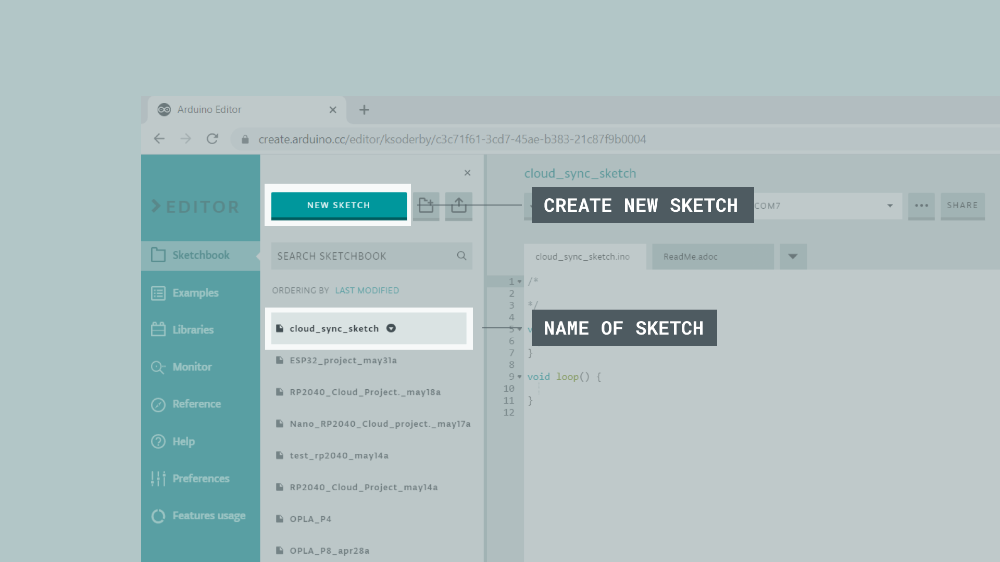
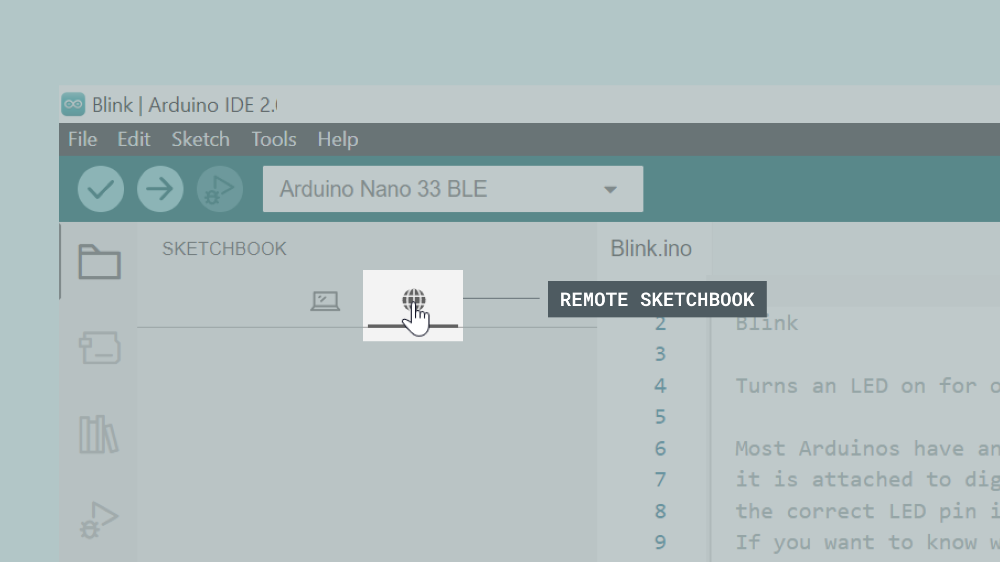
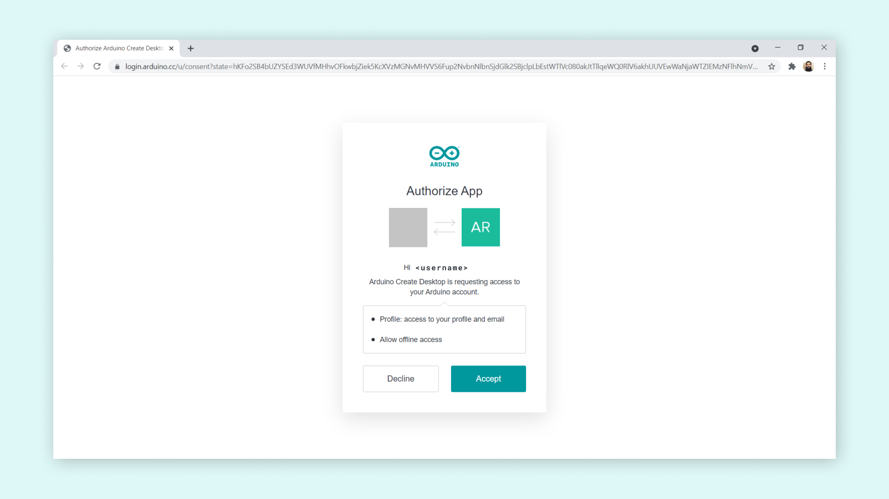
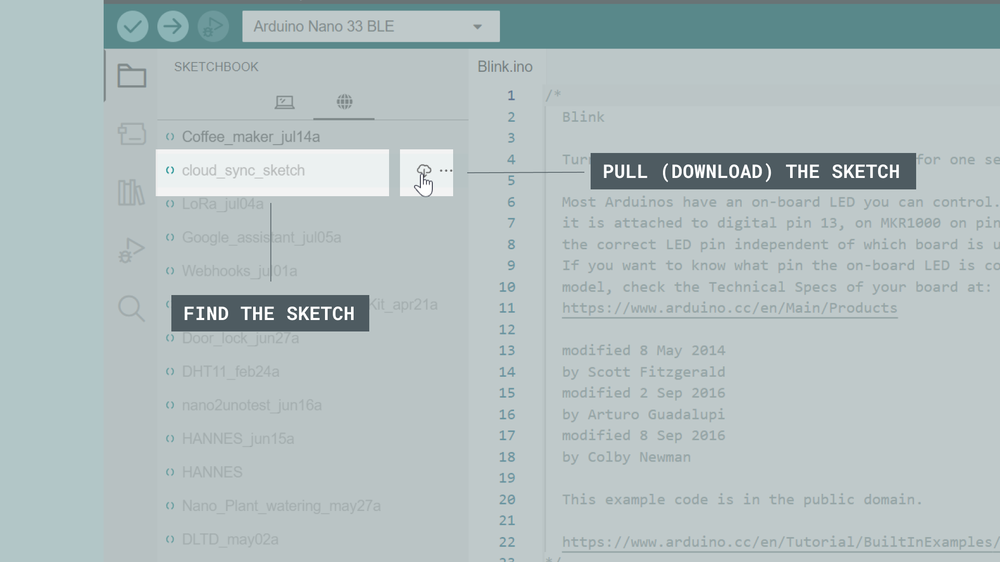
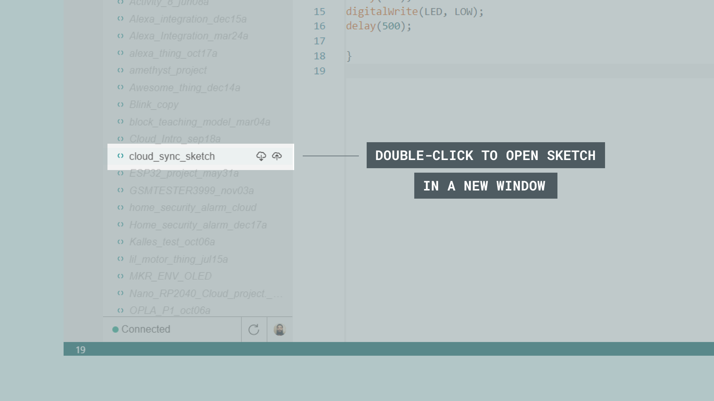
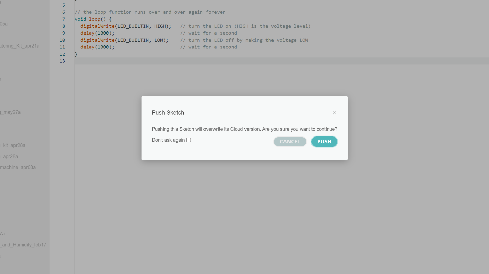
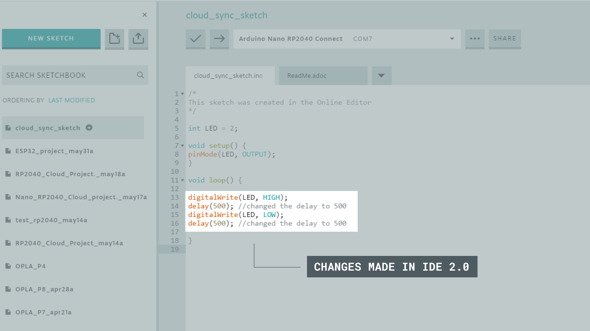
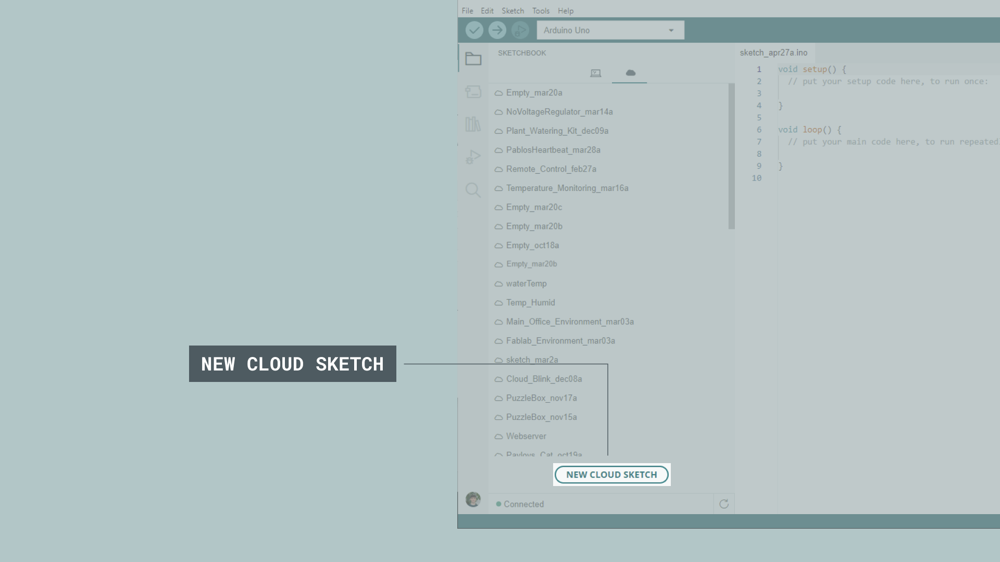
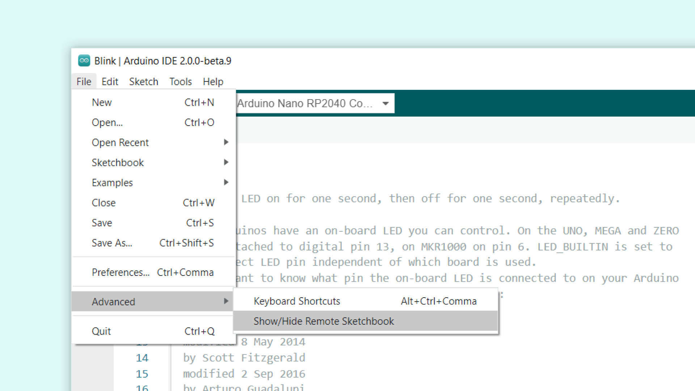

The new **Remote Sketchbook integration**, released in July 2021 is a ground-breaking feature that allows you to synchronise your **Arduino Cloud Sketchbook** to your **local computer**. This is a great milestone for people who work on multiple computers or want to store their Sketches securely in the cloud.

In this tutorial, we will describe the benefits of this new feature, go through the steps necessary to set it up, how to use it, what limitations there are, and what scenarios this feature is most useful in.

## Benefits

- **Code anywhere**:
Write your Arduino sketches on one computer and access them on another, with a single click! Do not worry about synchronisation or USB drives: the Arduino IDE 2 provides the Remote Sketches feature which allows you to store your sketches in the Arduino secure cloud and retrieve them easily on any other workstation.

- **Code from your browser**:
If you want to work on a computer that doesn’t have the Arduino IDE installed, just open the Arduino Web Editor: you’ll get an online IDE with all your sketches just there, plus all the libraries.

- **Backup your code**:
Your sketches are too important to risk losing them! And life is too short to make copies manually. With Remote Sketches you only need one click and they will be saved in the Arduino secure cloud.

- **No connection? Work offline, sync later**:
You don’t need to be always online to work on your remotely stored sketches: you work on a local copy, then as soon as you get back online you click on “Push” and your changes will be uploaded.

- **Share and publish your code**:
If you want to show your code to someone else, or provide a link that is always up-to-date, just turn the sharing settings from “Private” to “Public” and you’ll get a public link. Do you want to embed the sketch in an external website with nice syntax coloring? Just use our JavaScript widget.

## Security & Privacy

Security is our priority. The Arduino Cloud infrastructure is based on multiple security layers:

- Your sketches are stored in encrypted datastore (AES 256 bit).
- Data transfer between IDE and Arduino is protected by a SSL/TLS layer, and authenticated using secure tokens.
- The Arduino infrastructure is tested regularly to identify vulnerabilities and bugs.
- Two-factor authentication is available to protect your account in case you leak your credentials.
- Your sketches are configured as “Private” by default: you decide what you want to share with other people.

## Pricing
This feature is provided **free of charge**! You can use it without any restrictions. The limitations of your [Arduino cloud plan](https://store.arduino.cc/digital/create) apply.

## Overview

In a nutshell, the steps required to make this integration are the following:

- Create an Arduino Sketch in the Arduino Cloud.
- Authenticate your local editor with your Arduino account.
- Pull a Sketch you want to edit.
- When you have finished editing, push it back to the cloud. 

***The Remote Sketchbook integration with IDE 2 does not yet support pushing your local Sketches to the cloud. The Sketch needs to have been originally created in the Arduino Cloud platform.***

### Requirements

- [Arduino IDE 2](https://www.arduino.cc/en/software)
- Arduino account, [click here to register](https://login.arduino.cc/login).

## Understanding the Remote Sketchbook Concept

The Arduino development experience is centered around the use of **Sketches.** The concept of a Sketchbook is known to anyone who has used Arduino, and it is basically a storage space for all of your projects.

Up until now, there have been two ways of storing Sketches: 

A) You have an offline editor, and then you have a local Sketchbook, which can for example be located in your **C:\User\Documents** folder.


B) You are using the Arduino Cloud platform, where Sketches are stored in the cloud and not on your computer. When Sketches are edited they get automatically saved in the cloud, which is not only a great way of keeping track of your Sketches, it is also a more secure option.


But, with the latest integration of **Arduino Cloud** in the **Arduino IDE 2**, we are now able to synchronize our Sketches between the online and offline applications. This is made possible through a quick and easy authentication process that can be completed within a minute!


But without further ado, let's take a look at how to start using this incredible feature.

## Create an Arduino Account

In order for this integration to work, we will first need to [create an Arduino account](https://login.arduino.cc/login).

***If you already have an Arduino account, you will only need to login.***

Once we have created an account, we need to navigate to the [Cloud Editor](https://create.arduino.cc/editor/).

## Create a Sketch in the Arduino Cloud

The next step is to create a Sketch. To do so, we need to click the **"New Sketch"** button at the top left corner. Let's name it something unique, in this case, it was `cloud_sync_sketch`.

***If you already have sketches in you Cloud Sketchbook, you can skip this step.***



Now, let's write a quick program. It is not important what you create, but that we keep track on the changes we make. Feel free to use the example below:

```arduino
/* This Sketch was created in the Online Editor */

int LED = 2;

void setup() {
    pinMode(LED, OUTPUT);
}

void loop() {
    digitalWrite(LED, HIGH);
    delay(1000); 
    digitalWrite(LED, LOW);
    delay(1000); 
}
```

## Enabling the Remote Sketchbook

After we have created a Sketch in the Arduino Cloud, we can move on to **authenticating the Cloud and the IDE 2**. To continue, you need to have installed the Arduino IDE 2.

>You can download the IDE 2 from the [software page](https://www.arduino.cc/en/software). If you need help installing it, you can visit [this installation guide](/software/ide-v2/tutorials/getting-started/ide-v2-downloading-and-installing).

**1.** Open the Arduino IDE 2, and click on the folder at the top left corner. This is your **Sketchbook**.


**2.** You will now see all of your local Sketches. At the top of the list, click on the "Remote Sketchbook" symbol (the one that looks like a globe).



**3.** Click on the **"Sign In"** button to proceed.


**4.** This will ask you to authorize your Arduino account with your desktop app. Click on **"Accept"**.



Once you click on it, you should get a message in the browser that looks like the following image:


Congratulations, you have now synced your Arduino account with your local Arduino IDE 2, and your Sketches should now be available under the **Remote Sketchbook tab.**

## Pulling, Editing and Pushing

Now, let's test out the feature, by locating the Sketch we created in the Arduino Cloud. Remember that we named it `cloud_sync_sketch`? It should now appear in the list of Sketches. Notice also that your Sketches are all greyed out. The way it works is that before we can start working on Sketches, we need to **pull them**. This is done by hovering a Sketch, and clicking the little **cloud icon** that's located next to it.



When we have pulled a Sketch, we can **edit it by double clicking on the Sketch**. It is easy to see when it has finished pulling it, because it will **not be greyed out anymore**. This will open a new window, and we can start editing it. 



Now, let's make some edits to the Sketch, to test if the syncing works. In our example, we changed the value of the `delay()` from `1000` to `500`, and added a comment next to it.

```arduino
/*
This Sketch was created in the Online Editor
*/

int LED = 2;

void setup() {
    pinMode(LED, OUTPUT);
}

void loop() {
    digitalWrite(LED, HIGH);
    delay(500); //changed the delay to 500
    digitalWrite(LED, LOW);
    delay(500); //changed the delay to 500
}
```

When we are finished editing, we need to **push it** back to the Arduino Cloud. This is done by clicking the **cloud with an arrow pointing up** icon.


This will open up a modal window, asking for confirmation. Click on **"Push"**.



You have now pushed your changes to the cloud. You can easily check if it has been successful by refreshing the online Sketchbook (at Arduino Cloud). The changes should now be visible.



## New Cloud Sketches

With the IDE 2.1 and newer, you can also create new Cloud sketches, directly from the offline IDE. When you are in the Cloud sketchbook, at the bottom of the window there's a button to create a fresh sketch.



## Disabling the Remote Sketchbook

If you do not want to use the Remote Sketchbook feature, you can simply disable it in the editor. Navigate to **File > Advanced > Show/Hide Remote Sketchbook** to disable it. If you want to enable it again, simply click the same option!



## Wrapping Up

The integration of the Remote Sketchbook in the IDE 2 is an important milestone. It gives us great control of our Sketchbooks, and makes it really easy to move across computers and editors.

## Next Steps

You can find more tutorials in the [Arduino IDE 2 documentation page](/software/ide-v2/).

## FAQ

> Can I work offline and sync afterwards?

Yes, you can work on your local copy. As soon as you get back online you click on “Push” and your changes will be uploaded. Please note that the Sketch has to be pulled from the remote prior to going offline.


> What happens if I change a sketch on multiple workstations simultaneously?

The last device to push the changes will overwrite the other devices' changes in this scenario.