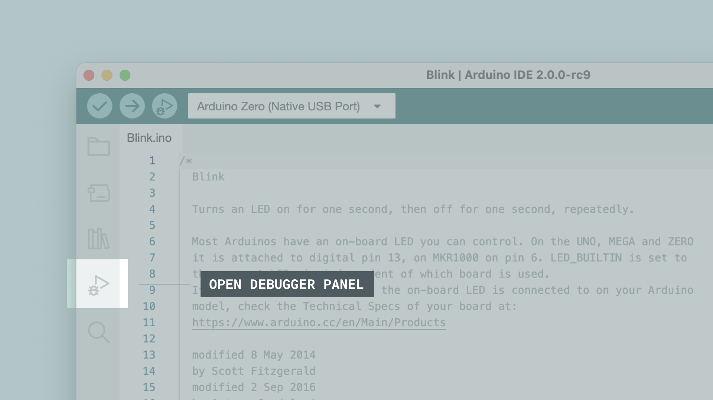
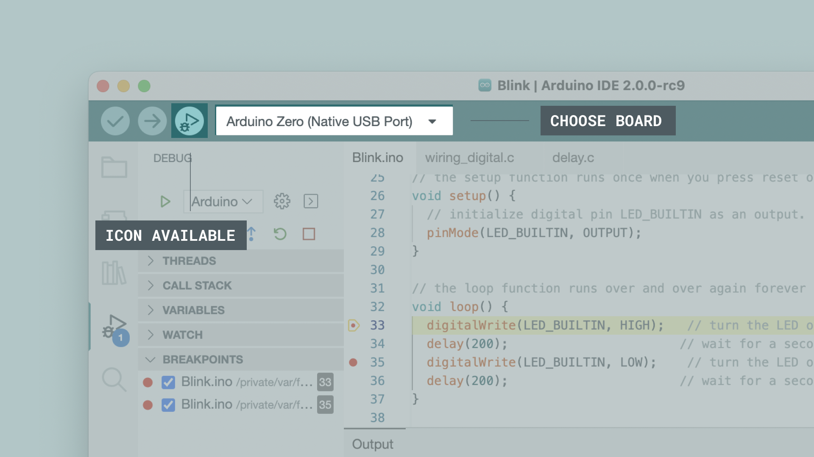
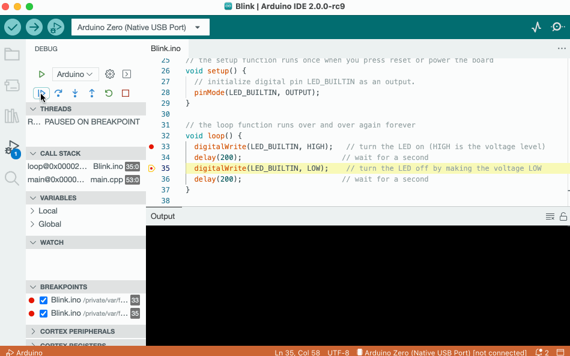

## Overview

A newly introduced, yet less famous feature of Arduino IDE 2 is the **Debugger**. 

A debugger is a software tool which is used to test and debug programs, hence the name.

It basically goes through a program in a controlled manner, with the help of a hardware interface which can help navigate through the program's execution. This can be of aid in better understanding the program as well as helping spot potential flaws and code errors.

*** You can easily download the editor from the [Arduino Software page](https://www.arduino.cc/en/software). ***

### Compatible Boards

The debugger is compatible with all SAMD boards. Boards using the SAMD architecture are the following: 

- [MKR Zero](https://store.arduino.cc/arduino-mkr-zero-i2s-bus-sd-for-sound-music-digital-audio-data)
- [MKR WiFi 1010](https://store.arduino.cc/arduino-mkr-wifi-1010)
- [MKR FOX 1200](https://store.arduino.cc/arduino-mkr-fox-1200)
- [MKR WAN 1300](https://store.arduino.cc/arduino-mkr-wan-1300)
- [MKR WAN 1310](https://store.arduino.cc/arduino-mkr-wan-1310)
- [MKR GSM 1400](https://store.arduino.cc/arduino-mkr-gsm-1400)
- [MKR NB 1500](https://store.arduino.cc/arduino-mkr-nb-1500)
- [MKR VIDOR 4000](https://store.arduino.cc/arduino-mkr-vidor-4000)
- [Nano 33 IoT](https://store.arduino.cc/arduino-nano-33-iot)
- [Zero](https://store.arduino.cc/arduino-zero)

***Tutorials for the Atmel-ICE and J-Link debuggers uses the MKR WiFi 1010, but can be easily be applied to the boards listed above.***

## Requirements

- Arduino IDE 2 installed.

You will also need one of the following hardware setups:
- [Arduino Zero](https://store.arduino.cc/arduino-zero) or
- [Segger J-Link BASE](https://store.arduino.cc/products/j-link-base-compact) / [Segger J-Link EDU](https://store.arduino.cc/products/j-link-edu) + [MKR WiFi 1010](https://store.arduino.cc/arduino-mkr-wifi-1010) or
- [Atmel-ICE](https://www.microchip.com/DevelopmentTools/ProductDetails/ATATMEL-ICE) + [MKR WiFi 1010](https://store.arduino.cc/arduino-mkr-wifi-1010)

Additional accessories such as soldering iron, connectors, jumper wires and USB cables will also be required, depending on what hardware setup you use.

*** The [Arduino Zero](https://store.arduino.cc/arduino-zero) board can be used without any external hardware. ***

## Hardware Setup

Below you will find three different tutorials that will help you set up and test the different hardware setups. We recommend you visit them, follow the instructions and come back here to learn how to use the tool!

### Arduino Zero

**The Arduino Zero** does not require any additional hardware, as it already has a built-in debugger. This makes it a great choice for beginners that wants to learn more about debugging.

- [Debugging with Arduino Zero.](/tutorials/zero/debugging-with-zero)

### J-Link

**Segger's J-Link** tool is a great option for advanced debugging. The J-Link tool can be connected to the MKR WiFi 1010 board by soldering, where a more detailed guide can be found in the link below:

- [Debugging with Segger J-Link.](/tutorials/mkr-wifi-1010/mkr-jlink-setup)

### Atmel-ICE

**Atmel-ICE** is another great option to use for debugging, and can also be connected to the MKR WiFi 1010 board through soldering. Learn more about debugging with the Atmel-ICE through the link below: 

- [Debugging with Atmel-ICE.](/tutorials/mkr-wifi-1010/atmel-ice)

## Getting to Know the Debugger

Once you have your hardware set up, we can continue to explore the Debugger tool in the Arduino IDE 2.

The Debugger is a brand new tool integrated in the Arduino IDE 2. You can easily access it from the sidebar on the left, grouped with the **Board Manager**, **Library Manager**, **Search** and **Sketchbook Explorer**. 

Mind that doing so will only show you its interface, but the real magic happens when you click the **bug icon** in the buttons menu.

Now, in order to use the debugger, we need specific hardware instruments, the choice of which is very dependent on what kind of board/processor you are using, and you will almost always need an external debugger.

## Using the Debugger

In order to use the Debugger, we need to upload a sketch to our board first, making sure that the built program will be optimized for debugging, so let's check that option right away.

>**Important:** You should connect the Arduino Zero through its **programming USB port**.

In this example, we are going to choose the basic **blink sketch**. You can easily access this code through **File > Examples > Basics > Blink**. Upload the code to your Arduino board. When it is finished, it will let you know in the output panel at the bottom.

Once your program has been uploaded, we can start using the debugger.

### Breakpoints

Let's begin by creating something called a **breakpoint**. Breakpoints are used to stop the program execution at a specific line (or when a specific condition is verified). We can use multiple of these in a program (the number is variable depending on the processor). 

In this example, we are going to set a breakpoint for **line 33** and **line 35**. These are set by clicking to the left of the line numbering in the editor. 

We can now go through our code, step by step.
The debugger will automatically stop at the first breakpoint it reached.

Let's continue, by clicking on the **Play/pause** button (**Continue**). The program will now run to the next breakpoint (e.g., line 35). If we click it again, it will jump to line 33 (the other lines in the program sequence will still be executed but we won't see that). Clicking the **Play/pause** button again will continue running the program which will pause at its next breakpoint, line 35. We're in the main loop, after all.

### Step over 

The **step over** feature basically goes through the operations of a program, step by step. Let's say we have 20 operations in our program, each doing something unique. The step over can in a way step through these, one by one, and analyse what's going on at each step.

### Step in and Out

Next up is the **step in** and **step out** commands. In this example, we are using the `digitalWrite()` and `delay()` functions. Using **step in** we basically branch out of the code we wrote, and jump into the code where these functions are defined. In this case, we are inspecting code inside a file which is part of the Arduino framework.

The **step out** feature is basically the opposite: it returns you to the origin point, and moves to the next step.

The step in/out actions can be very useful, you can use them to learn how commands you use everyday work and discover what happens when you invoke `digitalWrite`, `digitalRead`, `Serial.println` and all the other Arduino functions.

## Conclusion

In this guide, we have covered some basics on using the Arduino IDE 2 Debugger. We explored some different hardware setups that we can use, how to navigate the Debugger tool, and linked some more elaborate hardware guides to make your debugging experience more smooth!

We hope you enjoy the Debugger, and if you are having issues, please report them in [Arduino IDE GitHub repository](https://github.com/arduino/arduino-ide/issues). 

### More Tutorials

You can find more tutorials in the [Arduino IDE 2 documentation page](https://docs.arduino.cc/software/ide-v2).  

